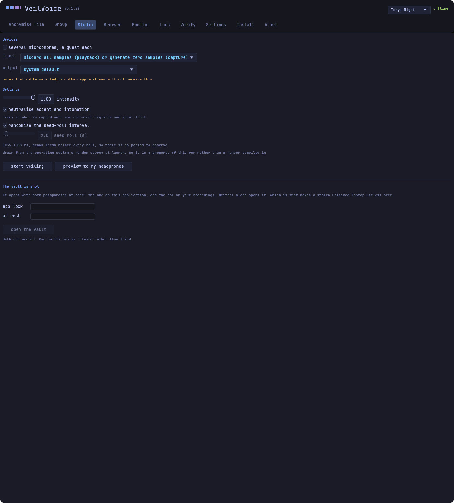
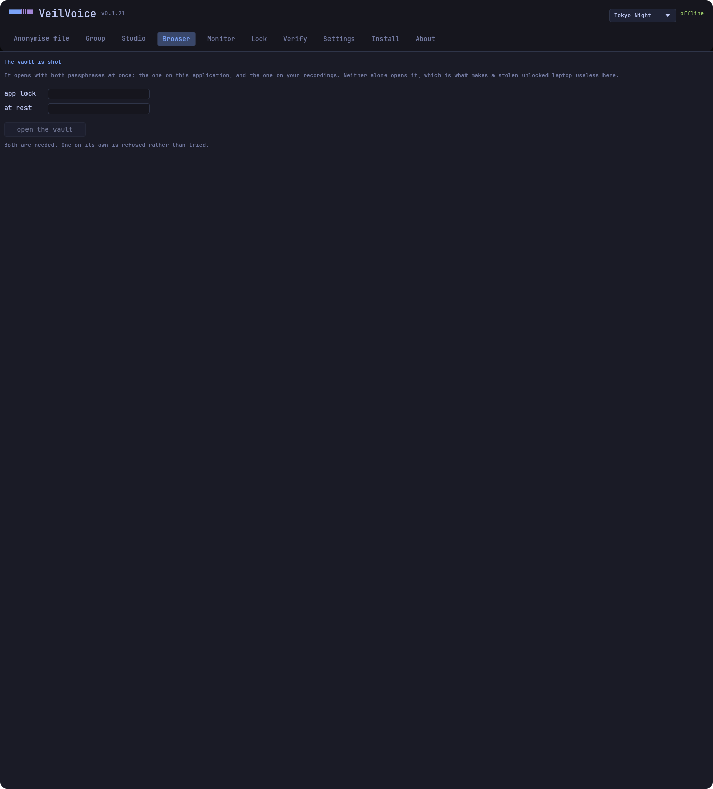
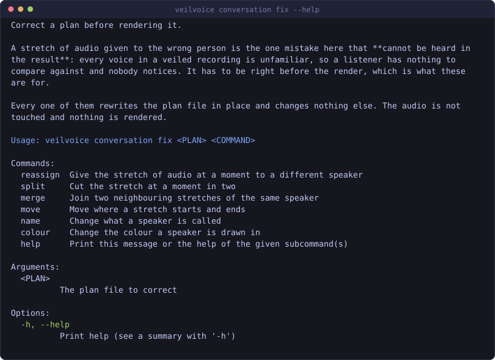

<!-- SPDX-License-Identifier: GPL-3.0-or-later -->

<!-- The animated banner, as a GIF, for the reason the still one was
     here instead: a README is read in a hundred clients that handle
     animation differently. The version this replaces needed a
     `<picture>` element to offer an APNG with a still fallback, and
     GitHub's renderer escapes `<picture>` -- which put a paragraph of
     raw markup above the project's name in the website's repository
     panel. One plain Markdown image needs no element to escape, and
     GIF is the one animated format every client draws. A client that
     will not animate it shows the first frame, which is exactly
     `assets/banner.png`.

     Nothing here is a committed blob: `assets/generate.py` draws the
     frames, writes the GIF with its own LZW encoder, and CI fails the
     build if the file and the generator disagree. The website does not
     serve this picture at all any more -- its banner is drawn in CSS,
     so it follows the reader's palette and its claims are text. -->


# VeilVoice

**Irreversible voice de-identification, fully offline.**

### → [tilas01.github.io/veilvoice](https://tilas01.github.io/veilvoice/)

Website, wiki, and an in-browser hash verifier that never uploads your file.
There is a [JavaScript-free edition](https://tilas01.github.io/veilvoice/nojs/)
for readers who would rather not run scripts.

The whole site is static files in [`website/`](website), so you can read it
offline if you cloned the repository, or if GitHub Pages is ever down: run
`python3 tools/site/serve.py` and open <http://localhost:8000>. For a real
server there is [`deploy/nginx.conf`](deploy/nginx.conf). The one number on the
site that must never be stale, the signing-key fingerprint, lives in the HTML,
so a local copy shows exactly what the source says.

Releases also carry a **self-signed code certificate** as a second, optional
identity beside the OpenPGP key. It is trust-on-first-use, not a certificate
authority, and it does not replace the OpenPGP check; what it adds is a
publisher an organisation can import once to reduce low-reputation false
positives, and an independent second signature. See
[docs/SELF_SIGNING.md](docs/SELF_SIGNING.md).

VeilVoice destroys the *biometric voiceprint* of a speaker, meaning pitch,
formants, timbre, micro-timing and the melody of an accent, so that neither software nor
a human listener can re-identify the speaker or reconstruct the original voice,
**while the words themselves stay clean and transcribable**.

There is no telemetry, no account, and no network code in the dependency
graph, and CI fails the build if an HTTP client appears in it.

**One thing reaches the network, and only when you press it.** The desktop app
has a *check for updates* button. It runs then and at no other time: no timer,
no check at startup, nothing in the background. It sends nothing about you or
your machine, it reads a public page anybody can open, and it downloads and
installs nothing: it reports a version number and every decision after that is
yours. There is still no HTTP client in the dependency graph: like the release
verifier, it borrows the transfer tool your operating system already ships.

Anonymising, scrambling, encrypting and every other thing VeilVoice does still
talk to no servers at all.

---

## What it does

1. **Anonymise a recording.** Wav, mp3, flac, ogg, m4a and friends in; a clean
   WAV out, with metadata stripped.
2. **Scramble your microphone live** and route the result to a virtual audio
   cable, so any application, whether a call, a stream or a recorder, receives the
   veiled voice instead of yours.
3. **Encrypt recordings at rest, by default.** Every file VeilVoice writes is
   sealed with post-quantum-hybrid cryptography unless you explicitly turn that
   off, and turning it off makes you read why first.
4. **Lock the app** behind a separate password, so someone who picks up your
   unlocked computer cannot open it. See the honest limits below.
5. **Detect tampering** with VeilVoice's own files, and say plainly when it
   cannot tell you which program did it.
6. **Strip identifying metadata** from audio and images (EXIF, GPS, tags).
7. **Watch what is listening.** See every application currently holding your
   microphone or camera, with alerts the moment one starts.
8. **Securely erase** a recording, with an honest account of what that is worth
   on flash storage.
9. **Work as a Rust library** in your own project. See below.

> ### Honest scope
>
> "Fill the whole spectrogram with white noise" and "stay understandable and
> transcribable" are mutually exclusive, because noise that covers the voice covers the
> words. VeilVoice therefore targets the achievable goal: **irreversible speaker
> de-identification with intelligibility preserved on purpose.** If the *message*
> also needs to be secret, encrypt it. That is a separate problem with a
> separate answer.
>
> The same honesty applies to **accent**. VeilVoice maps every speaker onto one
> canonical pitch register, vocal-tract scale and spectral tilt, so an accent's
> melody and colour do not survive. What no signal-level transform can change is
> *which phonemes you actually produced*, and at that level the accent and the words
> are the same thing.
>
> And to the **app lock**. It is an Argon2id password verifier with a rate
> limit, and it protects against *casual access*, meaning the person who picks up your
> unlocked laptop. It is not tamper-proof and it is not disk encryption: anyone
> who can write to your files can delete the lock, and anyone holding the drive
> can attack the stored hash offline. VeilVoice says this on the unlock screen
> itself rather than in a footnote. If the disk is the threat, encrypt the
> volume.
>
> The full argument, and everything an attacker can still learn, is in
> [`docs/WHITEPAPER.md`](docs/WHITEPAPER.md).

---

## What it looks like

Every picture below is of this build. The window captures are taken by
`tools/shots/gui.sh` on Linux or `tools/shots/gui.ps1` on Windows, either of
which drives the release build and photographs each tab; the terminal drawings
are generated from the command output committed beside them, and CI fails if a
drawing and its output disagree. See
[`assets/screenshots/README.md`](assets/screenshots/README.md) for why those two
are different kinds of thing.

### The desktop application

| | |
|---|---|
| **Anonymise a file.** One recording, veiled, encrypted at rest by default. | **Group mode.** Several people, a name and a colour each. |
|  |  |
| **Recording Studio.** A microphone in, a voice that is not yours out, and a locked vault to keep it in. | **Recording Browser.** What is in the vault, played out of locked memory, and the decoys that hide which vault is yours. |
|  |  |
| **Monitor.** Who is using the microphone and camera. | **Lock.** The app lock, and what it is and is not worth. |
|  |  |
| **Verify.** Drop a download on the window and be told what it is. | **Settings.** Nine palettes, motion, Failsafe, and which tabs are shown. |
|  |  |
| **Install.** Offered only to a portable copy. | **About.** Versions, scope, and the update check you press. |
|  |  |

Both scripts start the application once per tab with `--tab <name>` and
photograph it. There is no clicking and there are no coordinates, so a picture
cannot quietly end up showing the wrong tab. Neither script keeps a list of the
tabs either. `veilvoice-gui --tabs` prints them from the window's own, so one
added tomorrow is photographed without anybody remembering to add it.

**The pictures committed here were taken on Linux**, by `tools/shots/gui.sh`,
which runs the application under Xvfb with no window manager. Without one the
window is mapped at the origin at exactly the size it asks for, so the X root
window is the application window pixel for pixel and no cropping can include a
strip of desktop.

`tools/shots/gui.ps1` is the Windows counterpart and takes the same pictures
with `PrintWindow`. It is what produced the captures up to v0.1.19.

**Confirmed on Windows 11.** That is the one this application has been run on
by a person, rather than photographed by a script.

**Windows 10 is supported and not yet confirmed**, which is a different
sentence and is meant to be. Nothing in the desktop application needs anything
newer than Windows 10: the oldest interfaces it uses are `DwmGetWindowAttribute`
(Windows Vista), `SetProcessDpiAwareness` and `PrintWindow` with
`PW_RENDERFULLCONTENT` (Windows 8.1), and the two are only used by the
screenshot tool in any case. The application itself asks for nothing beyond
`whoami`, `tasklist`, `taskkill` and `reg`, all of which predate Windows 10 by
years. So it should run, and saying "it does" is not something this page will
claim until somebody has sat in front of one.

macOS and Linux build and their tests pass in CI, which is weaker still: a
green test run is not a person using the window.

### The command line

Everything the window does, and some things it does not.


<details>
<summary>The rest of the commands</summary>





</details>

## Install

Pick your system. Each one is a single command to get running, and a second
path if you would rather build it and check the result against what was
published.

**Check the download before you run it.** Every route below ends with that,
because a privacy tool you have not verified is a privacy tool you are taking
on faith.

<details>
<summary><b>Linux</b> (any distribution)</summary>

```bash
# 1. Download the archive, the hash list and the signature.
V=v0.1.20
B=https://github.com/tilas01/veilvoice/releases/download/$V
curl -fsSLO $B/veilvoice-$V-linux-x86_64.tar.gz
curl -fsSLO $B/SHA256SUMS
curl -fsSLO $B/SHA256SUMS.asc
curl -fsSLO $B/veilvoice-signing-key.asc

# 2. Unpack and check it, from inside the folder.
tar xzf veilvoice-$V-linux-x86_64.tar.gz
cd veilvoice-$V-linux-x86_64
./veilvoice verify

# 3. Run it, or install it so `veilvoice` works in any terminal.
./veilvoice-gui
./veilvoice install
```

`install` copies the programs into your own program directory and adds it to
`PATH`. No administrator rights, no service, nothing outside your account.
**Restart your terminal afterwards**, or the new `PATH` will not be in the one
you are using.

If the desktop application exits immediately saying a library could not be
loaded, install it and try again. The window toolkit opens it by name at
startup, so a minimal or server install often does not have it:

```bash
sudo apt install libxkbcommon-x11-0     # Debian, Ubuntu
sudo dnf install libxkbcommon-x11       # Fedora, RHEL
sudo pacman -S libxkbcommon-x11         # Arch
```

The command line needs none of this. On a distribution nothing else fits, take
the `musl-static` archive: it needs no system libraries at all.

</details>

<details>
<summary><b>macOS</b> (Intel and Apple Silicon)</summary>

```bash
V=v0.1.20
B=https://github.com/tilas01/veilvoice/releases/download/$V
# arm64 for Apple Silicon, x86_64 for Intel.
curl -fsSLO $B/veilvoice-$V-macos-arm64.tar.gz
curl -fsSLO $B/SHA256SUMS
curl -fsSLO $B/SHA256SUMS.asc
curl -fsSLO $B/veilvoice-signing-key.asc

tar xzf veilvoice-$V-macos-arm64.tar.gz
cd veilvoice-$V-macos-arm64
./veilvoice verify
./veilvoice-gui
```

macOS will refuse an unsigned download the first time. Right-click the program
and choose Open, rather than turning Gatekeeper off.

</details>

<details>
<summary><b>Windows</b> (10 and 11)</summary>

```powershell
$V = "v0.1.20"
$B = "https://github.com/tilas01/veilvoice/releases/download/$V"
curl.exe -fsSLO "$B/veilvoice-$V-windows-x86_64.zip"
curl.exe -fsSLO "$B/SHA256SUMS"
curl.exe -fsSLO "$B/SHA256SUMS.asc"
curl.exe -fsSLO "$B/veilvoice-signing-key.asc"

Expand-Archive "veilvoice-$V-windows-x86_64.zip" -DestinationPath .
cd "veilvoice-$V-windows-x86_64"
.\veilvoice.exe verify
.\veilvoice-gui.exe
```

`.\veilvoice.exe install` puts it on your `PATH`. **Open a new terminal
afterwards**: an existing one keeps the `PATH` it started with.

</details>

<details>
<summary><b>WSL</b></summary>

WSL is Linux, so the Linux instructions apply unchanged and `veilvoice` works
exactly as it does there. Two differences worth knowing:

- The window needs **WSLg**, which recent Windows has by default.
- A microphone belongs to Windows, not to the distribution, so **live mode is
  the Windows build's job**. Use the Windows download for that.

</details>

<details>
<summary><b>FreeBSD, OpenBSD, NetBSD</b></summary>

The command line only. The audio library has no BSD backend, so live capture
cannot work and the window is not shipped. Everything that operates on a file
runs exactly as it does elsewhere.

```sh
V=v0.1.20
fetch https://github.com/tilas01/veilvoice/releases/download/$V/veilvoice-$V-freebsd-x86_64.tar.gz
tar xzf veilvoice-$V-freebsd-x86_64.tar.gz
cd veilvoice-$V-freebsd-x86_64
./veilvoice verify
```

</details>

<details>
<summary><b>Build it yourself, and prove it matches</b></summary>

A fresh clone needs **no secrets**:

```bash
git clone https://github.com/tilas01/veilvoice && cd veilvoice
cargo build --release
```

To prove your build is the published one, byte for byte:

```bash
veilvoice verify --build-script > reproduce-veilvoice.sh
sh reproduce-veilvoice.sh v0.1.20
```

That clones the tag, builds it with the committed lockfile and the commit's own
date, and compares the result with the release. **If it does not match**, the
script says which file differed. Before reporting it, check the three things
that cause a mismatch on an otherwise honest machine:

1. **A different compiler.** The version is pinned in `rust-toolchain.toml`
   and `rustup` honours it automatically. Without `rustup`, you may be building
   with something else.
2. **`RUSTFLAGS` set in your environment**, which changes codegen.
3. **A dirty checkout.** The script clones fresh for exactly this reason; if
   you built by hand, `git status` should be clean.

If all three are ruled out, that is worth reporting, and
[`docs/REPRODUCIBLE_BUILDS.md`](docs/REPRODUCIBLE_BUILDS.md) explains what is
pinned and why.

</details>

### Guides

| If you have | Read |
|---|---|
| an archive you just downloaded | [Checking a download](docs/GUIDE_VERIFY.md) |
| a terminal | [The command line](docs/GUIDE_CLI.md) |
| a window | [The desktop application](docs/GUIDE_GUI.md) |
| all of it | [The full user guide](docs/USER_GUIDE.md) |

Also: [installing in detail](docs/INSTALL.md),
[packaging it yourself](docs/PACKAGING.md),
[reproducible builds](docs/REPRODUCIBLE_BUILDS.md).

---

## Use it

### Desktop app

```bash
veilvoice-gui
```

Ten tabs: anonymise a file, group conversations, the Studio, which scrambles a
microphone live and records into the vault, browse what is in that vault, who is
using the microphone and camera, the app lock, verify a download, settings,
portable or installed, and an about panel that states the scope. Nine palettes, or your own, and every screen is
captured under
[What it looks like](#what-it-looks-like).

### Command line

```bash
veilvoice anonymise recording.mp3 -o clean.wav   # writes clean.wav.veil, sealed
veilvoice anonymise recording.mp3 --encrypt-to friend.pub
veilvoice anonymise recording.mp3 --encrypt false   # warns first
veilvoice live --output "CABLE Input (VB-Audio Virtual Cable)"
veilvoice devices
veilvoice clean photo.jpg
veilvoice encrypt secret.wav
veilvoice decrypt clean.wav.veil -o clean.wav
veilvoice keygen
veilvoice lock set                     # password-gate the desktop app
veilvoice lock status
veilvoice guard init --sealed          # record what the files should be
veilvoice guard check                  # and see whether they still are
veilvoice watch                        # who is using the mic and camera
veilvoice shred secret.wav             # irreversible
```

Every command takes `--help`.

### Encrypted by default

`anonymise` seals its result into a `.veil` container rather than writing a bare
WAV, because de-identification and confidentiality are different problems and
only the first one is solved by the engine: **the words survive on purpose**, so
an unencrypted result is still a recording of everything that was said.

The WAV is encoded in memory and sealed there, so a recording that is going to be
encrypted never touches the disk in the clear, not even for a moment, because a
plaintext file that is written and then deleted is exactly what
[`veilvoice shred`](crates/veilvoice-crypto/src/shred.rs) explains cannot be
reliably taken back on flash storage.

Passing `--encrypt false` still works. It prints what you are giving up and, on
a terminal, waits for you to type `UNENCRYPTED`.

### Who is listening?

De-identifying your voice on a call achieves little if a second program is
recording the raw microphone at the same time. `veilvoice watch` names what is
holding your microphone and camera, and alerts the moment something starts:

```
● veilvoice is now using your microphone
```

Windows reads the same records that drive the OS privacy indicator; Linux reads
open handles under `/proc`. **macOS exposes no public interface for this**, so
nothing is reported there rather than something guessed: the tool tells you it
cannot see, because an empty list from a blind monitor is a false reassurance.

---

## Route it into a call

Live mode veils your microphone and writes the result to an output device. To
put that into a call, the call has to be able to *read* that output, and an
operating system will not normally let one program's output be another's input.
A **virtual audio cable** is a device that exists only in software: VeilVoice
writes to one end, and Zoom, Discord, OBS or anything else picks its microphone
as the other.

None of these is written by this project, none is bundled, and each is under
its own licence. Install whichever your system uses, then in VeilVoice choose
your real microphone as the input and the cable as the output, and in the call
choose the cable as the microphone.

**Where this does not apply.** The FreeBSD, OpenBSD and NetBSD archives have no
live microphone mode at all, because `cpal`, the audio device library, has no
backend for them. The BSD sections below are there so that somebody on one of
those systems knows that rather than hunting for a cable that would not help.
Run `veilvoice info` on any platform and it says what that build supports.

<details>
<summary><b>Windows 10 and 11</b></summary>

**[VB-CABLE](https://vb-audio.com/Cable/)** by VB-Audio Software. Proprietary
donationware, free to use. One cable, and the usual choice.

1. Download from [vb-audio.com/Cable](https://vb-audio.com/Cable/) and unzip it.
2. Right-click `VBCABLE_Setup_x64.exe` and choose **Run as administrator**. It
   needs that to install a driver.
3. Reboot. Windows will not show the device until you do.
4. In VeilVoice: input **your microphone**, output **CABLE Input (VB-Audio
   Virtual Cable)**.
5. In the call: microphone **CABLE Output (VB-Audio Virtual Cable)**.

To hear yourself while you talk, turn on *Listen to this device* for CABLE
Output in Windows sound settings and point it at your headphones.

**[Voicemeeter](https://vb-audio.com/Voicemeeter/)**, by the same author, is
the larger version: several cables plus a mixer, for feeding more than one
program at once. Same licence.

**[Virtual Audio Cable](https://vac.muzychenko.net/en/)** by Eugene Muzychenko
is the long-standing commercial alternative, with a trial that adds a spoken
reminder to the audio.

`veilvoice install` on Windows takes a `-WithVBCable` switch, which opens the
VB-CABLE download page in your browser. It downloads nothing itself and
installs nothing: VeilVoice does not install other people's drivers.

</details>

<details>
<summary><b>macOS</b> (Intel and Apple Silicon)</summary>

**[BlackHole](https://existential.audio/blackhole/)** by Existential Audio.
MIT licensed, open source, and a universal binary, so the same installer covers
both Intel and Apple Silicon.

1. Install it with Homebrew:

   ```bash
   brew install blackhole-2ch
   ```

   or download the signed installer from
   [existential.audio/blackhole](https://existential.audio/blackhole/). The
   source is at
   [github.com/ExistentialAudio/BlackHole](https://github.com/ExistentialAudio/BlackHole).
2. In VeilVoice: input **your microphone**, output **BlackHole 2ch**.
3. In the call: microphone **BlackHole 2ch**.

To hear yourself as well, open **Audio MIDI Setup**, create a **Multi-Output
Device** containing BlackHole and your headphones, and send VeilVoice there
instead.

The 16-channel and 64-channel builds (`blackhole-16ch`, `blackhole-64ch`) exist
for larger routing setups and are installed the same way. Two channels is what
a call needs.

**[Loopback](https://rogueamoeba.com/loopback/)** by Rogue Amoeba is the
commercial option, with a graphical patchbay and a free trial that degrades the
audio after twenty minutes. Soundflower, which older guides still recommend, is
unmaintained and is not a good choice on a current macOS.

macOS will ask for microphone permission the first time. That is the real
microphone, not the cable.

</details>

<details>
<summary><b>Linux</b> (any distribution)</summary>

**[PipeWire](https://pipewire.org/)** is almost certainly already running:
it is the default on Fedora, Ubuntu since 22.10, Debian 12, Arch and most
others. Nothing to install, and the cable is one command.

1. Create the cable:

   ```bash
   pw-loopback --capture-props='media.class=Audio/Sink node.name=veilvoice_cable' \
               --playback-props='media.class=Audio/Source node.name=veilvoice_cable_out'
   ```

   Leave that running. It disappears when you stop it, which is the tidy way
   round: nothing is installed and nothing survives a reboot.
2. In VeilVoice: input **your microphone**, output **veilvoice_cable**.
3. In the call: microphone **veilvoice_cable_out**.

A graphical patchbay makes the wiring visible and is worth having:
[**qpwgraph**](https://gitlab.freedesktop.org/rncbc/qpwgraph) or
[**Helvum**](https://gitlab.freedesktop.org/pipewire/helvum), both packaged
nearly everywhere.

**On PulseAudio**, if your distribution still uses it:

```bash
pactl load-module module-null-sink sink_name=veilvoice_cable \
      sink_properties=device.description=VeilVoice_Cable
```

VeilVoice outputs to `VeilVoice_Cable`; the call takes `Monitor of
VeilVoice_Cable` as its microphone. `pactl unload-module` with the number that
command printed removes it again.

**On [JACK](https://jackaudio.org/)**, connect VeilVoice's output port to the
call's input port in `qjackctl` or Carla. PipeWire provides a JACK interface,
so this works without running JACK itself.

</details>

<details>
<summary><b>FreeBSD, OpenBSD and NetBSD</b></summary>

**The BSD builds have no live mode**, so no cable will make one appear. `cpal`
has no BSD backend, which the archive's own notes and `veilvoice info` both
say. Everything else works: anonymise, clean, encrypt, decrypt, keygen,
conversation rendering and verification.

Recorded on the roadmap as a real gap rather than a decision. If you want to
route audio on these systems for other reasons, this is what people use:

- **FreeBSD**: [`virtual_oss`](https://github.com/freebsd/virtual_oss), in
  ports as `audio/virtual_oss`, creates virtual devices in front of a real
  one. PulseAudio and PipeWire are both in ports as well.
- **OpenBSD**: [**sndio**](https://sndio.org/), which is part of the base
  system. `sndiod` sub-devices route audio between programs with no third-party
  driver at all.
- **NetBSD**: the [`pad(4)`](https://man.netbsd.org/pad.4) pseudo-device, again
  in the base system, presents an audio device whose output another program can
  read.

</details>

---

## Use it as a library

**Worked examples, with the licence implications spelled out, are in
[`docs/USING_THE_CRATES.md`](docs/USING_THE_CRATES.md).** Every example there is
a real file under `crates/*/examples/`, compiled on every commit, so none of it
can quietly stop being true:

```bash
cargo run -p veilvoice-core   --example veil_a_buffer
cargo run -p veilvoice-crypto --example seal_and_open
```

Every crate is a normal Rust library. Point Cargo at the repository:

```toml
[dependencies]
veilvoice-core  = { git = "https://github.com/tilas01/veilvoice" }
veilvoice-audio = { git = "https://github.com/tilas01/veilvoice" }
```

| Crate | What it gives you |
|---|---|
| `veilvoice-core` | The de-identification engine. No I/O, no threads, allocation-free `process()`. |
| `veilvoice-audio` | Device enumeration, file decode/encode, live capture→process→playback. |
| `veilvoice-crypto` | Argon2id, X25519+ML-KEM-768 hybrid, XChaCha20-Poly1305, page-locked secrets, the app-lock verifier. |
| `veilvoice-meta` | Metadata stripping for audio and images. |
| `veilvoice-watch` | Microphone and camera use, by application. Zero dependencies. |
| `veilvoice-guard` | Integrity manifest and tamper detection for VeilVoice's own files. |
| `veilvoice-setup` | Per-user install and its exact reversal, and detection of the optional companion software. |
| `veilvoice-sentry` | Ransomware canaries and directory churn measurement. Detects; stops nothing. |
| `veilvoice-policy` | Settings that can only be tightened, sealed with the same post-quantum container. |
| `veilvoice-drivers` | What is loaded in the kernel, compared against last time, with a cross-view check. |
| `veilvoice-capture` | Which screen recorders are running, and an allowlist for the ones you meant. |
| `veilvoice-conversation` | Several speakers in one recording: a voice each, names, and subtitles. |

The engine itself is small enough to drop into an audio callback:

```rust
use veilvoice_core::{DeidConfig, Deidentifier};

let mut deid = Deidentifier::new(DeidConfig::default())?;
let mut out = vec![0.0; block.len()];
deid.process(&block, &mut out);   // no allocation, callback safe
```

### Example: speech-to-text without handing over your voice

Cloud transcription is genuinely useful and genuinely invasive: the provider
receives a biometric identifier that is as durable as a fingerprint, and it
usually keeps it. But transcription only needs the *words*, which is exactly
the half VeilVoice preserves.

So run the audio through VeilVoice first. The service gets speech it can
transcribe and a voiceprint that belongs to nobody:

```rust
use veilvoice_audio::{deidentify, io};
use veilvoice_core::DeidConfig;

// Your real voice never leaves this function.
let original = io::load(std::path::Path::new("dictation.wav"))?;
let veiled = deidentify(&original, DeidConfig::default())?;
io::save_wav(std::path::Path::new("safe-to-upload.wav"), &veiled)?;
```

Or from the shell:

```bash
veilvoice anonymise dictation.wav -o safe-to-upload.wav
```

**Two caveats, stated plainly.** Accuracy drops somewhat, because the output is
synthetic-sounding, and recognisers are trained on natural speech. And *the
words still go to the provider*: this protects your identity, not the content of
what you said. If the content is sensitive too, do not upload it at all:
transcribe locally.

Local transcription is the stronger answer and is a planned integration (see
[`ROADMAP.md`](ROADMAP.md)); until then, `whisper.cpp` reads the WAV VeilVoice
writes with no extra work.

---

## Design pillars

- **Offline by construction.** Zero servers, enforced in CI.
- **No `unsafe` anywhere.** Every crate carries `#![forbid(unsafe_code)]`,
  including the page-locking path.
- **57481 functional lines of Rust**, across 28 crates. A *functional line* is
  a line holding code: blank lines and lines holding only a comment are not
  counted, and a line with code and a trailing comment counts once. Each
  crate's own README states its share of that total under **The files**.

  It is a smaller number than the length of the tree, and deliberately so. This
  project is written with a high comment-to-code ratio, and the per-file line
  counts printed on the generated pages, in the artwork and in the reference
  links are the other measure, the length of the file. Both are stated with
  their definitions rather than one being quietly redefined to match the other,
  and both come from `tools/loc/count.py`. The 28 includes `fuzz/`, the
  harnesses, which is a Cargo project of its own rather than a workspace
  member.
- **Irreversible.** Each frame's measured phase is discarded and resynthesised,
  permanently destroying the speaker's waveform and micro-timing.
- **Normalising, not just scrambling.** Pitch register, vocal-tract length and
  spectral tilt are each collapsed onto one canonical target, so a whole
  population of speakers maps to the same output. That destroys information
  rather than moving it.
- **Cryptographically modulated, with a rolling seed.** The residual transform
  is driven every frame by a ChaCha20 CSPRNG whose seed never leaves the
  process, and that seed is ratcheted forward every couple of seconds, so each
  stretch of audio is sealed off behind a one-way step rather than sharing one
  stream with the whole recording. Configurable, and inaudible by construction.
- **Post-quantum ready, and on by default.** At-rest encryption is X25519 +
  ML-KEM-768 hybrid, because a recording stored today may be attacked decades
  from now, and it is what `anonymise` does unless you say otherwise.
- **Amnesic.** Secrets are page-locked out of swap, zeroized on drop, compared
  in constant time, and opaque to `Debug`.
- **Reproducible & verifiable.** Pinned toolchain, committed lockfile,
  path-remapped builds, and a double-build check in CI.
- **Libre.** GPL-3.0-or-later.

---

## Layout

| Crate | Purpose |
|-------|---------|
| `veilvoice-core`   | De-identification DSP engine and accent neutralisation, the security-critical heart. |
| `veilvoice-crypto` | Argon2id, X25519+ML-KEM-768 hybrid, XChaCha20-Poly1305, amnesic secrets. |
| `veilvoice-audio`  | Capture/playback (cpal), virtual-cable routing, file import/export. |
| `veilvoice-meta`   | Metadata strip/spoof for audio and image EXIF/GPS. |
| `veilvoice-watch`  | Which applications are using the microphone and camera, and alerts on change. |
| `veilvoice-capture` | Screen recorders that are running, muted per program. Does **not** hide VeilVoice's window. |
| `veilvoice-conversation` | Who spoke when, one destination voice each, WebVTT and SubRip subtitles. |
| `veilvoice-drivers` | Loaded kernel drivers and modules, recorded and compared. Detects carelessness, not rootkits. |
| `veilvoice-policy` | Settings fixed so the interface cannot turn them off. Every one of them tightens. |
| `veilvoice-sentry` | Canaries and churn measurement over a directory, an early warning and never a preventer. |
| `veilvoice-setup`  | Per-user install, PATH, removal, and companion detection, shared by both front ends. |
| `veilvoice-cli`    | The `veilvoice` command-line tool. |
| `veilvoice-gui`    | The desktop app (egui, Tokyo Night). |

Artwork is **generated, not committed as opaque blobs**:
`python assets/generate.py` reproduces every icon and the banner from source.

---

## Status

**v0.1.20: early but real.** The engine, cryptography, audio path, metadata
cleaning, at-rest encryption, app lock, tamper detection, encrypted-volume
destinations, CLI and GUI are implemented and tested (1545 tests across 27
crates plus doctests, and 18 website suites, clippy clean, no `unsafe`), with
randomised campaigns against every parser that reads untrusted input and
against the website's Markdown renderer. Release binaries are built for eleven
targets, each one built twice from a copy of the source at a different path and
compared byte for byte. **At v0.1.19 all eleven reproduced**, the three BSDs
included: those were the last three to be built only once, and the release
notes carry the verdict each platform actually reached rather than a claim
about all of them.

**Audited by tilas01**, who wrote and reviewed it. Be clear about what that is
worth: a maintainer audit catches what the author can see, and **no external
firm or independent researcher has reviewed this code**. Read the source before
relying on it for anything that matters. It is written to be read.

Thirty-two audit rounds have found and fixed **168 defects**.
Among them: a four-kilobyte file that killed the process, a configuration value that made every output sample silent, a secure erase that
destroyed a file other than the one named, a locked encrypted volume that went
on accepting recordings onto the ordinary disk, and two ways to freeze a
reader's browser tab. **None in any round was a confidentiality failure** in
the strict sense that nothing let an attacker recover a voiceprint, read a
sealed recording, bypass a password or weaken the cryptography. The two
encrypted-volume defects came closest, and `docs/AUDIT.md` is exact about which
side of that line they fall on rather than leaving the claim to do the work. Every one is written up individually, including
the ones earlier rounds had declared clean, in
[`docs/AUDIT.md`](docs/AUDIT.md).

Using it: [`docs/USER_GUIDE.md`](docs/USER_GUIDE.md), or
[the wiki](https://tilas01.github.io/veilvoice/wiki.html).
Roadmap and open work: [`ROADMAP.md`](ROADMAP.md).

## Credits

Written and maintained by **tilas01**, who holds the copyright and is the sole
author for licensing purposes.

Much of the code, the documentation and this website were drafted with the help
of **Claude**, Anthropic's assistant, working to tilas01's direction. Nothing
reaches a release unread: every change is reviewed, built and tested before it
is committed, and the audit rounds in [`docs/AUDIT.md`](docs/AUDIT.md) are the
record of that review finding its own mistakes. The credit is stated here, in
the open, rather than scattered through the commit log.

## Licence

GPL-3.0-or-later. See [`LICENSE`](LICENSE).

None of the virtual audio cables listed under
[Route it into a call](#route-it-into-a-call) is bundled here, and none of them
is ours. Each is somebody else's software under its own licence, named there
with what that licence is.
