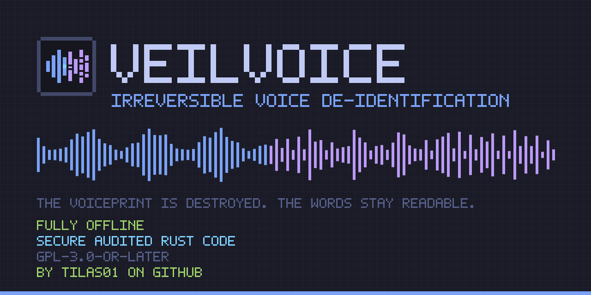

<!-- SPDX-License-Identifier: GPL-3.0-or-later -->

<p align="center">
  
</p>

# VeilVoice

**Irreversible voice de-identification — fully offline.**

### → [tilas01.github.io/veilvoice](https://tilas01.github.io/veilvoice/)

Website, wiki, and an in-browser hash verifier that never uploads your file.
There is a [JavaScript-free edition](https://tilas01.github.io/veilvoice/nojs/)
for readers who would rather not run scripts.

VeilVoice destroys the *biometric voiceprint* of a speaker — pitch, formants,
timbre, micro-timing and the melody of an accent — so that neither software nor
a human listener can re-identify the speaker or reconstruct the original voice,
**while the words themselves stay clean and transcribable**.

It talks to no servers. Ever. There is no telemetry, no update check, and no
network code in the dependency graph — CI fails the build if an HTTP client
appears in it.

---

## What it does

1. **Anonymise a recording** — wav, mp3, flac, ogg, m4a and friends in; a clean
   WAV out, with metadata stripped.
2. **Scramble your microphone live** and route the result to a virtual audio
   cable, so any application — a call, a stream, a recorder — receives the
   veiled voice instead of yours.
3. **Encrypt recordings** at rest with post-quantum-hybrid cryptography.
4. **Strip identifying metadata** from audio and images (EXIF, GPS, tags).
5. **Watch what is listening** — see every application currently holding your
   microphone or camera, with alerts the moment one starts.
6. **Securely erase** a recording, with an honest account of what that is worth
   on flash storage.
7. **Work as a Rust library** in your own project — see below.

> ### Honest scope
>
> "Fill the whole spectrogram with white noise" and "stay understandable and
> transcribable" are mutually exclusive — noise that covers the voice covers the
> words. VeilVoice therefore targets the achievable goal: **irreversible speaker
> de-identification with intelligibility preserved on purpose.** If the *message*
> also needs to be secret, encrypt it — that is a separate problem with a
> separate answer.
>
> The same honesty applies to **accent**. VeilVoice maps every speaker onto one
> canonical pitch register, vocal-tract scale and spectral tilt, so an accent's
> melody and colour do not survive. What no signal-level transform can change is
> *which phonemes you actually produced* — at that level the accent and the words
> are the same thing.
>
> The full argument, and everything an attacker can still learn, is in
> [`docs/WHITEPAPER.md`](docs/WHITEPAPER.md).

---

## Install

Grab a build from [Releases](https://github.com/tilas01/veilvoice/releases) —
or verify one first with the
[in-browser verifier](https://tilas01.github.io/veilvoice/#verify) — or build it
yourself, since a fresh clone needs **no secrets**:

```bash
git clone https://github.com/tilas01/veilvoice && cd veilvoice
cargo build --release
```

Release binaries are built twice in different directories and verified
byte-identical. See [`docs/REPRODUCIBLE_BUILDS.md`](docs/REPRODUCIBLE_BUILDS.md)
to check a download against the source yourself.

---

## Use it

### Desktop app

```bash
veilvoice-gui
```

Three modes — anonymise a file, scramble live, and an about panel that states
the scope. Tokyo Night, monospace, dark.

### Command line

```bash
veilvoice anonymise recording.mp3 -o clean.wav
veilvoice live --output "CABLE Input (VB-Audio Virtual Cable)"
veilvoice devices
veilvoice clean photo.jpg
veilvoice encrypt secret.wav
veilvoice keygen
veilvoice watch                        # who is using the mic and camera
veilvoice shred secret.wav             # irreversible
```

Every command takes `--help`.

### Who is listening?

De-identifying your voice on a call achieves little if a second program is
recording the raw microphone at the same time. `veilvoice watch` names what is
holding your microphone and camera, and alerts the moment something starts:

```
● veilvoice is now using your microphone
```

Windows reads the same records that drive the OS privacy indicator; Linux reads
open handles under `/proc`. **macOS exposes no public interface for this**, so
nothing is reported there rather than something guessed — the tool tells you it
cannot see, because an empty list from a blind monitor is a false reassurance.

---

## Use it as a library

Every crate is a normal Rust library. Point Cargo at the repository:

```toml
[dependencies]
veilvoice-core  = { git = "https://github.com/tilas01/veilvoice" }
veilvoice-audio = { git = "https://github.com/tilas01/veilvoice" }
```

| Crate | What it gives you |
|---|---|
| `veilvoice-core` | The de-identification engine. No I/O, no threads, allocation-free `process()`. |
| `veilvoice-audio` | Device enumeration, file decode/encode, live capture→process→playback. |
| `veilvoice-crypto` | Argon2id, X25519+ML-KEM-768 hybrid, XChaCha20-Poly1305, page-locked secrets. |
| `veilvoice-meta` | Metadata stripping for audio and images. |
| `veilvoice-watch` | Microphone and camera use, by application. Zero dependencies. |

The engine itself is small enough to drop into an audio callback:

```rust
use veilvoice_core::{DeidConfig, Deidentifier};

let mut deid = Deidentifier::new(DeidConfig::default())?;
let mut out = vec![0.0; block.len()];
deid.process(&block, &mut out);   // no allocation, callback safe
```

### Example: speech-to-text without handing over your voice

Cloud transcription is genuinely useful and genuinely invasive: the provider
receives a biometric identifier that is as durable as a fingerprint, and it
usually keeps it. But transcription only needs the *words* — which is exactly
the half VeilVoice preserves.

So run the audio through VeilVoice first. The service gets speech it can
transcribe and a voiceprint that belongs to nobody:

```rust
use veilvoice_audio::{deidentify, io};
use veilvoice_core::DeidConfig;

// Your real voice never leaves this function.
let original = io::load(std::path::Path::new("dictation.wav"))?;
let veiled = deidentify(&original, DeidConfig::default())?;
io::save_wav(std::path::Path::new("safe-to-upload.wav"), &veiled)?;
```

Or from the shell:

```bash
veilvoice anonymise dictation.wav -o safe-to-upload.wav
```

**Two caveats, stated plainly.** Accuracy drops somewhat — the output is
synthetic-sounding, and recognisers are trained on natural speech. And *the
words still go to the provider*: this protects your identity, not the content of
what you said. If the content is sensitive too, do not upload it at all —
transcribe locally.

Local transcription is the stronger answer and is a planned integration (see
[`HANDOFF.md`](HANDOFF.md)); until then, `whisper.cpp` reads the WAV VeilVoice
writes with no extra work.

---

## Design pillars

- **Offline by construction.** Zero servers, enforced in CI.
- **No `unsafe` anywhere.** Every crate carries `#![forbid(unsafe_code)]`,
  including the page-locking path.
- **Irreversible.** Each frame's measured phase is discarded and resynthesised,
  permanently destroying the speaker's waveform and micro-timing.
- **Normalising, not just scrambling.** Pitch register, vocal-tract length and
  spectral tilt are each collapsed onto one canonical target, so a whole
  population of speakers maps to the same output. That destroys information
  rather than moving it.
- **Cryptographically modulated, with a rolling seed.** The residual transform
  is driven every frame by a ChaCha20 CSPRNG whose seed never leaves the
  process — and that seed is ratcheted forward every couple of seconds, so each
  stretch of audio is sealed off behind a one-way step rather than sharing one
  stream with the whole recording. Configurable, and inaudible by construction.
- **Post-quantum ready.** At-rest encryption is X25519 + ML-KEM-768 hybrid,
  because a recording stored today may be attacked decades from now.
- **Amnesic.** Secrets are page-locked out of swap, zeroized on drop, compared
  in constant time, and opaque to `Debug`.
- **Reproducible & verifiable.** Pinned toolchain, committed lockfile,
  path-remapped builds, and a double-build check in CI.
- **Libre.** GPL-3.0-or-later.

---

## Layout

| Crate | Purpose |
|-------|---------|
| `veilvoice-core`   | De-identification DSP engine and accent neutralisation — the security-critical heart. |
| `veilvoice-crypto` | Argon2id, X25519+ML-KEM-768 hybrid, XChaCha20-Poly1305, amnesic secrets. |
| `veilvoice-audio`  | Capture/playback (cpal), virtual-cable routing, file import/export. |
| `veilvoice-meta`   | Metadata strip/spoof for audio and image EXIF/GPS. |
| `veilvoice-watch`  | Which applications are using the microphone and camera, and alerts on change. |
| `veilvoice-cli`    | The `veilvoice` command-line tool. |
| `veilvoice-gui`    | The desktop app (egui, Tokyo Night). |

Artwork is **generated, not committed as opaque blobs** —
`python assets/generate.py` reproduces every icon and the banner from source.

---

## Status

**v0.1.1 — early but real.** The engine, cryptography, audio path, metadata
cleaning, CLI and GUI are implemented and tested (151 tests, clippy clean, no
`unsafe`). Release binaries are verified bit-for-bit reproducible on Linux,
Windows, macOS ARM and macOS Intel.

**Audited by tilas01**, who wrote and reviewed it. Be clear about what that is
worth: a maintainer audit catches what the author can see, and **no external
firm or independent researcher has reviewed this code**. Read the source before
relying on it for anything that matters — it is written to be read.

Roadmap and open work: [`HANDOFF.md`](HANDOFF.md).
Documentation: [the wiki](https://tilas01.github.io/veilvoice/wiki.html).

## Licence

GPL-3.0-or-later. See [`LICENSE`](LICENSE).

Virtual audio routing on Windows is usually provided by
[VB-CABLE](https://vb-audio.com/Cable/), which is proprietary donationware and
is **not** bundled here — install it separately if you want it.
