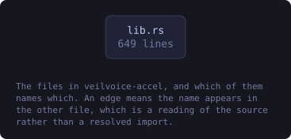

<!-- SPDX-License-Identifier: GPL-3.0-or-later -->
<!-- GENERATED by tools/docs/generate.py from the doc comments in the
     source. Do not edit this file: edit the `//!` and `///` comments in
     the .rs files and run the generator again. CI verifies it with
         python tools/docs/generate.py --check
-->

  

# veilvoice-accel

> What graphics hardware this machine has, which of it can encode video, and the measured reason the audio engine does not use any of it.

## Contents

- [The honest answer about the audio engine, with the number](#the-honest-answer-about-the-audio-engine-with-the-number)
- [Where it genuinely helps, which is video](#where-it-genuinely-helps-which-is-video)
- [Detection asks the system, and can fail](#detection-asks-the-system-and-can-fail)
- [In plain words](#in-plain-words)
  - [How the crate fits together](#how-the-crate-fits-together)
  - [The files](#the-files)
  - [Public items](#public-items)
  - [Reading it elsewhere](#reading-it-elsewhere)

What hardware this machine has, and the one place VeilVoice can use it.

# The honest answer about the audio engine, with the number

**The de-identifier is not going on a graphics card, and it would be slower
if it did.** That is a measurement rather than an opinion: veiling sixty
seconds of audio takes about 0.58 seconds on one core of an ordinary
desktop, which is roughly a hundred times faster than real time. Live mode
works on 1024-sample frames, so each frame has about 21 ms to be finished
in and takes about 0.05 ms.

A graphics card is fast at doing the same arithmetic to a very large batch
at once. It is not fast at answering small questions quickly: getting 1024
samples onto the card, waiting for a kernel, and getting them back costs
more than the whole computation. Offering a "use the GPU" switch for that
work would make VeilVoice slower and would be exactly the kind of claim
this project refuses to make.

# Where it genuinely helps, which is video

Encoding a video is the opposite shape of problem: a great deal of the same
work, on large frames, where a dedicated encoder block on the card does in
hardware what `libx264` does on the processor. Every current NVIDIA card has
**NVENC**, every current AMD card has **AMF**, and Intel's integrated
graphics have **Quick Sync**. That is what this crate detects and what
`veilvoice conversation video` can be pointed at.

# Detection asks the system, and can fail

There is no portable way to enumerate graphics hardware from the standard
library, and every native route is FFI. So this asks a tool the platform
already ships, exactly as the rest of this workspace does, and when it
cannot it says so rather than reporting an empty machine.

**Finding a card is not the same as being able to use it.** An encoder needs
a driver, and it needs the copy of `ffmpeg` on this machine to have been
built with support for it. `Adapter::caveat` says so, and nothing here
reports a device as usable on the strength of its name.

# In plain words

Changing a voice is already about a hundred times faster than listening to
it, so there is nothing for a graphics card to speed up, and pretending
otherwise would just make VeilVoice slower. Making a **video** is different:
that is real work, and most graphics cards have a dedicated chip for it.

So this finds the graphics hardware you have, tells you which of it can
encode video, and lets you pick. If you have two cards, an integrated one
and a separate one, you can say which. And it is honest that finding a card
is not proof it will work: that also depends on your drivers and on the
copy of ffmpeg you have.

## How the crate fits together

Every arrow below is a `crate::` or `super::` path one module actually
uses, read out of the source by the generator rather than drawn by
hand. A dependency that goes away loses its arrow the next time this
file is written.

  

The same graph as Mermaid source

## The files

| File | Lines | What it is |
|---|---:|---|
| [`lib.rs`](../../docs/files/veilvoice-accel/lib.md) | 589 | What hardware this machine has, and the one place VeilVoice can use it. |

## Public items

| Item | Where | What |
|---|---|---|
| `enum Vendor` | [`lib.rs`](../../docs/files/veilvoice-accel/lib.md) | Who made a graphics device. |
| `struct Adapter` | [`lib.rs`](../../docs/files/veilvoice-accel/lib.md) | One graphics device. |
| `struct Found` | [`lib.rs`](../../docs/files/veilvoice-accel/lib.md) | Everything found, and anything that went wrong looking. |
| `fn look` | [`lib.rs`](../../docs/files/veilvoice-accel/lib.md) | Look for graphics hardware. |
| `fn usable_threads` | [`lib.rs`](../../docs/files/veilvoice-accel/lib.md) | How many threads this machine can usefully run at once. |
| `const WHY_NOT_THE_ENGINE` | [`lib.rs`](../../docs/files/veilvoice-accel/lib.md) | Why the audio engine is not offered a graphics card, with the numbers. |
| `const WHAT_IT_CHANGES` | [`lib.rs`](../../docs/files/veilvoice-accel/lib.md) | What hardware encoding is for, and what it does not change. |

## Reading it elsewhere

- On the website: [`website/reference/veilvoice-accel.html`](../../website/reference/veilvoice-accel.html)
- The audit this code is held to: [`docs/AUDIT.md`](../../docs/AUDIT.md)
- The claims and their limits: [`docs/WHITEPAPER.md`](../../docs/WHITEPAPER.md)
- Using the crates from your own project: [`docs/USING_THE_CRATES.md`](../../docs/USING_THE_CRATES.md)

Signing key fingerprint `8101FB3BB28D02FB239E0CDF9CC1C7E7A9B5833A`.
