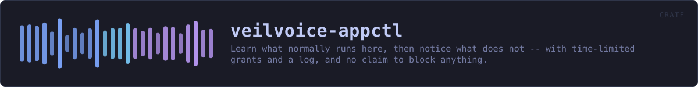
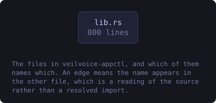

<!-- SPDX-License-Identifier: GPL-3.0-or-later -->
<!-- GENERATED by tools/docs/generate.py from the doc comments in the
     source. Do not edit this file: edit the `//!` and `///` comments in
     the .rs files and run the generator again. CI verifies it with
         python tools/docs/generate.py --check
-->

  

# veilvoice-appctl

> Learn what normally runs here, then notice what does not -- with time-limited grants and a log, and no claim to block anything.

## Contents

- [What this is, said before anything else](#what-this-is-said-before-anything-else)
- [Learning, and why it has an end](#learning-and-why-it-has-an-end)
- [Grants expire, and that is the whole design](#grants-expire-and-that-is-the-whole-design)
- [The log is append-only, and it is the point](#the-log-is-append-only-and-it-is-the-point)
- [In plain words](#in-plain-words)
  - [How the crate fits together](#how-the-crate-fits-together)
  - [The files](#the-files)
  - [Public items](#public-items)
  - [Reading it elsewhere](#reading-it-elsewhere)

Learn what normally runs on this machine, then notice what does not.

# What this is, said before anything else

**This is not application control.** It does not stop a program starting,
it cannot stop one starting, and nothing in this crate tries. It is a
*baseline*: you tell it to watch for a while, it records what it sees, and
afterwards it can tell you when something runs that was not in that
picture.

The name is the roadmap's and it is kept because renaming it would leave two
names for one thing, but `SCOPE` is the wording every front end must show,
and it says outright that nothing here prevents anything. Real enforcement
means a kernel driver or a signed policy blob and an application identity to
sign it with, and this project is published under a pseudonym on purpose.
Shipping something called "app control" that quietly only *watches* would be
the exact failure this project's second rule exists to prevent.

# Learning, and why it has an end

`Baseline::learning` records what runs. It is not left on: a baseline that
is always learning has learned nothing, because whatever an attacker starts
becomes part of the picture the moment it starts. So learning is a phase
with an end, and `Baseline::freeze` closes it.

# Grants expire, and that is the whole design

Allowing something for ever is how an allowlist becomes a list of everything
anybody ever ran. `Grant`s carry an expiry, `Baseline::allowed` checks
it against the clock it is given, and an expired grant is simply not a
grant. Nothing sweeps them: an expired entry is kept, because *"this was
allowed until Tuesday"* is worth more to somebody reading the log than a row
that vanished.

Permanent grants exist and are spelled `Grant::forever`, so that choosing
one is a thing somebody typed rather than a default they never saw.

# The log is append-only, and it is the point

Every decision is recorded: what was seen, whether it was known, which grant
covered it and when that grant ends. A control whose decisions cannot be
reviewed afterwards is a control nobody can check, and this one is *only*
ever going to be reviewable, since it does not enforce.

# In plain words

For a while, this watches which programs you normally run and writes them
down. After that, it can tell you when something starts that was not on that
list.

It does **not** block anything. It cannot. It is a way of noticing, not a
lock on the door, and anything that told you otherwise would be lying to
you about how safe you are.

You can allow a program you recognise, and when you do you say for how long
-- an hour, a day, or permanently if you really mean it. Temporary is the
normal case, because a list that only ever grows stops meaning anything.
Everything it decides is written to a log you can read.

## How the crate fits together

Every arrow below is a `crate::` or `super::` path one module actually
uses, read out of the source by the generator rather than drawn by
hand. A dependency that goes away loses its arrow the next time this
file is written.

  

The same graph as Mermaid source

```mermaid
%%{init: {"theme":"base","themeVariables":{"background":"#1a1b26","primaryColor":"#1f2335","primaryTextColor":"#c0caf5","primaryBorderColor":"#7aa2f7","secondaryColor":"#16161e","tertiaryColor":"#16161e","lineColor":"#737aa2","textColor":"#c0caf5","mainBkg":"#1f2335","nodeBorder":"#7aa2f7","clusterBkg":"#16161e","clusterBorder":"#2f3549","fontFamily":"ui-monospace, SFMono-Regular, Consolas, monospace","fontSize":"14px"}}}%%
flowchart TD
    n_lib(["lib.rs<br/>800 lines"])
    click n_lib href "https://github.com/tilas01/veilvoice/blob/main/crates/veilvoice-appctl/src/lib.rs" "open the source"
```

## The files

| File | Lines | What it is |
|---|---:|---|
| [`lib.rs`](../../docs/files/veilvoice-appctl/lib.md) | 800 | Learn what normally runs on this machine, then notice what does not. |

## Public items

| Item | Where | What |
|---|---|---|
| `enum Grant` | [`lib.rs`](../../docs/files/veilvoice-appctl/lib.md) | How long a grant lasts. |
| `enum Verdict` | [`lib.rs`](../../docs/files/veilvoice-appctl/lib.md) | What a baseline says about one program. |
| `struct Entry` | [`lib.rs`](../../docs/files/veilvoice-appctl/lib.md) | One line of the decision log. |
| `struct Baseline` | [`lib.rs`](../../docs/files/veilvoice-appctl/lib.md) | What normally runs here, what has been allowed, and what has been decided. |
| `enum Error` | [`lib.rs`](../../docs/files/veilvoice-appctl/lib.md) | Why something was refused. |
| `const SCOPE` | [`lib.rs`](../../docs/files/veilvoice-appctl/lib.md) | What a reader must be told, in the words to tell them. |

## Reading it elsewhere

- On the website: [`website/reference/veilvoice-appctl.html`](../../website/reference/veilvoice-appctl.html)
- The audit this code is held to: [`docs/AUDIT.md`](../../docs/AUDIT.md)
- The claims and their limits: [`docs/WHITEPAPER.md`](../../docs/WHITEPAPER.md)
- Using the crates from your own project: [`docs/USING_THE_CRATES.md`](../../docs/USING_THE_CRATES.md)

Signing key fingerprint `8101FB3BB28D02FB239E0CDF9CC1C7E7A9B5833A`.
