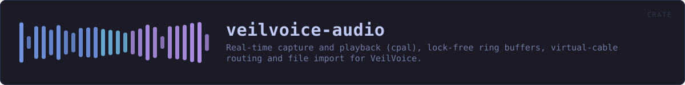
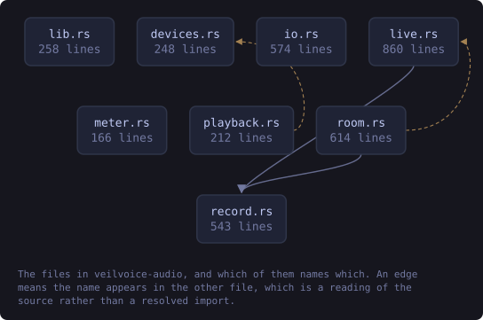
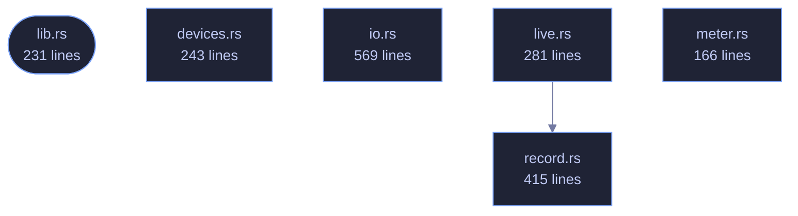

<!-- SPDX-License-Identifier: GPL-3.0-or-later -->
<!-- GENERATED by tools/docs/generate.py from the doc comments in the
     source. Do not edit this file: edit the `//!` and `///` comments in
     the .rs files and run the generator again. CI verifies it with
         python tools/docs/generate.py --check
-->

  

# veilvoice-audio

> Real-time capture and playback (cpal), lock-free ring buffers, virtual-cable routing and file import for VeilVoice.

## Contents

  - [The live feature](#the-live-feature)
  - [Routing, and why a virtual cable matters](#routing-and-why-a-virtual-cable-matters)
- [In plain words](#in-plain-words)
  - [How the crate fits together](#how-the-crate-fits-together)
  - [The files](#the-files)
  - [Public items](#public-items)
  - [Reading it elsewhere](#reading-it-elsewhere)

Everything between the sound hardware and
[`veilvoice_core`](../veilvoice-core/README.md): device enumeration, file
import and export, and the real-time capture → de-identify → playback path.

- `io`, to decode any common audio file to mono `f32`, write 16-bit WAV, or
encode one in memory so it can be encrypted without ever landing on disk
in the clear.
- `devices`, to enumerate inputs and outputs and spot a virtual audio cable.
- `live`, to run the engine live between two devices.

## The `live` feature

`devices` and `live` sit behind the default-on `live` feature. They are the
only part of this crate that needs `cpal`, and `cpal` has no backend for the
BSDs. Everything else, meaning decoding, encoding and running the engine over
a buffer, is pure Rust and builds anywhere, so turning the feature off keeps
file processing working on platforms that cannot do live capture rather than
failing to build at all.

## Routing, and why a virtual cable matters

Scrambling a microphone is only useful if other applications can hear the
result. Selecting a virtual audio cable as the output makes the veiled voice
appear as an ordinary microphone to any call, stream or recorder on the
machine, with no per-application setup. `devices::find_virtual_cable`
detects an installed one so the UI can offer it directly.

# In plain words

This is the plumbing between your microphone, your speakers and the part that
changes the voice.

It finds the sound devices you have, opens the recording you point at whatever
kind of file it is, and writes the result back out. For live use it does the
whole loop while you talk -- in from the microphone, through the engine, out to
whatever else is listening -- fast enough that a conversation still works.

It also reports how loud things are, which is what the level bars in the
program are drawing.

## How the crate fits together

Every arrow below is a `crate::` or `super::` path one module actually
uses, read out of the source by the generator rather than drawn by
hand. A dependency that goes away loses its arrow the next time this
file is written.

  

The same graph as Mermaid source

## The files

| File | Lines | What it is |
|---|---:|---|
| [`devices.rs`](../../docs/files/veilvoice-audio/devices.md) | 243 | Enumerating audio devices, and guessing which of them are virtual cables. |
| [`io.rs`](../../docs/files/veilvoice-audio/io.md) | 569 | Reading and writing audio files. |
| [`lib.rs`](../../docs/files/veilvoice-audio/lib.md) | 231 | Everything between the sound hardware and veilvoice_core: device enumeration, file import and export, and the real-time capture → de-identify → playback path. |
| [`live.rs`](../../docs/files/veilvoice-audio/live.md) | 281 | Live microphone scrambling. |
| [`meter.rs`](../../docs/files/veilvoice-audio/meter.md) | 166 | The scale a level meter is drawn on. |
| [`record.rs`](../../docs/files/veilvoice-audio/record.md) | 415 | Recording the veiled voice without it ever reaching unprotected memory. |

## Public items

| Item | Where | What |
|---|---|---|
| `enum Direction` | [`devices.rs`](../../docs/files/veilvoice-audio/devices.md) | Which direction a device carries audio. |
| `struct DeviceInfo` | [`devices.rs`](../../docs/files/veilvoice-audio/devices.md) | A device the user can choose. |
| `fn list` | [`devices.rs`](../../docs/files/veilvoice-audio/devices.md) | List the devices available in one direction. |
| `fn find_virtual_cable` | [`devices.rs`](../../docs/files/veilvoice-audio/devices.md) | Find the first output device that looks like a virtual audio cable. |
| `fn name_of` | [`devices.rs`](../../docs/files/veilvoice-audio/devices.md) | The name of an opened device, or a placeholder when the OS will not say. |
| `fn open` | [`devices.rs`](../../docs/files/veilvoice-audio/devices.md) | Look up a device by exact name, or the host default when name is None. |
| `const MAX_DECODED_SAMPLES` | [`io.rs`](../../docs/files/veilvoice-audio/io.md) | The most decoded audio load will hold, in mono f32 samples. |
| `fn preflight` | [`io.rs`](../../docs/files/veilvoice-audio/io.md) | Reject a file whose own header carries a value that will crash the decoder, before the decoder is given the file. |
| `struct Audio` | [`io.rs`](../../docs/files/veilvoice-audio/io.md) | Mono audio in memory. |
| `fn load` | [`io.rs`](../../docs/files/veilvoice-audio/io.md) | Decode any supported audio file to mono f32. |
| `fn wav_bytes` | [`io.rs`](../../docs/files/veilvoice-audio/io.md) | Encode mono f32 audio as a 16-bit PCM WAV, in memory. |
| `fn save_wav` | [`io.rs`](../../docs/files/veilvoice-audio/io.md) | Write mono f32 audio to a 16-bit PCM WAV file. |
| `const VERSION` | [`lib.rs`](../../docs/files/veilvoice-audio/lib.md) | Crate version string, surfaced in the About panel. |
| `enum Error` | [`lib.rs`](../../docs/files/veilvoice-audio/lib.md) | Everything that can go wrong in this crate. |
| `fn deidentify` | [`lib.rs`](../../docs/files/veilvoice-audio/lib.md) | De-identify a whole buffer of audio in one call. |
| `struct LiveStats` | [`live.rs`](../../docs/files/veilvoice-audio/live.md) | A snapshot of what the live path is doing, safe to read from the UI. |
| `struct LiveSession` | [`live.rs`](../../docs/files/veilvoice-audio/live.md) | A running live-scramble session. |
| `const FLOOR_DB` | [`meter.rs`](../../docs/files/veilvoice-audio/meter.md) | The quietest level worth drawing. |
| `const CLIP_DB` | [`meter.rs`](../../docs/files/veilvoice-audio/meter.md) | At or above this, the level is called clipping. |
| `fn dbfs` | [`meter.rs`](../../docs/files/veilvoice-audio/meter.md) | Level in decibels relative to full scale. |
| `fn position` | [`meter.rs`](../../docs/files/veilvoice-audio/meter.md) | Where a level sits along a bar: 0.0 at the floor, 1.0 at full scale. |
| `fn clipping` | [`meter.rs`](../../docs/files/veilvoice-audio/meter.md) | Whether a reading counts as clipping. |
| `const SLACK_SECONDS` | [`record.rs`](../../docs/files/veilvoice-audio/record.md) | How much audio the ring holds before samples are dropped, in seconds. |
| `struct Sink` | [`record.rs`](../../docs/files/veilvoice-audio/record.md) | The writing half, handed to the audio callback. |
| `struct Recorder` | [`record.rs`](../../docs/files/veilvoice-audio/record.md) | The reading half: moves samples out of the ring and into locked memory. |
| `fn start` | [`record.rs`](../../docs/files/veilvoice-audio/record.md) | Start a recorder and the sink that feeds it. |

## Reading it elsewhere

- On the website: [`website/reference/veilvoice-audio.html`](../../website/reference/veilvoice-audio.html)
- The audit this code is held to: [`docs/AUDIT.md`](../../docs/AUDIT.md)
- The claims and their limits: [`docs/WHITEPAPER.md`](../../docs/WHITEPAPER.md)
- Using the crates from your own project: [`docs/USING_THE_CRATES.md`](../../docs/USING_THE_CRATES.md)

Signing key fingerprint `8101FB3BB28D02FB239E0CDF9CC1C7E7A9B5833A`.
