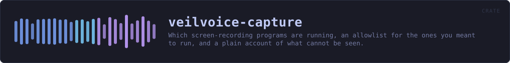
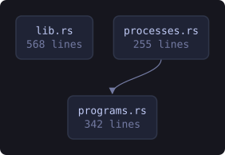
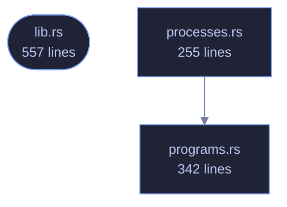

<!-- SPDX-License-Identifier: GPL-3.0-or-later -->
<!-- GENERATED by tools/docs/generate.py from the doc comments in the
     source. Do not edit this file: edit the `//!` and `///` comments in
     the .rs files and run the generator again. CI verifies it with
         python tools/docs/generate.py --check
-->

  

# veilvoice-capture

> Which screen-recording programs are running, an allowlist for the ones you meant to run, and a plain account of what cannot be seen.

## Contents

- [VeilVoice does not hide itself from your recorder](#veilvoice-does-not-hide-itself-from-your-recorder)
- [Telling you, and then not telling you again](#telling-you-and-then-not-telling-you-again)
- [Running is not recording, and this crate never confuses them](#running-is-not-recording-and-this-crate-never-confuses-them)
- [And it only knows the programs it knows](#and-it-only-knows-the-programs-it-knows)
- [How the crate fits together](#how-the-crate-fits-together)
- [The files](#the-files)
- [Public items](#public-items)
- [Reading it elsewhere](#reading-it-elsewhere)

Which screen-recording programs are running, an allowlist for the ones you
meant to run, and a plain account of the two things this cannot do.

## VeilVoice does not hide itself from your recorder

Stated first, because it is the question people actually have: **you can
record VeilVoice's window with OBS, and nothing here stops you.** Screen
capture of this application is not blocked, not degraded, and not detected
as an attack. If you are making a video about VeilVoice, or streaming while
you use it, it will appear on the recording exactly like any other window.

That is not only a choice, it is also a limit. Excluding a window from
capture means `SetWindowDisplayAffinity` on Windows and the equivalent
elsewhere, which is FFI — and every crate in this workspace carries
`#![forbid(unsafe_code)]`, which is a front-page claim. So the exclusion is
**not built**, and `ROADMAP.md` records it as a decision waiting on the
maintainer rather than as an oversight. Anybody who needs a window that
cannot be recorded does not have it here, and should know that before they
rely on it.

## Telling you, and then not telling you again

A monitor that says "OBS is running" every thirty seconds while you
deliberately record a tutorial is a monitor you turn off, and then it is not
watching for the recorder you did **not** start. So `Allowlist` exists:
name a program once, and it stops raising a notification.

Allowed is not hidden. `Sighting::allowed` is a flag on a sighting that is
still in the report, and `Report::all` still lists it. Only
`Report::worth_saying` filters, because that is the one a notification
reads. Something that vanished from the interface entirely would be a
setting for lying to yourself.

## Running is not recording, and this crate never confuses them

Zoom being open does not mean Zoom is sharing your screen; Discord running
does not mean anybody is watching. This reports **what is running**, and
`programs::Purpose` separates a program whose job is recording from one
that merely can. Every sentence produced here keeps the distinction, because
a privacy tool that announces surveillance every time somebody opens a chat
application has taught its user to ignore it.

Knowing whether a capture is actually in progress means asking the
compositor who holds a capture session, and that is FFI on every platform
here. Same trade, same answer, same place it is recorded.

## And it only knows the programs it knows

`programs::ALL` is a table of names. Something not in it is not reported,
and something written to record a screen quietly would not be called
`obs64.exe`. An empty report is not evidence that nothing is recording, and
`SCOPE` says so.

## How the crate fits together

Every arrow below is a `crate::` or `super::` path one module actually
uses, read out of the source by the generator rather than drawn by
hand. A dependency that goes away loses its arrow the next time this
file is written.

  

The same graph as Mermaid source

## The files

| File | Lines | What it is |
|---|---:|---|
| [`lib.rs`](../../docs/files/veilvoice-capture/lib.md) | 557 | Which screen-recording programs are running, an allowlist for the ones you meant to run, and a plain account of the two things this cannot do. |
| [`processes.rs`](../../docs/files/veilvoice-capture/processes.md) | 255 | Listing the processes that are running, per platform. |
| [`programs.rs`](../../docs/files/veilvoice-capture/programs.md) | 342 | The programs this build knows can capture a screen. |

## Public items

| Item | Where | What |
|---|---|---|
| `const VERSION` | [`lib.rs`](../../docs/files/veilvoice-capture/lib.md) | Crate version string, surfaced in the About panel. |
| `const SCOPE` | [`lib.rs`](../../docs/files/veilvoice-capture/lib.md) | What this is worth, in the words a front end should show. |
| `struct Allowlist` | [`lib.rs`](../../docs/files/veilvoice-capture/lib.md) | Programs the user has said they meant to run. |
| `struct Sighting` | [`lib.rs`](../../docs/files/veilvoice-capture/lib.md) | One capture-capable program found running. |
| `struct Report` | [`lib.rs`](../../docs/files/veilvoice-capture/lib.md) | What is running, and anything that got in the way of finding out. |
| `enum Error` | [`lib.rs`](../../docs/files/veilvoice-capture/lib.md) | Everything that can go wrong in this crate. |
| `struct Program` | [`programs.rs`](../../docs/files/veilvoice-capture/programs.md) | One program known to be able to capture a screen. |
| `enum Purpose` | [`programs.rs`](../../docs/files/veilvoice-capture/programs.md) | Why a program is in the table. |
| `const ALL` | [`programs.rs`](../../docs/files/veilvoice-capture/programs.md) | Every program in the table. |
| `fn matching` | [`programs.rs`](../../docs/files/veilvoice-capture/programs.md) | Find the program a process name belongs to, if this build knows it. |
| `fn by_key` | [`programs.rs`](../../docs/files/veilvoice-capture/programs.md) | Find a program by its Program::key. |

## Reading it elsewhere

- On the website: [`website/reference/veilvoice-capture.html`](../../website/reference/veilvoice-capture.html)
- The audit this code is held to: [`docs/AUDIT.md`](../../docs/AUDIT.md)
- The claims and their limits: [`docs/WHITEPAPER.md`](../../docs/WHITEPAPER.md)
- Using the crates from your own project: [`docs/USING_THE_CRATES.md`](../../docs/USING_THE_CRATES.md)

Signing key fingerprint `8101FB3BB28D02FB239E0CDF9CC1C7E7A9B5833A`.
