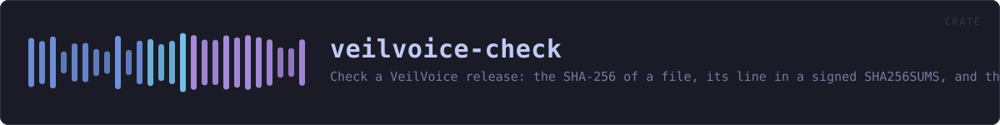
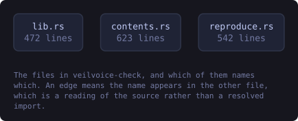
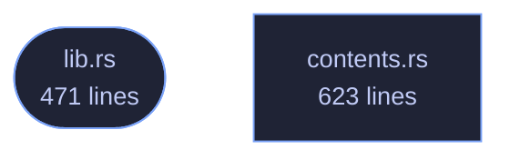

<!-- SPDX-License-Identifier: GPL-3.0-or-later -->
<!-- GENERATED by tools/docs/generate.py from the doc comments in the
     source. Do not edit this file: edit the `//!` and `///` comments in
     the .rs files and run the generator again. CI verifies it with
         python tools/docs/generate.py --check
-->

  

# veilvoice-check

> Check a VeilVoice release: the SHA-256 of a file, its line in a signed SHA256SUMS, and the detached signature over that list. No GnuPG, no network.

## Contents

- [Why this is a library and not only a program](#why-this-is-a-library-and-not-only-a-program)
- [What a pass actually proves, and what it does not](#what-a-pass-actually-proves-and-what-it-does-not)
- [No network, and no GnuPG](#no-network-and-no-gnupg)
- [In plain words](#in-plain-words)
  - [How the crate fits together](#how-the-crate-fits-together)
  - [The files](#the-files)
  - [Public items](#public-items)
  - [Reading it elsewhere](#reading-it-elsewhere)

Check a VeilVoice release: a file's SHA-256, its line in a `SHA256SUMS`,
and the detached OpenPGP signature over that list.

# Why this is a library and not only a program

`veilvoice-verify` did all of this and did it inside a binary crate, which
has no consumers by construction. The desktop application was asked for a
**verify tab** — drag a download onto the window and be told whether it is
the published one — and there were two ways to have that:

* link `eframe` into the 1.5 MB portable verifier, which is the one binary
in this project whose smallness is a feature: it is what somebody
downloads *before* they trust anything else here;
* or move the checking out of the binary, so both front ends call the same
code rather than two implementations of it.

This is the second. The verifier is unchanged in what it does and prints;
it just no longer owns the arithmetic.

# What a pass actually proves, and what it does not

A good signature over `SHA256SUMS`, plus a matching hash, proves the file is
**the one the holder of this key published**. It does not prove the file is
safe, that the source compiles to it, or that the key belongs to anybody in
particular. The second of those is the check worth having and it is the one
this project cannot perform for you — it needs somebody other than the
author to have built the same tag and got the same hash.

Every front end that uses this has to say so. The words are here, in
`SCOPE`, rather than in whichever interface happens to be showing the
answer, so a second front end cannot show a pass without them.

# No network, and no GnuPG

Nothing in this crate opens a socket or runs a program. It is given bytes
and it reports on them. Downloading is the caller's problem, and the two
callers that do it shell out to the system's own transfer tool.

# In plain words

This is the checking behind "is this download the real one".

You give it the file you downloaded, the published list of fingerprints, and
the signature over that list. It checks the signature first -- because a list
nobody signed proves nothing -- and only then compares your file against it.

A pass means the file is the one the person holding that key published. It does
not mean the file is safe, and it does not mean the program in it matches the
source code you can read. That last one is the check worth the most, and it is
the one this cannot do for you: it needs somebody other than the author to have
built the same thing and got the same answer.

## How the crate fits together

Every arrow below is a `crate::` or `super::` path one module actually
uses, read out of the source by the generator rather than drawn by
hand. A dependency that goes away loses its arrow the next time this
file is written.

  

The same graph as Mermaid source

## The files

| File | Lines | What it is |
|---|---:|---|
| [`contents.rs`](../../docs/files/veilvoice-check/contents.md) | 623 | The signed list of what is inside each release archive. |
| [`lib.rs`](../../docs/files/veilvoice-check/lib.md) | 471 | Check a VeilVoice release: a file's SHA-256, its line in a SHA256SUMS, and the detached OpenPGP signature over that list. |

## Public items

| Item | Where | What |
|---|---|---|
| `const CONTENTS` | [`contents.rs`](../../docs/files/veilvoice-check/contents.md) | The name a release publishes its contents list under. |
| `struct Member` | [`contents.rs`](../../docs/files/veilvoice-check/contents.md) | One file inside a release archive, and the hash published for it. |
| `struct ArchiveContents` | [`contents.rs`](../../docs/files/veilvoice-check/contents.md) | Everything one archive carries. |
| `enum Verdict` | [`contents.rs`](../../docs/files/veilvoice-check/contents.md) | What checking one published file against the disk found. |
| `struct Outcome` | [`contents.rs`](../../docs/files/veilvoice-check/contents.md) | One published file, checked against the disk. |
| `fn parse` | [`contents.rs`](../../docs/files/veilvoice-check/contents.md) | Read a CONTENTS.sha256. |
| `fn for_archive` | [`contents.rs`](../../docs/files/veilvoice-check/contents.md) | The section of a manifest covering one archive. |
| `fn check` | [`contents.rs`](../../docs/files/veilvoice-check/contents.md) | Check every file the archive published, against root. |
| `struct Sweep` | [`contents.rs`](../../docs/files/veilvoice-check/contents.md) | What a sweep of the extracted directory found. |
| `fn extras` | [`contents.rs`](../../docs/files/veilvoice-check/contents.md) | Files sitting in the extracted directory that the release never published. |
| `const PUBLIC_KEY` | [`lib.rs`](../../docs/files/veilvoice-check/lib.md) | The project's signing key, in ASCII armour. |
| `const FINGERPRINT` | [`lib.rs`](../../docs/files/veilvoice-check/lib.md) | The fingerprint, written out rather than derived. |
| `const SCOPE` | [`lib.rs`](../../docs/files/veilvoice-check/lib.md) | What a passing check is worth, in the words a user should be shown. |
| `enum Error` | [`lib.rs`](../../docs/files/veilvoice-check/lib.md) | Something that went wrong, in words a person can act on. |
| `fn key` | [`lib.rs`](../../docs/files/veilvoice-check/lib.md) | The embedded key, with its fingerprint checked. |
| `fn fingerprint_of` | [`lib.rs`](../../docs/files/veilvoice-check/lib.md) | A key's fingerprint, uppercase hex, no spaces. |
| `fn sha256_file` | [`lib.rs`](../../docs/files/veilvoice-check/lib.md) | SHA-256 of a file, read in chunks. |
| `fn sha256_bytes` | [`lib.rs`](../../docs/files/veilvoice-check/lib.md) | SHA-256 of bytes already in memory. |
| `fn digests_match` | [`lib.rs`](../../docs/files/veilvoice-check/lib.md) | Compare two hex digests without caring about case or stray whitespace. |
| `fn digest_from_sums` | [`lib.rs`](../../docs/files/veilvoice-check/lib.md) | Find a file's line in a sha256sum-format list. |
| `fn names_in_sums` | [`lib.rs`](../../docs/files/veilvoice-check/lib.md) | Every name a SHA256SUMS lists, in order. |
| `fn verify_detached` | [`lib.rs`](../../docs/files/veilvoice-check/lib.md) | Verify a detached signature over data using key. |
| `struct Checked` | [`lib.rs`](../../docs/files/veilvoice-check/lib.md) | What a full check found. |
| `fn check_file` | [`lib.rs`](../../docs/files/veilvoice-check/lib.md) | The whole check: signature first, then the hash. |

## Reading it elsewhere

- On the website: [`website/reference/veilvoice-check.html`](../../website/reference/veilvoice-check.html)
- The audit this code is held to: [`docs/AUDIT.md`](../../docs/AUDIT.md)
- The claims and their limits: [`docs/WHITEPAPER.md`](../../docs/WHITEPAPER.md)
- Using the crates from your own project: [`docs/USING_THE_CRATES.md`](../../docs/USING_THE_CRATES.md)

Signing key fingerprint `8101FB3BB28D02FB239E0CDF9CC1C7E7A9B5833A`.
