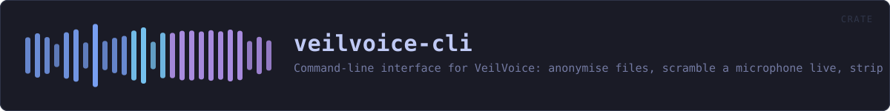
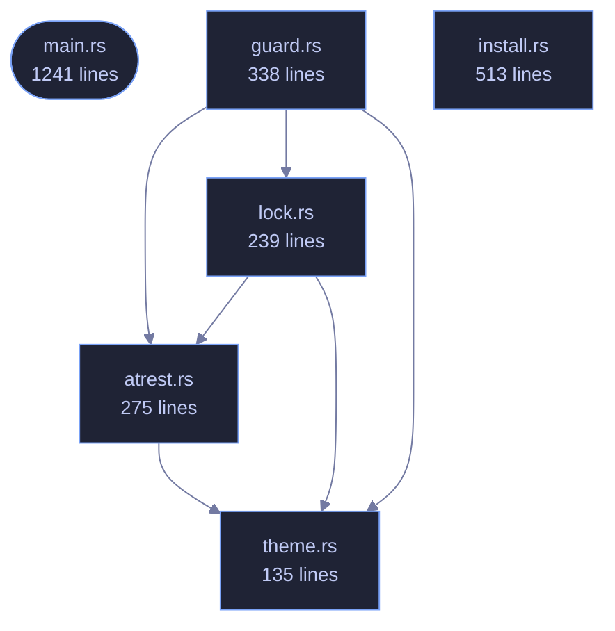

<!-- SPDX-License-Identifier: GPL-3.0-or-later -->
<!-- GENERATED by tools/docs/generate.py from the doc comments in the
     source. Do not edit this file: edit the `//!` and `///` comments in
     the .rs files and run the generator again. CI verifies it with
         python tools/docs/generate.py --check
-->

  

# veilvoice-cli

> Command-line interface for VeilVoice: anonymise files, scramble a microphone live, strip metadata, encrypt recordings.

## Contents

- [What is here](#what-is-here)
- [Two behaviours that surprise people, on purpose](#two-behaviours-that-surprise-people-on-purpose)
- [Passphrase prompts cannot be piped](#passphrase-prompts-cannot-be-piped)
- [A clap ordering rule worth knowing](#a-clap-ordering-rule-worth-knowing)
  - [How the crate fits together](#how-the-crate-fits-together)
  - [The files](#the-files)
  - [Public items](#public-items)
  - [Reading it elsewhere](#reading-it-elsewhere)

`veilvoice` — the command-line interface.

Everything VeilVoice does, available without a desktop: it runs over SSH, in
a container, and on machines that have no GUI toolkit at all. The same
engine backs both this and the graphical app.

# What is here

Fourteen subcommands, and they divide into four groups:

* **Audio** -- `anonymise` a file, `live` scramble a microphone, list
`devices`.
* **Privacy of the files themselves** -- `clean` metadata, `encrypt`,
`decrypt`, `keygen`, `shred`.
* **Watching the machine** -- `watch` the microphone and camera, `guard`
VeilVoice's own files against tampering.
* **The app lock** -- `lock set|status|change|remove`.

# Two behaviours that surprise people, on purpose

**`anonymise` writes `<out>.veil`, not a bare WAV.** Recordings are
encrypted at rest by default. `--encrypt=false` opts out and requires
`--yes`, because an unsealed recording is the thing somebody later wishes
they had not produced. The wiki explains where the WAV went.

**The front-ends refuse rather than downgrade.** Asked to encrypt with
nothing to encrypt with, this exits with an error instead of writing plain
audio and mentioning it. Quiet degradation to a weaker posture is the defect
class this project has found in itself most often.

# Passphrase prompts cannot be piped

`rpassword` needs a real console; piping a passphrase in blocks on
`CONIN$` rather than reading it. That is a property of terminal input, not a
bug here, and it means anything that prompts cannot be smoke-tested from a
non-interactive shell. The layer *beneath* each prompt is therefore tested
instead -- see `crate::atrest` and `crate::lock`, where the logic lives
precisely so it can be reached without a terminal.

# A clap ordering rule worth knowing

An argument declared beside `#[command(subcommand)]` must precede the
subcommand on the command line unless it is marked `global = true`. So
`veilvoice lock --path X status` parses and `veilvoice lock status --path X`
does not, except that `--path` is now global specifically so both do.

## How the crate fits together

Every arrow below is a `crate::` or `super::` path one module actually
uses, read out of the source by the generator rather than drawn by
hand. A dependency that goes away loses its arrow the next time this
file is written.

## The files

| File | Lines | What it is |
|---|---:|---|
| [`atrest.rs`](../../docs/files/veilvoice-cli/atrest.md) | 275 | Encryption at rest for the recordings VeilVoice writes, and the passphrase prompts that feed it. |
| [`guard.rs`](../../docs/files/veilvoice-cli/guard.md) | 338 | veilvoice guard -- record what VeilVoice's files should be, and check them. |
| [`install.rs`](../../docs/files/veilvoice-cli/install.md) | 513 | veilvoice install -- put this program somewhere the system can find it. |
| [`lock.rs`](../../docs/files/veilvoice-cli/lock.md) | 239 | veilvoice lock — manage the application lock from the command line. |
| [`main.rs`](../../docs/files/veilvoice-cli/main.md) | 1241 | veilvoice — the command-line interface. |
| [`theme.rs`](../../docs/files/veilvoice-cli/theme.md) | 135 | Tokyo Night colouring for the terminal. |

## Public items

| Item | Where | What |
|---|---|---|
| `const PLAINTEXT_WARNING` | [`atrest.rs`](../../docs/files/veilvoice-cli/atrest.md) | What the user is told before a recording is written in the clear. |
| `enum Recipient` | [`atrest.rs`](../../docs/files/veilvoice-cli/atrest.md) | How a recording is to be sealed. |
| `fn seal_to_disk` | [`atrest.rs`](../../docs/files/veilvoice-cli/atrest.md) | Seal plaintext and write it to <path>.veil, returning where it landed. |
| `fn confirm_plaintext` | [`atrest.rs`](../../docs/files/veilvoice-cli/atrest.md) | Print the plaintext warning and, on an interactive terminal, require an explicit answer before continuing. |
| `fn prompt_secret` | [`atrest.rs`](../../docs/files/veilvoice-cli/atrest.md) | Prompt once, without echoing, and keep the answer in a Secret. |
| `fn read_new_password` | [`atrest.rs`](../../docs/files/veilvoice-cli/atrest.md) | Read a password twice, without echoing it, and check the two agree. |
| `enum Action` | [`guard.rs`](../../docs/files/veilvoice-cli/guard.md) |  |
| `fn run` | [`guard.rs`](../../docs/files/veilvoice-cli/guard.md) |  |
| `const NAME` | [`install.rs`](../../docs/files/veilvoice-cli/install.md) | The name of the directory and the uninstall entry. |
| `fn prefix` | [`install.rs`](../../docs/files/veilvoice-cli/install.md) | Where an installation goes, for this user only. |
| `fn bin_dir` | [`install.rs`](../../docs/files/veilvoice-cli/install.md) | The directory a PATH entry should point at. |
| `struct Status` | [`install.rs`](../../docs/files/veilvoice-cli/install.md) | What an installation currently looks like. |
| `fn status` | [`install.rs`](../../docs/files/veilvoice-cli/install.md) | Read the current state without changing anything. |
| `fn install` | [`install.rs`](../../docs/files/veilvoice-cli/install.md) | Install for this user. |
| `fn uninstall` | [`install.rs`](../../docs/files/veilvoice-cli/install.md) | Remove what install added. |
| `enum Action` | [`lock.rs`](../../docs/files/veilvoice-cli/lock.md) |  |
| `fn wrap` | [`lock.rs`](../../docs/files/veilvoice-cli/lock.md) | Greedy word wrap. |
| `fn run` | [`lock.rs`](../../docs/files/veilvoice-cli/lock.md) |  |
| `mod colour` | [`theme.rs`](../../docs/files/veilvoice-cli/theme.md) | Tokyo Night, as 24-bit foreground escape sequences. |
| `fn paint` | [`theme.rs`](../../docs/files/veilvoice-cli/theme.md) | Wrap text in colour, or return it unchanged when colour is off. |
| `fn ok` | [`theme.rs`](../../docs/files/veilvoice-cli/theme.md) | A success line. |
| `fn warn` | [`theme.rs`](../../docs/files/veilvoice-cli/theme.md) | A warning line. |
| `fn err` | [`theme.rs`](../../docs/files/veilvoice-cli/theme.md) | An error line. |
| `fn heading` | [`theme.rs`](../../docs/files/veilvoice-cli/theme.md) | A section heading. |
| `fn field` | [`theme.rs`](../../docs/files/veilvoice-cli/theme.md) | A label: value line with the value highlighted. |

## Reading it elsewhere

- On the website: [`website/reference/veilvoice-cli.html`](../../website/reference/veilvoice-cli.html)
- The audit this code is held to: [`docs/AUDIT.md`](../../docs/AUDIT.md)
- The claims and their limits: [`docs/WHITEPAPER.md`](../../docs/WHITEPAPER.md)
- Using the crates from your own project: [`docs/USING_THE_CRATES.md`](../../docs/USING_THE_CRATES.md)

Signing key fingerprint `8101FB3BB28D02FB239E0CDF9CC1C7E7A9B5833A`.
