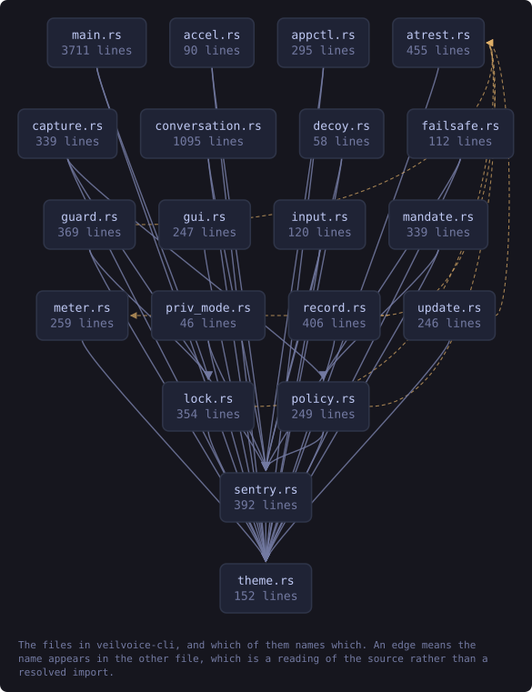

<!-- SPDX-License-Identifier: GPL-3.0-or-later -->
<!-- GENERATED by tools/docs/generate.py from the doc comments in the
     source. Do not edit this file: edit the `//!` and `///` comments in
     the .rs files and run the generator again. CI verifies it with
         python tools/docs/generate.py --check
-->

  

# veilvoice-cli

> Command-line interface for VeilVoice: anonymise files, scramble a microphone live, strip metadata, encrypt recordings.

## Contents

- [What is here](#what-is-here)
- [Two behaviours that surprise people, on purpose](#two-behaviours-that-surprise-people-on-purpose)
- [Passphrase prompts cannot be piped](#passphrase-prompts-cannot-be-piped)
- [A clap ordering rule worth knowing](#a-clap-ordering-rule-worth-knowing)
- [In plain words](#in-plain-words)
  - [How the crate fits together](#how-the-crate-fits-together)
  - [The files](#the-files)
  - [Public items](#public-items)
  - [Reading it elsewhere](#reading-it-elsewhere)

`veilvoice` — the command-line interface.

Everything VeilVoice does, available without a desktop: it runs over SSH, in
a container, and on machines that have no GUI toolkit at all. The same
engine backs both this and the graphical app.

# What is here

Twenty subcommands, and they divide into five groups:

* **Audio** -- `anonymise` a file, `live` scramble a microphone, list
`devices`, `conversation` for a recording with several people in it.
* **Privacy of the files themselves** -- `clean` metadata, `encrypt`,
`decrypt`, `keygen`, `shred`.
* **Watching the machine** -- `watch` the microphone and camera, `guard`
VeilVoice's own files against tampering, `sentry` for canaries and how
fast a folder is changing, `capture` for which screen recorders are
running.
* **The app lock** -- `lock set|status|change|remove`, and `policy` for
settings somebody has fixed so the interface cannot turn them off.
* **Getting it onto the machine** -- `install`, `uninstall`, `companions`,
and `gui` to open the desktop application.

That last group is a front end over `veilvoice_setup`, which the desktop
application's setup tab also calls. The careful part -- editing `PATH` --
has one implementation and one set of tests, rather than one per front
end.

# Two behaviours that surprise people, on purpose

**`anonymise` writes `<out>.veil`, not a bare WAV.** Recordings are
encrypted at rest by default. `--encrypt=false` opts out and requires
`--yes`, because an unsealed recording is the thing somebody later wishes
they had not produced. The wiki explains where the WAV went.

**The front-ends refuse rather than downgrade.** Asked to encrypt with
nothing to encrypt with, this exits with an error instead of writing plain
audio and mentioning it. Quiet degradation to a weaker posture is the defect
class this project has found in itself most often.

# Passphrase prompts cannot be piped

`rpassword` needs a real console; piping a passphrase in blocks on
`CONIN$` rather than reading it. That is a property of terminal input, not a
bug here, and it means anything that prompts cannot be smoke-tested from a
non-interactive shell. The layer *beneath* each prompt is therefore tested
instead -- see `crate::atrest` and `crate::lock`, where the logic lives
precisely so it can be reached without a terminal.

# A clap ordering rule worth knowing

An argument declared beside `#[command(subcommand)]` must precede the
subcommand on the command line unless it is marked `global = true`. So
`veilvoice lock --path X status` parses and `veilvoice lock status --path X`
does not, except that `--path` is now global specifically so both do.

# In plain words

This is VeilVoice without a window.

Everything the program does, typed instead of clicked: disguise a recording,
scramble a microphone while you talk, seal a file, strip a photograph's hidden
labels, handle a recording with several people in it.

It is the same code underneath, so it works the same way -- over a remote
connection, on a machine with no desktop, or from a script that runs it a
thousand times.

## How the crate fits together

Every arrow below is a `crate::` or `super::` path one module actually
uses, read out of the source by the generator rather than drawn by
hand. A dependency that goes away loses its arrow the next time this
file is written.

  

The same graph as Mermaid source

```mermaid
%%{init: {"theme":"base","themeVariables":{"background":"#1a1b26","primaryColor":"#1f2335","primaryTextColor":"#c0caf5","primaryBorderColor":"#7aa2f7","secondaryColor":"#16161e","tertiaryColor":"#16161e","lineColor":"#737aa2","textColor":"#c0caf5","mainBkg":"#1f2335","nodeBorder":"#7aa2f7","clusterBkg":"#16161e","clusterBorder":"#2f3549","fontFamily":"ui-monospace, SFMono-Regular, Consolas, monospace","fontSize":"14px"}}}%%
flowchart TD
    n_main(["main.rs<br/>2231 lines"])
    n_accel["accel.rs<br/>90 lines"]
    n_appctl["appctl.rs<br/>272 lines"]
    n_atrest["atrest.rs<br/>286 lines"]
    n_capture["capture.rs<br/>330 lines"]
    n_conversation["conversation.rs<br/>797 lines"]
    n_decoy["decoy.rs<br/>58 lines"]
    n_failsafe["failsafe.rs<br/>112 lines"]
    n_guard["guard.rs<br/>346 lines"]
    n_gui["gui.rs<br/>247 lines"]
    n_input["input.rs<br/>117 lines"]
    n_lock["lock.rs<br/>248 lines"]
    n_meter["meter.rs<br/>259 lines"]
    n_policy["policy.rs<br/>243 lines"]
    n_priv_mode["priv_mode.rs<br/>46 lines"]
    n_sentry["sentry.rs<br/>384 lines"]
    n_theme["theme.rs<br/>144 lines"]
    n_accel --> n_sentry
    n_accel --> n_theme
    n_appctl --> n_sentry
    n_appctl --> n_theme
    n_atrest --> n_theme
    n_capture --> n_policy
    n_capture --> n_sentry
    n_capture --> n_theme
    n_conversation --> n_sentry
    n_conversation --> n_theme
    n_decoy --> n_sentry
    n_decoy --> n_theme
    n_failsafe --> n_sentry
    n_failsafe --> n_theme
    n_guard --> n_atrest
    n_guard --> n_lock
    n_guard --> n_theme
    n_gui --> n_theme
    n_input --> n_sentry
    n_input --> n_theme
    n_lock --> n_atrest
    n_lock --> n_theme
    n_meter --> n_theme
    n_policy --> n_atrest
    n_policy --> n_sentry
    n_policy --> n_theme
    n_priv_mode --> n_sentry
    n_priv_mode --> n_theme
    n_sentry --> n_theme
    click n_main href "https://github.com/tilas01/veilvoice/blob/main/crates/veilvoice-cli/src/main.rs" "open the source"
    click n_accel href "https://github.com/tilas01/veilvoice/blob/main/crates/veilvoice-cli/src/accel.rs" "open the source"
    click n_appctl href "https://github.com/tilas01/veilvoice/blob/main/crates/veilvoice-cli/src/appctl.rs" "open the source"
    click n_atrest href "https://github.com/tilas01/veilvoice/blob/main/crates/veilvoice-cli/src/atrest.rs" "open the source"
    click n_capture href "https://github.com/tilas01/veilvoice/blob/main/crates/veilvoice-cli/src/capture.rs" "open the source"
    click n_conversation href "https://github.com/tilas01/veilvoice/blob/main/crates/veilvoice-cli/src/conversation.rs" "open the source"
    click n_decoy href "https://github.com/tilas01/veilvoice/blob/main/crates/veilvoice-cli/src/decoy.rs" "open the source"
    click n_failsafe href "https://github.com/tilas01/veilvoice/blob/main/crates/veilvoice-cli/src/failsafe.rs" "open the source"
    click n_guard href "https://github.com/tilas01/veilvoice/blob/main/crates/veilvoice-cli/src/guard.rs" "open the source"
    click n_gui href "https://github.com/tilas01/veilvoice/blob/main/crates/veilvoice-cli/src/gui.rs" "open the source"
    click n_input href "https://github.com/tilas01/veilvoice/blob/main/crates/veilvoice-cli/src/input.rs" "open the source"
    click n_lock href "https://github.com/tilas01/veilvoice/blob/main/crates/veilvoice-cli/src/lock.rs" "open the source"
    click n_meter href "https://github.com/tilas01/veilvoice/blob/main/crates/veilvoice-cli/src/meter.rs" "open the source"
    click n_policy href "https://github.com/tilas01/veilvoice/blob/main/crates/veilvoice-cli/src/policy.rs" "open the source"
    click n_priv_mode href "https://github.com/tilas01/veilvoice/blob/main/crates/veilvoice-cli/src/priv_mode.rs" "open the source"
    click n_sentry href "https://github.com/tilas01/veilvoice/blob/main/crates/veilvoice-cli/src/sentry.rs" "open the source"
    click n_theme href "https://github.com/tilas01/veilvoice/blob/main/crates/veilvoice-cli/src/theme.rs" "open the source"
```

## The files

| File | Lines | What it is |
|---|---:|---|
| [`accel.rs`](../../docs/files/veilvoice-cli/accel.md) | 90 | veilvoice accel — the graphics hardware here, and what it is good for. |
| [`appctl.rs`](../../docs/files/veilvoice-cli/appctl.md) | 272 | veilvoice appctl — learn what normally runs, then notice what does not. |
| [`atrest.rs`](../../docs/files/veilvoice-cli/atrest.md) | 286 | Encryption at rest for the recordings VeilVoice writes, and the passphrase prompts that feed it. |
| [`capture.rs`](../../docs/files/veilvoice-cli/capture.md) | 330 | veilvoice capture -- which screen recorders are running, and which of them you have said you meant to run. |
| [`conversation.rs`](../../docs/files/veilvoice-cli/conversation.md) | 797 | veilvoice conversation -- several speakers, a voice each, and subtitles. |
| [`decoy.rs`](../../docs/files/veilvoice-cli/decoy.md) | 58 | veilvoice decoy — what a second passphrase is worth, and what it is not. |
| [`failsafe.rs`](../../docs/files/veilvoice-cli/failsafe.md) | 112 | veilvoice failsafe — the safety catch, and what it can and cannot do. |
| [`guard.rs`](../../docs/files/veilvoice-cli/guard.md) | 346 | veilvoice guard -- record what VeilVoice's files should be, and check them. |
| [`gui.rs`](../../docs/files/veilvoice-cli/gui.md) | 247 | veilvoice gui — open the desktop application from the command line. |
| [`input.rs`](../../docs/files/veilvoice-cli/input.md) | 117 | veilvoice input — what running programs can see your keyboard and mouse. |
| [`lock.rs`](../../docs/files/veilvoice-cli/lock.md) | 248 | veilvoice lock — manage the application lock from the command line. |
| [`main.rs`](../../docs/files/veilvoice-cli/main.md) | 2231 | veilvoice — the command-line interface. |
| [`meter.rs`](../../docs/files/veilvoice-cli/meter.md) | 259 | Level meters for veilvoice live, on a scale that means something. |
| [`policy.rs`](../../docs/files/veilvoice-cli/policy.md) | 243 | veilvoice policy -- settings that can only be tightened. |
| [`priv_mode.rs`](../../docs/files/veilvoice-cli/priv_mode.md) | 46 | veilvoice privilege — what VeilVoice is running with, and what it can see. |
| [`sentry.rs`](../../docs/files/veilvoice-cli/sentry.md) | 384 | veilvoice sentry -- canaries, baselines, and what changed since. |
| [`theme.rs`](../../docs/files/veilvoice-cli/theme.md) | 144 | Tokyo Night colouring for the terminal. |

## Public items

| Item | Where | What |
|---|---|---|
| `fn show` | [`accel.rs`](../../docs/files/veilvoice-cli/accel.md) | Show what this machine has. |
| `fn baseline_path` | [`appctl.rs`](../../docs/files/veilvoice-cli/appctl.md) | Where the baseline is kept. |
| `fn learn` | [`appctl.rs`](../../docs/files/veilvoice-cli/appctl.md) | Record what is running as ordinary. |
| `fn check` | [`appctl.rs`](../../docs/files/veilvoice-cli/appctl.md) | Compare what is running against the baseline. |
| `fn allow` | [`appctl.rs`](../../docs/files/veilvoice-cli/appctl.md) | Allow a program, for a while or for good. |
| `fn revoke` | [`appctl.rs`](../../docs/files/veilvoice-cli/appctl.md) | Withdraw a grant. |
| `fn log` | [`appctl.rs`](../../docs/files/veilvoice-cli/appctl.md) | Show the decision log. |
| `const PLAINTEXT_WARNING` | [`atrest.rs`](../../docs/files/veilvoice-cli/atrest.md) | What the user is told before a recording is written in the clear. |
| `enum Recipient` | [`atrest.rs`](../../docs/files/veilvoice-cli/atrest.md) | How a recording is to be sealed. |
| `fn seal_to_disk` | [`atrest.rs`](../../docs/files/veilvoice-cli/atrest.md) | Seal plaintext and write it to <path>.veil, returning where it landed. |
| `fn confirm_plaintext` | [`atrest.rs`](../../docs/files/veilvoice-cli/atrest.md) | Print the plaintext warning and, on an interactive terminal, require an explicit answer before continuing. |
| `fn prompt_secret` | [`atrest.rs`](../../docs/files/veilvoice-cli/atrest.md) | Prompt once, without echoing, and keep the answer in a Secret. |
| `fn read_new_password` | [`atrest.rs`](../../docs/files/veilvoice-cli/atrest.md) | Read a password twice, without echoing it, and check the two agree. |
| `fn capture_dir` | [`capture.rs`](../../docs/files/veilvoice-cli/capture.md) | Where the allowlist is kept. |
| `fn status` | [`capture.rs`](../../docs/files/veilvoice-cli/capture.md) | What is running, what is allowed, and what this cannot see. |
| `fn calls` | [`capture.rs`](../../docs/files/veilvoice-cli/capture.md) | Every program in the table, whether it is running or not. |
| `fn list` | [`capture.rs`](../../docs/files/veilvoice-cli/capture.md) |  |
| `fn allow` | [`capture.rs`](../../docs/files/veilvoice-cli/capture.md) | Stop notifying about one program. |
| `fn deny` | [`capture.rs`](../../docs/files/veilvoice-cli/capture.md) | Start notifying about one program again. |
| `fn check` | [`capture.rs`](../../docs/files/veilvoice-cli/capture.md) | Look now, and let the exit code answer. |
| `fn look_from` | [`conversation.rs`](../../docs/files/veilvoice-cli/conversation.md) | Turn the picture flags into a Look, or explain why they do not describe a picture that can be drawn. |
| `fn inspect` | [`conversation.rs`](../../docs/files/veilvoice-cli/conversation.md) | Show a plan without rendering anything. |
| `fn run` | [`conversation.rs`](../../docs/files/veilvoice-cli/conversation.md) | Render a recording according to a plan. |
| `fn preview` | [`conversation.rs`](../../docs/files/veilvoice-cli/conversation.md) | A still of what the page will look like, and the command that would make a video of it. |
| `fn explain` | [`decoy.rs`](../../docs/files/veilvoice-cli/decoy.md) | Explain the feature and its limits. |
| `fn show` | [`failsafe.rs`](../../docs/files/veilvoice-cli/failsafe.md) | Show what Failsafe would make of this machine right now. |
| `fn describe` | [`failsafe.rs`](../../docs/files/veilvoice-cli/failsafe.md) | A named finding, for the tests to reach without a machine. |
| `enum Action` | [`guard.rs`](../../docs/files/veilvoice-cli/guard.md) |  |
| `fn run` | [`guard.rs`](../../docs/files/veilvoice-cli/guard.md) |  |
| `fn candidates` | [`gui.rs`](../../docs/files/veilvoice-cli/gui.md) | Everywhere this looks, in order, and whether each had it. |
| `fn find` | [`gui.rs`](../../docs/files/veilvoice-cli/gui.md) | The desktop application, wherever it is. |
| `fn open` | [`gui.rs`](../../docs/files/veilvoice-cli/gui.md) | Open the window. |
| `fn look` | [`input.rs`](../../docs/files/veilvoice-cli/input.md) | Show what can see input on this machine. |
| `fn known` | [`input.rs`](../../docs/files/veilvoice-cli/input.md) | Everything this build knows how to recognise, whether running or not. |
| `enum Action` | [`lock.rs`](../../docs/files/veilvoice-cli/lock.md) |  |
| `fn wrap` | [`lock.rs`](../../docs/files/veilvoice-cli/lock.md) | Greedy word wrap. |
| `fn run` | [`lock.rs`](../../docs/files/veilvoice-cli/lock.md) |  |
| `const HOLD` | [`meter.rs`](../../docs/files/veilvoice-cli/meter.md) | How long a peak marker is held before it falls back. |
| `fn render` | [`meter.rs`](../../docs/files/veilvoice-cli/meter.md) | One meter: the bar, the peak marker, and the number. |
| `struct Channel` | [`meter.rs`](../../docs/files/veilvoice-cli/meter.md) | One channel's meter, keeping the peak between reads. |
| `fn policy_dir` | [`policy.rs`](../../docs/files/veilvoice-cli/policy.md) | Where the policy files live. |
| `fn status` | [`policy.rs`](../../docs/files/veilvoice-cli/policy.md) | What is in force, and what is known about the seal. |
| `fn seal` | [`policy.rs`](../../docs/files/veilvoice-cli/policy.md) | Write a policy and seal it. |
| `fn verify` | [`policy.rs`](../../docs/files/veilvoice-cli/policy.md) | Check the plain policy against its sealed copy. |
| `fn remove` | [`policy.rs`](../../docs/files/veilvoice-cli/policy.md) | Delete both files. |
| `fn show` | [`priv_mode.rs`](../../docs/files/veilvoice-cli/priv_mode.md) | Report the privilege level and what it means. |
| `fn state_dir` | [`sentry.rs`](../../docs/files/veilvoice-cli/sentry.md) | Where the canaries and baselines are kept. |
| `fn status` | [`sentry.rs`](../../docs/files/veilvoice-cli/sentry.md) | What is planted, what is watched, and what this is worth. |
| `fn plant` | [`sentry.rs`](../../docs/files/veilvoice-cli/sentry.md) | Put a canary in dir. |
| `fn pull_up` | [`sentry.rs`](../../docs/files/veilvoice-cli/sentry.md) | Stop watching a canary, and delete it. |
| `fn baseline` | [`sentry.rs`](../../docs/files/veilvoice-cli/sentry.md) | Record what dir holds now, as the thing to compare against later. |
| `fn check` | [`sentry.rs`](../../docs/files/veilvoice-cli/sentry.md) | Look at every canary and every baseline. |
| `fn wrap` | [`sentry.rs`](../../docs/files/veilvoice-cli/sentry.md) | Wrap text to width columns on spaces, for the scope note. |
| `mod colour` | [`theme.rs`](../../docs/files/veilvoice-cli/theme.md) | Tokyo Night, as 24-bit foreground escape sequences. |
| `fn paint` | [`theme.rs`](../../docs/files/veilvoice-cli/theme.md) | Wrap text in colour, or return it unchanged when colour is off. |
| `fn ok` | [`theme.rs`](../../docs/files/veilvoice-cli/theme.md) | A success line. |
| `fn warn` | [`theme.rs`](../../docs/files/veilvoice-cli/theme.md) | A warning line. |
| `fn err` | [`theme.rs`](../../docs/files/veilvoice-cli/theme.md) | An error line. |
| `fn heading` | [`theme.rs`](../../docs/files/veilvoice-cli/theme.md) | A section heading. |
| `fn field` | [`theme.rs`](../../docs/files/veilvoice-cli/theme.md) | A label: value line with the value highlighted. |

## Reading it elsewhere

- On the website: [`website/reference/veilvoice-cli.html`](../../website/reference/veilvoice-cli.html)
- The audit this code is held to: [`docs/AUDIT.md`](../../docs/AUDIT.md)
- The claims and their limits: [`docs/WHITEPAPER.md`](../../docs/WHITEPAPER.md)
- Using the crates from your own project: [`docs/USING_THE_CRATES.md`](../../docs/USING_THE_CRATES.md)

Signing key fingerprint `8101FB3BB28D02FB239E0CDF9CC1C7E7A9B5833A`.
