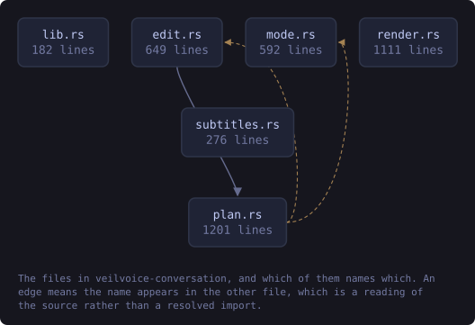
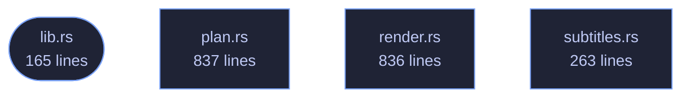

<!-- SPDX-License-Identifier: GPL-3.0-or-later -->
<!-- GENERATED by tools/docs/generate.py from the doc comments in the
     source. Do not edit this file: edit the `//!` and `///` comments in
     the .rs files and run the generator again. CI verifies it with
         python tools/docs/generate.py --check
-->

  

# veilvoice-conversation

> Several speakers in one recording: who spoke when, a distinct voice for each, names, and subtitles.

## Contents

- [Why this exists](#why-this-exists)
- [What a conversation costs, said plainly](#what-a-conversation-costs-said-plainly)
- [VeilVoice does not decide who is talking](#veilvoice-does-not-decide-who-is-talking)
- [The modules](#the-modules)
- [How the crate fits together](#how-the-crate-fits-together)
- [The files](#the-files)
- [Public items](#public-items)
- [Reading it elsewhere](#reading-it-elsewhere)

Several people in one recording: a plan of who spoke when, a distinct
destination voice for each of them, and subtitles that carry their names.

## Why this exists

VeilVoice's whole argument is that every speaker is mapped onto **one**
canonical voice, so many inputs give one output and there is no inverse to
compute. Run an interview through it and both people come out as the same
voice — which is perfectly private and completely unusable, because a
listener cannot tell a question from its answer.

This crate keeps the property and fixes the usability. Each speaker is
assigned a **slot**, each slot has its own canonical destination
(`veilvoice_core::voices`), and every speaker in a slot is normalised onto
that destination exactly as thoroughly as a lone speaker is normalised onto
the default one. There are ten buckets instead of one; each is still
many-to-one.

## What a conversation costs, said plainly

* **The number of speakers survives.** Three voices in the output means
three people were in the room.
* **The turn-taking survives.** Who spoke when, for how long, who
interrupted whom, the rhythm of the exchange. That is preserved on
purpose — it is what makes the result worth listening to — and it is
information about the conversation.
* **Names are whatever you type.** A subtitle saying "Alex" contains the
string "Alex". The audio is veiled; a caption is not, and this crate
cannot veil a name for you.
* **The voiceprints do not survive.** Each speaker is destroyed as
thoroughly as in single-speaker mode.

## VeilVoice does not decide who is talking

Working that out from audio alone is speaker diarisation and needs a trained
model. There is no model here, there is no server to ask, and guessing would
be worse than not offering it: a wrong guess either merges two people or
invents a third, and neither would be visible in the output. So the plan
comes from the user — a channel per person, or a list of turns. See
`plan`.

## The modules

| Module | What it owns |
|---|---|
| `plan` | Who is in the recording, when they speak, and the text format |
| `render` | One engine per speaker, spliced back onto the timeline |
| `subtitles` | WebVTT and SubRip, from the same plan |

## How the crate fits together

Every arrow below is a `crate::` or `super::` path one module actually
uses, read out of the source by the generator rather than drawn by
hand. A dependency that goes away loses its arrow the next time this
file is written.

  

The same graph as Mermaid source

## The files

| File | Lines | What it is |
|---|---:|---|
| [`lib.rs`](../../docs/files/veilvoice-conversation/lib.md) | 165 | Several people in one recording: a plan of who spoke when, a distinct destination voice for each of them, and subtitles that carry their names. |
| [`plan.rs`](../../docs/files/veilvoice-conversation/plan.md) | 837 | Who is in the recording, and who is speaking when. |
| [`render.rs`](../../docs/files/veilvoice-conversation/render.md) | 836 | Turning a plan and a recording into veiled audio, one engine per speaker. |
| [`subtitles.rs`](../../docs/files/veilvoice-conversation/subtitles.md) | 263 | Subtitles, from the same plan the audio is rendered from. |

## Public items

| Item | Where | What |
|---|---|---|
| `const VERSION` | [`lib.rs`](../../docs/files/veilvoice-conversation/lib.md) | Crate version string, surfaced in the About panel. |
| `const SCOPE` | [`lib.rs`](../../docs/files/veilvoice-conversation/lib.md) | What this crate does to a recording, in the words a front end should show. |
| `enum Error` | [`lib.rs`](../../docs/files/veilvoice-conversation/lib.md) | Everything that can go wrong in this crate. |
| `struct Speaker` | [`plan.rs`](../../docs/files/veilvoice-conversation/plan.md) | One person in the recording. |
| `struct Turn` | [`plan.rs`](../../docs/files/veilvoice-conversation/plan.md) | A span of the recording belonging to one speaker. |
| `struct Conversation` | [`plan.rs`](../../docs/files/veilvoice-conversation/plan.md) | The whole plan: who is in the recording, and when each of them speaks. |
| `struct Settings` | [`render.rs`](../../docs/files/veilvoice-conversation/render.md) | How to render. |
| `struct Rendered` | [`render.rs`](../../docs/files/veilvoice-conversation/render.md) | What came back. |
| `fn render` | [`render.rs`](../../docs/files/veilvoice-conversation/render.md) | Render input according to plan. |
| `enum Format` | [`subtitles.rs`](../../docs/files/veilvoice-conversation/subtitles.md) | Which subtitle format to write. |
| `fn write` | [`subtitles.rs`](../../docs/files/veilvoice-conversation/subtitles.md) | Render the plan as subtitles. |

## Reading it elsewhere

- On the website: [`website/reference/veilvoice-conversation.html`](../../website/reference/veilvoice-conversation.html)
- The audit this code is held to: [`docs/AUDIT.md`](../../docs/AUDIT.md)
- The claims and their limits: [`docs/WHITEPAPER.md`](../../docs/WHITEPAPER.md)
- Using the crates from your own project: [`docs/USING_THE_CRATES.md`](../../docs/USING_THE_CRATES.md)

Signing key fingerprint `8101FB3BB28D02FB239E0CDF9CC1C7E7A9B5833A`.
