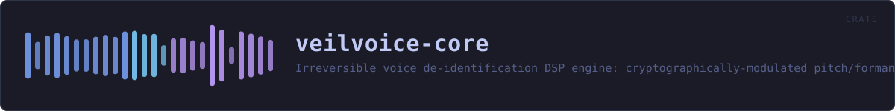
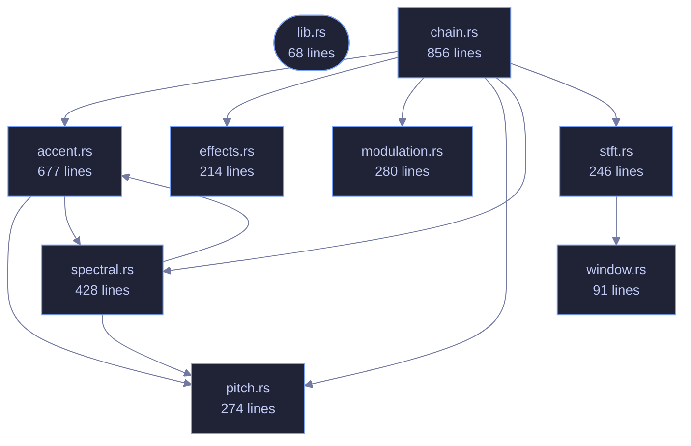

<!-- SPDX-License-Identifier: GPL-3.0-or-later -->
<!-- GENERATED by tools/docs/generate.py from the doc comments in the
     source. Do not edit this file: edit the `//!` and `///` comments in
     the .rs files and run the generator again. CI verifies it with
         python tools/docs/generate.py --check
-->

<p align="center">
  
</p>

# veilvoice-core

> Irreversible voice de-identification DSP engine: cryptographically-modulated pitch/formant scrambling with preserved intelligibility.

## Contents

- [What it guarantees (and what it deliberately does not)](#what-it-guarantees-and-what-it-deliberately-does-not)
- [Accent](#accent)
- [Why it is one-way](#why-it-is-one-way)
- [Example](#example)
- [How the crate fits together](#how-the-crate-fits-together)
- [The files](#the-files)
- [Public items](#public-items)
- [Reading it elsewhere](#reading-it-elsewhere)

The security-critical heart of VeilVoice: an **irreversible, cryptographically
modulated voice de-identification** engine.

## What it guarantees (and what it deliberately does not)

VeilVoice destroys the *biometric voiceprint* — fundamental pitch, formant
structure, timbre, accent and micro-timing — so that neither software nor a
human can re-identify the speaker or reconstruct the original waveform. It
does **not** hide the words: intelligibility is preserved on purpose, because
a scrambler you cannot understand or transcribe is useless. "Fill the whole
spectrogram with white noise" and "stay transcribable" are mutually
exclusive; see `docs/WHITEPAPER.md` for the full argument.

## Accent

`AccentConfig` additionally maps every speaker onto one canonical pitch
register, vocal-tract scale and long-term spectrum, so the *melody and
colour* of an accent — along with two of the strongest biometric features
there are — do not survive. What no signal-level transform can remove is the
**segmental** side of an accent: which phonemes were actually produced. At
that level the accent and the words are the same thing, and changing it means
changing what was said. See `AccentConfig` for the full argument and the
limit, which the whitepaper must state rather than overclaim.

## Why it is one-way

Every STFT frame has its **measured phase discarded** and resynthesised from
scratch (see `spectral`). The original excitation phase — which encodes the
precise waveform and a speaker's micro-timing — is never stored and never
reused, so no downstream process can recover it. On top of that, the pitch
and formant shifts are driven every frame by a ChaCha20 CSPRNG
(`modulation`) whose seed never leaves the process and is zeroized on drop,
so there is not even a single fixed transform to invert.

## Example

```
use veilvoice_core::{Deidentifier, DeidConfig};

let mut deid = Deidentifier::new(DeidConfig::default()).unwrap();
let input = vec![0.0f32; 4800];
let output = deid.process_vec(&input);
assert_eq!(output.len(), input.len());
// Live processing cost, e.g. for a latency read-out:
let _ms = deid.stats().last_block_ms();
```

## How the crate fits together

Every arrow below is a `crate::` or `super::` path one module actually
uses, read out of the source by the generator rather than drawn by
hand. A dependency that goes away loses its arrow the next time this
file is written.



## The files

| File | Lines | What it is |
|---|---:|---|
| [`accent.rs`](../../docs/files/veilvoice-core/accent.md) | 677 | Accent and speaker-trait neutralisation. |
| [`chain.rs`](../../docs/files/veilvoice-core/chain.md) | 856 | The assembled de-identification chain and its live performance statistics. |
| [`effects.rs`](../../docs/files/veilvoice-core/effects.md) | 214 | Light time-domain effects applied after resynthesis. |
| [`lib.rs`](../../docs/files/veilvoice-core/lib.md) | 68 | The security-critical heart of VeilVoice: an irreversible, cryptographically modulated voice de-identification engine. |
| [`modulation.rs`](../../docs/files/veilvoice-core/modulation.md) | 280 | Cryptographically-seeded modulation of the effect parameters. |
| [`pitch.rs`](../../docs/files/veilvoice-core/pitch.md) | 274 | Monophonic fundamental-frequency tracker (decimated YIN). |
| [`spectral.rs`](../../docs/files/veilvoice-core/spectral.md) | 428 | Frequency-domain de-identification transform. |
| [`stft.rs`](../../docs/files/veilvoice-core/stft.md) | 246 | Streaming short-time Fourier transform with overlap-add resynthesis. |
| [`window.rs`](../../docs/files/veilvoice-core/window.md) | 91 | Analysis and synthesis windowing, and the one constant that keeps overlap-add honest. |
| [`spectrum_report.rs`](../../docs/files/veilvoice-core/examples-spectrum_report.md) | 99 | Where do the output partials actually land? |
| [`veil_a_buffer.rs`](../../docs/files/veilvoice-core/examples-veil_a_buffer.md) | 45 | _no module documentation yet_ |
| [`hostile_audio.rs`](../../docs/files/veilvoice-core/tests-hostile_audio.md) | 353 | The engine against input that is not well-behaved audio. |

## Public items

| Item | Where | What |
|---|---|---|
| `struct AccentConfig` | [`accent.rs`](../../docs/files/veilvoice-core/accent.md) | How aggressively accent and speaker traits are normalised. |
| `struct AccentStats` | [`accent.rs`](../../docs/files/veilvoice-core/accent.md) | Live read-out of what the neutraliser is currently doing, for the UI. |
| `struct AccentNeutralizer` | [`accent.rs`](../../docs/files/veilvoice-core/accent.md) | Maps any speaker onto one canonical pitch register, vocal-tract scale and long-term spectrum. |
| `struct DeidConfig` | [`chain.rs`](../../docs/files/veilvoice-core/chain.md) | User-facing configuration for the de-identifier. |
| `struct ProcessStats` | [`chain.rs`](../../docs/files/veilvoice-core/chain.md) | Rolling performance statistics, surfaced live to the UI. |
| `struct Deidentifier` | [`chain.rs`](../../docs/files/veilvoice-core/chain.md) | The complete, irreversible voice de-identification chain. |
| `struct SoftClip` | [`effects.rs`](../../docs/files/veilvoice-core/effects.md) | Symmetric soft-clip (tanh) waveshaper. |
| `struct Chorus` | [`effects.rs`](../../docs/files/veilvoice-core/effects.md) | Detuned chorus ensemble. |
| `struct Reverb` | [`effects.rs`](../../docs/files/veilvoice-core/effects.md) | Minimal Schroeder-style reverb: one feedback comb + one all-pass. |
| `const VERSION` | [`lib.rs`](../../docs/files/veilvoice-core/lib.md) | Crate version, surfaced in the About panel. |
| `struct ModValues` | [`modulation.rs`](../../docs/files/veilvoice-core/modulation.md) | The values handed to the spectral transform for one frame. |
| `struct Modulator` | [`modulation.rs`](../../docs/files/veilvoice-core/modulation.md) | Non-stationary parameter generator. |
| `struct PitchEstimate` | [`pitch.rs`](../../docs/files/veilvoice-core/pitch.md) | One f0 measurement. |
| `struct PitchTracker` | [`pitch.rs`](../../docs/files/veilvoice-core/pitch.md) | Rolling, allocation-free f0 tracker. |
| `struct SpectralState` | [`spectral.rs`](../../docs/files/veilvoice-core/spectral.md) | Persistent per-instance state for the spectral transform. |
| `struct StftEngine` | [`stft.rs`](../../docs/files/veilvoice-core/stft.md) | Reusable streaming STFT engine (single channel). |
| `fn hann` | [`window.rs`](../../docs/files/veilvoice-core/window.md) | Periodic Hann window of length n (the correct variant for STFT overlap-add, as opposed to the symmetric variant used for filter design). |
| `fn ola_gain` | [`window.rs`](../../docs/files/veilvoice-core/window.md) | Overlap-add normalisation for a window applied on both analysis and synthesis at the given hop. |

## Reading it elsewhere

- On the website: [`website/reference/veilvoice-core.html`](../../website/reference/veilvoice-core.html)
- The audit this code is held to: [`docs/AUDIT.md`](../../docs/AUDIT.md)
- The claims and their limits: [`docs/WHITEPAPER.md`](../../docs/WHITEPAPER.md)
- Using the crates from your own project: [`docs/USING_THE_CRATES.md`](../../docs/USING_THE_CRATES.md)

Signing key fingerprint `8101FB3BB28D02FB239E0CDF9CC1C7E7A9B5833A`.
