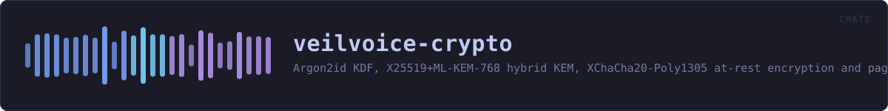
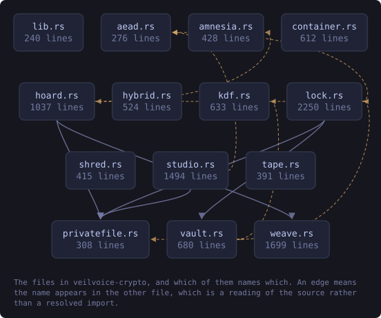
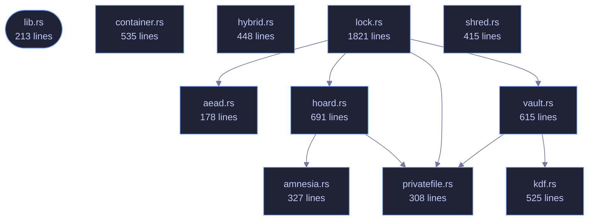

<!-- SPDX-License-Identifier: GPL-3.0-or-later -->
<!-- GENERATED by tools/docs/generate.py from the doc comments in the
     source. Do not edit this file: edit the `//!` and `///` comments in
     the .rs files and run the generator again. CI verifies it with
         python tools/docs/generate.py --check
-->

<p align="center">
  
</p>

# veilvoice-crypto

> Argon2id KDF, X25519+ML-KEM-768 hybrid KEM, XChaCha20-Poly1305 at-rest encryption and page-locked amnesic secrets for VeilVoice.

## Contents

  - [What this crate is for](#what-this-crate-is-for)
  - [Threat model, stated plainly](#threat-model-stated-plainly)
  - [Example](#example)
- [In plain words](#in-plain-words)
  - [How the crate fits together](#how-the-crate-fits-together)
  - [The files](#the-files)
  - [Public items](#public-items)
  - [Reading it elsewhere](#reading-it-elsewhere)

Key derivation, post-quantum-hybrid key agreement, authenticated encryption
and amnesic secret storage for VeilVoice.

## What this crate is for

[`veilvoice_core`](../veilvoice-core/README.md) makes a voice
unrecognisable; it does not hide the *words*, and it is not meant to. When a
recording needs to stay secret as well, at rest on disk or in transit to
someone else, that is this crate's job.

- `kdf`, Argon2id, for turning a password into a key.
- `hybrid`, X25519 + ML-KEM-768, so a recording captured today is not
readable by a quantum adversary tomorrow.
- `aead`, XChaCha20-Poly1305, with random nonces and authenticated
associated data.
- `container`, the `.veil` file format that ties the three together.
- `amnesia`, page-locked, zeroizing, constant-time-comparable secrets.
- `shred`, secure erasure, and an honest account of what that is worth
on flash storage.
- `privatefile`, writing a file that is owner-only from the moment it
exists, rather than world-readable until a second syscall tightens it.
- `lock`, the application lock: an Argon2id verifier with a rate limit,
which protects against casual access and says so rather than pretending to
be tamper-proof.

## Threat model, stated plainly

This crate protects data **at rest and in transit** against an attacker who
later obtains the file, including one who stores it until quantum hardware
exists. It does **not** protect against an attacker who is already running
code as you, or who can read this process's memory: page-locking keeps keys
out of the swap file, not out of a debugger. Hibernation writes RAM to disk
wholesale and defeats locking entirely.

## Example

```
use veilvoice_crypto::{container, kdf};

# fn main() -> Result<(), veilvoice_crypto::Error> {
// Cheap parameters so the doctest is fast; real callers use the default.
let params = kdf::KdfParams::weak_for_tests();
let sealed = container::seal_with_password(b"pass phrase", b"audio bytes", params)?;
assert_eq!(container::open_with_password(b"pass phrase", &sealed)?, b"audio bytes");
assert!(container::open_with_password(b"wrong", &sealed).is_err());
# Ok(())
# }
```

VeilVoice contains **no `unsafe` code at all**, including the page-locking
in `amnesia`, which goes through a safe wrapper.

# In plain words

This is the locking.

Two separate things use it. Recordings are sealed on your disk so that somebody
who takes the disk cannot listen to them, and the app can be put behind a
password so somebody who picks up your unlocked computer cannot open it.

Those two passwords are deliberately different. Opening the program should not
be the same act as unsealing everything it has ever written.

The maths is chosen to be slow to guess and to still be safe if somebody one
day builds a quantum computer. Nothing is sent anywhere; the sealing happens on
your machine and the key is made from your password each time.

## How the crate fits together

Every arrow below is a `crate::` or `super::` path one module actually
uses, read out of the source by the generator rather than drawn by
hand. A dependency that goes away loses its arrow the next time this
file is written.

<p align="center">
  
</p>

<details>
<summary>The same graph as Mermaid source</summary>



</details>

## The files

| File | Lines | What it is |
|---|---:|---|
| [`aead.rs`](../../docs/files/veilvoice-crypto/aead.md) | 178 | Authenticated encryption with XChaCha20-Poly1305. |
| [`amnesia.rs`](../../docs/files/veilvoice-crypto/amnesia.md) | 327 | Amnesic secret storage: page-locked, zeroized, and never printed. |
| [`container.rs`](../../docs/files/veilvoice-crypto/container.md) | 535 | The .veil encrypted container format. |
| [`hoard.rs`](../../docs/files/veilvoice-crypto/hoard.md) | 691 | The obfuscated program folder: what VeilVoice keeps on disk, under names that mean nothing and beside files that hold nothing. |
| [`hybrid.rs`](../../docs/files/veilvoice-crypto/hybrid.md) | 448 | Post-quantum hybrid key encapsulation: X25519 + ML-KEM-768. |
| [`kdf.rs`](../../docs/files/veilvoice-crypto/kdf.md) | 525 | Password-based key derivation with Argon2id. |
| [`lib.rs`](../../docs/files/veilvoice-crypto/lib.md) | 213 | Key derivation, post-quantum-hybrid key agreement, authenticated encryption and amnesic secret storage for VeilVoice. |
| [`lock.rs`](../../docs/files/veilvoice-crypto/lock.md) | 1821 | The application lock: an Argon2id password verifier with a rate limit. |
| [`privatefile.rs`](../../docs/files/veilvoice-crypto/privatefile.md) | 308 | Writing a file that only its owner can read. |
| [`shred.rs`](../../docs/files/veilvoice-crypto/shred.md) | 415 | Secure erasure, the self-destruct. |
| [`vault.rs`](../../docs/files/veilvoice-crypto/vault.md) | 615 | Where the app lock is kept: two copies, unpredictable names, and a restore. |
| [`seal_and_open.rs`](../../docs/files/veilvoice-crypto/examples-seal_and_open.md) | 80 | _no module documentation yet_ |
| [`parser_fuzz.rs`](../../docs/files/veilvoice-crypto/tests-parser_fuzz.md) | 368 | Randomised robustness testing for the two parsers that read untrusted input. |
| [`timing.rs`](../../docs/files/veilvoice-crypto/tests-timing.md) | 249 | Timing measurement of the password paths. |

## Public items

| Item | Where | What |
|---|---|---|
| `const NONCE_LEN` | [`aead.rs`](../../docs/files/veilvoice-crypto/aead.md) | Nonce length for XChaCha20-Poly1305, in bytes. |
| `const TAG_LEN` | [`aead.rs`](../../docs/files/veilvoice-crypto/aead.md) | Poly1305 authentication tag length, in bytes. |
| `fn random_nonce` | [`aead.rs`](../../docs/files/veilvoice-crypto/aead.md) | Draw a fresh random nonce from the OS CSPRNG. |
| `fn seal` | [`aead.rs`](../../docs/files/veilvoice-crypto/aead.md) | Encrypt plaintext, authenticating aad alongside it. |
| `fn open` | [`aead.rs`](../../docs/files/veilvoice-crypto/aead.md) | Decrypt and verify. |
| `struct Secret` | [`amnesia.rs`](../../docs/files/veilvoice-crypto/amnesia.md) | A byte buffer holding key material. |
| `const MAGIC` | [`container.rs`](../../docs/files/veilvoice-crypto/container.md) | Magic bytes at the start of every container. |
| `const FORMAT_VERSION` | [`container.rs`](../../docs/files/veilvoice-crypto/container.md) | Format version this build writes. |
| `const HEADER_LEN` | [`container.rs`](../../docs/files/veilvoice-crypto/container.md) | Fixed header length in bytes, before any encapsulation. |
| `enum Mode` | [`container.rs`](../../docs/files/veilvoice-crypto/container.md) | How a container is locked. |
| `struct Header` | [`container.rs`](../../docs/files/veilvoice-crypto/container.md) | A parsed container header. |
| `fn veil_path` | [`container.rs`](../../docs/files/veilvoice-crypto/container.md) | The conventional path of the sealed form of path. |
| `fn seal_with_password` | [`container.rs`](../../docs/files/veilvoice-crypto/container.md) | Encrypt plaintext under a password. |
| `fn seal_to_public_key` | [`container.rs`](../../docs/files/veilvoice-crypto/container.md) | Encrypt plaintext to a recipient's hybrid public key. |
| `fn open_with_password` | [`container.rs`](../../docs/files/veilvoice-crypto/container.md) | Decrypt a password-locked container. |
| `fn open_with_password_within` | [`container.rs`](../../docs/files/veilvoice-crypto/container.md) | Decrypt a password-locked container, refusing one that declares a memory cost above max_m_cost. |
| `fn open_with_secret_key` | [`container.rs`](../../docs/files/veilvoice-crypto/container.md) | Decrypt a container addressed to recipient. |
| `struct StoreKey` | [`hoard.rs`](../../docs/files/veilvoice-crypto/hoard.md) | The key that names and opens everything in the hoard. |
| `struct Audit` | [`hoard.rs`](../../docs/files/veilvoice-crypto/hoard.md) | What an audit found. |
| `struct Hoard` | [`hoard.rs`](../../docs/files/veilvoice-crypto/hoard.md) | An obfuscated store rooted at a directory. |
| `const X25519_PUB_LEN` | [`hybrid.rs`](../../docs/files/veilvoice-crypto/hybrid.md) | Encoded length of the X25519 public key. |
| `const MLKEM_EK_LEN` | [`hybrid.rs`](../../docs/files/veilvoice-crypto/hybrid.md) | Encoded length of the ML-KEM-768 encapsulation (public) key. |
| `const MLKEM_CT_LEN` | [`hybrid.rs`](../../docs/files/veilvoice-crypto/hybrid.md) | Encoded length of an ML-KEM-768 ciphertext. |
| `const MLKEM_DK_LEN` | [`hybrid.rs`](../../docs/files/veilvoice-crypto/hybrid.md) | Encoded length of the ML-KEM-768 decapsulation (private) key. |
| `const X25519_SECRET_LEN` | [`hybrid.rs`](../../docs/files/veilvoice-crypto/hybrid.md) | Encoded length of the X25519 private scalar. |
| `const SECRET_KEY_LEN` | [`hybrid.rs`](../../docs/files/veilvoice-crypto/hybrid.md) | Total encoded length of a SecretKey. |
| `const PUBLIC_KEY_LEN` | [`hybrid.rs`](../../docs/files/veilvoice-crypto/hybrid.md) | Total encoded length of a PublicKey. |
| `const ENCAPSULATION_LEN` | [`hybrid.rs`](../../docs/files/veilvoice-crypto/hybrid.md) | Total encoded length of an Encapsulation. |
| `struct PublicKey` | [`hybrid.rs`](../../docs/files/veilvoice-crypto/hybrid.md) | A recipient's public key: an X25519 point plus an ML-KEM-768 encapsulation key. |
| `struct SecretKey` | [`hybrid.rs`](../../docs/files/veilvoice-crypto/hybrid.md) | A recipient's private key. |
| `struct Encapsulation` | [`hybrid.rs`](../../docs/files/veilvoice-crypto/hybrid.md) | The public values a sender transmits so the recipient can recover the shared secret. |
| `struct KdfParams` | [`kdf.rs`](../../docs/files/veilvoice-crypto/kdf.md) | Argon2id cost parameters. |
| `const SALT_LEN` | [`kdf.rs`](../../docs/files/veilvoice-crypto/kdf.md) | Length of the salt stored in an encrypted container. |
| `const KEY_LEN` | [`kdf.rs`](../../docs/files/veilvoice-crypto/kdf.md) | Length of a derived symmetric key. |
| `fn derive_key` | [`kdf.rs`](../../docs/files/veilvoice-crypto/kdf.md) | Derive a 32-byte key from password and salt. |
| `fn random_salt` | [`kdf.rs`](../../docs/files/veilvoice-crypto/kdf.md) | Draw a fresh random salt from the OS CSPRNG. |
| `const VERSION` | [`lib.rs`](../../docs/files/veilvoice-crypto/lib.md) | Crate version string, surfaced in the About panel. |
| `enum Error` | [`lib.rs`](../../docs/files/veilvoice-crypto/lib.md) | Everything that can go wrong in this crate. |
| `const SCOPE` | [`lock.rs`](../../docs/files/veilvoice-crypto/lock.md) | What the app lock protects against, and what it does not, in the words a front-end should show the user. |
| `const MAGIC` | [`lock.rs`](../../docs/files/veilvoice-crypto/lock.md) | Magic bytes at the start of a lock file. |
| `const FORMAT_VERSION` | [`lock.rs`](../../docs/files/veilvoice-crypto/lock.md) | Format version this build writes. |
| `const LOCK_LEN` | [`lock.rs`](../../docs/files/veilvoice-crypto/lock.md) | Exact size of a version 2 lock file, in bytes. |
| `const LOCK_LEN_V1` | [`lock.rs`](../../docs/files/veilvoice-crypto/lock.md) | Exact size of a version 1 lock file, which this build still reads. |
| `fn delay_secs` | [`lock.rs`](../../docs/files/veilvoice-crypto/lock.md) | How long to refuse the next attempt after failures consecutive failures. |
| `struct AppLock` | [`lock.rs`](../../docs/files/veilvoice-crypto/lock.md) | A password verifier plus its attempt history. |
| `struct LockStore` | [`lock.rs`](../../docs/files/veilvoice-crypto/lock.md) | An AppLock bound to a file, which is persisted after every attempt. |
| `fn open_default` | [`lock.rs`](../../docs/files/veilvoice-crypto/lock.md) | Open the lock at the default location, wherever this platform keeps it. |
| `fn open_in` | [`lock.rs`](../../docs/files/veilvoice-crypto/lock.md) | Open a vault-backed lock under base, adopting a pre-vault file if one is there. |
| `fn create_default` | [`lock.rs`](../../docs/files/veilvoice-crypto/lock.md) | Create a lock at the default location, refusing to replace one already there. |
| `fn create_in` | [`lock.rs`](../../docs/files/veilvoice-crypto/lock.md) | Create a vault-backed lock under base. |
| `fn default_dir` | [`lock.rs`](../../docs/files/veilvoice-crypto/lock.md) | The configuration directory the vault keeps its files in, if the environment says where one is. |
| `fn default_path` | [`lock.rs`](../../docs/files/veilvoice-crypto/lock.md) | Where the lock file lives on this platform, if the environment says. |
| `fn write_owner_only` | [`privatefile.rs`](../../docs/files/veilvoice-crypto/privatefile.md) | Create path containing bytes, readable only by the current user. |
| `fn write_owner_only_new` | [`privatefile.rs`](../../docs/files/veilvoice-crypto/privatefile.md) | As write_owner_only, but fail if anything is already at path. |
| `fn replace_owner_only` | [`privatefile.rs`](../../docs/files/veilvoice-crypto/privatefile.md) | Replace path with bytes in one step, or leave what was there. |
| `fn tighten` | [`privatefile.rs`](../../docs/files/veilvoice-crypto/privatefile.md) | Make an existing file readable only by its owner. |
| `enum Passes` | [`shred.rs`](../../docs/files/veilvoice-crypto/shred.md) | How thoroughly to overwrite before unlinking. |
| `struct ShredReport` | [`shred.rs`](../../docs/files/veilvoice-crypto/shred.md) | What actually happened, so the caller can tell the user the truth. |
| `fn shred_file` | [`shred.rs`](../../docs/files/veilvoice-crypto/shred.md) | Overwrite a file's contents, then delete it. |
| `enum Found` | [`vault.rs`](../../docs/files/veilvoice-crypto/vault.md) | What Vault::load found when it went looking. |
| `struct Vault` | [`vault.rs`](../../docs/files/veilvoice-crypto/vault.md) | The two files a lock lives in, and the index that names them. |
| `fn admin_dir` | [`vault.rs`](../../docs/files/veilvoice-crypto/vault.md) | A directory only an administrator can write to, if this process can make one there. |

## Reading it elsewhere

- On the website: [`website/reference/veilvoice-crypto.html`](../../website/reference/veilvoice-crypto.html)
- The audit this code is held to: [`docs/AUDIT.md`](../../docs/AUDIT.md)
- The claims and their limits: [`docs/WHITEPAPER.md`](../../docs/WHITEPAPER.md)
- Using the crates from your own project: [`docs/USING_THE_CRATES.md`](../../docs/USING_THE_CRATES.md)

Signing key fingerprint `8101FB3BB28D02FB239E0CDF9CC1C7E7A9B5833A`.
