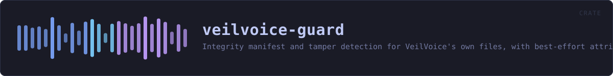
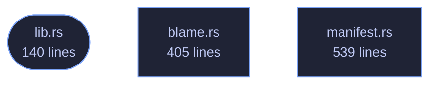

<!-- SPDX-License-Identifier: GPL-3.0-or-later -->
<!-- GENERATED by tools/docs/generate.py from the doc comments in the
     source. Do not edit this file: edit the `//!` and `///` comments in
     the .rs files and run the generator again. CI verifies it with
         python tools/docs/generate.py --check
-->

  

# veilvoice-guard

> Integrity manifest and tamper detection for VeilVoice's own files, with best-effort attribution of what changed them.

## Contents

- [What this is, and the word it deliberately does not use](#what-this-is-and-the-word-it-deliberately-does-not-use)
- [What it actually does](#what-it-actually-does)
- [The manifest is only as trustworthy as where it is kept](#the-manifest-is-only-as-trustworthy-as-where-it-is-kept)
- [What a privileged helper would add, and why there is not one here](#what-a-privileged-helper-would-add-and-why-there-is-not-one-here)
- [How the crate fits together](#how-the-crate-fits-together)
- [The files](#the-files)
- [Public items](#public-items)
- [Reading it elsewhere](#reading-it-elsewhere)

Tamper **detection** for VeilVoice's own files: a manifest of what they
should be, a check of what they are, and a best-effort answer to "what
changed them".

## What this is, and the word it deliberately does not use

It is not tamper-*proof*. Nothing that runs as an ordinary program on your
computer can be. A guard running as you can be killed by anything else
running as you; a guard running as root can be stopped by root. The only
honest verb here is **detect**, and where detection can be defeated that is
said rather than glossed.

This is the same limit the app lock has, for the same reason, and the
project answers it the same way: state it plainly, in the place the user
reads. See `SCOPE`.

## What it actually does

- `Manifest::of` records each file's size and SHA-256.
- `Manifest::check` compares that against what is on disk now and reports
what was **modified**, **removed** or **added**.
- `blame` tries to name the process responsible for a change. It usually
cannot, and says so instead of guessing.

## The manifest is only as trustworthy as where it is kept

Written plainly, a manifest detects accidental corruption, an interrupted
update, a file swapped by something careless -- and an attacker who did not
think to rewrite it. It does not detect one who did, because they can
recompute it as easily as this crate can.

To raise that bar, seal the manifest with
`veilvoice_crypto::container::seal_with_password` and keep the passphrase
out of the manifest's own directory. Then rewriting it undetectably requires
the passphrase as well as write access. That is a real improvement and still
not proof: an attacker who is present *while* you type the passphrase has
everything. `Manifest::seal` and `Manifest::open_sealed` do this.

## What a privileged helper would add, and why there is not one here

A root service using `fanotify` (Linux) or a SACL plus Security event 4663
(Windows) could attribute every write reliably, and `fanotify` with
`FAN_OPEN_PERM` could even block one. That is genuinely stronger than
anything in this crate.

It is also an installer, a privileged daemon and a much larger attack
surface bolted onto a project that currently needs no privileges at all --
and it still could not stop a root-level attacker, only watch one. So the
unprivileged half ships first, on its own merits, and `ROADMAP.md` records
what the privileged half would need to be worth adding.

## How the crate fits together

Every arrow below is a `crate::` or `super::` path one module actually
uses, read out of the source by the generator rather than drawn by
hand. A dependency that goes away loses its arrow the next time this
file is written.

## The files

| File | Lines | What it is |
|---|---:|---|
| [`blame.rs`](../../docs/files/veilvoice-guard/blame.md) | 405 | Best-effort attribution: which program changed a file. |
| [`lib.rs`](../../docs/files/veilvoice-guard/lib.md) | 140 | Tamper detection for VeilVoice's own files: a manifest of what they should be, a check of what they are, and a best-effort answer to "what changed them". |
| [`manifest.rs`](../../docs/files/veilvoice-guard/manifest.md) | 539 | The integrity manifest: what the files were, and what they are now. |

## Public items

| Item | Where | What |
|---|---|---|
| `enum Blame` | [`blame.rs`](../../docs/files/veilvoice-guard/blame.md) | What, if anything, is known about who changed a file. |
| `fn who_touched` | [`blame.rs`](../../docs/files/veilvoice-guard/blame.md) | Try to name the program that last wrote to path. |
| `const VERSION` | [`lib.rs`](../../docs/files/veilvoice-guard/lib.md) | Crate version string, surfaced in the About panel. |
| `const SCOPE` | [`lib.rs`](../../docs/files/veilvoice-guard/lib.md) | What tamper detection is worth, in the words a front-end should show. |
| `enum Error` | [`lib.rs`](../../docs/files/veilvoice-guard/lib.md) | Everything that can go wrong in this crate. |
| `struct Entry` | [`manifest.rs`](../../docs/files/veilvoice-guard/manifest.md) | One recorded file. |
| `enum Change` | [`manifest.rs`](../../docs/files/veilvoice-guard/manifest.md) | How a file differs from its record. |
| `struct Report` | [`manifest.rs`](../../docs/files/veilvoice-guard/manifest.md) | The result of checking a manifest against the disk. |
| `struct Manifest` | [`manifest.rs`](../../docs/files/veilvoice-guard/manifest.md) | A record of a set of files. |
| `fn files_in` | [`manifest.rs`](../../docs/files/veilvoice-guard/manifest.md) | Every file directly inside dir, for use as check's extra argument. |

## Reading it elsewhere

- On the website: [`website/reference/veilvoice-guard.html`](../../website/reference/veilvoice-guard.html)
- The audit this code is held to: [`docs/AUDIT.md`](../../docs/AUDIT.md)
- The claims and their limits: [`docs/WHITEPAPER.md`](../../docs/WHITEPAPER.md)
- Using the crates from your own project: [`docs/USING_THE_CRATES.md`](../../docs/USING_THE_CRATES.md)

Signing key fingerprint `8101FB3BB28D02FB239E0CDF9CC1C7E7A9B5833A`.
