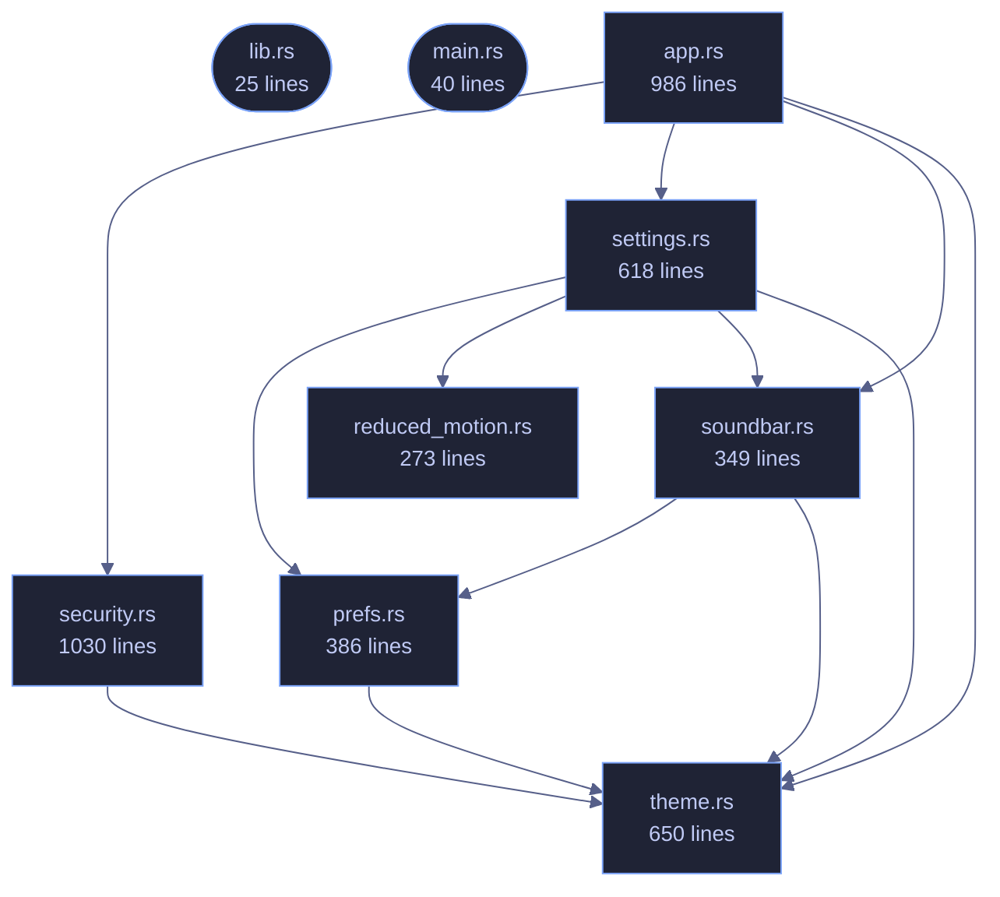

<!-- SPDX-License-Identifier: CC-BY-NC-SA-4.0 -->
<!-- GENERATED by tools/docs/generate.py from the doc comments in the
     source. Do not edit this file: edit the `//!` and `///` comments in
     the .rs files and run the generator again. CI verifies it with
         python tools/docs/generate.py --check
-->

  

# veilvoice-gui

> egui/eframe front-end for VeilVoice: Tokyo Night, monospace, three modes.

## Contents

- [How the crate fits together](#how-the-crate-fits-together)
- [The files](#the-files)
- [Public items](#public-items)
- [Reading it elsewhere](#reading-it-elsewhere)

The VeilVoice desktop application: an egui/eframe front-end, monospace
throughout — anonymise a file, scramble a microphone live, watch what is
listening, manage the app lock, choose how the app looks, and an about
panel that states the honest scope.

The binary lives in `main.rs`; this library exists so the UI logic can be
unit tested without opening a window.

## How the crate fits together

Every arrow below is a `crate::` or `super::` path one module actually
uses, read out of the source by the generator rather than drawn by
hand. A dependency that goes away loses its arrow the next time this
file is written.

## The files

| File | Lines | What it is |
|---|---:|---|
| [`app.rs`](../../docs/files/veilvoice-gui/app.md) | 986 | The VeilVoice desktop application. |
| [`lib.rs`](../../docs/files/veilvoice-gui/lib.md) | 25 | The VeilVoice desktop application: an egui/eframe front-end, monospace throughout — anonymise a file, scramble a microphone live, watch what is listening, manage the app lock, choose how the app looks, and an about panel that states the honest scope. |
| [`main.rs`](../../docs/files/veilvoice-gui/main.md) | 40 | VeilVoice desktop application entry point. |
| [`prefs.rs`](../../docs/files/veilvoice-gui/prefs.md) | 386 | What the user has chosen about how the app looks and moves. |
| [`reduced_motion.rs`](../../docs/files/veilvoice-gui/reduced_motion.md) | 273 | Whether the operating system has been asked to reduce motion. |
| [`security.rs`](../../docs/files/veilvoice-gui/security.md) | 1030 | The application lock, and the at-rest encryption of what VeilVoice writes. |
| [`settings.rs`](../../docs/files/veilvoice-gui/settings.md) | 618 | The settings panel: a menu of pages, each a titled group of choices. |
| [`soundbar.rs`](../../docs/files/veilvoice-gui/soundbar.md) | 349 | The animated mark: a row of bars that rise and fall. |
| [`theme.rs`](../../docs/files/veilvoice-gui/theme.md) | 650 | Colour schemes for the desktop app. |

## Public items

| Item | Where | What |
|---|---|---|
| `struct VeilVoiceApp` | [`app.rs`](../../docs/files/veilvoice-gui/app.md) | Application state. |
| `const VERSION` | [`lib.rs`](../../docs/files/veilvoice-gui/lib.md) | Crate version string, surfaced in the About panel. |
| `struct Prefs` | [`prefs.rs`](../../docs/files/veilvoice-gui/prefs.md) | Everything the user can choose about presentation. |
| `fn default_path` | [`prefs.rs`](../../docs/files/veilvoice-gui/prefs.md) | Where preferences live: beside the app lock, in this platform's config directory. |
| `struct Motion` | [`prefs.rs`](../../docs/files/veilvoice-gui/prefs.md) | Whether movement is allowed, and how much. |
| `enum Query` | [`reduced_motion.rs`](../../docs/files/veilvoice-gui/reduced_motion.md) | What the platform said. |
| `fn query` | [`reduced_motion.rs`](../../docs/files/veilvoice-gui/reduced_motion.md) | Ask the operating system. |
| `enum Sealing` | [`security.rs`](../../docs/files/veilvoice-gui/security.md) | How the recording that comes out of a job is protected. |
| `struct Security` | [`security.rs`](../../docs/files/veilvoice-gui/security.md) | Everything about locking the app and sealing its output. |
| `const DISABLE_WARNING` | [`security.rs`](../../docs/files/veilvoice-gui/security.md) | What the user is told before recordings stop being encrypted. |
| `enum Plan` | [`security.rs`](../../docs/files/veilvoice-gui/security.md) | What a finished job should do with its bytes. |
| `enum Page` | [`settings.rs`](../../docs/files/veilvoice-gui/settings.md) | Which page of the settings menu is showing. |
| `struct Settings` | [`settings.rs`](../../docs/files/veilvoice-gui/settings.md) | The settings tab's own state. |
| `fn draw` | [`soundbar.rs`](../../docs/files/veilvoice-gui/soundbar.md) | Draw the mark at size, returning the response so it can carry a tooltip. |
| `struct Theme` | [`theme.rs`](../../docs/files/veilvoice-gui/theme.md) | One complete colour scheme. |
| `const THEMES` | [`theme.rs`](../../docs/files/veilvoice-gui/theme.md) | Every theme, in the order the picker shows them. |
| `fn active` | [`theme.rs`](../../docs/files/veilvoice-gui/theme.md) | The theme currently in force. |
| `fn by_id` | [`theme.rs`](../../docs/files/veilvoice-gui/theme.md) | Look a theme up by its stable identifier. |
| `fn set_by_id` | [`theme.rs`](../../docs/files/veilvoice-gui/theme.md) | Switch to id, and apply it to ctx. |
| `mod palette` | [`theme.rs`](../../docs/files/veilvoice-gui/theme.md) | Shorthand accessors, so call sites read as p::fg() rather than theme::active().fg. |
| `fn install_fonts` | [`theme.rs`](../../docs/files/veilvoice-gui/theme.md) | Load JetBrains Mono if the system has it. |
| `fn install` | [`theme.rs`](../../docs/files/veilvoice-gui/theme.md) | Apply the active theme's visuals and a monospace-everywhere type scale. |

## Reading it elsewhere

- On the website: [`website/reference/veilvoice-gui.html`](../../website/reference/veilvoice-gui.html)
- The audit this code is held to: [`docs/AUDIT.md`](../../docs/AUDIT.md)
- The claims and their limits: [`docs/WHITEPAPER.md`](../../docs/WHITEPAPER.md)
- Using the crates from your own project: [`docs/USING_THE_CRATES.md`](../../docs/USING_THE_CRATES.md)

Signing key fingerprint `8101FB3BB28D02FB239E0CDF9CC1C7E7A9B5833A`.
