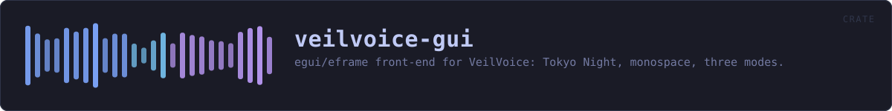
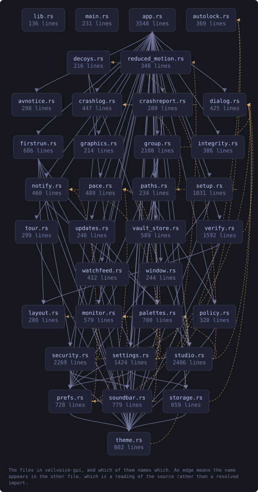
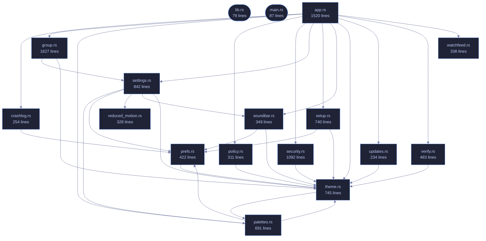

<!-- SPDX-License-Identifier: GPL-3.0-or-later -->
<!-- GENERATED by tools/docs/generate.py from the doc comments in the
     source. Do not edit this file: edit the `//!` and `///` comments in
     the .rs files and run the generator again. CI verifies it with
         python tools/docs/generate.py --check
-->

  

# veilvoice-gui

> egui/eframe front-end for VeilVoice: Tokyo Night, monospace, three modes.

## Contents

- [The modules](#the-modules)
- [Two rules this crate keeps](#two-rules-this-crate-keeps)
- [In plain words](#in-plain-words)
  - [How the crate fits together](#how-the-crate-fits-together)
  - [The files](#the-files)
  - [Public items](#public-items)
  - [Reading it elsewhere](#reading-it-elsewhere)

The VeilVoice desktop application: an egui/eframe front-end, monospace
throughout — anonymise a file, scramble a microphone live, watch what is
listening, manage the app lock, choose how the app looks, and an about
panel that states the honest scope.

The binary lives in `main.rs`; this library exists so the UI logic can be
unit tested without opening a window.

That split is worth stating plainly, because it is the reason this crate has
tests at all: a binary crate cannot be unit tested, so everything with logic
in it -- the app lock's state machine, preference loading, palette
resolution, the reduced-motion decision -- lives here where a test can reach
it without a display server. `main.rs` holds only what genuinely needs a
window.

# The modules

| Module | What it owns |
|---|---|
| `security` | The unlock screen, the lock tab, and the at-rest controls |
| `prefs` | Preferences, and recovering from a corrupt preferences file |
| `policy` | Settings somebody has fixed, and the reason beside each one |
| `settings` | The settings tab |
| `setup` | Installing this copy, and the optional companions |
| `theme` | The palette, shared with the command-line front end |
| `soundbar` | The animated level meter |
| `reduced_motion` | Whether to animate at all |
| `watchfeed` | The device monitor, on a thread that is not this one |

# Two rules this crate keeps

**The user interface never softens a scope note.** Where a control has a
bound -- the app lock is a verifier and not disk encryption, tamper detection
detects rather than prevents -- the interface says so next to the control,
and tests fail the build if that text changes. Documentation nobody opens
does not protect anybody.

**Animation is a preference that is honoured, not a decoration.**
`reduced_motion` resolves the platform's own setting alongside the user's
explicit choice, and the whole interface reads that answer rather than each
widget deciding for itself.

# In plain words

This is the window.

Tabs down the top for the things the program does: disguise a file, scramble a
microphone as you talk, handle a recording with several people, watch for
anything using your microphone, put the app behind a password, check a
download, and change how it looks.

Nine colour schemes, and your own if you write one. It does the slow work on
another thread, so the window keeps answering while it is busy.

## How the crate fits together

Every arrow below is a `crate::` or `super::` path one module actually
uses, read out of the source by the generator rather than drawn by
hand. A dependency that goes away loses its arrow the next time this
file is written.

  

The same graph as Mermaid source

## The files

| File | Lines | What it is |
|---|---:|---|
| [`app.rs`](../../docs/files/veilvoice-gui/app.md) | 1520 | The VeilVoice desktop application: seven tabs, one window, no menus. |
| [`crashlog.rs`](../../docs/files/veilvoice-gui/crashlog.md) | 254 | Make a failure that produces no output produce some. |
| [`group.rs`](../../docs/files/veilvoice-gui/group.md) | 1627 | Group mode: several people in one recording, each with a name and a colour. |
| [`lib.rs`](../../docs/files/veilvoice-gui/lib.md) | 79 | The VeilVoice desktop application: an egui/eframe front-end, monospace throughout — anonymise a file, scramble a microphone live, watch what is listening, manage the app lock, choose how the app looks, and an about panel that states the honest scope. |
| [`main.rs`](../../docs/files/veilvoice-gui/main.md) | 87 | Entry point for the desktop application: open a window, hand it to veilvoice_gui::VeilVoiceApp, and get out of the way. |
| [`palettes.rs`](../../docs/files/veilvoice-gui/palettes.md) | 691 | User-defined colour schemes, and the contrast check that keeps them usable. |
| [`policy.rs`](../../docs/files/veilvoice-gui/policy.md) | 311 | The policy in force, and what the interface does about it. |
| [`prefs.rs`](../../docs/files/veilvoice-gui/prefs.md) | 422 | What the user has chosen about how the app looks and moves. |
| [`reduced_motion.rs`](../../docs/files/veilvoice-gui/reduced_motion.md) | 328 | Whether the operating system has been asked to reduce motion. |
| [`security.rs`](../../docs/files/veilvoice-gui/security.md) | 1092 | The application lock, and the at-rest encryption of what VeilVoice writes. |
| [`settings.rs`](../../docs/files/veilvoice-gui/settings.md) | 842 | The settings panel: a menu of pages, each a titled group of choices. |
| [`setup.rs`](../../docs/files/veilvoice-gui/setup.md) | 740 | The setup tab: install this copy, undo that, and the optional companions. |
| [`soundbar.rs`](../../docs/files/veilvoice-gui/soundbar.md) | 349 | The animated mark: a row of bars that rise and fall. |
| [`theme.rs`](../../docs/files/veilvoice-gui/theme.md) | 745 | Colour schemes for the desktop app. |
| [`updates.rs`](../../docs/files/veilvoice-gui/updates.md) | 234 | The manual update check, as the window shows it. |
| [`verify.rs`](../../docs/files/veilvoice-gui/verify.md) | 483 | The verify tab: drop a download on the window and be told what it is. |
| [`watchfeed.rs`](../../docs/files/veilvoice-gui/watchfeed.md) | 338 | The device monitor, moved off the thread that paints. |

## Public items

| Item | Where | What |
|---|---|---|
| `struct VeilVoiceApp` | [`app.rs`](../../docs/files/veilvoice-gui/app.md) | Application state. |
| `fn default_path` | [`crashlog.rs`](../../docs/files/veilvoice-gui/crashlog.md) | The file a failure is written to, beside the preferences. |
| `fn write` | [`crashlog.rs`](../../docs/files/veilvoice-gui/crashlog.md) | Write one failure report. |
| `fn install` | [`crashlog.rs`](../../docs/files/veilvoice-gui/crashlog.md) | Install the panic hook. |
| `fn record_startup_failure` | [`crashlog.rs`](../../docs/files/veilvoice-gui/crashlog.md) | Record a startup failure that eframe returned rather than panicked. |
| `fn previous` | [`crashlog.rs`](../../docs/files/veilvoice-gui/crashlog.md) | Read a previous report, if one is there, so the interface can mention it. |
| `fn clear` | [`crashlog.rs`](../../docs/files/veilvoice-gui/crashlog.md) | Forget a previous report. |
| `struct Person` | [`group.rs`](../../docs/files/veilvoice-gui/group.md) | One person, as the panel holds them. |
| `struct Outputs` | [`group.rs`](../../docs/files/veilvoice-gui/group.md) | What comes out of a group render. |
| `struct Group` | [`group.rs`](../../docs/files/veilvoice-gui/group.md) | The group-mode panel's state. |
| `fn assigned_colour` | [`group.rs`](../../docs/files/veilvoice-gui/group.md) | The colour a slot is given, as an egui colour. |
| `const VERSION` | [`lib.rs`](../../docs/files/veilvoice-gui/lib.md) | Crate version string, surfaced in the About panel. |
| `const REQUIRED` | [`palettes.rs`](../../docs/files/veilvoice-gui/palettes.md) | Every token a palette file has to define. |
| `const MAX_PALETTES` | [`palettes.rs`](../../docs/files/veilvoice-gui/palettes.md) | The most palette files that will be read from the directory. |
| `const MAX_BYTES` | [`palettes.rs`](../../docs/files/veilvoice-gui/palettes.md) | The largest palette file that will be read. |
| `fn contrast` | [`palettes.rs`](../../docs/files/veilvoice-gui/palettes.md) | The WCAG contrast ratio between two colours, from 1.0 to 21.0. |
| `fn contrast_problems` | [`palettes.rs`](../../docs/files/veilvoice-gui/palettes.md) | Check a palette's contrast, returning one message per failing pair. |
| `fn default_dir` | [`palettes.rs`](../../docs/files/veilvoice-gui/palettes.md) | Where palettes live, beside the preferences file. |
| `fn load` | [`palettes.rs`](../../docs/files/veilvoice-gui/palettes.md) | Read every palette in dir, returning the usable ones and every complaint. |
| `struct InForce` | [`policy.rs`](../../docs/files/veilvoice-gui/policy.md) | The policy this machine is running under, if any. |
| `fn default_dir` | [`policy.rs`](../../docs/files/veilvoice-gui/policy.md) | Where the policy files live, beside everything else VeilVoice keeps. |
| `struct Prefs` | [`prefs.rs`](../../docs/files/veilvoice-gui/prefs.md) | Everything the user can choose about presentation. |
| `fn default_path` | [`prefs.rs`](../../docs/files/veilvoice-gui/prefs.md) | Where preferences live: beside the app lock, in this platform's config directory. |
| `struct Motion` | [`prefs.rs`](../../docs/files/veilvoice-gui/prefs.md) | Whether movement is allowed, and how much. |
| `enum Query` | [`reduced_motion.rs`](../../docs/files/veilvoice-gui/reduced_motion.md) | What the platform said. |
| `fn query` | [`reduced_motion.rs`](../../docs/files/veilvoice-gui/reduced_motion.md) | Ask the operating system. |
| `enum Sealing` | [`security.rs`](../../docs/files/veilvoice-gui/security.md) | How the recording that comes out of a job is protected. |
| `struct Security` | [`security.rs`](../../docs/files/veilvoice-gui/security.md) | Everything about locking the app and sealing its output. |
| `const DISABLE_WARNING` | [`security.rs`](../../docs/files/veilvoice-gui/security.md) | What the user is told before recordings stop being encrypted. |
| `enum Plan` | [`security.rs`](../../docs/files/veilvoice-gui/security.md) | What a finished job should do with its bytes. |
| `enum Page` | [`settings.rs`](../../docs/files/veilvoice-gui/settings.md) | Which page of the settings menu is showing. |
| `struct Settings` | [`settings.rs`](../../docs/files/veilvoice-gui/settings.md) | The settings tab's own state. |
| `struct Setup` | [`setup.rs`](../../docs/files/veilvoice-gui/setup.md) | The setup tab's state. |
| `fn draw` | [`soundbar.rs`](../../docs/files/veilvoice-gui/soundbar.md) | Draw the mark at size, returning the response so it can carry a tooltip. |
| `struct Theme` | [`theme.rs`](../../docs/files/veilvoice-gui/theme.md) | One complete colour scheme. |
| `const THEMES` | [`theme.rs`](../../docs/files/veilvoice-gui/theme.md) | Every theme, in the order the picker shows them. |
| `fn active` | [`theme.rs`](../../docs/files/veilvoice-gui/theme.md) | The theme currently in force. |
| `fn themes` | [`theme.rs`](../../docs/files/veilvoice-gui/theme.md) | Every theme the picker offers: the built-in ones, then any the user added. |
| `fn load_custom` | [`theme.rs`](../../docs/files/veilvoice-gui/theme.md) | Read the user's palettes and add them to the table. |
| `fn by_id` | [`theme.rs`](../../docs/files/veilvoice-gui/theme.md) | Look a theme up by its stable identifier. |
| `fn set_by_id` | [`theme.rs`](../../docs/files/veilvoice-gui/theme.md) | Switch to id, and apply it to ctx. |
| `mod palette` | [`theme.rs`](../../docs/files/veilvoice-gui/theme.md) | Shorthand accessors, so call sites read as p::fg() rather than theme::active().fg. |
| `fn install_fonts` | [`theme.rs`](../../docs/files/veilvoice-gui/theme.md) | Load JetBrains Mono if the system has it. |
| `fn install` | [`theme.rs`](../../docs/files/veilvoice-gui/theme.md) | Apply the active theme's visuals and a monospace-everywhere type scale. |
| `struct Updates` | [`updates.rs`](../../docs/files/veilvoice-gui/updates.md) | The panel's state. |
| `struct Verify` | [`verify.rs`](../../docs/files/veilvoice-gui/verify.md) | The tab's state. |
| `struct Update` | [`watchfeed.rs`](../../docs/files/veilvoice-gui/watchfeed.md) | One look at the machine. |
| `struct WatchFeed` | [`watchfeed.rs`](../../docs/files/veilvoice-gui/watchfeed.md) | The window's end of the monitor. |

## Reading it elsewhere

- On the website: [`website/reference/veilvoice-gui.html`](../../website/reference/veilvoice-gui.html)
- The audit this code is held to: [`docs/AUDIT.md`](../../docs/AUDIT.md)
- The claims and their limits: [`docs/WHITEPAPER.md`](../../docs/WHITEPAPER.md)
- Using the crates from your own project: [`docs/USING_THE_CRATES.md`](../../docs/USING_THE_CRATES.md)

Signing key fingerprint `8101FB3BB28D02FB239E0CDF9CC1C7E7A9B5833A`.
