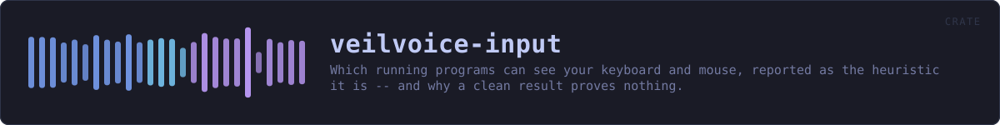
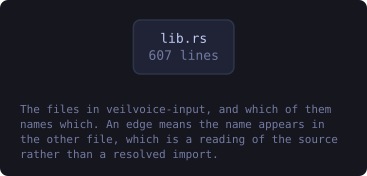

<!-- SPDX-License-Identifier: GPL-3.0-or-later -->
<!-- GENERATED by tools/docs/generate.py from the doc comments in the
     source. Do not edit this file: edit the `//!` and `///` comments in
     the .rs files and run the generator again. CI verifies it with
         python tools/docs/generate.py --check
-->

  

# veilvoice-input

> Which running programs can see your keyboard and mouse, reported as the heuristic it is -- and why a clean result proves nothing.

## Contents

- [This is a heuristic, and the crate is built to keep saying so](#this-is-a-heuristic-and-the-crate-is-built-to-keep-saying-so)
- [What it does not do, deliberately](#what-it-does-not-do-deliberately)
- [In plain words](#in-plain-words)
  - [How the crate fits together](#how-the-crate-fits-together)
  - [The files](#the-files)
  - [Public items](#public-items)
  - [Reading it elsewhere](#reading-it-elsewhere)

What on this machine could be watching the keyboard and the mouse.

# This is a heuristic, and the crate is built to keep saying so

There is no way to ask an operating system "is anything logging my
keystrokes" and get a true answer. The mechanisms a keylogger uses are the
same ones accessibility software, password managers, remote-support tools,
macro utilities and games legitimately use, and the good ones are written
not to be found. A tool that claimed to detect keyloggers would be making a
promise nothing can keep.

So this does the one thing that *can* be done honestly: it names the
programs running right now that are **able** to see your input, says what
each one is for, and leaves the judgement where it belongs. Every finding is
phrased as capability, never as an accusation, and `Finding::phrasing`
exists so that no front end has to invent that wording and get it wrong.

`LIMITS` is the paragraph a front end must show beside any result. It says
outright that a clean result proves nothing. That is not a disclaimer bolted
on; it is the most important thing this crate outputs, because somebody who
reads "nothing found" as "nothing there" has been made *less* safe by
running it.

# What it does not do, deliberately

It does not hook the keyboard, read input, count keystrokes, time them, or
watch the mouse. A program that monitored input to detect input monitoring
would be the thing it warns about, and on Windows it would need the same
`SetWindowsHookEx` that `#![forbid(unsafe_code)]` rules out anyway.

It also does not scan memory, inspect other processes' handles or read the
registry's autostart keys. `veilvoice-watch` already covers persistence,
and duplicating it here would give two answers to one question.

# In plain words

Software that records what you type is real, and there is no honest way for
any program to tell you for certain whether it is on your computer. Anything
that claims otherwise is guessing and not admitting it.

What this does instead: it looks at which programs are open, and tells you
which of them *could* see your typing or your mouse -- remote-support tools,
macro recorders, accessibility software, and so on. Most of the time these
are things you installed on purpose and there is nothing wrong. The point is
that you get to know they are running and decide for yourself.

If it finds nothing, that does **not** mean nothing is watching. It means
nothing it knows how to recognise is open, which is a much smaller claim,
and this crate will keep saying so every time.

## How the crate fits together

Every arrow below is a `crate::` or `super::` path one module actually
uses, read out of the source by the generator rather than drawn by
hand. A dependency that goes away loses its arrow the next time this
file is written.

  

The same graph as Mermaid source

```mermaid
%%{init: {"theme":"base","themeVariables":{"background":"#1a1b26","primaryColor":"#1f2335","primaryTextColor":"#c0caf5","primaryBorderColor":"#7aa2f7","secondaryColor":"#16161e","tertiaryColor":"#16161e","lineColor":"#737aa2","textColor":"#c0caf5","mainBkg":"#1f2335","nodeBorder":"#7aa2f7","clusterBkg":"#16161e","clusterBorder":"#2f3549","fontFamily":"ui-monospace, SFMono-Regular, Consolas, monospace","fontSize":"14px"}}}%%
flowchart TD
    n_lib(["lib.rs<br/>607 lines"])
    click n_lib href "https://github.com/tilas01/veilvoice/blob/main/crates/veilvoice-input/src/lib.rs" "open the source"
```

## The files

| File | Lines | What it is |
|---|---:|---|
| [`lib.rs`](../../docs/files/veilvoice-input/lib.md) | 607 | What on this machine could be watching the keyboard and the mouse. |

## Public items

| Item | Where | What |
|---|---|---|
| `enum Reach` | [`lib.rs`](../../docs/files/veilvoice-input/lib.md) | Why a program is in the table. |
| `struct Watcher` | [`lib.rs`](../../docs/files/veilvoice-input/lib.md) | One program able to observe keyboard or mouse input. |
| `const ALL` | [`lib.rs`](../../docs/files/veilvoice-input/lib.md) | Every program this build knows how to recognise. |
| `fn by_key` | [`lib.rs`](../../docs/files/veilvoice-input/lib.md) | The program with this identifier. |
| `fn matching` | [`lib.rs`](../../docs/files/veilvoice-input/lib.md) | The entry a process name belongs to, if any. |
| `struct Finding` | [`lib.rs`](../../docs/files/veilvoice-input/lib.md) | One program found running, and how to describe it. |
| `struct Report` | [`lib.rs`](../../docs/files/veilvoice-input/lib.md) | What was found, and everything that qualifies it. |
| `fn look` | [`lib.rs`](../../docs/files/veilvoice-input/lib.md) | Look, and report. |
| `const LIMITS` | [`lib.rs`](../../docs/files/veilvoice-input/lib.md) | What a reader must be told, in the words to tell them. |
| `const WHY_NOT_HOOKING` | [`lib.rs`](../../docs/files/veilvoice-input/lib.md) | Why this crate does not watch input in order to detect input watching. |

## Reading it elsewhere

- On the website: [`website/reference/veilvoice-input.html`](../../website/reference/veilvoice-input.html)
- The audit this code is held to: [`docs/AUDIT.md`](../../docs/AUDIT.md)
- The claims and their limits: [`docs/WHITEPAPER.md`](../../docs/WHITEPAPER.md)
- Using the crates from your own project: [`docs/USING_THE_CRATES.md`](../../docs/USING_THE_CRATES.md)

Signing key fingerprint `8101FB3BB28D02FB239E0CDF9CC1C7E7A9B5833A`.
