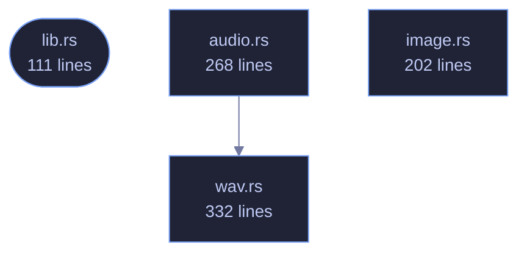

<!-- SPDX-License-Identifier: GPL-3.0-or-later -->
<!-- GENERATED by tools/docs/generate.py from the doc comments in the
     source. Do not edit this file: edit the `//!` and `///` comments in
     the .rs files and run the generator again. CI verifies it with
         python tools/docs/generate.py --check
-->

  

# veilvoice-meta

> Strip or spoof identifying metadata: audio tags, and image EXIF/GPS.

## Contents

- [Why this exists](#why-this-exists)
- [Strip versus spoof](#strip-versus-spoof)
- [What this crate cannot do](#what-this-crate-cannot-do)
- [How the crate fits together](#how-the-crate-fits-together)
- [The files](#the-files)
- [Public items](#public-items)
- [Reading it elsewhere](#reading-it-elsewhere)

Strip or spoof the identifying metadata that rides along with media files.

## Why this exists

De-identifying a voice accomplishes nothing if the file still says who
recorded it. A phone recording routinely carries the device model, the
recording software, a precise timestamp and — for images — GPS coordinates
accurate to a few metres. That is often a far easier way to identify someone
than analysing their voice, and it survives every DSP transform because it
is not in the audio at all.

## Strip versus spoof

Removing every tag is not always the least conspicuous choice. A file with
*no* metadata whatsoever is itself a signal: it says the sender was trying to
hide something, and it stands out in a set of otherwise ordinary files.
`Policy` therefore offers two approaches:

- `Policy::Strip` — remove everything. Best when the file is expected to
be sanitised anyway, or when any false statement would be worse than an
obvious absence.
- `Policy::Realistic` — replace the tags with plausible, non-identifying
values so the file looks unremarkable rather than scrubbed.

## What this crate cannot do

It removes *container* metadata. It cannot remove information encoded in the
media itself: a photograph still shows the room it was taken in, and audio
still carries its room acoustics and background noise. Nor does it touch
filesystem timestamps or the filename, both of which are outside the file —
callers that care must handle those separately.

## How the crate fits together

Every arrow below is a `crate::` or `super::` path one module actually
uses, read out of the source by the generator rather than drawn by
hand. A dependency that goes away loses its arrow the next time this
file is written.

## The files

| File | Lines | What it is |
|---|---:|---|
| [`audio.rs`](../../docs/files/veilvoice-meta/audio.md) | 268 | Audio tag removal and replacement. |
| [`image.rs`](../../docs/files/veilvoice-meta/image.md) | 202 | Image EXIF/GPS removal. |
| [`lib.rs`](../../docs/files/veilvoice-meta/lib.md) | 111 | Strip or spoof the identifying metadata that rides along with media files. |
| [`wav.rs`](../../docs/files/veilvoice-meta/wav.md) | 332 | Chunk-level RIFF/WAVE metadata removal. |
| [`wav_fuzz.rs`](../../docs/files/veilvoice-meta/tests-wav_fuzz.md) | 291 | Randomised robustness testing for the RIFF chunk walker. |

## Public items

| Item | Where | What |
|---|---|---|
| `fn clean_audio_file` | [`audio.rs`](../../docs/files/veilvoice-meta/audio.md) | Strip or replace the tags of an audio file, in place. |
| `fn clean_audio_tags` | [`audio.rs`](../../docs/files/veilvoice-meta/audio.md) | Report which tag blocks a file carries, without modifying it. |
| `enum ImageKind` | [`image.rs`](../../docs/files/veilvoice-meta/image.md) | Image container formats this crate can clean. |
| `fn clean_image_bytes` | [`image.rs`](../../docs/files/veilvoice-meta/image.md) | Strip identifying metadata from encoded image bytes. |
| `fn clean_image_file` | [`image.rs`](../../docs/files/veilvoice-meta/image.md) | Strip identifying metadata from an image file, in place. |
| `const VERSION` | [`lib.rs`](../../docs/files/veilvoice-meta/lib.md) | Crate version string, surfaced in the About panel. |
| `enum Policy` | [`lib.rs`](../../docs/files/veilvoice-meta/lib.md) | How aggressively to rewrite metadata. |
| `struct Report` | [`lib.rs`](../../docs/files/veilvoice-meta/lib.md) | What changed in a single file. |
| `enum Error` | [`lib.rs`](../../docs/files/veilvoice-meta/lib.md) | Everything that can go wrong in this crate. |
| `fn is_wav` | [`wav.rs`](../../docs/files/veilvoice-meta/wav.md) | Whether bytes looks like a RIFF/WAVE file. |
| `fn clean_wav_bytes` | [`wav.rs`](../../docs/files/veilvoice-meta/wav.md) | Rewrite a WAV, keeping only the chunks needed to decode it. |

## Reading it elsewhere

- On the website: [`website/reference/veilvoice-meta.html`](../../website/reference/veilvoice-meta.html)
- The audit this code is held to: [`docs/AUDIT.md`](../../docs/AUDIT.md)
- The claims and their limits: [`docs/WHITEPAPER.md`](../../docs/WHITEPAPER.md)
- Using the crates from your own project: [`docs/USING_THE_CRATES.md`](../../docs/USING_THE_CRATES.md)

Signing key fingerprint `8101FB3BB28D02FB239E0CDF9CC1C7E7A9B5833A`.
