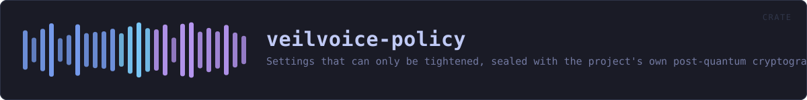
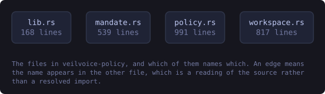
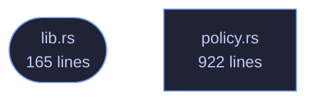

<!-- SPDX-License-Identifier: GPL-3.0-or-later -->
<!-- GENERATED by tools/docs/generate.py from the doc comments in the
     source. Do not edit this file: edit the `//!` and `///` comments in
     the .rs files and run the generator again. CI verifies it with
         python tools/docs/generate.py --check
-->

  

# veilvoice-policy

> Settings that can only be tightened, sealed with the project's own post-quantum cryptography.

## Contents

  - [The design decision this crate turns on](#the-design-decision-this-crate-turns-on)
  - [What the seal is for, and what it is not](#what-the-seal-is-for-and-what-it-is-not)
  - [Reading a policy costs nothing](#reading-a-policy-costs-nothing)
- [In plain words](#in-plain-words)
  - [How the crate fits together](#how-the-crate-fits-together)
  - [The files](#the-files)
  - [Public items](#public-items)
  - [Reading it elsewhere](#reading-it-elsewhere)

Settings somebody else decided, sealed so they cannot be edited without a
passphrase — and, more importantly, built so that editing them without one
buys nothing worth having.

## The design decision this crate turns on

A policy file has an obvious problem. To *apply* a policy at every launch,
the program has to be able to read it at every launch. If reading it needs a
passphrase, the user types one every time, and if it does not, then anybody
who can write the file can rewrite the policy.

The usual answers are a privileged daemon holding the key, or a key hidden
in the binary, and neither is honest here: this project needs no privileges,
and a key in a binary anybody can download is not a key.

So the constraint is moved into the shape of the data. **A requirement can
only make VeilVoice stricter.** There is no requirement that turns
encryption off, none that lowers the de-identification floor, none that
disables the app lock — and there is no room in `Requirement` to express
one, because every variant is a tightening and the type has no other kind.

Then somebody who edits the plain policy file without the passphrase can do
exactly one thing: make this machine's VeilVoice **more** restrictive than
its owner asked for. That is a nuisance, and it is not a privacy failure —
which is the failure this project exists to avoid. The passphrase-sealed
copy is what proves the policy is the one the administrator wrote; the
shape of the type is what makes the answer survive the seal not having been
checked yet.

## What the seal is for, and what it is not

`Policy::seal` uses the same container as everything else here — Argon2id
over the passphrase, X25519 with ML-KEM-768 for the hybrid modes,
XChaCha20-Poly1305 for the contents. `verify` opens the sealed copy and
compares it against the plain one, which is how anybody with the passphrase
establishes that the policy in force is the policy that was written.

It is **not** enforcement. Anything with write access to VeilVoice's own
executable can replace VeilVoice, and no file it reads can prevent that.
Anything running as the user can delete the policy entirely. What a sealed
policy gives is a policy that cannot be *quietly rewritten into something
weaker*, and that is a smaller claim than "enforced" on purpose. See
`SCOPE`.

Detecting deletion is `veilvoice-guard`'s job, not this one's: put the
policy files in a tamper manifest and the removal shows up there.

## Reading a policy costs nothing

`Policy::load` reads the plain file and applies it. It never asks for a
passphrase, never blocks, and reports the seal as `Verification::Unchecked`
rather than pretending to have looked. A front end that wants the stronger
statement calls `verify` when it has a passphrase to offer.

# In plain words

This lets settings be locked down, and only in one direction.

Someone setting up a machine for other people can seal a set of settings so
they can be made stricter but never looser. Nobody needs a password to read
what the rules are -- only to change them -- because a rule people cannot see
is a rule they will trip over.

## How the crate fits together

Every arrow below is a `crate::` or `super::` path one module actually
uses, read out of the source by the generator rather than drawn by
hand. A dependency that goes away loses its arrow the next time this
file is written.

  

The same graph as Mermaid source

## The files

| File | Lines | What it is |
|---|---:|---|
| [`lib.rs`](../../docs/files/veilvoice-policy/lib.md) | 165 | Settings somebody else decided, sealed so they cannot be edited without a passphrase — and, more importantly, built so that editing them without one buys nothing worth having. |
| [`policy.rs`](../../docs/files/veilvoice-policy/policy.md) | 922 | The policy itself: what can be required, and what requiring it does. |

## Public items

| Item | Where | What |
|---|---|---|
| `const VERSION` | [`lib.rs`](../../docs/files/veilvoice-policy/lib.md) | Crate version string, surfaced in the About panel. |
| `const SCOPE` | [`lib.rs`](../../docs/files/veilvoice-policy/lib.md) | What a sealed policy is worth, in the words a front end should show. |
| `enum Error` | [`lib.rs`](../../docs/files/veilvoice-policy/lib.md) | Everything that can go wrong in this crate. |
| `const PLAIN_FILE` | [`policy.rs`](../../docs/files/veilvoice-policy/policy.md) | The plain policy, read at every launch and needing no passphrase. |
| `const SEALED_FILE` | [`policy.rs`](../../docs/files/veilvoice-policy/policy.md) | The same policy sealed under a passphrase, for proving the plain one is what was written. |
| `enum Requirement` | [`policy.rs`](../../docs/files/veilvoice-policy/policy.md) | One thing a policy can insist on. |
| `struct Posture` | [`policy.rs`](../../docs/files/veilvoice-policy/policy.md) | The settings a policy can reach, as a front end holds them. |
| `struct Policy` | [`policy.rs`](../../docs/files/veilvoice-policy/policy.md) | A set of requirements, and an optional note from whoever wrote them. |
| `enum Verification` | [`policy.rs`](../../docs/files/veilvoice-policy/policy.md) | What is known about the seal on a policy. |
| `fn verify` | [`policy.rs`](../../docs/files/veilvoice-policy/policy.md) | Check the plain policy in dir against its sealed copy. |

## Reading it elsewhere

- On the website: [`website/reference/veilvoice-policy.html`](../../website/reference/veilvoice-policy.html)
- The audit this code is held to: [`docs/AUDIT.md`](../../docs/AUDIT.md)
- The claims and their limits: [`docs/WHITEPAPER.md`](../../docs/WHITEPAPER.md)
- Using the crates from your own project: [`docs/USING_THE_CRATES.md`](../../docs/USING_THE_CRATES.md)

Signing key fingerprint `8101FB3BB28D02FB239E0CDF9CC1C7E7A9B5833A`.
