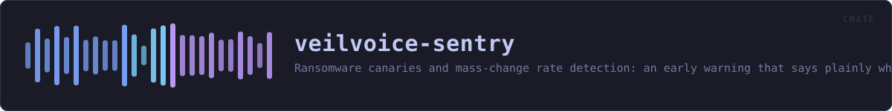
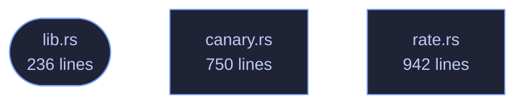

<!-- SPDX-License-Identifier: GPL-3.0-or-later -->
<!-- GENERATED by tools/docs/generate.py from the doc comments in the
     source. Do not edit this file: edit the `//!` and `///` comments in
     the .rs files and run the generator again. CI verifies it with
         python tools/docs/generate.py --check
-->

  

# veilvoice-sentry

> Ransomware canaries and mass-change rate detection: an early warning that says plainly what it cannot do.

## Contents

- [The word this crate does not use](#the-word-this-crate-does-not-use)
- [The two signals, and what each is worth](#the-two-signals-and-what-each-is-worth)
- [What it cannot tell you: who](#what-it-cannot-tell-you-who)
- [Entropy is a hint and never evidence](#entropy-is-a-hint-and-never-evidence)
- [How the crate fits together](#how-the-crate-fits-together)
- [The files](#the-files)
- [Public items](#public-items)
- [Reading it elsewhere](#reading-it-elsewhere)

An early warning that something is going through your files: decoy files
that should never change, and a measure of how fast a directory tree is
changing.

## The word this crate does not use

It does not **prevent** anything. By the time a canary has been encrypted,
whatever encrypted it has already been running for some number of seconds
and has already reached some number of real files. What this buys is the
difference between finding out now and finding out when you next open a
document — which is a real difference, and it is the whole of what is on
offer. See `SCOPE`.

Stopping a process mid-run needs an interposition point in the kernel:
`fanotify` with `FAN_OPEN_PERM` on Linux, a filesystem minifilter on
Windows. The Windows one requires a code-signing identity issued to a
verified legal entity, which this project does not have and will not get —
it is published under a pseudonym on purpose. `ROADMAP.md` records that as
a decision rather than an omission.

## The two signals, and what each is worth

**`canary` — decoy files that should never change.** A file nothing
legitimately touches is a clean signal: if its contents differ from what
was planted, something walked the directory and wrote to everything it
found. Very few false positives, and one enormous hole — it only fires if
the attacker *reaches* it. Something that encrypts only `.docx` under one
folder will never see a canary planted anywhere else, and this crate cannot
tell you that it did not fire because nothing happened.

**`rate` — how much of a tree changed, and how fast.** No blind spot, and
far weaker evidence: a restore from backup, importing a camera card, a
compiler, or a synchronisation client catching up all look exactly like a
mass rewrite, because they are one. `rate::Churn` therefore reports
numbers and a `rate::Concern` level against a threshold **you** set. It
never reports "ransomware", because it does not know that and neither does
anything else that only counts files.

Used together they are worth more than either: a canary hit *and* a high
churn rate at the same moment is a much stronger statement than either
alone. That is a judgement for the front end to present, not for this crate
to make on the user's behalf.

## What it cannot tell you: who

Nothing here names a process. Attribution needs system auditing that is
normally switched off, and it lives in `veilvoice-guard` rather than here —
`veilvoice_guard::who_touched` takes a path and usually, honestly, answers
that it does not know. This crate deliberately does not depend on that one:
a project that wants canaries should not have to take a cryptography stack
with them.

## Entropy is a hint and never evidence

`entropy` measures Shannon entropy in bits per byte, and encrypted data
sits near 8.0. So does a JPEG, a `.zip`, a video, and this project's own
`.veil` container. High entropy is only meaningful for a file whose
contents this crate *planted* and therefore knows should have been prose.
It is used for exactly that and nothing else.

## How the crate fits together

Every arrow below is a `crate::` or `super::` path one module actually
uses, read out of the source by the generator rather than drawn by
hand. A dependency that goes away loses its arrow the next time this
file is written.

## The files

| File | Lines | What it is |
|---|---:|---|
| [`canary.rs`](../../docs/files/veilvoice-sentry/canary.md) | 750 | Decoy files that should never change, and a record of what they were. |
| [`lib.rs`](../../docs/files/veilvoice-sentry/lib.md) | 236 | An early warning that something is going through your files: decoy files that should never change, and a measure of how fast a directory tree is changing. |
| [`rate.rs`](../../docs/files/veilvoice-sentry/rate.md) | 942 | How much of a directory tree changed, and how fast. |

## Public items

| Item | Where | What |
|---|---|---|
| `const DEFAULT_NAME` | [`canary.rs`](../../docs/files/veilvoice-sentry/canary.md) | The default filename for a canary. |
| `const PROSE_CEILING` | [`canary.rs`](../../docs/files/veilvoice-sentry/canary.md) | Below this, a canary that was prose has stopped being prose. |
| `struct Canary` | [`canary.rs`](../../docs/files/veilvoice-sentry/canary.md) | One planted decoy, and what it was when it was planted. |
| `enum State` | [`canary.rs`](../../docs/files/veilvoice-sentry/canary.md) | What a canary looks like now. |
| `struct Sighting` | [`canary.rs`](../../docs/files/veilvoice-sentry/canary.md) | One canary and what became of it. |
| `struct Nest` | [`canary.rs`](../../docs/files/veilvoice-sentry/canary.md) | The set of planted canaries. |
| `fn contents` | [`canary.rs`](../../docs/files/veilvoice-sentry/canary.md) | The text a canary is filled with. |
| `const VERSION` | [`lib.rs`](../../docs/files/veilvoice-sentry/lib.md) | Crate version string, surfaced in the About panel. |
| `const SCOPE` | [`lib.rs`](../../docs/files/veilvoice-sentry/lib.md) | What this crate is worth, in the words a front end should show. |
| `fn entropy` | [`lib.rs`](../../docs/files/veilvoice-sentry/lib.md) | Shannon entropy of bytes, in bits per byte, from 0.0 to 8.0. |
| `enum Error` | [`lib.rs`](../../docs/files/veilvoice-sentry/lib.md) | Everything that can go wrong in this crate. |
| `struct Facts` | [`rate.rs`](../../docs/files/veilvoice-sentry/rate.md) | What is recorded about one file. |
| `struct Limits` | [`rate.rs`](../../docs/files/veilvoice-sentry/rate.md) | How far a walk is allowed to go. |
| `struct Snapshot` | [`rate.rs`](../../docs/files/veilvoice-sentry/rate.md) | What a tree looked like at one moment. |
| `struct Churn` | [`rate.rs`](../../docs/files/veilvoice-sentry/rate.md) | The difference between two snapshots. |
| `struct Threshold` | [`rate.rs`](../../docs/files/veilvoice-sentry/rate.md) | When to raise the level, set by the user rather than guessed at here. |
| `enum Concern` | [`rate.rs`](../../docs/files/veilvoice-sentry/rate.md) | How much of the threshold a Churn met. |
| `fn concern` | [`rate.rs`](../../docs/files/veilvoice-sentry/rate.md) | Judge a Churn against a Threshold. |
| `fn baseline_name` | [`rate.rs`](../../docs/files/veilvoice-sentry/rate.md) | A stable filename for the saved snapshot of root. |
| `fn compare` | [`rate.rs`](../../docs/files/veilvoice-sentry/rate.md) | Compare two snapshots of the same tree. |

## Reading it elsewhere

- On the website: [`website/reference/veilvoice-sentry.html`](../../website/reference/veilvoice-sentry.html)
- The audit this code is held to: [`docs/AUDIT.md`](../../docs/AUDIT.md)
- The claims and their limits: [`docs/WHITEPAPER.md`](../../docs/WHITEPAPER.md)
- Using the crates from your own project: [`docs/USING_THE_CRATES.md`](../../docs/USING_THE_CRATES.md)

Signing key fingerprint `8101FB3BB28D02FB239E0CDF9CC1C7E7A9B5833A`.
