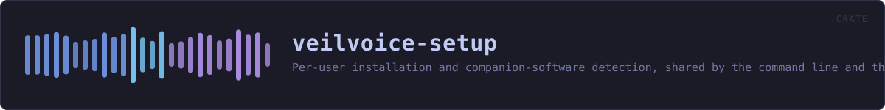
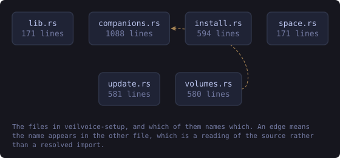
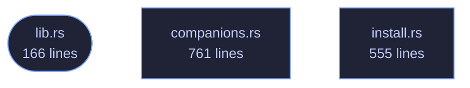

<!-- SPDX-License-Identifier: GPL-3.0-or-later -->
<!-- GENERATED by tools/docs/generate.py from the doc comments in the
     source. Do not edit this file: edit the `//!` and `///` comments in
     the .rs files and run the generator again. CI verifies it with
         python tools/docs/generate.py --check
-->

  

# veilvoice-setup

> Per-user installation and companion-software detection, shared by the command line and the desktop app.

## Contents

- [Why this is a library and not part of the command line](#why-this-is-a-library-and-not-part-of-the-command-line)
- [What it will not do](#what-it-will-not-do)
- [No unsafe, and therefore some subprocesses](#no-unsafe-and-therefore-some-subprocesses)
- [In plain words](#in-plain-words)
  - [How the crate fits together](#how-the-crate-fits-together)
  - [The files](#the-files)
  - [Public items](#public-items)
  - [Reading it elsewhere](#reading-it-elsewhere)

Everything that puts VeilVoice on a machine, and everything that reports
what is already on it. Two modules: `install` does the per-user install
and its exact reversal, `companions` finds the optional third-party
software that live mode is easier with and says who makes each piece.

# Why this is a library and not part of the command line

It was part of the command line. `install.rs` lived inside the
`veilvoice-cli` **binary** crate, which meant the desktop application could
not call a single line of it — a binary crate has no consumers. The choice
was to reimplement the installer behind the graphical front end, or to move
the logic somewhere both front ends can reach. Reimplementing it would have
produced two programs that edit `PATH`, drifting apart at whatever rate
nobody noticed, and the `PATH` edit is the one operation here that can
damage a machine.

So this crate is the installer, and both front ends are front ends. The
command line calls `install::install`; so does the desktop app's setup
tab. There is one implementation of the careful part, and one set of tests
covering it.

# What it will not do

**It never runs somebody else's installer.** `companions` reports what is
present and prepares an exact command for what is not, and where that
command is "open the vendor's download page" it says so rather than
fetching and executing an unverified binary. A project whose entire subject
is verifying what you run has no business being casual about that.

**It never asks for administrator rights.** Everything `install` does is
inside the user's own account. Where a companion genuinely needs privilege
— a system package manager, an audio driver — that fact is reported and the
command is handed over rather than run, because a graphical program cannot
honestly collect a `sudo` password and this one does not try.

**Nothing is ticked by default.** There are no checkboxes at all: each
companion is a separate, deliberate action. The rule that predates this
crate — detect, say what it is and who makes it, act only on an explicit
yes — is unchanged by the interface getting prettier.

# No `unsafe`, and therefore some subprocesses

`#![forbid(unsafe_code)]` holds here as everywhere else in the workspace,
so the Windows registry is reached through `reg.exe` rather than the Win32
API. `command` wraps every spawn so that none of them flashes a console
window when the desktop application is the caller — the defect that shipped
in v0.1.10 — and a test reads this crate's own source to catch a spawn that
forgets.

# In plain words

This installs the program, if you want it installed.

You do not have to. Unzipping it and running it is a perfectly normal way to
use it, and this says so rather than treating it as a mistake. Installing does
three small things -- copies the program into your own folder, adds it to your
PATH so typing its name works, and adds an entry so Windows can remove it --
and nothing else. No administrator rights, no service.

It also looks for the few other programs VeilVoice can work alongside, tells
you who makes each one, and installs none of them unless you say so.

## How the crate fits together

Every arrow below is a `crate::` or `super::` path one module actually
uses, read out of the source by the generator rather than drawn by
hand. A dependency that goes away loses its arrow the next time this
file is written.

  

The same graph as Mermaid source

## The files

| File | Lines | What it is |
|---|---:|---|
| [`companions.rs`](../../docs/files/veilvoice-setup/companions.md) | 761 | Optional third-party software, detected rather than assumed. |
| [`install.rs`](../../docs/files/veilvoice-setup/install.md) | 555 | Put this program somewhere the system can find it. |
| [`lib.rs`](../../docs/files/veilvoice-setup/lib.md) | 166 | Everything that puts VeilVoice on a machine, and everything that reports what is already on it. |

## Public items

| Item | Where | What |
|---|---|---|
| `enum Presence` | [`companions.rs`](../../docs/files/veilvoice-setup/companions.md) | What a probe found. |
| `enum Offer` | [`companions.rs`](../../docs/files/veilvoice-setup/companions.md) | What VeilVoice can offer to do about a companion that is not there. |
| `struct Companion` | [`companions.rs`](../../docs/files/veilvoice-setup/companions.md) | One piece of optional third-party software. |
| `const ALL` | [`companions.rs`](../../docs/files/veilvoice-setup/companions.md) | Every companion this project knows about, in the order a front end should show them. |
| `fn for_this_platform` | [`companions.rs`](../../docs/files/veilvoice-setup/companions.md) | The companions that mean anything on the platform this is running on. |
| `fn by_key` | [`companions.rs`](../../docs/files/veilvoice-setup/companions.md) | Find one by Companion::key. |
| `fn run` | [`companions.rs`](../../docs/files/veilvoice-setup/companions.md) | Run an offer, and return what it printed. |
| `fn open_page` | [`companions.rs`](../../docs/files/veilvoice-setup/companions.md) | Open a companion's own page in the user's browser. |
| `const NAME` | [`install.rs`](../../docs/files/veilvoice-setup/install.md) | The name of the directory and the uninstall entry. |
| `fn prefix` | [`install.rs`](../../docs/files/veilvoice-setup/install.md) | Where an installation goes, for this user only. |
| `fn bin_dir` | [`install.rs`](../../docs/files/veilvoice-setup/install.md) | The directory a PATH entry should point at. |
| `struct Status` | [`install.rs`](../../docs/files/veilvoice-setup/install.md) | What an installation currently looks like. |
| `fn status` | [`install.rs`](../../docs/files/veilvoice-setup/install.md) | Read the current state without changing anything. |
| `fn install` | [`install.rs`](../../docs/files/veilvoice-setup/install.md) | Install for this user. |
| `fn uninstall` | [`install.rs`](../../docs/files/veilvoice-setup/install.md) | Remove what install added. |
| `const VERSION` | [`lib.rs`](../../docs/files/veilvoice-setup/lib.md) | Crate version string, surfaced in the About panel. |

## Reading it elsewhere

- On the website: [`website/reference/veilvoice-setup.html`](../../website/reference/veilvoice-setup.html)
- The audit this code is held to: [`docs/AUDIT.md`](../../docs/AUDIT.md)
- The claims and their limits: [`docs/WHITEPAPER.md`](../../docs/WHITEPAPER.md)
- Using the crates from your own project: [`docs/USING_THE_CRATES.md`](../../docs/USING_THE_CRATES.md)

Signing key fingerprint `8101FB3BB28D02FB239E0CDF9CC1C7E7A9B5833A`.
