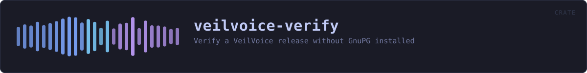
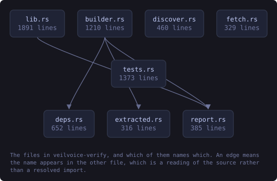
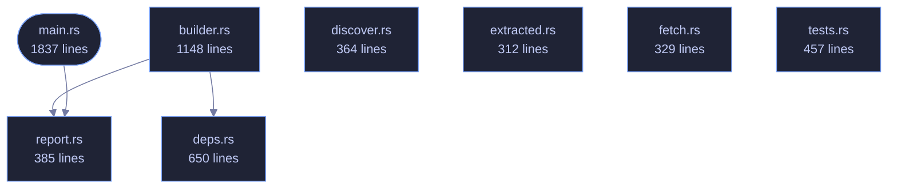

<!-- SPDX-License-Identifier: GPL-3.0-or-later -->
<!-- GENERATED by tools/docs/generate.py from the doc comments in the
     source. Do not edit this file: edit the `//!` and `///` comments in
     the .rs files and run the generator again. CI verifies it with
         python tools/docs/generate.py --check
-->

  

# veilvoice-verify

> Verify a VeilVoice release without GnuPG installed

## Contents

- [What this is for](#what-this-is-for)
- [The one thing it cannot embed](#the-one-thing-it-cannot-embed)
- [What it does not do](#what-it-does-not-do)
- [In plain words](#in-plain-words)
  - [How the crate fits together](#how-the-crate-fits-together)
  - [The files](#the-files)
  - [Public items](#public-items)
  - [Reading it elsewhere](#reading-it-elsewhere)

The portable verifier: check a VeilVoice release without GnuPG installed.

# What this is for

Verifying a download by hand needs GnuPG and a SHA-256 tool. That is four
commands and two dependencies, and on Windows it is usually neither. This
is one binary that does the same checks with nothing else installed: the
signing key and its fingerprint are compiled into it.

# The one thing it cannot embed

It cannot carry the expected hash of the file it is checking. A file cannot
contain its own digest -- writing the digest in changes the file, which
changes the digest. So the hash has to come from outside, and there are
exactly two places it can come from. They prove **different things**, and
this tool is careful never to blur them:

**From the published `SHA256SUMS`** -- whose signature this tool checks
against the embedded key. A match proves the download is *intact*: it is
byte-for-byte the file that was published, not a corrupted or substituted
one. It says nothing about whether that file corresponds to the source,
because whoever published it produced both the file and the list.

**Typed in by hand, from a hash somebody else produced** by building the
same tagged source themselves. A match proves something strictly stronger:
that the published binary is what that source compiles to, on a machine
that is not the publisher's. That is *reproducibility*, and it is the only
check that does not ultimately rest on trusting whoever signed the release.

Most people want the first. The second is what makes the first worth
anything, and it needs somebody other than the author to have done a build.
`docs/REPRODUCIBLE_BUILDS.md` says how.

# What it does not do

It does not download anything -- this project has no network code and this
binary is not the exception. Fetch the files however you like; this reads
them from disk. It does not install anything, and it writes nothing.

# In plain words

This is the small program you can check a download with before trusting
anything else here.

It is deliberately tiny and it is on its own: no window, no other pieces, and
it does not need any other software installed -- not even the usual signature
program. That matters because it is the first thing you run, and the point of
it is to be small enough to be worth reading.

Double-click it and it looks for a downloaded release nearby and checks it.
Give it arguments and it does exactly what you asked.

## How the crate fits together

Every arrow below is a `crate::` or `super::` path one module actually
uses, read out of the source by the generator rather than drawn by
hand. A dependency that goes away loses its arrow the next time this
file is written.

  

The same graph as Mermaid source

## The files

| File | Lines | What it is |
|---|---:|---|
| [`builder.rs`](../../docs/files/veilvoice-verify/builder.md) | 1148 | Build VeilVoice here, and compare what came out against what was published. |
| [`deps.rs`](../../docs/files/veilvoice-verify/deps.md) | 650 | What this machine needs before it can build VeilVoice, and who ships it. |
| [`discover.rs`](../../docs/files/veilvoice-verify/discover.md) | 364 | Finding a release to check, without being told where it is. |
| [`extracted.rs`](../../docs/files/veilvoice-verify/extracted.md) | 312 | What came out of the archive, and the GnuPG somebody already has. |
| [`fetch.rs`](../../docs/files/veilvoice-verify/fetch.md) | 329 | Download a release, without putting an HTTP client in the dependency graph. |
| [`main.rs`](../../docs/files/veilvoice-verify/main.md) | 1837 | The portable verifier: check a VeilVoice release without GnuPG installed. |
| [`report.rs`](../../docs/files/veilvoice-verify/report.md) | 385 | How much this program says, and what it returns when it says nothing. |
| [`tests.rs`](../../docs/files/veilvoice-verify/tests.md) | 457 | The verifier's own tests. |
| [`release_manifest.rs`](../../docs/files/veilvoice-verify/tests-release_manifest.md) | 208 | Marker 97. |

## Public items

| Item | Where | What |
|---|---|---|
| `const RELEASE_ARGS` | [`builder.rs`](../../docs/files/veilvoice-verify/builder.md) | The profile a release is built with. |
| `const RELEASE_DIR` | [`builder.rs`](../../docs/files/veilvoice-verify/builder.md) | Where a release build leaves its binaries, relative to the target directory. |
| `const SHIPPED` | [`builder.rs`](../../docs/files/veilvoice-verify/builder.md) | The binaries a release publishes, without any platform extension. |
| `struct Built` | [`builder.rs`](../../docs/files/veilvoice-verify/builder.md) | What a build produced. |
| `fn looks_like_the_source` | [`builder.rs`](../../docs/files/veilvoice-verify/builder.md) | Whether the source tree this is pointed at is really one. |
| `fn pinned_toolchain` | [`builder.rs`](../../docs/files/veilvoice-verify/builder.md) | The compiler version the source tree pins itself to. |
| `fn host_triple` | [`builder.rs`](../../docs/files/veilvoice-verify/builder.md) | The platform triple this build is for, as rustc names it. |
| `fn target_directory` | [`builder.rs`](../../docs/files/veilvoice-verify/builder.md) | Where this workspace's build output actually goes. |
| `struct Environment` | [`builder.rs`](../../docs/files/veilvoice-verify/builder.md) | Everything that would otherwise differ between two builds of one source. |
| `fn repro_link` | [`builder.rs`](../../docs/files/veilvoice-verify/builder.md) | Flags that make this platform's linker deterministic. |
| `fn environment` | [`builder.rs`](../../docs/files/veilvoice-verify/builder.md) | The environment the release is built in, for this tree on this machine. |
| `fn build` | [`builder.rs`](../../docs/files/veilvoice-verify/builder.md) | Run the release build. |
| `fn hash_what_was_built` | [`builder.rs`](../../docs/files/veilvoice-verify/builder.md) | Hash every binary a release ships, from a directory a build left behind. |
| `fn with_platform_extension` | [`builder.rs`](../../docs/files/veilvoice-verify/builder.md) | A binary's name on this platform. |
| `enum Compared` | [`builder.rs`](../../docs/files/veilvoice-verify/builder.md) | How a built file compared against the published list. |
| `fn compare` | [`builder.rs`](../../docs/files/veilvoice-verify/builder.md) | Compare a build against a hash list. |
| `fn all_matched` | [`builder.rs`](../../docs/files/veilvoice-verify/builder.md) | Whether every file that could be compared matched. |
| `fn report_dependencies` | [`builder.rs`](../../docs/files/veilvoice-verify/builder.md) | Report what a dependency check found. |
| `fn install` | [`builder.rs`](../../docs/files/veilvoice-verify/builder.md) | Run one install command, having been told yes. |
| `fn agreed` | [`builder.rs`](../../docs/files/veilvoice-verify/builder.md) | Ask, and take only an unambiguous yes. |
| `fn status_for` | [`builder.rs`](../../docs/files/veilvoice-verify/builder.md) | The status a comparison should exit with. |
| `enum Presence` | [`deps.rs`](../../docs/files/veilvoice-verify/deps.md) | Whether a dependency is here, missing, or unanswerable. |
| `enum Route` | [`deps.rs`](../../docs/files/veilvoice-verify/deps.md) | What could be done about a missing dependency, on this machine. |
| `struct Need` | [`deps.rs`](../../docs/files/veilvoice-verify/deps.md) | One thing a build needs. |
| `const ALL` | [`deps.rs`](../../docs/files/veilvoice-verify/deps.md) | Everything a build can need, on every platform. |
| `fn for_this_platform` | [`deps.rs`](../../docs/files/veilvoice-verify/deps.md) | What this platform needs, in the order to report them. |
| `fn missing` | [`deps.rs`](../../docs/files/veilvoice-verify/deps.md) | What is missing, split by whether a build stops without it. |
| `const SUMS` | [`discover.rs`](../../docs/files/veilvoice-verify/discover.md) | The names of the two files a signed release carries beside its archives. |
| `const SUMS_SIG` | [`discover.rs`](../../docs/files/veilvoice-verify/discover.md) | The detached signature over SUMS. |
| `const CONTENTS` | [`discover.rs`](../../docs/files/veilvoice-verify/discover.md) | The list of what is inside each archive, itself covered by SUMS. |
| `struct Found` | [`discover.rs`](../../docs/files/veilvoice-verify/discover.md) | What was found in one directory. |
| `fn looks_like_archive` | [`discover.rs`](../../docs/files/veilvoice-verify/discover.md) | Whether a filename looks like one of this project's release archives. |
| `fn look_in` | [`discover.rs`](../../docs/files/veilvoice-verify/discover.md) | Look in one directory, one level deep. |
| `fn places` | [`discover.rs`](../../docs/files/veilvoice-verify/discover.md) | Every place worth looking, in order, without duplicates. |
| `fn search` | [`discover.rs`](../../docs/files/veilvoice-verify/discover.md) | Look everywhere worth looking and return the first directory that holds a complete, checkable set, or, failing that, everything that turned up. |
| `const PROGRAMS` | [`extracted.rs`](../../docs/files/veilvoice-verify/extracted.md) | The programs a release archive carries. |
| `struct Program` | [`extracted.rs`](../../docs/files/veilvoice-verify/extracted.md) | One program found in an extracted directory. |
| `struct Extracted` | [`extracted.rs`](../../docs/files/veilvoice-verify/extracted.md) | What an extracted directory turned out to hold. |
| `fn directory_for` | [`extracted.rs`](../../docs/files/veilvoice-verify/extracted.md) | The directory an archive would extract into, by this project's naming. |
| `fn look_in` | [`extracted.rs`](../../docs/files/veilvoice-verify/extracted.md) | Look in directory for the programs a release carries. |
| `const HOST` | [`fetch.rs`](../../docs/files/veilvoice-verify/fetch.md) | The only host this will ever talk to. |
| `const REPO` | [`fetch.rs`](../../docs/files/veilvoice-verify/fetch.md) | The repository releases are fetched from. |
| `const MAX_BYTES` | [`fetch.rs`](../../docs/files/veilvoice-verify/fetch.md) | The largest file this will accept. |
| `fn no_downloader_message` | [`fetch.rs`](../../docs/files/veilvoice-verify/fetch.md) | Say what could not be found, and what to do instead. |
| `fn download` | [`fetch.rs`](../../docs/files/veilvoice-verify/fetch.md) | Fetch one URL into into. |
| `fn asset_url` | [`fetch.rs`](../../docs/files/veilvoice-verify/fetch.md) | The URL of one file in one release. |
| `const SUMS` | [`fetch.rs`](../../docs/files/veilvoice-verify/fetch.md) | The three files every release publishes for checking itself. |
| `const SIGNATURE` | [`fetch.rs`](../../docs/files/veilvoice-verify/fetch.md) |  |
| `fn valid_tag` | [`fetch.rs`](../../docs/files/veilvoice-verify/fetch.md) | A release tag, rejected unless it looks like one. |
| `fn valid_asset` | [`fetch.rs`](../../docs/files/veilvoice-verify/fetch.md) | An asset filename, rejected unless it looks like one. |
| `fn set_level` | [`report.rs`](../../docs/files/veilvoice-verify/report.md) | Set the level. |
| `fn level` | [`report.rs`](../../docs/files/veilvoice-verify/report.md) | The level in force. |
| `enum Status` | [`report.rs`](../../docs/files/veilvoice-verify/report.md) | What happened, as a number a script can read. |
| `enum Loudness` | [`report.rs`](../../docs/files/veilvoice-verify/report.md) | How much to print. |

## Reading it elsewhere

- On the website: [`website/reference/veilvoice-verify.html`](../../website/reference/veilvoice-verify.html)
- The audit this code is held to: [`docs/AUDIT.md`](../../docs/AUDIT.md)
- The claims and their limits: [`docs/WHITEPAPER.md`](../../docs/WHITEPAPER.md)
- Using the crates from your own project: [`docs/USING_THE_CRATES.md`](../../docs/USING_THE_CRATES.md)

Signing key fingerprint `8101FB3BB28D02FB239E0CDF9CC1C7E7A9B5833A`.
