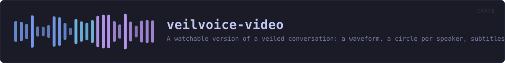
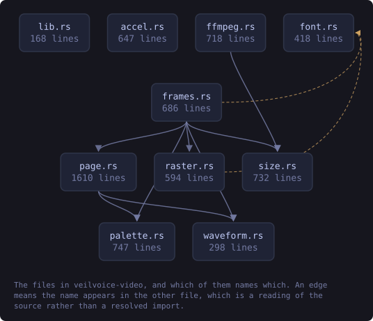
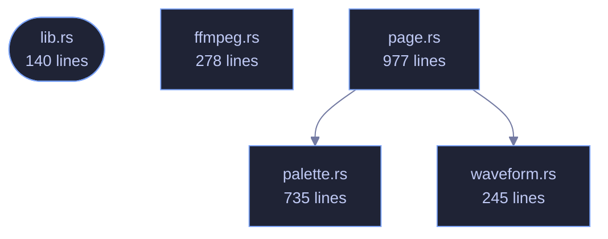

<!-- SPDX-License-Identifier: GPL-3.0-or-later -->
<!-- GENERATED by tools/docs/generate.py from the doc comments in the
     source. Do not edit this file: edit the `//!` and `///` comments in
     the .rs files and run the generator again. CI verifies it with
         python tools/docs/generate.py --check
-->

  

# veilvoice-video

> A watchable version of a veiled conversation: a waveform, a circle per speaker, subtitles, and an honest account of what needs ffmpeg.

## Contents

  - [What this produces, and what needs something else](#what-this-produces-and-what-needs-something-else)
  - [The page needs a little JavaScript, and says so](#the-page-needs-a-little-javascript-and-says-so)
  - [A picture is not veiled](#a-picture-is-not-veiled)
- [In plain words](#in-plain-words)
  - [How the crate fits together](#how-the-crate-fits-together)
  - [The files](#the-files)
  - [Public items](#public-items)
  - [Reading it elsewhere](#reading-it-elsewhere)

A watchable version of a veiled conversation: the waveform, a circle per
speaker, the title, the subtitles, and a background.

## What this produces, and what needs something else

**A self-contained page, always.** `page::player` writes one HTML file
that plays the veiled audio, draws its waveform, lights each speaker's
circle as they talk and shows the subtitles. It needs nothing installed, it
contacts nothing, it opens in any browser on any device, and it is what this
crate is for.

**A video file, only if `ffmpeg` is there.** Turning a few thousand frames
into an `.mp4` needs a codec, and this project ships none: writing an H.264
encoder is not a sensible thing for a voice de-identifier to do, and pulling
one in would put a large C dependency into a graph whose emptiness is a
front-page claim. So `ffmpeg` finds the tool if the machine has it and
prepares the exact command; if the machine does not, the page is still
there and nothing has failed.

VeilVoice never downloads or runs `ffmpeg` on your behalf, exactly as it
never installs any other companion.

## The page needs a little JavaScript, and says so

Lighting the right circle means knowing where the audio has got to, and only
the audio element knows that. There is a small inline script — no file, no
network, no library — and a `<noscript>` that says what it does. Without it
the audio still plays, the subtitles still appear and the waveform is still
drawn; the circles simply do not light up.

## A picture is not veiled

A speaker may have a portrait, and it is drawn exactly as supplied. Nothing
here anonymises an image: a photograph of somebody's face beside their
veiled voice identifies them completely. The default is a plain filled
circle for that reason, and `SCOPE` says it where a user will read it.

# In plain words

This draws the picture.

A waveform, a circle for each person in their own colour with their name under
it, a title, and a page that plays all of it together in a browser and needs
nothing installed.

It does not make a video file. That needs an encoder, and this project ships
none -- so it prints the command that would do it with `ffmpeg`, if you have
`ffmpeg`, and leaves running it to you.

## How the crate fits together

Every arrow below is a `crate::` or `super::` path one module actually
uses, read out of the source by the generator rather than drawn by
hand. A dependency that goes away loses its arrow the next time this
file is written.

  

The same graph as Mermaid source

## The files

| File | Lines | What it is |
|---|---:|---|
| [`ffmpeg.rs`](../../docs/files/veilvoice-video/ffmpeg.md) | 278 | The video file, which needs a codec this project does not ship. |
| [`lib.rs`](../../docs/files/veilvoice-video/lib.md) | 140 | A watchable version of a veiled conversation: the waveform, a circle per speaker, the title, the subtitles, and a background. |
| [`page.rs`](../../docs/files/veilvoice-video/page.md) | 977 | The picture: one still for a preview, and one page that plays. |
| [`palette.rs`](../../docs/files/veilvoice-video/palette.md) | 735 | Colours: the site's own tokens, and one per speaker. |
| [`waveform.rs`](../../docs/files/veilvoice-video/waveform.md) | 245 | The shape of the audio, reduced to something a page can draw. |

## Public items

| Item | Where | What |
|---|---|---|
| `fn found` | [`ffmpeg.rs`](../../docs/files/veilvoice-video/ffmpeg.md) | Where ffmpeg is, if this machine has one. |
| `struct Encoding` | [`ffmpeg.rs`](../../docs/files/veilvoice-video/ffmpeg.md) | How to render the file. |
| `fn command` | [`ffmpeg.rs`](../../docs/files/veilvoice-video/ffmpeg.md) | The command that turns a directory of numbered frames and a WAV into a video file. |
| `fn command_line` | [`ffmpeg.rs`](../../docs/files/veilvoice-video/ffmpeg.md) | The command as one line, for printing. |
| `fn describe` | [`ffmpeg.rs`](../../docs/files/veilvoice-video/ffmpeg.md) | What to tell the user about their machine's ffmpeg. |
| `const VERSION` | [`lib.rs`](../../docs/files/veilvoice-video/lib.md) | Crate version string, surfaced in the About panel. |
| `const SCOPE` | [`lib.rs`](../../docs/files/veilvoice-video/lib.md) | What a rendered video is worth, in the words a front end should show. |
| `enum Error` | [`lib.rs`](../../docs/files/veilvoice-video/lib.md) | Everything that can go wrong in this crate. |
| `struct Look` | [`page.rs`](../../docs/files/veilvoice-video/page.md) | What the picture looks like. |
| `enum Background` | [`page.rs`](../../docs/files/veilvoice-video/page.md) | What sits behind the picture. |
| `struct Layout` | [`page.rs`](../../docs/files/veilvoice-video/page.md) | Where each part of the picture goes. |
| `fn layout` | [`page.rs`](../../docs/files/veilvoice-video/page.md) | Work out the layout for a look and a number of speakers. |
| `fn escape` | [`page.rs`](../../docs/files/veilvoice-video/page.md) | Escape text for markup. |
| `fn data_uri` | [`page.rs`](../../docs/files/veilvoice-video/page.md) | Read an image and turn it into a data: URI. |
| `struct Drawn` | [`page.rs`](../../docs/files/veilvoice-video/page.md) | What a render produced, and anything the user should know about it. |
| `fn still` | [`page.rs`](../../docs/files/veilvoice-video/page.md) | A single frame, as standalone SVG. |
| `fn player` | [`page.rs`](../../docs/files/veilvoice-video/page.md) | The self-contained page that plays. |
| `const BG` | [`palette.rs`](../../docs/files/veilvoice-video/palette.md) | The page background. |
| `const BG_INSET` | [`palette.rs`](../../docs/files/veilvoice-video/palette.md) | A panel or inset behind the waveform. |
| `const BORDER` | [`palette.rs`](../../docs/files/veilvoice-video/palette.md) | Hairlines and dividers. |
| `const FG` | [`palette.rs`](../../docs/files/veilvoice-video/palette.md) | Body text. |
| `const MUTED` | [`palette.rs`](../../docs/files/veilvoice-video/palette.md) | Secondary text. |
| `struct Palette` | [`palette.rs`](../../docs/files/veilvoice-video/palette.md) | One complete colour scheme, matching one data-theme block in website/css/themes.css and one entry in veilvoice-gui's theme table. |
| `const PALETTES` | [`palette.rs`](../../docs/files/veilvoice-video/palette.md) | Every palette, in the order the pickers show them. |
| `const DEFAULT_ID` | [`palette.rs`](../../docs/files/veilvoice-video/palette.md) | The palette a render uses unless one is named. |
| `fn by_id` | [`palette.rs`](../../docs/files/veilvoice-video/palette.md) | The palette with this identifier. |
| `fn default_palette` | [`palette.rs`](../../docs/files/veilvoice-video/palette.md) | The default palette. |
| `fn ids` | [`palette.rs`](../../docs/files/veilvoice-video/palette.md) | Every identifier, for an error message or a picker. |
| `const SPEAKERS` | [`palette.rs`](../../docs/files/veilvoice-video/palette.md) | The ten speaker colours, in the order slots are handed out. |
| `fn speaker` | [`palette.rs`](../../docs/files/veilvoice-video/palette.md) | The colour for a speaker slot. |
| `fn distance` | [`palette.rs`](../../docs/files/veilvoice-video/palette.md) | How far apart two colours look, by the "redmean" approximation. |
| `fn rgb` | [`palette.rs`](../../docs/files/veilvoice-video/palette.md) | Parse #rrggbb into its three channels. |
| `fn luminance` | [`palette.rs`](../../docs/files/veilvoice-video/palette.md) | Relative luminance, as WCAG defines it, from 0.0 to 1.0. |
| `fn contrast` | [`palette.rs`](../../docs/files/veilvoice-video/palette.md) | The contrast ratio between two colours, from 1.0 to 21.0. |
| `fn ink_on` | [`palette.rs`](../../docs/files/veilvoice-video/palette.md) | Black or white, whichever is readable on background. |
| `struct Envelope` | [`waveform.rs`](../../docs/files/veilvoice-video/waveform.md) | The peak envelope of a signal: one minimum and one maximum per column. |
| `fn envelope` | [`waveform.rs`](../../docs/files/veilvoice-video/waveform.md) | Reduce samples to columns peak pairs. |
| `fn svg_path` | [`waveform.rs`](../../docs/files/veilvoice-video/waveform.md) | The envelope as an SVG path, filled, inside a box. |

## Reading it elsewhere

- On the website: [`website/reference/veilvoice-video.html`](../../website/reference/veilvoice-video.html)
- The audit this code is held to: [`docs/AUDIT.md`](../../docs/AUDIT.md)
- The claims and their limits: [`docs/WHITEPAPER.md`](../../docs/WHITEPAPER.md)
- Using the crates from your own project: [`docs/USING_THE_CRATES.md`](../../docs/USING_THE_CRATES.md)

Signing key fingerprint `8101FB3BB28D02FB239E0CDF9CC1C7E7A9B5833A`.
