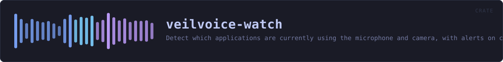
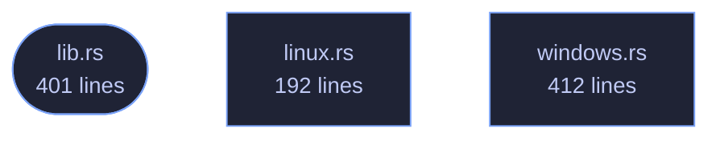

<!-- SPDX-License-Identifier: GPL-3.0-or-later -->
<!-- GENERATED by tools/docs/generate.py from the doc comments in the
     source. Do not edit this file: edit the `//!` and `///` comments in
     the .rs files and run the generator again. CI verifies it with
         python tools/docs/generate.py --check
-->

  

# veilvoice-watch

> Detect which applications are currently using the microphone and camera, with alerts on change.

## Contents

- [Why this belongs in a voice-privacy tool](#why-this-belongs-in-a-voice-privacy-tool)
- [What it can actually see, per platform](#what-it-can-actually-see-per-platform)
- [How the crate fits together](#how-the-crate-fits-together)
- [The files](#the-files)
- [Public items](#public-items)
- [Reading it elsewhere](#reading-it-elsewhere)

Find out which applications are using your microphone and camera, right now.

## Why this belongs in a voice-privacy tool

VeilVoice protects the audio you choose to send. This answers a different
and more basic question: *is something listening that you did not choose?*
A de-identified voice on a call is worth very little if a second program is
recording the raw microphone at the same time.

Operating systems have grown indicators for this — the orange dot, the
taskbar icon — but they are small, easily missed, and tell you only that
*something* is active, rarely what. This reports the process, its PID and
how long it has held the device.

## What it can actually see, per platform

Detection is honest about its limits, because a monitor that quietly sees
nothing is worse than no monitor at all — it produces false confidence.
`support` reports what the current platform can do before you rely on it.

| Platform | Microphone | Camera | How |
|---|---|---|---|
| Windows | ✅ | ✅ | The same `CapabilityAccessManager` records the OS privacy indicator uses |
| Linux | ✅ | ✅ | `/proc/*/fd` handles open on `/dev/snd/pcm*` and `/dev/video*` |
| macOS | ❌ | ❌ | No public API exposes it; anything claiming otherwise on macOS is guessing |

On Linux you see every process you have permission to inspect. Without root
that means your own; other users' processes are invisible, and that is a
kernel permission boundary rather than something this crate can work around.

## How the crate fits together

Every arrow below is a `crate::` or `super::` path one module actually
uses, read out of the source by the generator rather than drawn by
hand. A dependency that goes away loses its arrow the next time this
file is written.

## The files

| File | Lines | What it is |
|---|---:|---|
| [`lib.rs`](../../docs/files/veilvoice-watch/lib.md) | 401 | Find out which applications are using your microphone and camera, right now. |
| [`linux.rs`](../../docs/files/veilvoice-watch/linux.md) | 192 | Linux detection, via open file handles in /proc. |
| [`windows.rs`](../../docs/files/veilvoice-watch/windows.md) | 412 | Windows detection, via the Capability Access Manager. |
| [`scan_once.rs`](../../docs/files/veilvoice-watch/examples-scan_once.md) | 22 | Print what is using the microphone and camera right now. |

## Public items

| Item | Where | What |
|---|---|---|
| `const VERSION` | [`lib.rs`](../../docs/files/veilvoice-watch/lib.md) | Crate version string, surfaced in the About panel. |
| `enum DeviceKind` | [`lib.rs`](../../docs/files/veilvoice-watch/lib.md) | The kind of device being used. |
| `struct DeviceUse` | [`lib.rs`](../../docs/files/veilvoice-watch/lib.md) | One application holding one device. |
| `struct Support` | [`lib.rs`](../../docs/files/veilvoice-watch/lib.md) | What detection is possible here. |
| `fn support` | [`lib.rs`](../../docs/files/veilvoice-watch/lib.md) | Report what this platform can detect. |
| `enum Error` | [`lib.rs`](../../docs/files/veilvoice-watch/lib.md) | Everything that can go wrong here. |
| `fn scan` | [`lib.rs`](../../docs/files/veilvoice-watch/lib.md) | Take one snapshot of what is currently using the microphone and camera. |
| `enum Change` | [`lib.rs`](../../docs/files/veilvoice-watch/lib.md) | A change between two scans. |
| `struct Monitor` | [`lib.rs`](../../docs/files/veilvoice-watch/lib.md) | Watches for changes between scans. |
| `fn scan` | [`linux.rs`](../../docs/files/veilvoice-watch/linux.md) |  |
| `fn scan` | [`windows.rs`](../../docs/files/veilvoice-watch/windows.md) |  |

## Reading it elsewhere

- On the website: [`website/reference/veilvoice-watch.html`](../../website/reference/veilvoice-watch.html)
- The audit this code is held to: [`docs/AUDIT.md`](../../docs/AUDIT.md)
- The claims and their limits: [`docs/WHITEPAPER.md`](../../docs/WHITEPAPER.md)
- Using the crates from your own project: [`docs/USING_THE_CRATES.md`](../../docs/USING_THE_CRATES.md)

Signing key fingerprint `8101FB3BB28D02FB239E0CDF9CC1C7E7A9B5833A`.
