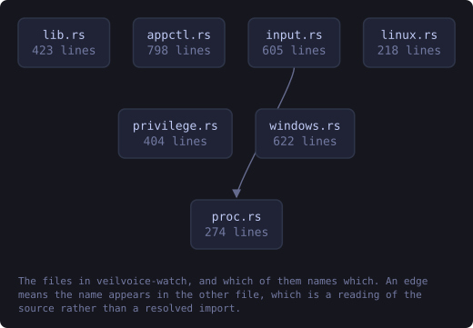
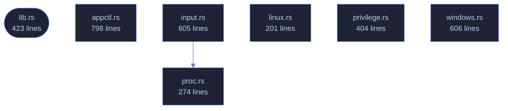

<!-- SPDX-License-Identifier: GPL-3.0-or-later -->
<!-- GENERATED by tools/docs/generate.py from the doc comments in the
     source. Do not edit this file: edit the `//!` and `///` comments in
     the .rs files and run the generator again. CI verifies it with
         python tools/docs/generate.py --check
-->

  

# veilvoice-watch

> Detect which applications are currently using the microphone and camera, with alerts on change.

## Contents

  - [Why this belongs in a voice-privacy tool](#why-this-belongs-in-a-voice-privacy-tool)
  - [What it can actually see, per platform](#what-it-can-actually-see-per-platform)
- [In plain words](#in-plain-words)
  - [How the crate fits together](#how-the-crate-fits-together)
  - [The files](#the-files)
  - [Public items](#public-items)
  - [Reading it elsewhere](#reading-it-elsewhere)

Find out which applications are using your microphone and camera, right now.

## Why this belongs in a voice-privacy tool

VeilVoice protects the audio you choose to send. This answers a different
and more basic question: *is something listening that you did not choose?*
A de-identified voice on a call is worth very little if a second program is
recording the raw microphone at the same time.

Operating systems have grown indicators for this, the orange dot and the
taskbar icon, but they are small, easily missed, and tell you only that
*something* is active, rarely what. This reports the process, its PID and
how long it has held the device.

## What it can actually see, per platform

Detection is honest about its limits, because a monitor that quietly sees
nothing is worse than no monitor at all, because it produces false confidence.
`support` reports what the current platform can do before you rely on it.

| Platform | Microphone | Camera | How |
|---|---|---|---|
| Windows | ✅ | ✅ | The same `CapabilityAccessManager` records the OS privacy indicator uses |
| Linux | ✅ | ✅ | `/proc/*/fd` handles open on `/dev/snd/pcm*` and `/dev/video*` |
| macOS | ❌ | ❌ | No public API exposes it; anything claiming otherwise on macOS is guessing |

On Linux you see every process you have permission to inspect. Without root
that means your own; other users' processes are invisible, and that is a
kernel permission boundary rather than something this crate can work around.

# In plain words

This tells you when something is using your microphone or camera.

Not what it is doing with them -- just that a program has them open, and which
program. That is worth knowing before you start talking, and it is the kind of
thing an operating system knows and does not always show you.

It cannot see everything. Some ways of getting at a microphone do not go past
the place this reads.

## How the crate fits together

Every arrow below is a `crate::` or `super::` path one module actually
uses, read out of the source by the generator rather than drawn by
hand. A dependency that goes away loses its arrow the next time this
file is written.

  

The same graph as Mermaid source

## The files

| File | Lines | What it is |
|---|---:|---|
| [`appctl.rs`](../../docs/files/veilvoice-watch/appctl.md) | 798 | Learn what normally runs on this machine, then notice what does not. |
| [`input.rs`](../../docs/files/veilvoice-watch/input.md) | 605 | What on this machine could be watching the keyboard and the mouse. |
| [`lib.rs`](../../docs/files/veilvoice-watch/lib.md) | 423 | Find out which applications are using your microphone and camera, right now. |
| [`linux.rs`](../../docs/files/veilvoice-watch/linux.md) | 201 | Linux detection, via open file handles in /proc. |
| [`privilege.rs`](../../docs/files/veilvoice-watch/privilege.md) | 404 | What privilege VeilVoice is running with, and what each level can actually see. |
| [`proc.rs`](../../docs/files/veilvoice-watch/proc.md) | 274 | Which processes are running, per platform, and what that cannot tell you. |
| [`windows.rs`](../../docs/files/veilvoice-watch/windows.md) | 606 | Windows detection, via the Capability Access Manager. |
| [`scan_once.rs`](../../docs/files/veilvoice-watch/examples-scan_once.md) | 30 | Print what is using the microphone and camera right now. |

**3,917 functional lines of Rust** in this crate. A functional line is a line
holding code: blank lines and lines holding only a comment are not counted,
and a line with code and a trailing comment counts once. That is a different
measure from the **Lines** column above, which is the length of each file and
counts blank lines and comments too. Both are produced by
`tools/loc/count.py`.

## Public items

| Item | Where | What |
|---|---|---|
| `enum Grant` | [`appctl.rs`](../../docs/files/veilvoice-watch/appctl.md) | How long a grant lasts. |
| `enum Verdict` | [`appctl.rs`](../../docs/files/veilvoice-watch/appctl.md) | What a baseline says about one program. |
| `struct Entry` | [`appctl.rs`](../../docs/files/veilvoice-watch/appctl.md) | One line of the decision log. |
| `struct Baseline` | [`appctl.rs`](../../docs/files/veilvoice-watch/appctl.md) | What normally runs here, what has been allowed, and what has been decided. |
| `enum Error` | [`appctl.rs`](../../docs/files/veilvoice-watch/appctl.md) | Why something was refused. |
| `const SCOPE` | [`appctl.rs`](../../docs/files/veilvoice-watch/appctl.md) | What a reader must be told, in the words to tell them. |
| `enum Reach` | [`input.rs`](../../docs/files/veilvoice-watch/input.md) | Why a program is in the table. |
| `struct Watcher` | [`input.rs`](../../docs/files/veilvoice-watch/input.md) | One program able to observe keyboard or mouse input. |
| `const ALL` | [`input.rs`](../../docs/files/veilvoice-watch/input.md) | Every program this build knows how to recognise. |
| `fn by_key` | [`input.rs`](../../docs/files/veilvoice-watch/input.md) | The program with this identifier. |
| `fn matching` | [`input.rs`](../../docs/files/veilvoice-watch/input.md) | The entry a process name belongs to, if any. |
| `struct Finding` | [`input.rs`](../../docs/files/veilvoice-watch/input.md) | One program found running, and how to describe it. |
| `struct Report` | [`input.rs`](../../docs/files/veilvoice-watch/input.md) | What was found, and everything that qualifies it. |
| `fn look` | [`input.rs`](../../docs/files/veilvoice-watch/input.md) | Look, and report. |
| `const LIMITS` | [`input.rs`](../../docs/files/veilvoice-watch/input.md) | What a reader must be told, in the words to tell them. |
| `const WHY_NOT_HOOKING` | [`input.rs`](../../docs/files/veilvoice-watch/input.md) | Why this crate does not watch input in order to detect input watching. |
| `const VERSION` | [`lib.rs`](../../docs/files/veilvoice-watch/lib.md) | Crate version string, surfaced in the About panel. |
| `enum DeviceKind` | [`lib.rs`](../../docs/files/veilvoice-watch/lib.md) | The kind of device being used. |
| `struct DeviceUse` | [`lib.rs`](../../docs/files/veilvoice-watch/lib.md) | One application holding one device. |
| `struct Support` | [`lib.rs`](../../docs/files/veilvoice-watch/lib.md) | What detection is possible here. |
| `fn support` | [`lib.rs`](../../docs/files/veilvoice-watch/lib.md) | Report what this platform can detect. |
| `enum Error` | [`lib.rs`](../../docs/files/veilvoice-watch/lib.md) | Everything that can go wrong here. |
| `fn scan` | [`lib.rs`](../../docs/files/veilvoice-watch/lib.md) | Take one snapshot of what is currently using the microphone and camera. |
| `enum Change` | [`lib.rs`](../../docs/files/veilvoice-watch/lib.md) | A change between two scans. |
| `struct Monitor` | [`lib.rs`](../../docs/files/veilvoice-watch/lib.md) | Watches for changes between scans. |
| `fn scan` | [`linux.rs`](../../docs/files/veilvoice-watch/linux.md) |  |
| `enum Level` | [`privilege.rs`](../../docs/files/veilvoice-watch/privilege.md) | What VeilVoice is running with. |
| `fn level` | [`privilege.rs`](../../docs/files/veilvoice-watch/privilege.md) | What VeilVoice is running with right now. |
| `fn service_installed` | [`privilege.rs`](../../docs/files/veilvoice-watch/privilege.md) | Whether a background service is installed. |
| `const NO_SERVICE` | [`privilege.rs`](../../docs/files/veilvoice-watch/privilege.md) | Why the opt-in service is not shipped, in the words to show. |
| `const NO_KERNEL` | [`privilege.rs`](../../docs/files/veilvoice-watch/privilege.md) | What kernel level would need, and why it is not here. |
| `const NEVER_ELEVATES` | [`privilege.rs`](../../docs/files/veilvoice-watch/privilege.md) | What this crate will not do, and why that is deliberate. |
| `fn running` | [`proc.rs`](../../docs/files/veilvoice-watch/proc.md) | Every process name this build can see, lower-cased and without a path. |
| `const SCOPE` | [`proc.rs`](../../docs/files/veilvoice-watch/proc.md) | What a reader has to be told, in the words to show them. |
| `fn scan` | [`windows.rs`](../../docs/files/veilvoice-watch/windows.md) |  |

## Reading it elsewhere

- On the website: [`website/reference/veilvoice-watch.html`](../../website/reference/veilvoice-watch.html)
- The audit this code is held to: [`docs/AUDIT.md`](../../docs/AUDIT.md)
- The claims and their limits: [`docs/WHITEPAPER.md`](../../docs/WHITEPAPER.md)
- Using the crates from your own project: [`docs/USING_THE_CRATES.md`](../../docs/USING_THE_CRATES.md)

Signing key fingerprint `8101FB3BB28D02FB239E0CDF9CC1C7E7A9B5833A`.
