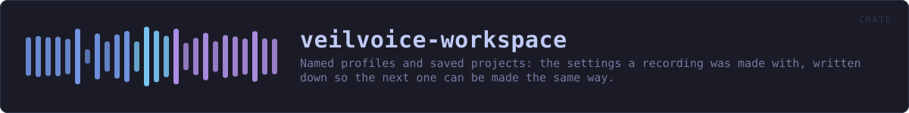
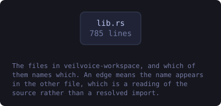

<!-- SPDX-License-Identifier: GPL-3.0-or-later -->
<!-- GENERATED by tools/docs/generate.py from the doc comments in the
     source. Do not edit this file: edit the `//!` and `///` comments in
     the .rs files and run the generator again. CI verifies it with
         python tools/docs/generate.py --check
-->

  

# veilvoice-workspace

> Named profiles and saved projects: the settings a recording was made with, written down so the next one can be made the same way.

## Contents

- [Why a project file is worth having here in particular](#why-a-project-file-is-worth-having-here-in-particular)
- [Plain text, and the same shape as a plan](#plain-text-and-the-same-shape-as-a-plan)
- [What a project file does not contain](#what-a-project-file-does-not-contain)
- [In plain words](#in-plain-words)
  - [How the crate fits together](#how-the-crate-fits-together)
  - [The files](#the-files)
  - [Public items](#public-items)
  - [Reading it elsewhere](#reading-it-elsewhere)

Named profiles and saved projects.

Two things, which sound alike and are not:

* A `Profile` is a **way of working** — a named set of settings you can
switch to. "Anonymise one person, as thoroughly as this can." "A group,
everybody the same voice." Three are built in and you can save your own.
* A `Workspace` is **one piece of work** — which recording, which plan,
who is in it and what they are called, and the profile it was done under.
Saved beside the recording, so opening it a week later puts everything
back where it was.

# Why a project file is worth having here in particular

Setting up a group recording is a dozen small decisions: who is in it, what
each is called, what colour each is drawn in, whether they share a voice.
Getting halfway through and having to stop is ordinary. Losing all of it
because the window was closed is not, and it is worse than usual here,
because the *recording* may be the only copy of something that cannot be
made again.

# Plain text, and the same shape as a plan

`VEILWORK1`, then one `key  value` per line. The same format
`veilvoice-conversation` uses for a plan, for the same reasons: it is
readable, diffable, greppable, and has no syntax in which something
surprising can hide. A project file is a description of your work; it should
not require this program to read it.

# What a project file does **not** contain

**No audio and no passwords.** It records the *path* to a recording, not the
recording, and nothing about how anything is encrypted. A workspace is a
thing you might send somebody so they can set their machine up the same way;
if it carried a passphrase, sending it would be handing over the recordings
too, and people would find that out afterwards.

Speaker names *are* in it, because the whole point is to put them back — and
a name is a name. The file says so.

# In plain words

This is the "save my project" and "load my setup" part.

Profiles are named ways of working you can flip between: one for anonymising
a single person as thoroughly as possible, one for a group where everybody
keeps their own disguised voice, one for a group where everybody sounds
identical and only the names tell you who is speaking.

A project file remembers the rest: which recording you were working on, who
is in it, what you called them and what colour each one is. Open it next
week and everything is where you left it.

It does not contain the recording itself and it does not contain any
password. It does contain the names you typed, because putting those back is
the point of it.

## How the crate fits together

Every arrow below is a `crate::` or `super::` path one module actually
uses, read out of the source by the generator rather than drawn by
hand. A dependency that goes away loses its arrow the next time this
file is written.

  

The same graph as Mermaid source

```mermaid
%%{init: {"theme":"base","themeVariables":{"background":"#1a1b26","primaryColor":"#1f2335","primaryTextColor":"#c0caf5","primaryBorderColor":"#7aa2f7","secondaryColor":"#16161e","tertiaryColor":"#16161e","lineColor":"#737aa2","textColor":"#c0caf5","mainBkg":"#1f2335","nodeBorder":"#7aa2f7","clusterBkg":"#16161e","clusterBorder":"#2f3549","fontFamily":"ui-monospace, SFMono-Regular, Consolas, monospace","fontSize":"14px"}}}%%
flowchart TD
    n_lib(["lib.rs<br/>785 lines"])
    click n_lib href "https://github.com/tilas01/veilvoice/blob/main/crates/veilvoice-workspace/src/lib.rs" "open the source"
```

## The files

| File | Lines | What it is |
|---|---:|---|
| [`lib.rs`](../../docs/files/veilvoice-workspace/lib.md) | 785 | Named profiles and saved projects. |

## Public items

| Item | Where | What |
|---|---|---|
| `enum Error` | [`lib.rs`](../../docs/files/veilvoice-workspace/lib.md) | Something that could not be read. |
| `struct Profile` | [`lib.rs`](../../docs/files/veilvoice-workspace/lib.md) | A named way of working. |
| `const INDIVIDUAL` | [`lib.rs`](../../docs/files/veilvoice-workspace/lib.md) | Anonymise one person, with everything this engine has turned on. |
| `const GROUP_VOICES` | [`lib.rs`](../../docs/files/veilvoice-workspace/lib.md) | A group, each person with their own disguised voice. |
| `const GROUP_ONE_VOICE` | [`lib.rs`](../../docs/files/veilvoice-workspace/lib.md) | A group where nobody can be picked out by sound at all. |
| `const BUILT_IN` | [`lib.rs`](../../docs/files/veilvoice-workspace/lib.md) | The profiles that ship, in the order a picker shows them. |
| `fn profile` | [`lib.rs`](../../docs/files/veilvoice-workspace/lib.md) | The profile with this identifier. |
| `fn default_profile` | [`lib.rs`](../../docs/files/veilvoice-workspace/lib.md) | The profile a fresh install starts in. |
| `struct Member` | [`lib.rs`](../../docs/files/veilvoice-workspace/lib.md) | One person in a saved project. |
| `struct Workspace` | [`lib.rs`](../../docs/files/veilvoice-workspace/lib.md) | One piece of work, saved. |

## Reading it elsewhere

- On the website: [`website/reference/veilvoice-workspace.html`](../../website/reference/veilvoice-workspace.html)
- The audit this code is held to: [`docs/AUDIT.md`](../../docs/AUDIT.md)
- The claims and their limits: [`docs/WHITEPAPER.md`](../../docs/WHITEPAPER.md)
- Using the crates from your own project: [`docs/USING_THE_CRATES.md`](../../docs/USING_THE_CRATES.md)

Signing key fingerprint `8101FB3BB28D02FB239E0CDF9CC1C7E7A9B5833A`.
