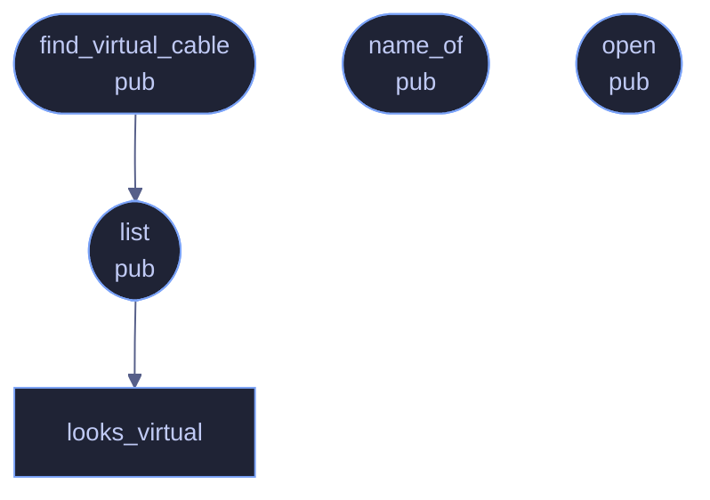

<!-- SPDX-License-Identifier: CC-BY-NC-SA-4.0 -->
<!-- GENERATED by tools/docs/generate.py from the doc comments in the
     source. Do not edit this file: edit the `//!` and `///` comments in
     the .rs files and run the generator again. CI verifies it with
         python tools/docs/generate.py --check
-->

  

# `crates/veilvoice-audio/src/devices.rs`

[`veilvoice-audio`](../../../crates/veilvoice-audio/README.md) &middot; 188 lines &middot; [read the source](https://github.com/tilas01/veilvoice/blob/main/crates/veilvoice-audio/src/devices.rs)

## Contents

- [What calls what](#what-calls-what)
- [Items](#items)

Device enumeration and virtual-cable detection.

## What calls what

The functions this file defines, and the calls between them. Both
are read out of the source: an edge means the callee's name appears,
called, inside the caller's body. It is a syntactic reading, not a
type-resolved one, so a call made through a trait object or a macro
will not appear.

## Items

| Item | Line | Documentation |
|---|---:|---|
| `Direction` pub enum | [9](https://github.com/tilas01/veilvoice/blob/main/crates/veilvoice-audio/src/devices.rs#L9) | Which direction a device carries audio. |
| `DeviceInfo` pub struct | [18](https://github.com/tilas01/veilvoice/blob/main/crates/veilvoice-audio/src/devices.rs#L18) | A device the user can choose. |
| `VIRTUAL_CABLE_HINTS` const | [34](https://github.com/tilas01/veilvoice/blob/main/crates/veilvoice-audio/src/devices.rs#L34) | Name fragments used by the common virtual audio cables. |
| `looks_virtual` fn | [46](https://github.com/tilas01/veilvoice/blob/main/crates/veilvoice-audio/src/devices.rs#L46) |  |
| `list` pub fn | [52](https://github.com/tilas01/veilvoice/blob/main/crates/veilvoice-audio/src/devices.rs#L52) | List the devices available in one direction. |
| `find_virtual_cable` pub fn | [85](https://github.com/tilas01/veilvoice/blob/main/crates/veilvoice-audio/src/devices.rs#L85) | Find the first output device that looks like a virtual audio cable. |
| `name_of` pub fn | [95](https://github.com/tilas01/veilvoice/blob/main/crates/veilvoice-audio/src/devices.rs#L95) | The name of an opened device, or a placeholder when the OS will not say. |
| `open` pub fn | [100](https://github.com/tilas01/veilvoice/blob/main/crates/veilvoice-audio/src/devices.rs#L100) | Look up a device by exact name, or the host default when name is None. |

---

Generated from `crates/veilvoice-audio/src/devices.rs`. On the website: [`website/reference/veilvoice-audio/devices.html`](../../../website/reference/veilvoice-audio/devices.html).

Signing key fingerprint `8101FB3BB28D02FB239E0CDF9CC1C7E7A9B5833A`.
