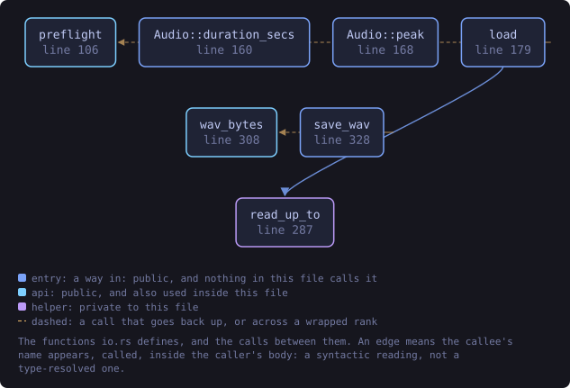
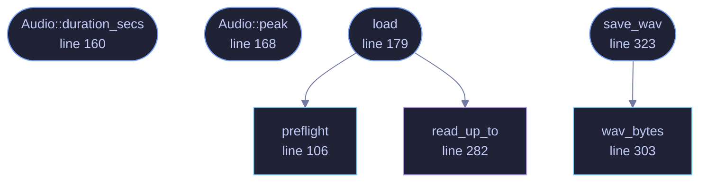

<!-- SPDX-License-Identifier: GPL-3.0-or-later -->
<!-- GENERATED by tools/docs/generate.py from the doc comments in the
     source. Do not edit this file: edit the `//!` and `///` comments in
     the .rs files and run the generator again. CI verifies it with
         python tools/docs/generate.py --check
-->

  

# `crates/veilvoice-audio/src/io.rs`

[`veilvoice-audio`](../../../crates/veilvoice-audio/README.md) &middot; 569 lines &middot; [read the source](https://github.com/tilas01/veilvoice/blob/main/crates/veilvoice-audio/src/io.rs)

## Contents

- [A decoder is a parser, and this one reads files somebody else made](#a-decoder-is-a-parser-and-this-one-reads-files-somebody-else-made)
- [Writing is WAV only, and that is a decision](#writing-is-wav-only-and-that-is-a-decision)
- [In-memory encoding, so plaintext never reaches the disk](#in-memory-encoding-so-plaintext-never-reaches-the-disk)
- [In plain words](#in-plain-words)
  - [What this file contains](#what-this-file-contains)
  - [What calls what](#what-calls-what)
  - [Items](#items)

Reading and writing audio files.

Decoding goes through `symphonia`, which is pure Rust and covers WAV, MP3,
FLAC, OGG/Vorbis, MP4/AAC and friends without shelling out to a codec
library. Writing is WAV only, on purpose: VeilVoice's job is to hand back
audio that has not been degraded, and re-encoding to a lossy format after
de-identification would throw away quality for no benefit. Callers who want
MP3 can transcode with whatever they already trust.

# A decoder is a parser, and this one reads files somebody else made

`symphonia` is the largest attacker-facing surface in this crate: it is
handed whole files of a format VeilVoice does not itself define. It is pure
Rust, which removes the memory-corruption class outright, but it does not
remove panics -- and this workspace builds with `panic = "abort"`, so a
panic inside a decoder is not an error a caller can handle, it is the
process ending.

That is why a pre-flight check runs before a file reaches the decoder, and
why the honest position is recorded in the audit rather than glossed:
decoding in a separate process is the only complete answer to "the next
malformed file in a format we do not parse ourselves", and it is not built.

# Writing is WAV only, and that is a decision

Re-encoding to a lossy format after de-identification would throw away
quality for no privacy benefit -- the voiceprint is already gone, and what
remains is the words, which is the part worth keeping intact.

# In-memory encoding, so plaintext never reaches the disk

`wav_bytes` exists so a recording can be encoded and then sealed without
ever being written in the clear. It has an awkward shape for a real reason:
`hound::WavWriter::finalize` consumes the writer, so the encode has to borrow
the cursor (`WavWriter::new(&mut cursor, spec)`) and read the bytes back
through `cursor.into_inner()` after the writer has been dropped.

# In plain words

This opens sound files and writes them back out.

It can read the usual formats, and it always writes plain WAV. That is
deliberate: WAV throws nothing away. Saving as MP3 after the voice has been
veiled would lose quality for no reason, and anybody who wants a smaller file
can convert it afterwards with whatever they already use.

Opening a sound file means reading a file somebody else made, which is the part
of any program most worth being careful in. A file that is damaged, or built on
purpose to cause trouble, is refused with a reason rather than being allowed to
bring the program down.

## What this file contains

569 lines defining **7 functions** (6 public), **1 type** and **1 constant**. Everything below is read out of the source, so it cannot disagree with the code.

**The types it owns.**

- `struct Audio` (line 151) -- Mono audio in memory.

**What happens when it runs.** These are the ways in: public, and nothing else in this file calls them, so they are what an outside caller reaches first.

- `Audio::duration_secs` (line 160) -- Duration in seconds.
- `Audio::peak` (line 168) -- Peak absolute sample value.
- `load` (line 179) -- Decode any supported audio file to mono f32.
  - reaches: `preflight`, `read_up_to`
- `save_wav` (line 323) -- Write mono f32 audio to a 16-bit PCM WAV file.
  - reaches: `wav_bytes`

## What calls what

The functions this file defines, and the calls between them. Both
are read out of the source: an edge means the callee's name appears,
called, inside the caller's body. It is a syntactic reading, not a
type-resolved one, so a call made through a trait object or a macro
will not appear.

_Colour key: **entry** -- a way in: public, and nothing in this file calls it; **api** -- public, and also used inside this file; **helper** -- private to this file._

  

The same graph as Mermaid source

## Items

| Item | Line | Documentation |
|---|---:|---|
| `MAX_DECODED_SAMPLES` pub const | [76](https://github.com/tilas01/veilvoice/blob/main/crates/veilvoice-audio/src/io.rs#L76) | The most decoded audio load will hold, in mono f32 samples. |
| `preflight` pub fn | [106](https://github.com/tilas01/veilvoice/blob/main/crates/veilvoice-audio/src/io.rs#L106) | Reject a file whose own header carries a value that will crash the decoder, before the decoder is given the file. |
| `Audio` pub struct | [151](https://github.com/tilas01/veilvoice/blob/main/crates/veilvoice-audio/src/io.rs#L151) | Mono audio in memory. |
| `Audio::duration_secs` pub fn | [160](https://github.com/tilas01/veilvoice/blob/main/crates/veilvoice-audio/src/io.rs#L160) | Duration in seconds. |
| `Audio::peak` pub fn | [168](https://github.com/tilas01/veilvoice/blob/main/crates/veilvoice-audio/src/io.rs#L168) | Peak absolute sample value. |
| `load` pub fn | [179](https://github.com/tilas01/veilvoice/blob/main/crates/veilvoice-audio/src/io.rs#L179) | Decode any supported audio file to mono f32. |
| `read_up_to` fn | [282](https://github.com/tilas01/veilvoice/blob/main/crates/veilvoice-audio/src/io.rs#L282) | Fill as much of buf as the file has, tolerating short reads. |
| `wav_bytes` pub fn | [303](https://github.com/tilas01/veilvoice/blob/main/crates/veilvoice-audio/src/io.rs#L303) | Encode mono f32 audio as a 16-bit PCM WAV, in memory. |
| `save_wav` pub fn | [323](https://github.com/tilas01/veilvoice/blob/main/crates/veilvoice-audio/src/io.rs#L323) | Write mono f32 audio to a 16-bit PCM WAV file. |

---

Generated from `crates/veilvoice-audio/src/io.rs`. On the website: [`website/reference/veilvoice-audio/io.html`](../../../website/reference/veilvoice-audio/io.html).

Signing key fingerprint `8101FB3BB28D02FB239E0CDF9CC1C7E7A9B5833A`.
