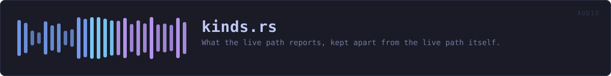
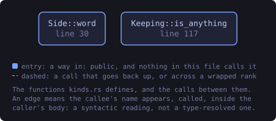
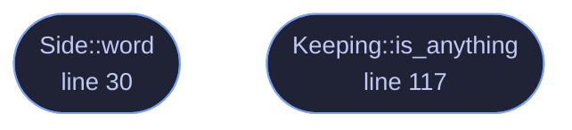

<!-- SPDX-License-Identifier: GPL-3.0-or-later -->
<!-- GENERATED by tools/docs/generate.py from the doc comments in the
     source. Do not edit this file: edit the `//!` and `///` comments in
     the .rs files and run the generator again. CI verifies it with
         python tools/docs/generate.py --check
-->

  

# `crates/veilvoice-audio/src/kinds.rs`

[`veilvoice-audio`](../../../crates/veilvoice-audio/README.md) &middot; 190 lines &middot; [read the source](https://github.com/tilas01/veilvoice/blob/main/crates/veilvoice-audio/src/kinds.rs)

## Contents

- [In plain words](#in-plain-words)
  - [What this file contains](#what-this-file-contains)
  - [What calls what](#what-calls-what)
  - [Items](#items)

What the live path reports, kept apart from the live path itself.

**Roadmap item 162.** These are plain data: which side something happened
on, what the meters read, what a session was asked to keep, what a device is
called. None of them touches `cpal`, so they are compiled whether or not the
`live` feature is on. The modules that do the capturing re-export them, so
`veilvoice_audio::live::LiveStats` is the same type in both builds, and a
front end built without live capture (the window on the BSDs) still has the
words to describe a session it cannot start.

# In plain words

The numbers and names the live microphone path reports, in a file of their
own so that a build with no microphone support still knows what they are.

## What this file contains

190 lines defining **2 functions** (2 public), **8 types** and **1 constant**. Everything below is read out of the source, so it cannot disagree with the code.

**The types it owns.**

- `enum Side` (line 21) -- Which side of the engine something happened to.
- `struct Interference` (line 51) -- Something that happened to the audio path while it was running.
- `struct LiveStats` (line 77) -- A snapshot of what the live path is doing, safe to read from the UI.
- `struct Keeping` (line 106) -- Which sides of the engine a session keeps.
- `struct GuestStats` (line 132) -- What one guest's half of a running room is doing.
- `struct RoomStats` (line 147) -- What a running room is doing, safe to read from the interface.
- `enum Direction` (line 174) -- Which direction a device carries audio.
- `struct DeviceInfo` (line 183) -- A device the user can choose.

**What happens when it runs.** These are the ways in: public, and nothing else in this file calls them, so they are what an outside caller reaches first.

- `Side::word` (line 30) -- The word for this side, as a person reading a warning would meet it.
- `Keeping::is_anything` (line 117) -- Whether anything at all is being kept.

## What calls what

The functions this file defines, and the calls between them. Both
are read out of the source: an edge means the callee's name appears,
called, inside the caller's body. It is a syntactic reading, not a
type-resolved one, so a call made through a trait object or a macro
will not appear.

_Colour key: **entry** -- a way in: public, and nothing in this file calls it._

  

The same graph as Mermaid source

## Items

| Item | Line | Documentation |
|---|---:|---|
| `Side` pub enum | [21](https://github.com/tilas01/veilvoice/blob/main/crates/veilvoice-audio/src/kinds.rs#L21) | Which side of the engine something happened to. |
| `Side::word` pub fn | [30](https://github.com/tilas01/veilvoice/blob/main/crates/veilvoice-audio/src/kinds.rs#L30) | The word for this side, as a person reading a warning would meet it. |
| `Interference` pub struct | [51](https://github.com/tilas01/veilvoice/blob/main/crates/veilvoice-audio/src/kinds.rs#L51) | Something that happened to the audio path while it was running. |
| `LiveStats` pub struct | [77](https://github.com/tilas01/veilvoice/blob/main/crates/veilvoice-audio/src/kinds.rs#L77) | A snapshot of what the live path is doing, safe to read from the UI. |
| `Keeping` pub struct | [106](https://github.com/tilas01/veilvoice/blob/main/crates/veilvoice-audio/src/kinds.rs#L106) | Which sides of the engine a session keeps. |
| `Keeping::is_anything` pub fn | [117](https://github.com/tilas01/veilvoice/blob/main/crates/veilvoice-audio/src/kinds.rs#L117) | Whether anything at all is being kept. |
| `MAX_GUESTS` pub const | [128](https://github.com/tilas01/veilvoice/blob/main/crates/veilvoice-audio/src/kinds.rs#L128) | The most microphones one room will open at once. |
| `GuestStats` pub struct | [132](https://github.com/tilas01/veilvoice/blob/main/crates/veilvoice-audio/src/kinds.rs#L132) | What one guest's half of a running room is doing. |
| `RoomStats` pub struct | [147](https://github.com/tilas01/veilvoice/blob/main/crates/veilvoice-audio/src/kinds.rs#L147) | What a running room is doing, safe to read from the interface. |
| `Direction` pub enum | [174](https://github.com/tilas01/veilvoice/blob/main/crates/veilvoice-audio/src/kinds.rs#L174) | Which direction a device carries audio. |
| `DeviceInfo` pub struct | [183](https://github.com/tilas01/veilvoice/blob/main/crates/veilvoice-audio/src/kinds.rs#L183) | A device the user can choose. |

---

Generated from `crates/veilvoice-audio/src/kinds.rs`. On the website: [`website/reference/veilvoice-audio/kinds.html`](../../../website/reference/veilvoice-audio/kinds.html).

Signing key fingerprint `8101FB3BB28D02FB239E0CDF9CC1C7E7A9B5833A`.
