<!-- SPDX-License-Identifier: GPL-3.0-or-later -->
<!-- GENERATED by tools/docs/generate.py from the doc comments in the
     source. Do not edit this file: edit the `//!` and `///` comments in
     the .rs files and run the generator again. CI verifies it with
         python tools/docs/generate.py --check
-->

  

# `crates/veilvoice-audio/src/live.rs`

[`veilvoice-audio`](../../../crates/veilvoice-audio/README.md) &middot; 586 lines &middot; [read the source](https://github.com/tilas01/veilvoice/blob/main/crates/veilvoice-audio/src/live.rs)

## Contents

- [Structure](#structure)
- [Rules the callbacks follow](#rules-the-callbacks-follow)
- [Latency](#latency)
- [In plain words](#in-plain-words)
  - [What this file contains](#what-this-file-contains)
  - [What calls what](#what-calls-what)
  - [Items](#items)

Live microphone scrambling.

# Structure

Capture and playback run as two independent callbacks driven by the audio
hardware, joined by a lock-free SPSC ring buffer. The de-identification runs
inside the *output* callback, which is the shortest path: adding a worker
thread would mean a second buffer and a second scheduling delay for no
benefit, and `veilvoice_core::Deidentifier::process` is explicitly
allocation-free and safe to call from an audio callback.

# Rules the callbacks follow

An audio callback that blocks produces a dropout, so neither callback ever
allocates, locks, or waits. Statistics are published through a mutex the
callback only ever *tries* to take: if the UI thread happens to hold it, the
update is skipped rather than the audio stalling.

# Latency

Total latency is the input buffer, plus the ring backlog, plus the engine's
one-frame group delay (~21 ms at the defaults), plus the output buffer. The
ring is intentionally short, enough to absorb jitter between two clocks
that are not synchronised, not enough to accumulate a delay the user would
notice while speaking.

# In plain words

This is live mode: your microphone in one end, a voice that is not yours out
the other, fast enough to hold a conversation.

Sound arrives from the microphone in small pieces, and each one has to be dealt
with before the next arrives. There is no room to be late. So the veiling
happens on the same short path the sound is already travelling, with nothing
queued up behind it and nothing that could pause to allocate memory or wait for
another part of the program.

If the computer ever cannot keep up, that is counted and shown rather than
hidden. A gap in the sound you can see explained is far better than one you
cannot.

## What this file contains

586 lines defining **7 functions** (6 public), **7 types** and **1 constant**. Everything below is read out of the source, so it cannot disagree with the code.

**The types it owns.**

- `enum Side` (line 56) -- Which side of the engine something happened to.
- `struct Interference` (line 86) -- Something that happened to the audio path while it was running.
- `struct LiveStats` (line 104) -- A snapshot of what the live path is doing, safe to read from the UI.
- `struct Keeping` (line 133) -- Which sides of the engine a session keeps.
- `struct Kept` (line 156) -- The recorders a session was asked for, one per side of Keeping.
- `struct LiveSession` (line 164) -- A running live-scramble session.
- `struct Shared` (line 172)

**What happens when it runs.** These are the ways in: public, and nothing else in this file calls them, so they are what an outside caller reaches first.

- `Side::word` (line 65) -- The word for this side, as a person reading a warning would meet it.
- `Keeping::is_anything` (line 144) -- Whether anything at all is being kept.
- `LiveSession::start` (line 213) -- Start scrambling from input into output.
  - reaches: `start_recording`
- `LiveSession::stats` (line 429) -- Read the current statistics, resetting the peak meters.
- `LiveSession::interference` (line 448) -- What the platform last reported about either stream.

## What calls what

The functions this file defines, and the calls between them. Both
are read out of the source: an edge means the callee's name appears,
called, inside the caller's body. It is a syntactic reading, not a
type-resolved one, so a call made through a trait object or a macro
will not appear.

_Colour key: **entry** -- a way in: public, and nothing in this file calls it; **api** -- public, and also used inside this file; **helper** -- private to this file._

  

The same graph as Mermaid source

```mermaid
%%{init: {"theme":"base","themeVariables":{"background":"#1a1b26","primaryColor":"#1f2335","primaryTextColor":"#c0caf5","primaryBorderColor":"#7aa2f7","secondaryColor":"#16161e","tertiaryColor":"#16161e","lineColor":"#737aa2","textColor":"#c0caf5","mainBkg":"#1f2335","nodeBorder":"#7aa2f7","clusterBkg":"#16161e","clusterBorder":"#2f3549","fontFamily":"ui-monospace, SFMono-Regular, Consolas, monospace","fontSize":"14px"}}}%%
flowchart TD
    n_word(["Side::word<br/>line 65"])
    n_is_anything(["Keeping::is_anything<br/>line 144"])
    n_report["Shared::report<br/>line 190"]
    n_start(["LiveSession::start<br/>line 213"])
    n_start_recording["LiveSession::start_recording<br/>line 255"]
    n_stats(["LiveSession::stats<br/>line 429"])
    n_interference(["LiveSession::interference<br/>line 448"])
    n_start --> n_start_recording
    click n_word href "https://github.com/tilas01/veilvoice/blob/main/crates/veilvoice-audio/src/live.rs#L65" "open the source"
    click n_is_anything href "https://github.com/tilas01/veilvoice/blob/main/crates/veilvoice-audio/src/live.rs#L144" "open the source"
    click n_report href "https://github.com/tilas01/veilvoice/blob/main/crates/veilvoice-audio/src/live.rs#L190" "open the source"
    click n_start href "https://github.com/tilas01/veilvoice/blob/main/crates/veilvoice-audio/src/live.rs#L213" "open the source"
    click n_start_recording href "https://github.com/tilas01/veilvoice/blob/main/crates/veilvoice-audio/src/live.rs#L255" "open the source"
    click n_stats href "https://github.com/tilas01/veilvoice/blob/main/crates/veilvoice-audio/src/live.rs#L429" "open the source"
    click n_interference href "https://github.com/tilas01/veilvoice/blob/main/crates/veilvoice-audio/src/live.rs#L448" "open the source"
    classDef entry fill:#1f2335,stroke:#7aa2f7,color:#c0caf5
    class n_word,n_is_anything,n_start,n_stats,n_interference entry
    classDef api fill:#1f2335,stroke:#7dcfff,color:#c0caf5
    class n_start_recording api
    classDef helper fill:#1f2335,stroke:#bb9af7,color:#c0caf5
    class n_report helper
```

## Items

| Item | Line | Documentation |
|---|---:|---|
| `RING_MILLIS` const | [52](https://github.com/tilas01/veilvoice/blob/main/crates/veilvoice-audio/src/live.rs#L52) | How much jitter the ring absorbs before it starts dropping samples. |
| `Side` pub enum | [56](https://github.com/tilas01/veilvoice/blob/main/crates/veilvoice-audio/src/live.rs#L56) | Which side of the engine something happened to. |
| `Side::word` pub fn | [65](https://github.com/tilas01/veilvoice/blob/main/crates/veilvoice-audio/src/live.rs#L65) | The word for this side, as a person reading a warning would meet it. |
| `Interference` pub struct | [86](https://github.com/tilas01/veilvoice/blob/main/crates/veilvoice-audio/src/live.rs#L86) | Something that happened to the audio path while it was running. |
| `LiveStats` pub struct | [104](https://github.com/tilas01/veilvoice/blob/main/crates/veilvoice-audio/src/live.rs#L104) | A snapshot of what the live path is doing, safe to read from the UI. |
| `Keeping` pub struct | [133](https://github.com/tilas01/veilvoice/blob/main/crates/veilvoice-audio/src/live.rs#L133) | Which sides of the engine a session keeps. |
| `Keeping::is_anything` pub fn | [144](https://github.com/tilas01/veilvoice/blob/main/crates/veilvoice-audio/src/live.rs#L144) | Whether anything at all is being kept. |
| `Kept` pub struct | [156](https://github.com/tilas01/veilvoice/blob/main/crates/veilvoice-audio/src/live.rs#L156) | The recorders a session was asked for, one per side of Keeping. |
| `LiveSession` pub struct | [164](https://github.com/tilas01/veilvoice/blob/main/crates/veilvoice-audio/src/live.rs#L164) | A running live-scramble session. |
| `Shared` struct | [172](https://github.com/tilas01/veilvoice/blob/main/crates/veilvoice-audio/src/live.rs#L172) |  |
| `Shared::report` fn | [190](https://github.com/tilas01/veilvoice/blob/main/crates/veilvoice-audio/src/live.rs#L190) | Record what the platform said about a stream. |
| `LiveSession::start` pub fn | [213](https://github.com/tilas01/veilvoice/blob/main/crates/veilvoice-audio/src/live.rs#L213) | Start scrambling from input into output. |
| `LiveSession::start_recording` pub fn | [255](https://github.com/tilas01/veilvoice/blob/main/crates/veilvoice-audio/src/live.rs#L255) | Start scrambling, keeping the sides of it Keeping asks for. |
| `LiveSession::stats` pub fn | [429](https://github.com/tilas01/veilvoice/blob/main/crates/veilvoice-audio/src/live.rs#L429) | Read the current statistics, resetting the peak meters. |
| `LiveSession::interference` pub fn | [448](https://github.com/tilas01/veilvoice/blob/main/crates/veilvoice-audio/src/live.rs#L448) | What the platform last reported about either stream. |

---

Generated from `crates/veilvoice-audio/src/live.rs`. On the website: [`website/reference/veilvoice-audio/live.html`](../../../website/reference/veilvoice-audio/live.html).

Signing key fingerprint `8101FB3BB28D02FB239E0CDF9CC1C7E7A9B5833A`.
