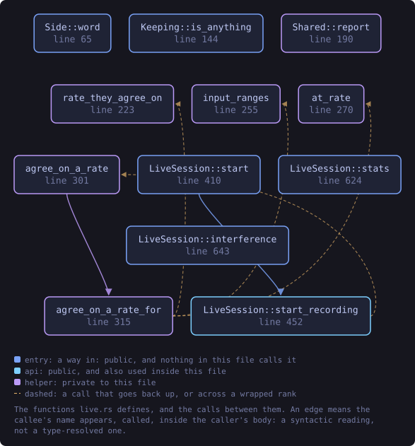
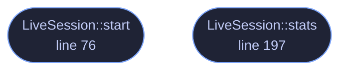

<!-- SPDX-License-Identifier: GPL-3.0-or-later -->
<!-- GENERATED by tools/docs/generate.py from the doc comments in the
     source. Do not edit this file: edit the `//!` and `///` comments in
     the .rs files and run the generator again. CI verifies it with
         python tools/docs/generate.py --check
-->

  

# `crates/veilvoice-audio/src/live.rs`

[`veilvoice-audio`](../../../crates/veilvoice-audio/README.md) &middot; 237 lines &middot; [read the source](https://github.com/tilas01/veilvoice/blob/main/crates/veilvoice-audio/src/live.rs)

## Contents

- [Structure](#structure)
- [Rules the callbacks follow](#rules-the-callbacks-follow)
- [Latency](#latency)
  - [What this file contains](#what-this-file-contains)
  - [What calls what](#what-calls-what)
  - [Items](#items)

Live microphone scrambling.

# Structure

Capture and playback run as two independent callbacks driven by the audio
hardware, joined by a lock-free SPSC ring buffer. The de-identification runs
inside the *output* callback, which is the shortest path: adding a worker
thread would mean a second buffer and a second scheduling delay for no
benefit, and `veilvoice_core::Deidentifier::process` is explicitly
allocation-free and safe to call from an audio callback.

# Rules the callbacks follow

An audio callback that blocks produces a dropout, so neither callback ever
allocates, locks, or waits. Statistics are published through a mutex the
callback only ever *tries* to take: if the UI thread happens to hold it, the
update is skipped rather than the audio stalling.

# Latency

Total latency is the input buffer, plus the ring backlog, plus the engine's
one-frame group delay (~21 ms at the defaults), plus the output buffer. The
ring is intentionally short — enough to absorb jitter between two clocks
that are not synchronised, not enough to accumulate a delay the user would
notice while speaking.

## What this file contains

237 lines defining **2 functions** (2 public), **3 types** and **1 constant**. Everything below is read out of the source, so it cannot disagree with the code.

**The types it owns.**

- `struct LiveStats` (line 41) -- A snapshot of what the live path is doing, safe to read from the UI.
- `struct LiveSession` (line 56) -- A running live-scramble session.
- `struct Shared` (line 64)

**What happens when it runs.** These are the ways in: public, and nothing else in this file calls them, so they are what an outside caller reaches first.

- `LiveSession::start` (line 76) -- Start scrambling from input into output.
- `LiveSession::stats` (line 197) -- Read the current statistics, resetting the peak meters.

## What calls what

The functions this file defines, and the calls between them. Both
are read out of the source: an edge means the callee's name appears,
called, inside the caller's body. It is a syntactic reading, not a
type-resolved one, so a call made through a trait object or a macro
will not appear.

_Colour key: **entry** -- a way in: public, and nothing in this file calls it._

  

The same graph as Mermaid source

## Items

| Item | Line | Documentation |
|---|---:|---|
| `RING_MILLIS` const | [37](https://github.com/tilas01/veilvoice/blob/main/crates/veilvoice-audio/src/live.rs#L37) | How much jitter the ring absorbs before it starts dropping samples. |
| `LiveStats` pub struct | [41](https://github.com/tilas01/veilvoice/blob/main/crates/veilvoice-audio/src/live.rs#L41) | A snapshot of what the live path is doing, safe to read from the UI. |
| `LiveSession` pub struct | [56](https://github.com/tilas01/veilvoice/blob/main/crates/veilvoice-audio/src/live.rs#L56) | A running live-scramble session. |
| `Shared` struct | [64](https://github.com/tilas01/veilvoice/blob/main/crates/veilvoice-audio/src/live.rs#L64) |  |
| `LiveSession::start` pub fn | [76](https://github.com/tilas01/veilvoice/blob/main/crates/veilvoice-audio/src/live.rs#L76) | Start scrambling from input into output. |
| `LiveSession::stats` pub fn | [197](https://github.com/tilas01/veilvoice/blob/main/crates/veilvoice-audio/src/live.rs#L197) | Read the current statistics, resetting the peak meters. |

---

Generated from `crates/veilvoice-audio/src/live.rs`. On the website: [`website/reference/veilvoice-audio/live.html`](../../../website/reference/veilvoice-audio/live.html).

Signing key fingerprint `8101FB3BB28D02FB239E0CDF9CC1C7E7A9B5833A`.
