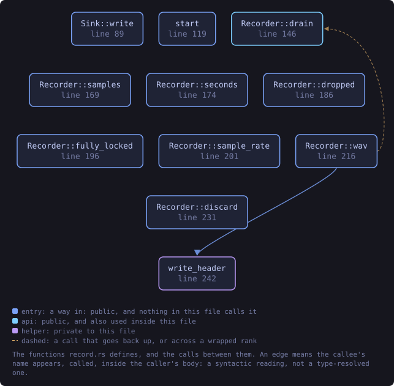

<!-- SPDX-License-Identifier: GPL-3.0-or-later -->
<!-- GENERATED by tools/docs/generate.py from the doc comments in the
     source. Do not edit this file: edit the `//!` and `///` comments in
     the .rs files and run the generator again. CI verifies it with
         python tools/docs/generate.py --check
-->

  

# `crates/veilvoice-audio/src/record.rs`

[`veilvoice-audio`](../../../crates/veilvoice-audio/README.md) &middot; 415 lines &middot; [read the source](https://github.com/tilas01/veilvoice/blob/main/crates/veilvoice-audio/src/record.rs)

## Contents

- [What this is for](#what-this-is-for)
- [Never a plaintext file, either](#never-a-plaintext-file-either)
- [The two halves, and why they are split](#the-two-halves-and-why-they-are-split)
- [In plain words](#in-plain-words)
  - [What this file contains](#what-this-file-contains)
  - [What calls what](#what-calls-what)
  - [Items](#items)

Recording the veiled voice without it ever reaching unprotected memory.

# What this is for

[`live`](crate::live) sends the veiled voice to a device and keeps nothing.
This keeps it, and the whole difficulty is *where*. A recording that is
accumulated in a `Vec`, encoded with a library that returns a `Vec`, and
then sealed, has existed in unlocked, unzeroized memory three times over by
the time it is encrypted, and the operating system may have written any of
those copies to the page file. Sealing it afterwards does not take that
back.

So the recording lives in a `Tape` from the first sample to the last, the
WAV is assembled inside a `Secret`, and the only thing that leaves this
module is that sealed-ready `Secret`. There is no route here that produces a
plain `Vec` of the audio, because a route that existed would eventually be
taken.

# Never a plaintext file, either

Nothing here writes to disk at all. The caller seals the `Secret` and
writes the result. A recorder that wrote a WAV and encrypted it afterwards
would leave a plaintext file that
[`veilvoice_crypto::shred`](veilvoice_crypto::shred) explains cannot be
reliably taken back on flash storage, which is the whole reason at-rest
encryption is the default rather than an option.

# The two halves, and why they are split

`Sink` is handed to the audio callback and `Recorder` is kept by the
caller. They are joined by a lock-free ring buffer, for the reason the
[`live`](crate::live) module documentation gives: a callback that allocates
or waits produces a dropout, and locking a page or growing a tape does both.
So the callback only ever pushes into a buffer that is already allocated,
and the slow, careful work of moving those samples into locked memory
happens on the caller's thread in `Recorder::drain`.

A caller that stops draining does not stall the audio. The ring fills, and
samples are counted as dropped rather than waited for, because a glitch in a
recording is better than a glitch in the live output somebody is speaking
into. `Recorder::dropped` reports it rather than letting the recording be
quietly short.

# In plain words

Keeps the veiled voice as it is produced, in memory the operating system has
been asked not to write to disk, and hands it over ready to be encrypted.

It never writes an unencrypted recording anywhere, not even briefly, because
a file that is written and deleted can still be recovered from the disk
afterwards.

## What this file contains

415 lines defining **11 functions** (10 public), **2 types** and **2 constants**. Everything below is read out of the source, so it cannot disagree with the code.

**The types it owns.**

- `struct Sink` (line 77) -- The writing half, handed to the audio callback.
- `struct Recorder` (line 99) -- The reading half: moves samples out of the ring and into locked memory.

**What happens when it runs.** These are the ways in: public, and nothing else in this file calls them, so they are what an outside caller reaches first.

- `Sink::write` (line 89) -- Take a block of veiled samples.
- `start` (line 119) -- Start a recorder and the sink that feeds it.
- `Recorder::samples` (line 169) -- Samples recorded so far, as of the last Recorder::drain.
- `Recorder::seconds` (line 174) -- Length so far in seconds, as of the last Recorder::drain.
- `Recorder::dropped` (line 186) -- Samples lost because the caller did not drain in time.
- `Recorder::fully_locked` (line 196) -- Whether every page holding the recording is locked out of swap.
- `Recorder::sample_rate` (line 201) -- The sample rate written into the WAV header.
- `Recorder::wav` (line 216) -- Drain what is left and hand over the recording as a WAV, in a Secret, ready to be sealed.
  - reaches: `drain`, `write_header`
- `Recorder::discard` (line 231) -- Wipe the recording held so far and start again from nothing.

## What calls what

The functions this file defines, and the calls between them. Both
are read out of the source: an edge means the callee's name appears,
called, inside the caller's body. It is a syntactic reading, not a
type-resolved one, so a call made through a trait object or a macro
will not appear.

_Colour key: **entry** -- a way in: public, and nothing in this file calls it; **api** -- public, and also used inside this file; **helper** -- private to this file._

  

The same graph as Mermaid source

```mermaid
%%{init: {"theme":"base","themeVariables":{"background":"#1a1b26","primaryColor":"#1f2335","primaryTextColor":"#c0caf5","primaryBorderColor":"#7aa2f7","secondaryColor":"#16161e","tertiaryColor":"#16161e","lineColor":"#737aa2","textColor":"#c0caf5","mainBkg":"#1f2335","nodeBorder":"#7aa2f7","clusterBkg":"#16161e","clusterBorder":"#2f3549","fontFamily":"ui-monospace, SFMono-Regular, Consolas, monospace","fontSize":"14px"}}}%%
flowchart TD
    n_write(["Sink::write<br/>line 89"])
    n_start(["start<br/>line 119"])
    n_drain["Recorder::drain<br/>line 146"]
    n_samples(["Recorder::samples<br/>line 169"])
    n_seconds(["Recorder::seconds<br/>line 174"])
    n_dropped(["Recorder::dropped<br/>line 186"])
    n_fully_locked(["Recorder::fully_locked<br/>line 196"])
    n_sample_rate(["Recorder::sample_rate<br/>line 201"])
    n_wav(["Recorder::wav<br/>line 216"])
    n_discard(["Recorder::discard<br/>line 231"])
    n_write_header["write_header<br/>line 242"]
    n_wav --> n_drain
    n_wav --> n_write_header
    click n_write href "https://github.com/tilas01/veilvoice/blob/main/crates/veilvoice-audio/src/record.rs#L89" "open the source"
    click n_start href "https://github.com/tilas01/veilvoice/blob/main/crates/veilvoice-audio/src/record.rs#L119" "open the source"
    click n_drain href "https://github.com/tilas01/veilvoice/blob/main/crates/veilvoice-audio/src/record.rs#L146" "open the source"
    click n_samples href "https://github.com/tilas01/veilvoice/blob/main/crates/veilvoice-audio/src/record.rs#L169" "open the source"
    click n_seconds href "https://github.com/tilas01/veilvoice/blob/main/crates/veilvoice-audio/src/record.rs#L174" "open the source"
    click n_dropped href "https://github.com/tilas01/veilvoice/blob/main/crates/veilvoice-audio/src/record.rs#L186" "open the source"
    click n_fully_locked href "https://github.com/tilas01/veilvoice/blob/main/crates/veilvoice-audio/src/record.rs#L196" "open the source"
    click n_sample_rate href "https://github.com/tilas01/veilvoice/blob/main/crates/veilvoice-audio/src/record.rs#L201" "open the source"
    click n_wav href "https://github.com/tilas01/veilvoice/blob/main/crates/veilvoice-audio/src/record.rs#L216" "open the source"
    click n_discard href "https://github.com/tilas01/veilvoice/blob/main/crates/veilvoice-audio/src/record.rs#L231" "open the source"
    click n_write_header href "https://github.com/tilas01/veilvoice/blob/main/crates/veilvoice-audio/src/record.rs#L242" "open the source"
    classDef entry fill:#1f2335,stroke:#7aa2f7,color:#c0caf5
    class n_write,n_start,n_samples,n_seconds,n_dropped,n_fully_locked,n_sample_rate,n_wav,n_discard entry
    classDef api fill:#1f2335,stroke:#7dcfff,color:#c0caf5
    class n_drain api
    classDef helper fill:#1f2335,stroke:#bb9af7,color:#c0caf5
    class n_write_header helper
```

## Items

| Item | Line | Documentation |
|---|---:|---|
| `HEADER` const | [62](https://github.com/tilas01/veilvoice/blob/main/crates/veilvoice-audio/src/record.rs#L62) | Bytes in a canonical 16-bit PCM WAV header. |
| `SLACK_SECONDS` pub const | [71](https://github.com/tilas01/veilvoice/blob/main/crates/veilvoice-audio/src/record.rs#L71) | How much audio the ring holds before samples are dropped, in seconds. |
| `Sink` pub struct | [77](https://github.com/tilas01/veilvoice/blob/main/crates/veilvoice-audio/src/record.rs#L77) | The writing half, handed to the audio callback. |
| `Sink::write` pub fn | [89](https://github.com/tilas01/veilvoice/blob/main/crates/veilvoice-audio/src/record.rs#L89) | Take a block of veiled samples. |
| `Recorder` pub struct | [99](https://github.com/tilas01/veilvoice/blob/main/crates/veilvoice-audio/src/record.rs#L99) | The reading half: moves samples out of the ring and into locked memory. |
| `start` pub fn | [119](https://github.com/tilas01/veilvoice/blob/main/crates/veilvoice-audio/src/record.rs#L119) | Start a recorder and the sink that feeds it. |
| `Recorder::drain` pub fn | [146](https://github.com/tilas01/veilvoice/blob/main/crates/veilvoice-audio/src/record.rs#L146) | Move everything waiting in the ring into the tape. |
| `Recorder::samples` pub fn | [169](https://github.com/tilas01/veilvoice/blob/main/crates/veilvoice-audio/src/record.rs#L169) | Samples recorded so far, as of the last Recorder::drain. |
| `Recorder::seconds` pub fn | [174](https://github.com/tilas01/veilvoice/blob/main/crates/veilvoice-audio/src/record.rs#L174) | Length so far in seconds, as of the last Recorder::drain. |
| `Recorder::dropped` pub fn | [186](https://github.com/tilas01/veilvoice/blob/main/crates/veilvoice-audio/src/record.rs#L186) | Samples lost because the caller did not drain in time. |
| `Recorder::fully_locked` pub fn | [196](https://github.com/tilas01/veilvoice/blob/main/crates/veilvoice-audio/src/record.rs#L196) | Whether every page holding the recording is locked out of swap. |
| `Recorder::sample_rate` pub fn | [201](https://github.com/tilas01/veilvoice/blob/main/crates/veilvoice-audio/src/record.rs#L201) | The sample rate written into the WAV header. |
| `Recorder::wav` pub fn | [216](https://github.com/tilas01/veilvoice/blob/main/crates/veilvoice-audio/src/record.rs#L216) | Drain what is left and hand over the recording as a WAV, in a Secret, ready to be sealed. |
| `Recorder::discard` pub fn | [231](https://github.com/tilas01/veilvoice/blob/main/crates/veilvoice-audio/src/record.rs#L231) | Wipe the recording held so far and start again from nothing. |
| `write_header` fn | [242](https://github.com/tilas01/veilvoice/blob/main/crates/veilvoice-audio/src/record.rs#L242) | Write a canonical 44-byte mono 16-bit PCM WAV header into out. |

---

Generated from `crates/veilvoice-audio/src/record.rs`. On the website: [`website/reference/veilvoice-audio/record.html`](../../../website/reference/veilvoice-audio/record.html).

Signing key fingerprint `8101FB3BB28D02FB239E0CDF9CC1C7E7A9B5833A`.
