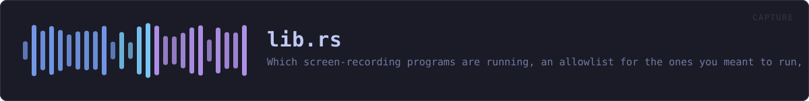
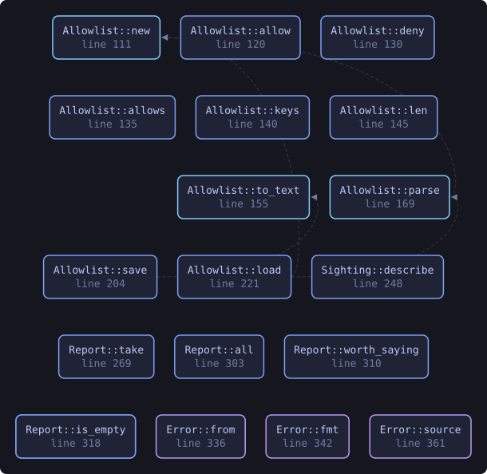

<!-- SPDX-License-Identifier: GPL-3.0-or-later -->
<!-- GENERATED by tools/docs/generate.py from the doc comments in the
     source. Do not edit this file: edit the `//!` and `///` comments in
     the .rs files and run the generator again. CI verifies it with
         python tools/docs/generate.py --check
-->

  

# `crates/veilvoice-capture/src/lib.rs`

[`veilvoice-capture`](../../../crates/veilvoice-capture/README.md) &middot; 575 lines &middot; [read the source](https://github.com/tilas01/veilvoice/blob/main/crates/veilvoice-capture/src/lib.rs)

## Contents

  - [VeilVoice does not hide itself from your recorder](#veilvoice-does-not-hide-itself-from-your-recorder)
  - [Telling you, and then not telling you again](#telling-you-and-then-not-telling-you-again)
  - [Running is not recording, and this crate never confuses them](#running-is-not-recording-and-this-crate-never-confuses-them)
  - [And it only knows the programs it knows](#and-it-only-knows-the-programs-it-knows)
- [In plain words](#in-plain-words)
  - [What this file contains](#what-this-file-contains)
  - [What calls what](#what-calls-what)
  - [Items](#items)

Which screen-recording programs are running, an allowlist for the ones you
meant to run, and a plain account of the two things this cannot do.

## VeilVoice does not hide itself from your recorder

Stated first, because it is the question people actually have: **you can
record VeilVoice's window with OBS, and nothing here stops you.** Screen
capture of this application is not blocked, not degraded, and not detected
as an attack. If you are making a video about VeilVoice, or streaming while
you use it, it will appear on the recording exactly like any other window.

That is not only a choice, it is also a limit. Excluding a window from
capture means `SetWindowDisplayAffinity` on Windows and the equivalent
elsewhere, which is FFI — and every crate in this workspace carries
`#![forbid(unsafe_code)]`, which is a front-page claim. So the exclusion is
**not built**, and `ROADMAP.md` records it as a decision waiting on the
maintainer rather than as an oversight. Anybody who needs a window that
cannot be recorded does not have it here, and should know that before they
rely on it.

## Telling you, and then not telling you again

A monitor that says "OBS is running" every thirty seconds while you
deliberately record a tutorial is a monitor you turn off, and then it is not
watching for the recorder you did **not** start. So `Allowlist` exists:
name a program once, and it stops raising a notification.

Allowed is not hidden. `Sighting::allowed` is a flag on a sighting that is
still in the report, and `Report::all` still lists it. Only
`Report::worth_saying` filters, because that is the one a notification
reads. Something that vanished from the interface entirely would be a
setting for lying to yourself.

## Running is not recording, and this crate never confuses them

Zoom being open does not mean Zoom is sharing your screen; Discord running
does not mean anybody is watching. This reports **what is running**, and
`programs::Purpose` separates a program whose job is recording from one
that merely can. Every sentence produced here keeps the distinction, because
a privacy tool that announces surveillance every time somebody opens a chat
application has taught its user to ignore it.

Knowing whether a capture is actually in progress means asking the
compositor who holds a capture session, and that is FFI on every platform
here. Same trade, same answer, same place it is recorded.

## And it only knows the programs it knows

`programs::ALL` is a table of names. Something not in it is not reported,
and something written to record a screen quietly would not be called
`obs64.exe`. An empty report is not evidence that nothing is recording, and
`SCOPE` says so.

# In plain words

This tells you which screen-recording programs are running.

If you are about to say something private and a recorder is going, that is
worth knowing first. Programs you run on purpose can be marked as expected, and
they stay in the list rather than disappearing from it.

It cannot hide VeilVoice's window from a recorder, and it does not pretend to.
A camera pointed at the screen would not care anyway.

## What this file contains

575 lines defining **19 functions** (16 public), **4 types** and **3 constants**. Everything below is read out of the source, so it cannot disagree with the code.

**The types it owns.**

- `struct Allowlist` (line 107) -- Programs the user has said they meant to run.
- `struct Sighting` (line 237) -- One capture-capable program found running.
- `struct Report` (line 264) -- What is running, and anything that got in the way of finding out.
- `enum Error` (line 331) -- Everything that can go wrong in this crate.

**What happens when it runs.** These are the ways in: public, and nothing else in this file calls them, so they are what an outside caller reaches first.

- `Allowlist::allow` (line 125) -- Stop notifying about this program.
- `Allowlist::deny` (line 135) -- Start notifying about this program again.
- `Allowlist::allows` (line 140) -- Whether this program is allowed.
- `Allowlist::keys` (line 145) -- The allowed keys, in a stable order.
- `Allowlist::len` (line 150) -- How many programs are allowed.
- `Allowlist::is_empty` (line 155) -- Whether nothing is allowed.
- `Allowlist::save` (line 209) -- Write the allowlist to path.
  - reaches: `to_text`
- `Allowlist::load` (line 226) -- Read an allowlist written by Allowlist::save, treating a missing file as "nothing is allowed".
  - reaches: `new`, `parse`
- `Sighting::describe` (line 253) -- One line for a terminal, a log or a notification.
- `Report::take` (line 274) -- Look at what is running now.
- `Report::all` (line 308) -- Everything found, allowed or not.
- `Report::worth_saying` (line 315) -- The sightings a notification should raise: the ones not allowed.
- `Report::is_empty` (line 323) -- Whether anything at all was found, allowed or not.

## What calls what

The functions this file defines, and the calls between them. Both
are read out of the source: an edge means the callee's name appears,
called, inside the caller's body. It is a syntactic reading, not a
type-resolved one, so a call made through a trait object or a macro
will not appear.

_Colour key: **entry** -- a way in: public, and nothing in this file calls it; **api** -- public, and also used inside this file; **helper** -- private to this file._

  

The same graph as Mermaid source

```mermaid
%%{init: {"theme":"base","themeVariables":{"background":"#1a1b26","primaryColor":"#1f2335","primaryTextColor":"#c0caf5","primaryBorderColor":"#7aa2f7","secondaryColor":"#16161e","tertiaryColor":"#16161e","lineColor":"#737aa2","textColor":"#c0caf5","mainBkg":"#1f2335","nodeBorder":"#7aa2f7","clusterBkg":"#16161e","clusterBorder":"#2f3549","fontFamily":"ui-monospace, SFMono-Regular, Consolas, monospace","fontSize":"14px"}}}%%
flowchart TD
    n_new["Allowlist::new<br/>line 116"]
    n_allow(["Allowlist::allow<br/>line 125"])
    n_deny(["Allowlist::deny<br/>line 135"])
    n_allows(["Allowlist::allows<br/>line 140"])
    n_keys(["Allowlist::keys<br/>line 145"])
    n_len(["Allowlist::len<br/>line 150"])
    n_is_empty(["Allowlist::is_empty<br/>line 155"])
    n_to_text["Allowlist::to_text<br/>line 160"]
    n_parse["Allowlist::parse<br/>line 174"]
    n_save(["Allowlist::save<br/>line 209"])
    n_load(["Allowlist::load<br/>line 226"])
    n_describe(["Sighting::describe<br/>line 253"])
    n_take(["Report::take<br/>line 274"])
    n_all(["Report::all<br/>line 308"])
    n_worth_saying(["Report::worth_saying<br/>line 315"])
    n_is_empty(["Report::is_empty<br/>line 323"])
    n_from["Error::from<br/>line 341"]
    n_fmt["Error::fmt<br/>line 347"]
    n_source["Error::source<br/>line 366"]
    n_load --> n_new
    n_load --> n_parse
    n_parse --> n_new
    n_save --> n_to_text
    click n_new href "https://github.com/tilas01/veilvoice/blob/main/crates/veilvoice-capture/src/lib.rs#L116" "open the source"
    click n_allow href "https://github.com/tilas01/veilvoice/blob/main/crates/veilvoice-capture/src/lib.rs#L125" "open the source"
    click n_deny href "https://github.com/tilas01/veilvoice/blob/main/crates/veilvoice-capture/src/lib.rs#L135" "open the source"
    click n_allows href "https://github.com/tilas01/veilvoice/blob/main/crates/veilvoice-capture/src/lib.rs#L140" "open the source"
    click n_keys href "https://github.com/tilas01/veilvoice/blob/main/crates/veilvoice-capture/src/lib.rs#L145" "open the source"
    click n_len href "https://github.com/tilas01/veilvoice/blob/main/crates/veilvoice-capture/src/lib.rs#L150" "open the source"
    click n_is_empty href "https://github.com/tilas01/veilvoice/blob/main/crates/veilvoice-capture/src/lib.rs#L155" "open the source"
    click n_to_text href "https://github.com/tilas01/veilvoice/blob/main/crates/veilvoice-capture/src/lib.rs#L160" "open the source"
    click n_parse href "https://github.com/tilas01/veilvoice/blob/main/crates/veilvoice-capture/src/lib.rs#L174" "open the source"
    click n_save href "https://github.com/tilas01/veilvoice/blob/main/crates/veilvoice-capture/src/lib.rs#L209" "open the source"
    click n_load href "https://github.com/tilas01/veilvoice/blob/main/crates/veilvoice-capture/src/lib.rs#L226" "open the source"
    click n_describe href "https://github.com/tilas01/veilvoice/blob/main/crates/veilvoice-capture/src/lib.rs#L253" "open the source"
    click n_take href "https://github.com/tilas01/veilvoice/blob/main/crates/veilvoice-capture/src/lib.rs#L274" "open the source"
    click n_all href "https://github.com/tilas01/veilvoice/blob/main/crates/veilvoice-capture/src/lib.rs#L308" "open the source"
    click n_worth_saying href "https://github.com/tilas01/veilvoice/blob/main/crates/veilvoice-capture/src/lib.rs#L315" "open the source"
    click n_is_empty href "https://github.com/tilas01/veilvoice/blob/main/crates/veilvoice-capture/src/lib.rs#L323" "open the source"
    click n_from href "https://github.com/tilas01/veilvoice/blob/main/crates/veilvoice-capture/src/lib.rs#L341" "open the source"
    click n_fmt href "https://github.com/tilas01/veilvoice/blob/main/crates/veilvoice-capture/src/lib.rs#L347" "open the source"
    click n_source href "https://github.com/tilas01/veilvoice/blob/main/crates/veilvoice-capture/src/lib.rs#L366" "open the source"
    classDef entry fill:#1f2335,stroke:#7aa2f7,color:#c0caf5
    class n_allow,n_deny,n_allows,n_keys,n_len,n_is_empty,n_save,n_load,n_describe,n_take,n_all,n_worth_saying,n_is_empty entry
    classDef api fill:#1f2335,stroke:#7dcfff,color:#c0caf5
    class n_new,n_to_text,n_parse api
    classDef helper fill:#1f2335,stroke:#bb9af7,color:#c0caf5
    class n_from,n_fmt,n_source helper
```

## Items

| Item | Line | Documentation |
|---|---:|---|
| `processes` pub(crate) mod | [74](https://github.com/tilas01/veilvoice/blob/main/crates/veilvoice-capture/src/lib.rs#L74) |  |
| `VERSION` pub const | [86](https://github.com/tilas01/veilvoice/blob/main/crates/veilvoice-capture/src/lib.rs#L86) | Crate version string, surfaced in the About panel. |
| `SCOPE` pub const | [92](https://github.com/tilas01/veilvoice/blob/main/crates/veilvoice-capture/src/lib.rs#L92) | What this is worth, in the words a front end should show. |
| `Allowlist` pub struct | [107](https://github.com/tilas01/veilvoice/blob/main/crates/veilvoice-capture/src/lib.rs#L107) | Programs the user has said they meant to run. |
| `MAGIC` const | [112](https://github.com/tilas01/veilvoice/blob/main/crates/veilvoice-capture/src/lib.rs#L112) | Magic first line. |
| `Allowlist::new` pub fn | [116](https://github.com/tilas01/veilvoice/blob/main/crates/veilvoice-capture/src/lib.rs#L116) | An allowlist that allows nothing. |
| `Allowlist::allow` pub fn | [125](https://github.com/tilas01/veilvoice/blob/main/crates/veilvoice-capture/src/lib.rs#L125) | Stop notifying about this program. |
| `Allowlist::deny` pub fn | [135](https://github.com/tilas01/veilvoice/blob/main/crates/veilvoice-capture/src/lib.rs#L135) | Start notifying about this program again. |
| `Allowlist::allows` pub fn | [140](https://github.com/tilas01/veilvoice/blob/main/crates/veilvoice-capture/src/lib.rs#L140) | Whether this program is allowed. |
| `Allowlist::keys` pub fn | [145](https://github.com/tilas01/veilvoice/blob/main/crates/veilvoice-capture/src/lib.rs#L145) | The allowed keys, in a stable order. |
| `Allowlist::len` pub fn | [150](https://github.com/tilas01/veilvoice/blob/main/crates/veilvoice-capture/src/lib.rs#L150) | How many programs are allowed. |
| `Allowlist::is_empty` pub fn | [155](https://github.com/tilas01/veilvoice/blob/main/crates/veilvoice-capture/src/lib.rs#L155) | Whether nothing is allowed. |
| `Allowlist::to_text` pub fn | [160](https://github.com/tilas01/veilvoice/blob/main/crates/veilvoice-capture/src/lib.rs#L160) | Serialise to a text format, one key per line. |
| `Allowlist::parse` pub fn | [174](https://github.com/tilas01/veilvoice/blob/main/crates/veilvoice-capture/src/lib.rs#L174) | Parse the text format. |
| `Allowlist::save` pub fn | [209](https://github.com/tilas01/veilvoice/blob/main/crates/veilvoice-capture/src/lib.rs#L209) | Write the allowlist to path. |
| `Allowlist::load` pub fn | [226](https://github.com/tilas01/veilvoice/blob/main/crates/veilvoice-capture/src/lib.rs#L226) | Read an allowlist written by Allowlist::save, treating a missing file as "nothing is allowed". |
| `Sighting` pub struct | [237](https://github.com/tilas01/veilvoice/blob/main/crates/veilvoice-capture/src/lib.rs#L237) | One capture-capable program found running. |
| `Sighting::describe` pub fn | [253](https://github.com/tilas01/veilvoice/blob/main/crates/veilvoice-capture/src/lib.rs#L253) | One line for a terminal, a log or a notification. |
| `Report` pub struct | [264](https://github.com/tilas01/veilvoice/blob/main/crates/veilvoice-capture/src/lib.rs#L264) | What is running, and anything that got in the way of finding out. |
| `Report::take` pub fn | [274](https://github.com/tilas01/veilvoice/blob/main/crates/veilvoice-capture/src/lib.rs#L274) | Look at what is running now. |
| `Report::all` pub fn | [308](https://github.com/tilas01/veilvoice/blob/main/crates/veilvoice-capture/src/lib.rs#L308) | Everything found, allowed or not. |
| `Report::worth_saying` pub fn | [315](https://github.com/tilas01/veilvoice/blob/main/crates/veilvoice-capture/src/lib.rs#L315) | The sightings a notification should raise: the ones not allowed. |
| `Report::is_empty` pub fn | [323](https://github.com/tilas01/veilvoice/blob/main/crates/veilvoice-capture/src/lib.rs#L323) | Whether anything at all was found, allowed or not. |
| `Error` pub enum | [331](https://github.com/tilas01/veilvoice/blob/main/crates/veilvoice-capture/src/lib.rs#L331) | Everything that can go wrong in this crate. |
| `Error::from` fn | [341](https://github.com/tilas01/veilvoice/blob/main/crates/veilvoice-capture/src/lib.rs#L341) |  |
| `Error::fmt` fn | [347](https://github.com/tilas01/veilvoice/blob/main/crates/veilvoice-capture/src/lib.rs#L347) |  |
| `Error::source` fn | [366](https://github.com/tilas01/veilvoice/blob/main/crates/veilvoice-capture/src/lib.rs#L366) |  |

---

Generated from `crates/veilvoice-capture/src/lib.rs`. On the website: [`website/reference/veilvoice-capture/lib.html`](../../../website/reference/veilvoice-capture/lib.html).

Signing key fingerprint `8101FB3BB28D02FB239E0CDF9CC1C7E7A9B5833A`.
