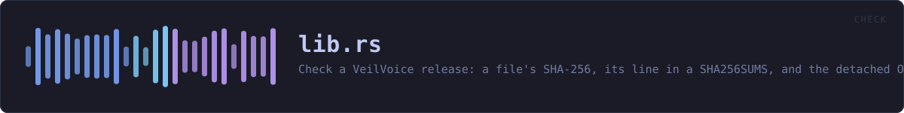
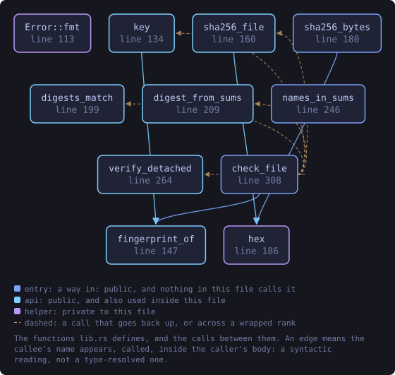

<!-- SPDX-License-Identifier: GPL-3.0-or-later -->
<!-- GENERATED by tools/docs/generate.py from the doc comments in the
     source. Do not edit this file: edit the `//!` and `///` comments in
     the .rs files and run the generator again. CI verifies it with
         python tools/docs/generate.py --check
-->

  

# `crates/veilvoice-check/src/lib.rs`

[`veilvoice-check`](../../../crates/veilvoice-check/README.md) &middot; 472 lines &middot; [read the source](https://github.com/tilas01/veilvoice/blob/main/crates/veilvoice-check/src/lib.rs)

## Contents

- [Why this is a library and not only a program](#why-this-is-a-library-and-not-only-a-program)
- [What a pass actually proves, and what it does not](#what-a-pass-actually-proves-and-what-it-does-not)
- [No network, and no GnuPG](#no-network-and-no-gnupg)
- [In plain words](#in-plain-words)
  - [What this file contains](#what-this-file-contains)
  - [What calls what](#what-calls-what)
  - [Items](#items)

Check a VeilVoice release: a file's SHA-256, its line in a `SHA256SUMS`,
and the detached OpenPGP signature over that list.

# Why this is a library and not only a program

`veilvoice-verify` did all of this and did it inside a binary crate, which
has no consumers by construction. The desktop application was asked for a
**verify tab**, where you drag a download onto the window and are told
whether it is the published one, and there were two ways to have that:

* link `eframe` into the 1.5 MB portable verifier, which is the one binary
in this project whose smallness is a feature: it is what somebody
downloads *before* they trust anything else here;
* or move the checking out of the binary, so both front ends call the same
code rather than two implementations of it.

This is the second. The verifier is unchanged in what it does and prints;
it just no longer owns the arithmetic.

# What a pass actually proves, and what it does not

A good signature over `SHA256SUMS`, plus a matching hash, proves the file is
**the one the holder of this key published**. It does not prove the file is
safe, that the source compiles to it, or that the key belongs to anybody in
particular. The second of those is the check worth having and it is the one
this project cannot perform for you, because it needs somebody other than the
author to have built the same tag and got the same hash.

Every front end that uses this has to say so. The words are here, in
`SCOPE`, rather than in whichever interface happens to be showing the
answer, so a second front end cannot show a pass without them.

# No network, and no GnuPG

Nothing in this crate opens a socket or runs a program. It is given bytes
and it reports on them. Downloading is the caller's problem, and the two
callers that do it shell out to the system's own transfer tool.

# In plain words

This is the checking behind "is this download the real one".

You give it the file you downloaded, the published list of fingerprints, and
the signature over that list. It checks the signature first -- because a list
nobody signed proves nothing -- and only then compares your file against it.

A pass means the file is the one the person holding that key published. It does
not mean the file is safe, and it does not mean the program in it matches the
source code you can read. That last one is the check worth the most, and it is
the one this cannot do for you: it needs somebody other than the author to have
built the same thing and got the same answer.

## What this file contains

472 lines defining **11 functions** (9 public), **2 types** and **3 constants**. Everything below is read out of the source, so it cannot disagree with the code.

**The types it owns.**

- `enum Error` (line 97) -- Something that went wrong, in words a person can act on.
- `struct Checked` (line 285) -- What a full check found.

**What happens when it runs.** These are the ways in: public, and nothing else in this file calls them, so they are what an outside caller reaches first.

- `sha256_bytes` (line 180) -- SHA-256 of bytes already in memory.
  - reaches: `hex`
- `names_in_sums` (line 246) -- Every name a SHA256SUMS lists, in order.
- `check_file` (line 308) -- The whole check: signature first, then the hash.
  - reaches: `digest_from_sums`, `digests_match`, `fingerprint_of`, `key`, `sha256_file`, `verify_detached`, `hex`

## What calls what

The functions this file defines, and the calls between them. Both
are read out of the source: an edge means the callee's name appears,
called, inside the caller's body. It is a syntactic reading, not a
type-resolved one, so a call made through a trait object or a macro
will not appear.

_Colour key: **entry** -- a way in: public, and nothing in this file calls it; **api** -- public, and also used inside this file; **helper** -- private to this file._

  

The same graph as Mermaid source

```mermaid
%%{init: {"theme":"base","themeVariables":{"background":"#1a1b26","primaryColor":"#1f2335","primaryTextColor":"#c0caf5","primaryBorderColor":"#7aa2f7","secondaryColor":"#16161e","tertiaryColor":"#16161e","lineColor":"#737aa2","textColor":"#c0caf5","mainBkg":"#1f2335","nodeBorder":"#7aa2f7","clusterBkg":"#16161e","clusterBorder":"#2f3549","fontFamily":"ui-monospace, SFMono-Regular, Consolas, monospace","fontSize":"14px"}}}%%
flowchart TD
    n_fmt["Error::fmt<br/>line 113"]
    n_key["key<br/>line 134"]
    n_fingerprint_of["fingerprint_of<br/>line 147"]
    n_sha256_file["sha256_file<br/>line 160"]
    n_sha256_bytes(["sha256_bytes<br/>line 180"])
    n_hex["hex<br/>line 186"]
    n_digests_match["digests_match<br/>line 199"]
    n_digest_from_sums["digest_from_sums<br/>line 209"]
    n_names_in_sums(["names_in_sums<br/>line 246"])
    n_verify_detached["verify_detached<br/>line 264"]
    n_check_file(["check_file<br/>line 308"])
    n_check_file --> n_digest_from_sums
    n_check_file --> n_digests_match
    n_check_file --> n_fingerprint_of
    n_check_file --> n_key
    n_check_file --> n_sha256_file
    n_check_file --> n_verify_detached
    n_key --> n_fingerprint_of
    n_sha256_bytes --> n_hex
    n_sha256_file --> n_hex
    click n_fmt href "https://github.com/tilas01/veilvoice/blob/main/crates/veilvoice-check/src/lib.rs#L113" "open the source"
    click n_key href "https://github.com/tilas01/veilvoice/blob/main/crates/veilvoice-check/src/lib.rs#L134" "open the source"
    click n_fingerprint_of href "https://github.com/tilas01/veilvoice/blob/main/crates/veilvoice-check/src/lib.rs#L147" "open the source"
    click n_sha256_file href "https://github.com/tilas01/veilvoice/blob/main/crates/veilvoice-check/src/lib.rs#L160" "open the source"
    click n_sha256_bytes href "https://github.com/tilas01/veilvoice/blob/main/crates/veilvoice-check/src/lib.rs#L180" "open the source"
    click n_hex href "https://github.com/tilas01/veilvoice/blob/main/crates/veilvoice-check/src/lib.rs#L186" "open the source"
    click n_digests_match href "https://github.com/tilas01/veilvoice/blob/main/crates/veilvoice-check/src/lib.rs#L199" "open the source"
    click n_digest_from_sums href "https://github.com/tilas01/veilvoice/blob/main/crates/veilvoice-check/src/lib.rs#L209" "open the source"
    click n_names_in_sums href "https://github.com/tilas01/veilvoice/blob/main/crates/veilvoice-check/src/lib.rs#L246" "open the source"
    click n_verify_detached href "https://github.com/tilas01/veilvoice/blob/main/crates/veilvoice-check/src/lib.rs#L264" "open the source"
    click n_check_file href "https://github.com/tilas01/veilvoice/blob/main/crates/veilvoice-check/src/lib.rs#L308" "open the source"
    classDef entry fill:#1f2335,stroke:#7aa2f7,color:#c0caf5
    class n_sha256_bytes,n_names_in_sums,n_check_file entry
    classDef api fill:#1f2335,stroke:#7dcfff,color:#c0caf5
    class n_key,n_fingerprint_of,n_sha256_file,n_digests_match,n_digest_from_sums,n_verify_detached api
    classDef helper fill:#1f2335,stroke:#bb9af7,color:#c0caf5
    class n_fmt,n_hex helper
```

## Items

| Item | Line | Documentation |
|---|---:|---|
| `PUBLIC_KEY` pub const | [72](https://github.com/tilas01/veilvoice/blob/main/crates/veilvoice-check/src/lib.rs#L72) | The project's signing key, in ASCII armour. |
| `FINGERPRINT` pub const | [84](https://github.com/tilas01/veilvoice/blob/main/crates/veilvoice-check/src/lib.rs#L84) | The fingerprint, written out rather than derived. |
| `SCOPE` pub const | [87](https://github.com/tilas01/veilvoice/blob/main/crates/veilvoice-check/src/lib.rs#L87) | What a passing check is worth, in the words a user should be shown. |
| `Error` pub enum | [97](https://github.com/tilas01/veilvoice/blob/main/crates/veilvoice-check/src/lib.rs#L97) | Something that went wrong, in words a person can act on. |
| `Error::fmt` fn | [113](https://github.com/tilas01/veilvoice/blob/main/crates/veilvoice-check/src/lib.rs#L113) |  |
| `key` pub fn | [134](https://github.com/tilas01/veilvoice/blob/main/crates/veilvoice-check/src/lib.rs#L134) | The embedded key, with its fingerprint checked. |
| `fingerprint_of` pub fn | [147](https://github.com/tilas01/veilvoice/blob/main/crates/veilvoice-check/src/lib.rs#L147) | A key's fingerprint, uppercase hex, no spaces. |
| `sha256_file` pub fn | [160](https://github.com/tilas01/veilvoice/blob/main/crates/veilvoice-check/src/lib.rs#L160) | SHA-256 of a file, read in chunks. |
| `sha256_bytes` pub fn | [180](https://github.com/tilas01/veilvoice/blob/main/crates/veilvoice-check/src/lib.rs#L180) | SHA-256 of bytes already in memory. |
| `hex` fn | [186](https://github.com/tilas01/veilvoice/blob/main/crates/veilvoice-check/src/lib.rs#L186) |  |
| `digests_match` pub fn | [199](https://github.com/tilas01/veilvoice/blob/main/crates/veilvoice-check/src/lib.rs#L199) | Compare two hex digests without caring about case or stray whitespace. |
| `digest_from_sums` pub fn | [209](https://github.com/tilas01/veilvoice/blob/main/crates/veilvoice-check/src/lib.rs#L209) | Find a file's line in a sha256sum-format list. |
| `names_in_sums` pub fn | [246](https://github.com/tilas01/veilvoice/blob/main/crates/veilvoice-check/src/lib.rs#L246) | Every name a SHA256SUMS lists, in order. |
| `verify_detached` pub fn | [264](https://github.com/tilas01/veilvoice/blob/main/crates/veilvoice-check/src/lib.rs#L264) | Verify a detached signature over data using key. |
| `Checked` pub struct | [285](https://github.com/tilas01/veilvoice/blob/main/crates/veilvoice-check/src/lib.rs#L285) | What a full check found. |
| `check_file` pub fn | [308](https://github.com/tilas01/veilvoice/blob/main/crates/veilvoice-check/src/lib.rs#L308) | The whole check: signature first, then the hash. |

---

Generated from `crates/veilvoice-check/src/lib.rs`. On the website: [`website/reference/veilvoice-check/lib.html`](../../../website/reference/veilvoice-check/lib.html).

Signing key fingerprint `8101FB3BB28D02FB239E0CDF9CC1C7E7A9B5833A`.
