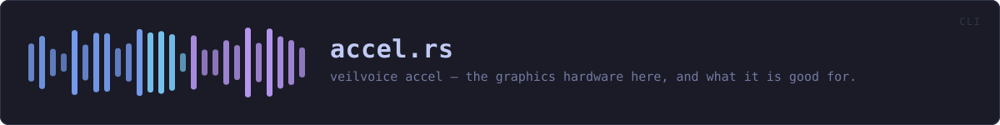
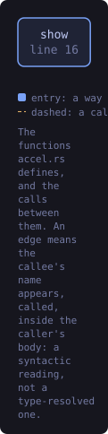

<!-- SPDX-License-Identifier: GPL-3.0-or-later -->
<!-- GENERATED by tools/docs/generate.py from the doc comments in the
     source. Do not edit this file: edit the `//!` and `///` comments in
     the .rs files and run the generator again. CI verifies it with
         python tools/docs/generate.py --check
-->

  

# `crates/veilvoice-cli/src/accel.rs`

[`veilvoice-cli`](../../../crates/veilvoice-cli/README.md) &middot; 90 lines &middot; [read the source](https://github.com/tilas01/veilvoice/blob/main/crates/veilvoice-cli/src/accel.rs)

## Contents

- [In plain words](#in-plain-words)
  - [What this file contains](#what-this-file-contains)
  - [What calls what](#what-calls-what)
  - [Items](#items)

`veilvoice accel` — the graphics hardware here, and what it is good for.

# In plain words

Lists the graphics devices on this computer and says which of them can
encode video, so you can pick one when making a video of a conversation.

It also says, with the measurement behind it, why the voice changing itself
does not use a graphics card: it is already about a hundred times faster
than real time, and moving that work onto a card would slow it down.

## What this file contains

90 lines defining **1 function** (1 public), **0 types** and **0 constants**. Everything below is read out of the source, so it cannot disagree with the code.

**What happens when it runs.** These are the ways in: public, and nothing else in this file calls them, so they are what an outside caller reaches first.

- `show` (line 16) -- Show what this machine has.

## What calls what

The functions this file defines, and the calls between them. Both
are read out of the source: an edge means the callee's name appears,
called, inside the caller's body. It is a syntactic reading, not a
type-resolved one, so a call made through a trait object or a macro
will not appear.

_Colour key: **entry** -- a way in: public, and nothing in this file calls it._

  

The same graph as Mermaid source

```mermaid
%%{init: {"theme":"base","themeVariables":{"background":"#1a1b26","primaryColor":"#1f2335","primaryTextColor":"#c0caf5","primaryBorderColor":"#7aa2f7","secondaryColor":"#16161e","tertiaryColor":"#16161e","lineColor":"#737aa2","textColor":"#c0caf5","mainBkg":"#1f2335","nodeBorder":"#7aa2f7","clusterBkg":"#16161e","clusterBorder":"#2f3549","fontFamily":"ui-monospace, SFMono-Regular, Consolas, monospace","fontSize":"14px"}}}%%
flowchart TD
    n_show(["show<br/>line 16"])
    click n_show href "https://github.com/tilas01/veilvoice/blob/main/crates/veilvoice-cli/src/accel.rs#L16" "open the source"
    classDef entry fill:#1f2335,stroke:#7aa2f7,color:#c0caf5
    class n_show entry
```

## Items

| Item | Line | Documentation |
|---|---:|---|
| `show` pub fn | [16](https://github.com/tilas01/veilvoice/blob/main/crates/veilvoice-cli/src/accel.rs#L16) | Show what this machine has. |

---

Generated from `crates/veilvoice-cli/src/accel.rs`. On the website: [`website/reference/veilvoice-cli/accel.html`](../../../website/reference/veilvoice-cli/accel.html).

Signing key fingerprint `8101FB3BB28D02FB239E0CDF9CC1C7E7A9B5833A`.
