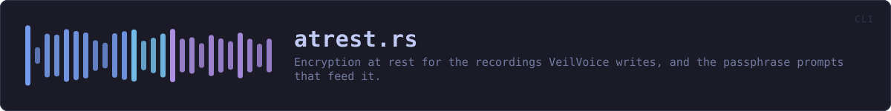
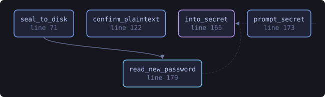
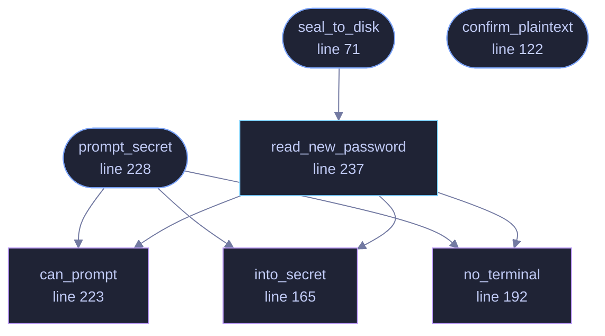

<!-- SPDX-License-Identifier: GPL-3.0-or-later -->
<!-- GENERATED by tools/docs/generate.py from the doc comments in the
     source. Do not edit this file: edit the `//!` and `///` comments in
     the .rs files and run the generator again. CI verifies it with
         python tools/docs/generate.py --check
-->

  

# `crates/veilvoice-cli/src/atrest.rs`

[`veilvoice-cli`](../../../crates/veilvoice-cli/README.md) &middot; 414 lines &middot; [read the source](https://github.com/tilas01/veilvoice/blob/main/crates/veilvoice-cli/src/atrest.rs)

## Contents

- [Why this is the default](#why-this-is-the-default)
- [Never through a plaintext file](#never-through-a-plaintext-file)
- [In plain words](#in-plain-words)
  - [What this file contains](#what-this-file-contains)
  - [What calls what](#what-calls-what)
  - [Items](#items)

Encryption at rest for the recordings VeilVoice writes, and the passphrase
prompts that feed it.

# Why this is the default

De-identification and confidentiality are different problems, and VeilVoice
only solves the first: the words survive on purpose, so a veiled recording
sitting on disk is still a recording of everything that was said. Writing it
in the clear by default would quietly leave the second problem unsolved for
everyone who did not think to ask.

So the result is sealed into a `container`, with Argon2id or the X25519
plus ML-KEM-768 hybrid, unless the user asks for plaintext, and asking for
plaintext prints `PLAINTEXT_WARNING` and, on a terminal, waits for an
answer.

# Never through a plaintext file

The WAV is encoded in memory and sealed there. It is never written to disk
and then encrypted, because a plaintext file that is created and deleted is
precisely what `veilvoice_crypto::shred` explains cannot be reliably taken
back on flash storage.

# In plain words

Asks for a passphrase and encrypts the recording VeilVoice has just written.

It is on by default, and the reason is worth stating: the words survive
de-identification on purpose, so an unencrypted result is still a recording of
everything that was said. Veiling the voice and leaving the file open protects
the speaker and not the conversation.

Writing one unencrypted is allowed, and asks first.

## What this file contains

414 lines defining **7 functions** (4 public), **1 type** and **1 constant**. Everything below is read out of the source, so it cannot disagree with the code.

**The types it owns.**

- `enum Recipient` (line 63) -- How a recording is to be sealed.

**What happens when it runs.** These are the ways in: public, and nothing else in this file calls them, so they are what an outside caller reaches first.

- `seal_to_disk` (line 71) -- Seal plaintext and write it to <path>.veil, returning where it landed.
  - reaches: `read_new_password`, `can_prompt`, `into_secret`, `no_terminal`
- `confirm_plaintext` (line 122) -- Print the plaintext warning and, on an interactive terminal, require an explicit answer before continuing.
- `prompt_secret` (line 228) -- Prompt once, without echoing, and keep the answer in a Secret.
  - reaches: `can_prompt`, `into_secret`, `no_terminal`

## What calls what

The functions this file defines, and the calls between them. Both
are read out of the source: an edge means the callee's name appears,
called, inside the caller's body. It is a syntactic reading, not a
type-resolved one, so a call made through a trait object or a macro
will not appear.

_Colour key: **entry** -- a way in: public, and nothing in this file calls it; **api** -- public, and also used inside this file; **helper** -- private to this file._

  

The same graph as Mermaid source

## Items

| Item | Line | Documentation |
|---|---:|---|
| `PLAINTEXT_WARNING` pub const | [46](https://github.com/tilas01/veilvoice/blob/main/crates/veilvoice-cli/src/atrest.rs#L46) | What the user is told before a recording is written in the clear. |
| `Recipient` pub enum | [63](https://github.com/tilas01/veilvoice/blob/main/crates/veilvoice-cli/src/atrest.rs#L63) | How a recording is to be sealed. |
| `seal_to_disk` pub fn | [71](https://github.com/tilas01/veilvoice/blob/main/crates/veilvoice-cli/src/atrest.rs#L71) | Seal plaintext and write it to <path>.veil, returning where it landed. |
| `confirm_plaintext` pub fn | [122](https://github.com/tilas01/veilvoice/blob/main/crates/veilvoice-cli/src/atrest.rs#L122) | Print the plaintext warning and, on an interactive terminal, require an explicit answer before continuing. |
| `into_secret` fn | [165](https://github.com/tilas01/veilvoice/blob/main/crates/veilvoice-cli/src/atrest.rs#L165) | Move a typed password into page-locked, zeroizing storage, wiping the String it arrived in. |
| `no_terminal` fn | [192](https://github.com/tilas01/veilvoice/blob/main/crates/veilvoice-cli/src/atrest.rs#L192) | What to say when there is no terminal to ask on. |
| `can_prompt` fn | [223](https://github.com/tilas01/veilvoice/blob/main/crates/veilvoice-cli/src/atrest.rs#L223) | Whether a passphrase can be asked for at all. |
| `prompt_secret` pub fn | [228](https://github.com/tilas01/veilvoice/blob/main/crates/veilvoice-cli/src/atrest.rs#L228) | Prompt once, without echoing, and keep the answer in a Secret. |
| `read_new_password` pub fn | [237](https://github.com/tilas01/veilvoice/blob/main/crates/veilvoice-cli/src/atrest.rs#L237) | Read a password twice, without echoing it, and check the two agree. |
| `no_terminal_tests` mod | [350](https://github.com/tilas01/veilvoice/blob/main/crates/veilvoice-cli/src/atrest.rs#L350) |  |

---

Generated from `crates/veilvoice-cli/src/atrest.rs`. On the website: [`website/reference/veilvoice-cli/atrest.html`](../../../website/reference/veilvoice-cli/atrest.html).

Signing key fingerprint `8101FB3BB28D02FB239E0CDF9CC1C7E7A9B5833A`.
