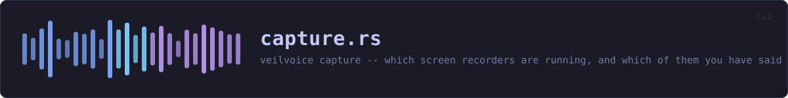
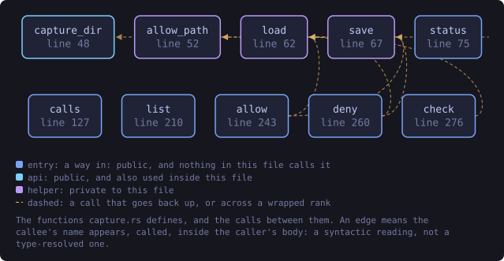
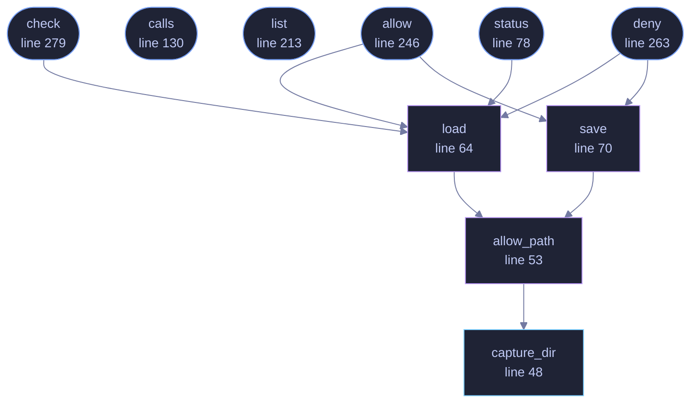

<!-- SPDX-License-Identifier: GPL-3.0-or-later -->
<!-- GENERATED by tools/docs/generate.py from the doc comments in the
     source. Do not edit this file: edit the `//!` and `///` comments in
     the .rs files and run the generator again. CI verifies it with
         python tools/docs/generate.py --check
-->

<p align="center">
  
</p>

# `crates/veilvoice-cli/src/capture.rs`

[`veilvoice-cli`](../../../crates/veilvoice-cli/README.md) &middot; 339 lines &middot; [read the source](https://github.com/tilas01/veilvoice/blob/main/crates/veilvoice-cli/src/capture.rs)

## Contents

- [Where the allowlist lives](#where-the-allowlist-lives)
- [The exit code](#the-exit-code)
- [In plain words](#in-plain-words)
  - [What this file contains](#what-this-file-contains)
  - [What calls what](#what-calls-what)
  - [Items](#items)

`veilvoice capture` -- which screen recorders are running, and which of them
you have said you meant to run.

The command-line front end to `veilvoice_watch::capture`. That crate holds the
table, the allowlist and the honest account of the three things it cannot
do; this file decides where the allowlist lives and prints the result.

# Where the allowlist lives

```text
<config>/veilvoice/capture/allow.txt
```

Beside everything else this program keeps. Plain text, nothing secret in it:
an allowlist is a note to yourself about which notifications you have
already read.

# The exit code

`veilvoice capture check` exits non-zero when something **not allowed** is
running, so it can be a step in a script that refuses to start recording
something sensitive while a recorder is open. Allowing a program is
precisely how you tell that script you meant it.

It exits zero when the listing itself failed, and says so on the way past.
A check that cannot see is not a check that passed, but neither is it a
reason to fail a script. The difference is in the words, and the words are
printed.

# In plain words

Tells you which screen recorders are running, and lets you say you meant to
start one so it stops being mentioned.

It cannot tell whether a program is actually recording, only that it is open,
and it says so. A meeting application being open is not somebody watching your
screen.

## What this file contains

339 lines defining **10 functions** (7 public), **0 types** and **0 constants**. Everything below is read out of the source, so it cannot disagree with the code.

**What happens when it runs.** These are the ways in: public, and nothing else in this file calls them, so they are what an outside caller reaches first.

- `status` (line 78) -- What is running, what is allowed, and what this cannot see.
  - reaches: `load`, `allow_path`, `capture_dir`
- `calls` (line 130) -- Every program in the table, whether it is running or not.
- `list` (line 213) -- veilvoice capture list: the screen recorders this build knows how to name.
- `allow` (line 246) -- Stop notifying about one program.
  - reaches: `load`, `save`, `allow_path`, `capture_dir`
- `deny` (line 263) -- Start notifying about one program again.
  - reaches: `load`, `save`, `allow_path`, `capture_dir`
- `check` (line 279) -- Look now, and let the exit code answer.
  - reaches: `load`, `allow_path`, `capture_dir`

## What calls what

The functions this file defines, and the calls between them. Both
are read out of the source: an edge means the callee's name appears,
called, inside the caller's body. It is a syntactic reading, not a
type-resolved one, so a call made through a trait object or a macro
will not appear.

_Colour key: **entry** -- a way in: public, and nothing in this file calls it; **api** -- public, and also used inside this file; **helper** -- private to this file._

<p align="center">
  
</p>

<details>
<summary>The same graph as Mermaid source</summary>



</details>

## Items

| Item | Line | Documentation |
|---|---:|---|
| `capture_dir` <sub>pub fn</sub> | [48](https://github.com/tilas01/veilvoice/blob/main/crates/veilvoice-cli/src/capture.rs#L48) | Where the allowlist is kept. |
| `allow_path` <sub>fn</sub> | [53](https://github.com/tilas01/veilvoice/blob/main/crates/veilvoice-cli/src/capture.rs#L53) | Where the screen-recorder allowlist is kept for this user. |
| `load` <sub>fn</sub> | [64](https://github.com/tilas01/veilvoice/blob/main/crates/veilvoice-cli/src/capture.rs#L64) | The allowlist, or an empty one when none has been written yet. |
| `save` <sub>fn</sub> | [70](https://github.com/tilas01/veilvoice/blob/main/crates/veilvoice-cli/src/capture.rs#L70) | Write the allowlist back, readable by its owner and nobody else. |
| `status` <sub>pub fn</sub> | [78](https://github.com/tilas01/veilvoice/blob/main/crates/veilvoice-cli/src/capture.rs#L78) | What is running, what is allowed, and what this cannot see. |
| `calls` <sub>pub fn</sub> | [130](https://github.com/tilas01/veilvoice/blob/main/crates/veilvoice-cli/src/capture.rs#L130) | Every program in the table, whether it is running or not. |
| `list` <sub>pub fn</sub> | [213](https://github.com/tilas01/veilvoice/blob/main/crates/veilvoice-cli/src/capture.rs#L213) | veilvoice capture list: the screen recorders this build knows how to name. |
| `allow` <sub>pub fn</sub> | [246](https://github.com/tilas01/veilvoice/blob/main/crates/veilvoice-cli/src/capture.rs#L246) | Stop notifying about one program. |
| `deny` <sub>pub fn</sub> | [263](https://github.com/tilas01/veilvoice/blob/main/crates/veilvoice-cli/src/capture.rs#L263) | Start notifying about one program again. |
| `check` <sub>pub fn</sub> | [279](https://github.com/tilas01/veilvoice/blob/main/crates/veilvoice-cli/src/capture.rs#L279) | Look now, and let the exit code answer. |

---

Generated from `crates/veilvoice-cli/src/capture.rs`. On the website: [`website/reference/veilvoice-cli/capture.html`](../../../website/reference/veilvoice-cli/capture.html).

Signing key fingerprint `8101FB3BB28D02FB239E0CDF9CC1C7E7A9B5833A`.
