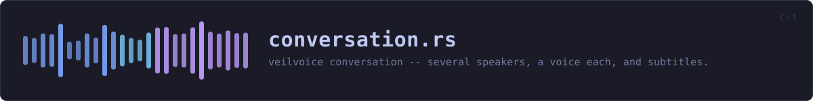
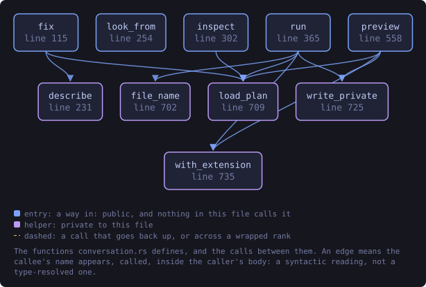
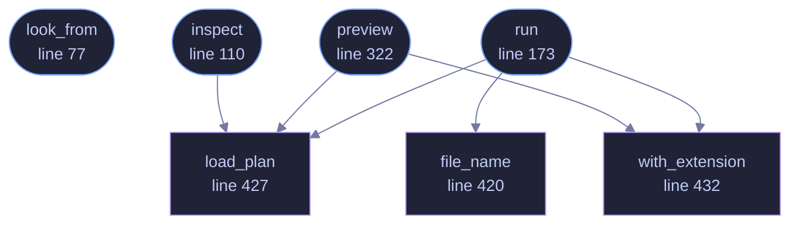

<!-- SPDX-License-Identifier: GPL-3.0-or-later -->
<!-- GENERATED by tools/docs/generate.py from the doc comments in the
     source. Do not edit this file: edit the `//!` and `///` comments in
     the .rs files and run the generator again. CI verifies it with
         python tools/docs/generate.py --check
-->

<p align="center">
  
</p>

# `crates/veilvoice-cli/src/conversation.rs`

[`veilvoice-cli`](../../../crates/veilvoice-cli/README.md) &middot; 647 lines &middot; [read the source](https://github.com/tilas01/veilvoice/blob/main/crates/veilvoice-cli/src/conversation.rs)

## Contents

- [What comes out](#what-comes-out)
- [The page, and why it is not a video](#the-page-and-why-it-is-not-a-video)
- [The one warning this command will not let you miss](#the-one-warning-this-command-will-not-let-you-miss)
- [This does not encrypt what it writes](#this-does-not-encrypt-what-it-writes)
  - [What this file contains](#what-this-file-contains)
  - [What calls what](#what-calls-what)
  - [Items](#items)

`veilvoice conversation` -- several speakers, a voice each, and subtitles.

The command-line front end to `veilvoice_conversation`. That crate holds
the plan, the renderer and the honest account of what a conversation keeps;
this file reads the audio, writes the results and prints what happened.

# What comes out

Three files beside the output you name:

```text
out.veiled.wav   the audio, one destination voice per speaker
out.veiled.vtt   subtitles for a browser
out.veiled.srt   subtitles for everything else
out.veiled.html  with `--page`: a player that needs nothing installed
```

# The page, and why it is not a video

`--page` writes a self-contained HTML player: the waveform, a circle per
speaker that lights when they speak, and the subtitles. It references the
audio and the WebVTT track by relative name rather than embedding them, so
the files move together and the page does not double the size of a recording
already sitting beside it.

A *video* file needs an encoder, and this project ships no codec. `preview`
prints the `ffmpeg` command that would make one, and says whether `ffmpeg`
is on this machine -- it never runs it. Nothing here silently depends on a
program the user did not know they were running.

The subtitles are written whether or not anybody wrote down the words. With
every voice replaced, a caption track saying *who* is talking is often the
only way to follow a recording at all.

# The one warning this command will not let you miss

Audio no turn claims is **silenced**, never passed through. A gap in the
plan is a span nobody assigned to a speaker, so it has not been veiled, and
putting it into the result would place a real voice inside a file whose
whole purpose is that it contains none. The amount is printed, loudly,
because a plan with a hole in it is something to fix rather than something
to discover later.

# This does not encrypt what it writes

Unlike `anonymise`, which seals its output at rest by default. A conversation
render produces a set of files -- audio and two subtitle tracks -- and the
container this project uses seals one thing. Rather than invent a
half-answer, the files are written in the clear and the command says so:
`veilvoice encrypt` seals the audio afterwards, and the subtitles hold
whatever names were typed and are not veiled by anything.

## What this file contains

647 lines defining **7 functions** (4 public), **0 types** and **1 constant**. Everything below is read out of the source, so it cannot disagree with the code.

**What happens when it runs.** These are the ways in: public, and nothing else in this file calls them, so they are what an outside caller reaches first.

- `look_from` (line 77) -- Turn the picture flags into a Look, or explain why they do not describe a picture that can be drawn.
- `inspect` (line 110) -- Show a plan without rendering anything.
  - reaches: `load_plan`
- `run` (line 173) -- Render a recording according to a plan.
  - reaches: `file_name`, `load_plan`, `with_extension`
- `preview` (line 322) -- A still of what the page will look like, and the command that would make a video of it.
  - reaches: `load_plan`, `with_extension`

## What calls what

The functions this file defines, and the calls between them. Both
are read out of the source: an edge means the callee's name appears,
called, inside the caller's body. It is a syntactic reading, not a
type-resolved one, so a call made through a trait object or a macro
will not appear.

_Colour key: **entry** -- a way in: public, and nothing in this file calls it; **helper** -- private to this file._

<p align="center">
  
</p>

<details>
<summary>The same graph as Mermaid source</summary>



</details>

## Items

| Item | Line | Documentation |
|---|---:|---|
| `WAVE_COLUMNS` <sub>const</sub> | [69](https://github.com/tilas01/veilvoice/blob/main/crates/veilvoice-cli/src/conversation.rs#L69) | How many columns of waveform to reduce a recording to. |
| `look_from` <sub>pub fn</sub> | [77](https://github.com/tilas01/veilvoice/blob/main/crates/veilvoice-cli/src/conversation.rs#L77) | Turn the picture flags into a Look, or explain why they do not describe a picture that can be drawn. |
| `inspect` <sub>pub fn</sub> | [110](https://github.com/tilas01/veilvoice/blob/main/crates/veilvoice-cli/src/conversation.rs#L110) | Show a plan without rendering anything. |
| `run` <sub>pub fn</sub> | [173](https://github.com/tilas01/veilvoice/blob/main/crates/veilvoice-cli/src/conversation.rs#L173) | Render a recording according to a plan. |
| `preview` <sub>pub fn</sub> | [322](https://github.com/tilas01/veilvoice/blob/main/crates/veilvoice-cli/src/conversation.rs#L322) | A still of what the page will look like, and the command that would make a video of it. |
| `file_name` <sub>fn</sub> | [420](https://github.com/tilas01/veilvoice/blob/main/crates/veilvoice-cli/src/conversation.rs#L420) | The last component of a path, for writing into a page as a relative link. |
| `load_plan` <sub>fn</sub> | [427](https://github.com/tilas01/veilvoice/blob/main/crates/veilvoice-cli/src/conversation.rs#L427) | Read a plan, and say where it went wrong rather than only that it did. |
| `with_extension` <sub>fn</sub> | [432](https://github.com/tilas01/veilvoice/blob/main/crates/veilvoice-cli/src/conversation.rs#L432) | Replace the last extension, keeping any .veiled before it. |

---

Generated from `crates/veilvoice-cli/src/conversation.rs`. On the website: [`website/reference/veilvoice-cli/conversation.html`](../../../website/reference/veilvoice-cli/conversation.html).

Signing key fingerprint `8101FB3BB28D02FB239E0CDF9CC1C7E7A9B5833A`.
