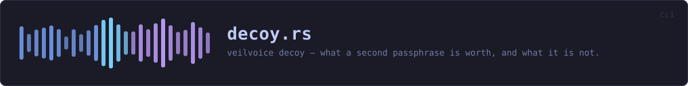
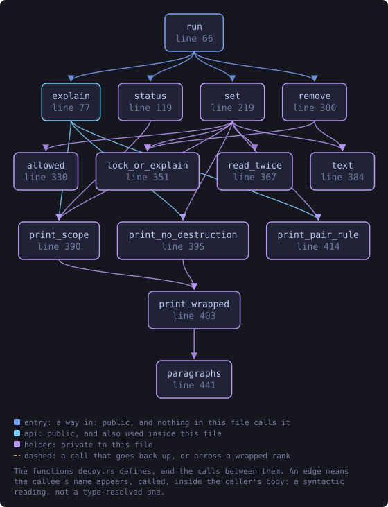
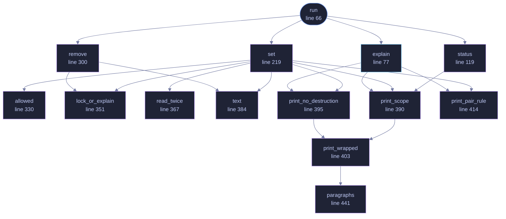

<!-- SPDX-License-Identifier: GPL-3.0-or-later -->
<!-- GENERATED by tools/docs/generate.py from the doc comments in the
     source. Do not edit this file: edit the `//!` and `///` comments in
     the .rs files and run the generator again. CI verifies it with
         python tools/docs/generate.py --check
-->

  

# `crates/veilvoice-cli/src/decoy.rs`

[`veilvoice-cli`](../../../crates/veilvoice-cli/README.md) &middot; 550 lines &middot; [read the source](https://github.com/tilas01/veilvoice/blob/main/crates/veilvoice-cli/src/decoy.rs)

## Contents

- [What it is worth is printed on the way in, not behind a flag](#what-it-is-worth-is-printed-on-the-way-in-not-behind-a-flag)
- [In plain words](#in-plain-words)
  - [What this file contains](#what-this-file-contains)
  - [What calls what](#what-calls-what)
  - [Items](#items)

`veilvoice decoy`, and what a second passphrase is worth and what it is not.

# What it is worth is printed on the way in, not behind a flag

Every path that reports on a decoy or sets one up prints
`veilvoice_crypto::decoy::SCOPE`, and the two that set one print
`veilvoice_crypto::decoy::WHY_NO_DESTRUCTION` with it, for the same reason
`crate::lock` prints the lock's own: somebody who believes a decoy hides
that a second passphrase exists has been made **less** safe by it, not more.
They would rely on an argument they do not have.

Removing one is the exception and prints neither. Nothing is being taken on
trust there, and a reader who has just asked for the feature to go does not
need a page on what it was worth.

The window prints the same two passages from the same two constants, so
neither front end can soften it without the other.

# In plain words

Explains the decoy passphrase, and sets, changes or removes one.

A decoy opens VeilVoice with nothing in it. It is there for the situation
where somebody is standing over you asking you to unlock your computer: it
gives you something true to say.

It does not hide that a second passphrase might exist, and no passphrase
destroys your recordings. Both of those are printed every time, and the
second is deliberate: on modern storage, deleting a file does not reliably
remove it, so a feature that claimed to would be lying to you at the worst
possible moment.

Setting or removing a decoy asks for your real passphrase first, so nobody
can do either at a window you left unlocked.

## What this file contains

550 lines defining **14 functions** (2 public), **1 type** and **0 constants**. Everything below is read out of the source, so it cannot disagree with the code.

**The types it owns.**

- `enum Action` (line 49) -- What veilvoice decoy can be asked to do.

**What happens when it runs.** These are the ways in: public, and nothing else in this file calls them, so they are what an outside caller reaches first.

- `run` (line 66) -- Dispatch veilvoice decoy, or explain the feature when nothing was asked.
  - reaches: `explain`, `remove`, `set`, `status`, `print_no_destruction`, `print_pair_rule`, `print_scope`, `lock_or_explain`, `text`, `allowed`, `read_twice`, `print_wrapped`

## What calls what

The functions this file defines, and the calls between them. Both
are read out of the source: an edge means the callee's name appears,
called, inside the caller's body. It is a syntactic reading, not a
type-resolved one, so a call made through a trait object or a macro
will not appear.

_Colour key: **entry** -- a way in: public, and nothing in this file calls it; **api** -- public, and also used inside this file; **helper** -- private to this file._

  

The same graph as Mermaid source

## Items

| Item | Line | Documentation |
|---|---:|---|
| `Action` pub enum | [49](https://github.com/tilas01/veilvoice/blob/main/crates/veilvoice-cli/src/decoy.rs#L49) | What veilvoice decoy can be asked to do. |
| `run` pub fn | [66](https://github.com/tilas01/veilvoice/blob/main/crates/veilvoice-cli/src/decoy.rs#L66) | Dispatch veilvoice decoy, or explain the feature when nothing was asked. |
| `explain` pub fn | [77](https://github.com/tilas01/veilvoice/blob/main/crates/veilvoice-cli/src/decoy.rs#L77) | Explain the feature and its limits. |
| `status` fn | [119](https://github.com/tilas01/veilvoice/blob/main/crates/veilvoice-cli/src/decoy.rs#L119) | veilvoice decoy status: whether a decoy is set, and where it lives. |
| `set` fn | [219](https://github.com/tilas01/veilvoice/blob/main/crates/veilvoice-cli/src/decoy.rs#L219) | veilvoice decoy set and veilvoice decoy change, which are one path. |
| `remove` fn | [300](https://github.com/tilas01/veilvoice/blob/main/crates/veilvoice-cli/src/decoy.rs#L300) | veilvoice decoy remove: take the decoy off, after proving the real one. |
| `allowed` fn | [330](https://github.com/tilas01/veilvoice/blob/main/crates/veilvoice-cli/src/decoy.rs#L330) | Whether the state on disk allows what was asked, and what to say first. |
| `lock_or_explain` fn | [351](https://github.com/tilas01/veilvoice/blob/main/crates/veilvoice-cli/src/decoy.rs#L351) | The app lock, or a message saying what to do about there not being one. |
| `read_twice` fn | [367](https://github.com/tilas01/veilvoice/blob/main/crates/veilvoice-cli/src/decoy.rs#L367) | Read the decoy twice, without echoing it, and check the two agree. |
| `text` fn | [384](https://github.com/tilas01/veilvoice/blob/main/crates/veilvoice-cli/src/decoy.rs#L384) | A typed passphrase as text. |
| `print_scope` fn | [390](https://github.com/tilas01/veilvoice/blob/main/crates/veilvoice-cli/src/decoy.rs#L390) | What a decoy is worth, wrapped, from the one constant both front ends read. |
| `print_no_destruction` fn | [395](https://github.com/tilas01/veilvoice/blob/main/crates/veilvoice-cli/src/decoy.rs#L395) | Why no passphrase destroys anything, from the same place. |
| `print_wrapped` fn | [403](https://github.com/tilas01/veilvoice/blob/main/crates/veilvoice-cli/src/decoy.rs#L403) | Print an indented, wrapped passage, with the blank lines left blank. |
| `print_pair_rule` fn | [414](https://github.com/tilas01/veilvoice/blob/main/crates/veilvoice-cli/src/decoy.rs#L414) | The rule about the pair, and why there is one. |
| `paragraphs` fn | [441](https://github.com/tilas01/veilvoice/blob/main/crates/veilvoice-cli/src/decoy.rs#L441) | Wrap text that has paragraphs in it, and keep the paragraphs. |

---

Generated from `crates/veilvoice-cli/src/decoy.rs`. On the website: [`website/reference/veilvoice-cli/decoy.html`](../../../website/reference/veilvoice-cli/decoy.html).

Signing key fingerprint `8101FB3BB28D02FB239E0CDF9CC1C7E7A9B5833A`.
