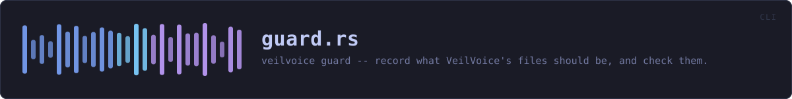
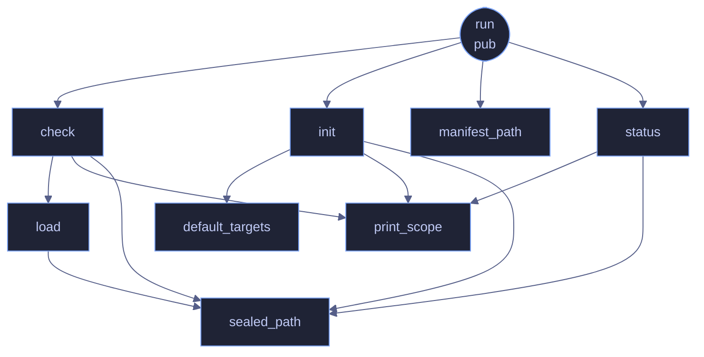

<!-- SPDX-License-Identifier: CC-BY-NC-SA-4.0 -->
<!-- GENERATED by tools/docs/generate.py from the doc comments in the
     source. Do not edit this file: edit the `//!` and `///` comments in
     the .rs files and run the generator again. CI verifies it with
         python tools/docs/generate.py --check
-->

  

# `crates/veilvoice-cli/src/guard.rs`

[`veilvoice-cli`](../../../crates/veilvoice-cli/README.md) &middot; 306 lines &middot; [read the source](https://github.com/tilas01/veilvoice/blob/main/crates/veilvoice-cli/src/guard.rs)

## Contents

- [What calls what](#what-calls-what)
- [Items](#items)

`veilvoice guard` -- record what VeilVoice's files should be, and check them.

Detection, not prevention. See `veilvoice_guard::SCOPE`, which every path
through this module prints, for the same reason the app lock prints its own:
a protection someone over-trusts has made them less safe, not more.

## What calls what

The functions this file defines, and the calls between them. Both
are read out of the source: an edge means the callee's name appears,
called, inside the caller's body. It is a syntactic reading, not a
type-resolved one, so a call made through a trait object or a macro
will not appear.

## Items

| Item | Line | Documentation |
|---|---:|---|
| `Action` pub enum | [14](https://github.com/tilas01/veilvoice/blob/main/crates/veilvoice-cli/src/guard.rs#L14) |  |
| `manifest_path` fn | [35](https://github.com/tilas01/veilvoice/blob/main/crates/veilvoice-cli/src/guard.rs#L35) | Where the manifest lives, beside the app lock. |
| `sealed_path` fn | [48](https://github.com/tilas01/veilvoice/blob/main/crates/veilvoice-cli/src/guard.rs#L48) | A sealed manifest sits beside the plain one, with a different suffix. |
| `print_scope` fn | [52](https://github.com/tilas01/veilvoice/blob/main/crates/veilvoice-cli/src/guard.rs#L52) |  |
| `default_targets` fn | [61](https://github.com/tilas01/veilvoice/blob/main/crates/veilvoice-cli/src/guard.rs#L61) | The files worth watching when the user names none: the running binary, and the app lock beside it. |
| `run` pub fn | [74](https://github.com/tilas01/veilvoice/blob/main/crates/veilvoice-cli/src/guard.rs#L74) |  |
| `init` fn | [86](https://github.com/tilas01/veilvoice/blob/main/crates/veilvoice-cli/src/guard.rs#L86) |  |
| `load` fn | [149](https://github.com/tilas01/veilvoice/blob/main/crates/veilvoice-cli/src/guard.rs#L149) | Load whichever form of the record exists, asking for a passphrase only if the sealed one is the one that is there. |
| `check` fn | [162](https://github.com/tilas01/veilvoice/blob/main/crates/veilvoice-cli/src/guard.rs#L162) |  |
| `status` fn | [231](https://github.com/tilas01/veilvoice/blob/main/crates/veilvoice-cli/src/guard.rs#L231) |  |

---

Generated from `crates/veilvoice-cli/src/guard.rs`. On the website: [`website/reference/veilvoice-cli/guard.html`](../../../website/reference/veilvoice-cli/guard.html).

Signing key fingerprint `8101FB3BB28D02FB239E0CDF9CC1C7E7A9B5833A`.
