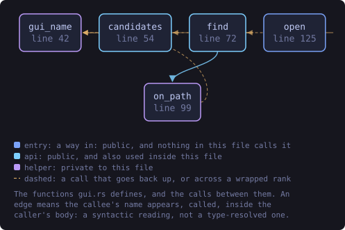
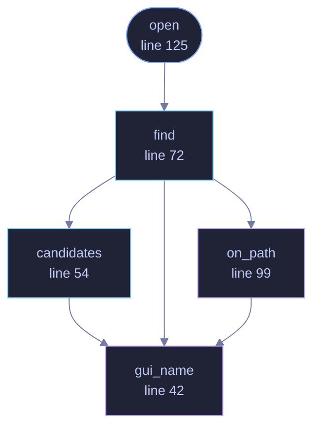

<!-- SPDX-License-Identifier: GPL-3.0-or-later -->
<!-- GENERATED by tools/docs/generate.py from the doc comments in the
     source. Do not edit this file: edit the `//!` and `///` comments in
     the .rs files and run the generator again. CI verifies it with
         python tools/docs/generate.py --check
-->

  

# `crates/veilvoice-cli/src/gui.rs`

[`veilvoice-cli`](../../../crates/veilvoice-cli/README.md) &middot; 247 lines &middot; [read the source](https://github.com/tilas01/veilvoice/blob/main/crates/veilvoice-cli/src/gui.rs)

## Contents

- [Why this is not simply Command::new("veilvoice-gui")](#why-this-is-not-simply-commandnewveilvoice-gui)
- [It does not wait](#it-does-not-wait)
- [In plain words](#in-plain-words)
  - [What this file contains](#what-this-file-contains)
  - [What calls what](#what-calls-what)
  - [Items](#items)

`veilvoice gui` opens the desktop application from the command line.

# Why this is not simply `Command::new("veilvoice-gui")`

A bare name is resolved through `PATH`, and on Windows the **current
directory is searched first**. So `veilvoice gui`, run inside a downloads
folder that happens to contain something called `veilvoice-gui.exe`, would
start that instead. This is the one command whose whole job is to launch
another program, which makes it a poor place to be relaxed about which.

So the search is explicit and in a stated order:

1. **Beside this binary.** A portable folder holds all three programs
together, and somebody who unpacked a release and typed `veilvoice gui`
means the one they unpacked.
2. **Where an installation puts it**, from `veilvoice_setup::install`.
3. **`PATH`**, last, and only through the system's own resolver.

If none of those has it, that is said plainly with the places that were
looked in, rather than a "not found" that leaves somebody guessing.

# It does not wait

The window is started and the command returns. A terminal held open for as
long as a desktop application runs is a terminal somebody cannot use, and
closing it would then close the window.

# In plain words

Type `veilvoice gui` (or `veilvoice g`) and the VeilVoice window opens. The
terminal is yours again immediately; closing it will not close the window.

It looks for the application next to the command first, then where an
install would have put it, then on your system path. If it cannot find
it anywhere, it tells you exactly where it looked.

## What this file contains

247 lines defining **5 functions** (3 public), **0 types** and **0 constants**. Everything below is read out of the source, so it cannot disagree with the code.

**What happens when it runs.** These are the ways in: public, and nothing else in this file calls them, so they are what an outside caller reaches first.

- `open` (line 125) -- Open the window.
  - reaches: `find`, `candidates`, `gui_name`, `on_path`

## What calls what

The functions this file defines, and the calls between them. Both
are read out of the source: an edge means the callee's name appears,
called, inside the caller's body. It is a syntactic reading, not a
type-resolved one, so a call made through a trait object or a macro
will not appear.

_Colour key: **entry** -- a way in: public, and nothing in this file calls it; **api** -- public, and also used inside this file; **helper** -- private to this file._

  

The same graph as Mermaid source

## Items

| Item | Line | Documentation |
|---|---:|---|
| `gui_name` fn | [42](https://github.com/tilas01/veilvoice/blob/main/crates/veilvoice-cli/src/gui.rs#L42) | The executable's name on this platform. |
| `candidates` pub fn | [54](https://github.com/tilas01/veilvoice/blob/main/crates/veilvoice-cli/src/gui.rs#L54) | Everywhere this looks, in order, and whether each had it. |
| `find` pub fn | [72](https://github.com/tilas01/veilvoice/blob/main/crates/veilvoice-cli/src/gui.rs#L72) | The desktop application, wherever it is. |
| `on_path` fn | [99](https://github.com/tilas01/veilvoice/blob/main/crates/veilvoice-cli/src/gui.rs#L99) | Ask the system where the program is, if anywhere. |
| `open` pub fn | [125](https://github.com/tilas01/veilvoice/blob/main/crates/veilvoice-cli/src/gui.rs#L125) | Open the window. |

---

Generated from `crates/veilvoice-cli/src/gui.rs`. On the website: [`website/reference/veilvoice-cli/gui.html`](../../../website/reference/veilvoice-cli/gui.html).

Signing key fingerprint `8101FB3BB28D02FB239E0CDF9CC1C7E7A9B5833A`.
