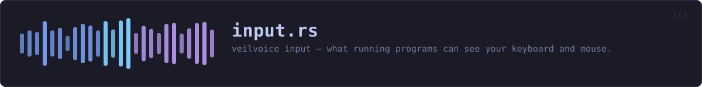
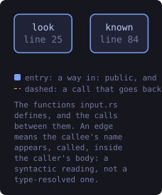

<!-- SPDX-License-Identifier: GPL-3.0-or-later -->
<!-- GENERATED by tools/docs/generate.py from the doc comments in the
     source. Do not edit this file: edit the `//!` and `///` comments in
     the .rs files and run the generator again. CI verifies it with
         python tools/docs/generate.py --check
-->

  

# `crates/veilvoice-cli/src/input.rs`

[`veilvoice-cli`](../../../crates/veilvoice-cli/README.md) &middot; 117 lines &middot; [read the source](https://github.com/tilas01/veilvoice/blob/main/crates/veilvoice-cli/src/input.rs)

## Contents

- [In plain words](#in-plain-words)
  - [What this file contains](#what-this-file-contains)
  - [What calls what](#what-calls-what)
  - [Items](#items)

`veilvoice input` shows which running programs can see your keyboard and mouse.

The whole command is arranged around one risk: that somebody runs it, sees
nothing listed, and concludes their machine is clean. That conclusion is
wrong and acting on it makes them less safe than not having looked, so the
limits are printed **with** the result rather than behind a flag, and they
are printed whether anything was found or not.

# In plain words

This tells you which of the programs currently open on your computer are
able to see what you type or where you click. Most of them will be things
you installed on purpose, such as a password manager, a screen reader, remote
support software you use for work.

It cannot tell you whether anything is actually recording your typing. No
program can, and this one says so every time rather than letting a short
list look like good news.

## What this file contains

117 lines defining **2 functions** (2 public), **0 types** and **0 constants**. Everything below is read out of the source, so it cannot disagree with the code.

**What happens when it runs.** These are the ways in: public, and nothing else in this file calls them, so they are what an outside caller reaches first.

- `look` (line 25) -- Show what can see input on this machine.
- `known` (line 84) -- Everything this build knows how to recognise, whether running or not.

## What calls what

The functions this file defines, and the calls between them. Both
are read out of the source: an edge means the callee's name appears,
called, inside the caller's body. It is a syntactic reading, not a
type-resolved one, so a call made through a trait object or a macro
will not appear.

_Colour key: **entry** -- a way in: public, and nothing in this file calls it._

  

The same graph as Mermaid source

```mermaid
%%{init: {"theme":"base","themeVariables":{"background":"#1a1b26","primaryColor":"#1f2335","primaryTextColor":"#c0caf5","primaryBorderColor":"#7aa2f7","secondaryColor":"#16161e","tertiaryColor":"#16161e","lineColor":"#737aa2","textColor":"#c0caf5","mainBkg":"#1f2335","nodeBorder":"#7aa2f7","clusterBkg":"#16161e","clusterBorder":"#2f3549","fontFamily":"ui-monospace, SFMono-Regular, Consolas, monospace","fontSize":"14px"}}}%%
flowchart TD
    n_look(["look<br/>line 25"])
    n_known(["known<br/>line 84"])
    click n_look href "https://github.com/tilas01/veilvoice/blob/main/crates/veilvoice-cli/src/input.rs#L25" "open the source"
    click n_known href "https://github.com/tilas01/veilvoice/blob/main/crates/veilvoice-cli/src/input.rs#L84" "open the source"
    classDef entry fill:#1f2335,stroke:#7aa2f7,color:#c0caf5
    class n_look,n_known entry
```

## Items

| Item | Line | Documentation |
|---|---:|---|
| `look` pub fn | [25](https://github.com/tilas01/veilvoice/blob/main/crates/veilvoice-cli/src/input.rs#L25) | Show what can see input on this machine. |
| `known` pub fn | [84](https://github.com/tilas01/veilvoice/blob/main/crates/veilvoice-cli/src/input.rs#L84) | Everything this build knows how to recognise, whether running or not. |

---

Generated from `crates/veilvoice-cli/src/input.rs`. On the website: [`website/reference/veilvoice-cli/input.html`](../../../website/reference/veilvoice-cli/input.html).

Signing key fingerprint `8101FB3BB28D02FB239E0CDF9CC1C7E7A9B5833A`.
