<!-- SPDX-License-Identifier: GPL-3.0-or-later -->
<!-- GENERATED by tools/docs/generate.py from the doc comments in the
     source. Do not edit this file: edit the `//!` and `///` comments in
     the .rs files and run the generator again. CI verifies it with
         python tools/docs/generate.py --check
-->

  

# `crates/veilvoice-cli/src/install.rs`

[`veilvoice-cli`](../../../crates/veilvoice-cli/README.md) &middot; 513 lines &middot; [read the source](https://github.com/tilas01/veilvoice/blob/main/crates/veilvoice-cli/src/install.rs)

## Contents

- [Portable is the default, and installing is the exception](#portable-is-the-default-and-installing-is-the-exception)
- [No administrator, and nothing outside the user's own account](#no-administrator-and-nothing-outside-the-users-own-account)
- [Every change is reversible, and uninstall reverses exactly these](#every-change-is-reversible-and-uninstall-reverses-exactly-these)
- [Why the registry through reg.exe](#why-the-registry-through-regexe)
  - [What this file contains](#what-this-file-contains)
  - [What calls what](#what-calls-what)
  - [Items](#items)

`veilvoice install` -- put this program somewhere the system can find it.

# Portable is the default, and installing is the exception

VeilVoice runs from wherever it is unpacked. Nothing has to be installed,
nothing is written outside the folder unless the user does something that
writes outside the folder, and deleting the folder removes it. That is the
posture this project has always had and it is not being given up.

This exists because "runs from anywhere" and "I would like to type
`veilvoice` in a terminal" are both reasonable, and the second needs three
things a portable folder cannot provide: a stable location, an entry on
`PATH`, and a way for the operating system to list and remove it.

# No administrator, and nothing outside the user's own account

Everything here is per-user: `%LOCALAPPDATA%` on Windows,
`~/.local` on everything else, and on Windows the `HKCU` registry rather
than `HKLM`. No elevation is requested, nothing is written to a system
directory, and no service is created.

That is a deliberate limit rather than an oversight. A per-user install can
be undone by the user who made it, needs no privilege to audit, and cannot
break anybody else's account. A machine-wide install would need
administrator rights, and the reason to ask for those has to be better than
"so the program is on everyone's PATH".

# Every change is reversible, and `uninstall` reverses exactly these

| What | Where | Undone by |
|---|---|---|
| The binaries | `<prefix>/VeilVoice` | removing that directory |
| `PATH` entry | `HKCU\Environment`, or a shell profile line | removing just that entry |
| Uninstall entry | `HKCU\...\Uninstall\VeilVoice` | deleting that key |

The `PATH` edit is the one that can damage something, so it is the one
handled most carefully: the existing value is read, the entry is appended
only if absent, and removal takes out that entry and nothing else. A tool
that overwrites `PATH` wholesale has broken a machine, and doing it during
an *uninstall* is worse -- that is the moment somebody is least inclined to
check.

# Why the registry through `reg.exe`

The same reason `veilvoice-watch` reads it that way: this workspace carries
`#![forbid(unsafe_code)]` in every crate, and the Win32 registry API needs
`unsafe` FFI. Shelling out to a system tool keeps that guarantee and costs a
subprocess on an operation that runs once. `reg.exe` is resolved by absolute
path -- resolving it by name would search the working directory first, which
is finding F-13.

## What this file contains

513 lines defining **19 functions** (5 public), **1 type** and **2 constants**. Everything below is read out of the source, so it cannot disagree with the code.

**The types it owns.**

- `struct Status` (line 121) -- What an installation currently looks like.

**What happens when it runs.** These are the ways in: public, and nothing else in this file calls them, so they are what an outside caller reaches first.

- `status` (line 133) -- Read the current state without changing anything.
  - reaches: `exe_name`, `path_contains`, `prefix`
- `install` (line 403) -- Install for this user.
  - reaches: `add_to_path`, `bin_dir`, `copy_programs`, `prefix`, `register_uninstall`, `no_window`, `read_user_path`, `reg_exe`, `exe_name`
- `uninstall` (line 430) -- Remove what install added.
  - reaches: `bin_dir`, `prefix`, `remove_from_path`, `unregister_uninstall`, `no_window`, `read_user_path`, `reg_exe`

## What calls what

The functions this file defines, and the calls between them. Both
are read out of the source: an edge means the callee's name appears,
called, inside the caller's body. It is a syntactic reading, not a
type-resolved one, so a call made through a trait object or a macro
will not appear.

_Colour key: **entry** -- a way in: public, and nothing in this file calls it; **api** -- public, and also used inside this file; **helper** -- private to this file._

```mermaid
%%{init: {"theme":"base","themeVariables":{"background":"#1a1b26","primaryColor":"#1f2335","primaryTextColor":"#c0caf5","primaryBorderColor":"#7aa2f7","secondaryColor":"#16161e","tertiaryColor":"#16161e","lineColor":"#737aa2","textColor":"#c0caf5","mainBkg":"#1f2335","nodeBorder":"#7aa2f7","clusterBkg":"#16161e","clusterBorder":"#2f3549","fontFamily":"ui-monospace, SFMono-Regular, Consolas, monospace","fontSize":"14px"}}}%%
flowchart TD
    n_no_window["no_window<br/>line 69"]
    n_reg_exe["reg_exe<br/>line 86"]
    n_prefix["prefix<br/>line 92"]
    n_bin_dir["bin_dir<br/>line 109"]
    n_status(["status<br/>line 133"])
    n_exe_name["exe_name<br/>line 153"]
    n_path_contains["path_contains<br/>line 167"]
    n_copy_programs["copy_programs<br/>line 175"]
    n_add_to_path["add_to_path<br/>line 217"]
    n_read_user_path["read_user_path<br/>line 255"]
    n_add_to_path["add_to_path<br/>line 289"]
    n_register_uninstall["register_uninstall<br/>line 299"]
    n_register_uninstall["register_uninstall<br/>line 338"]
    n_remove_from_path["remove_from_path<br/>line 343"]
    n_remove_from_path["remove_from_path<br/>line 384"]
    n_unregister_uninstall["unregister_uninstall<br/>line 389"]
    n_unregister_uninstall["unregister_uninstall<br/>line 398"]
    n_install(["install<br/>line 403"])
    n_uninstall(["uninstall<br/>line 430"])
    n_add_to_path --> n_no_window
    n_add_to_path --> n_read_user_path
    n_add_to_path --> n_reg_exe
    n_bin_dir --> n_prefix
    n_copy_programs --> n_exe_name
    n_install --> n_add_to_path
    n_install --> n_bin_dir
    n_install --> n_copy_programs
    n_install --> n_prefix
    n_install --> n_register_uninstall
    n_read_user_path --> n_no_window
    n_read_user_path --> n_reg_exe
    n_register_uninstall --> n_exe_name
    n_register_uninstall --> n_no_window
    n_register_uninstall --> n_reg_exe
    n_remove_from_path --> n_no_window
    n_remove_from_path --> n_read_user_path
    n_remove_from_path --> n_reg_exe
    n_status --> n_exe_name
    n_status --> n_path_contains
    n_status --> n_prefix
    n_uninstall --> n_bin_dir
    n_uninstall --> n_prefix
    n_uninstall --> n_remove_from_path
    n_uninstall --> n_unregister_uninstall
    n_unregister_uninstall --> n_no_window
    n_unregister_uninstall --> n_reg_exe
    click n_no_window href "https://github.com/tilas01/veilvoice/blob/main/crates/veilvoice-cli/src/install.rs#L69" "open the source"
    click n_reg_exe href "https://github.com/tilas01/veilvoice/blob/main/crates/veilvoice-cli/src/install.rs#L86" "open the source"
    click n_prefix href "https://github.com/tilas01/veilvoice/blob/main/crates/veilvoice-cli/src/install.rs#L92" "open the source"
    click n_bin_dir href "https://github.com/tilas01/veilvoice/blob/main/crates/veilvoice-cli/src/install.rs#L109" "open the source"
    click n_status href "https://github.com/tilas01/veilvoice/blob/main/crates/veilvoice-cli/src/install.rs#L133" "open the source"
    click n_exe_name href "https://github.com/tilas01/veilvoice/blob/main/crates/veilvoice-cli/src/install.rs#L153" "open the source"
    click n_path_contains href "https://github.com/tilas01/veilvoice/blob/main/crates/veilvoice-cli/src/install.rs#L167" "open the source"
    click n_copy_programs href "https://github.com/tilas01/veilvoice/blob/main/crates/veilvoice-cli/src/install.rs#L175" "open the source"
    click n_add_to_path href "https://github.com/tilas01/veilvoice/blob/main/crates/veilvoice-cli/src/install.rs#L217" "open the source"
    click n_read_user_path href "https://github.com/tilas01/veilvoice/blob/main/crates/veilvoice-cli/src/install.rs#L255" "open the source"
    click n_add_to_path href "https://github.com/tilas01/veilvoice/blob/main/crates/veilvoice-cli/src/install.rs#L289" "open the source"
    click n_register_uninstall href "https://github.com/tilas01/veilvoice/blob/main/crates/veilvoice-cli/src/install.rs#L299" "open the source"
    click n_register_uninstall href "https://github.com/tilas01/veilvoice/blob/main/crates/veilvoice-cli/src/install.rs#L338" "open the source"
    click n_remove_from_path href "https://github.com/tilas01/veilvoice/blob/main/crates/veilvoice-cli/src/install.rs#L343" "open the source"
    click n_remove_from_path href "https://github.com/tilas01/veilvoice/blob/main/crates/veilvoice-cli/src/install.rs#L384" "open the source"
    click n_unregister_uninstall href "https://github.com/tilas01/veilvoice/blob/main/crates/veilvoice-cli/src/install.rs#L389" "open the source"
    click n_unregister_uninstall href "https://github.com/tilas01/veilvoice/blob/main/crates/veilvoice-cli/src/install.rs#L398" "open the source"
    click n_install href "https://github.com/tilas01/veilvoice/blob/main/crates/veilvoice-cli/src/install.rs#L403" "open the source"
    click n_uninstall href "https://github.com/tilas01/veilvoice/blob/main/crates/veilvoice-cli/src/install.rs#L430" "open the source"
    classDef entry fill:#1f2335,stroke:#7aa2f7,color:#c0caf5
    class n_status,n_install,n_uninstall entry
    classDef api fill:#1f2335,stroke:#7dcfff,color:#c0caf5
    class n_prefix,n_bin_dir api
    classDef helper fill:#1f2335,stroke:#bb9af7,color:#c0caf5
    class n_no_window,n_reg_exe,n_exe_name,n_path_contains,n_copy_programs,n_add_to_path,n_read_user_path,n_add_to_path,n_register_uninstall,n_register_uninstall,n_remove_from_path,n_remove_from_path,n_unregister_uninstall,n_unregister_uninstall helper
```

## Items

| Item | Line | Documentation |
|---|---:|---|
| `NAME` pub const | [57](https://github.com/tilas01/veilvoice/blob/main/crates/veilvoice-cli/src/install.rs#L57) | The name of the directory and the uninstall entry. |
| `PROGRAMS` const | [60](https://github.com/tilas01/veilvoice/blob/main/crates/veilvoice-cli/src/install.rs#L60) | Files that make up an installation, if they are beside the running binary. |
| `no_window` fn | [69](https://github.com/tilas01/veilvoice/blob/main/crates/veilvoice-cli/src/install.rs#L69) | Spawn without a console window. |
| `reg_exe` fn | [86](https://github.com/tilas01/veilvoice/blob/main/crates/veilvoice-cli/src/install.rs#L86) | reg.exe, by absolute path. |
| `prefix` pub fn | [92](https://github.com/tilas01/veilvoice/blob/main/crates/veilvoice-cli/src/install.rs#L92) | Where an installation goes, for this user only. |
| `bin_dir` pub fn | [109](https://github.com/tilas01/veilvoice/blob/main/crates/veilvoice-cli/src/install.rs#L109) | The directory a PATH entry should point at. |
| `Status` pub struct | [121](https://github.com/tilas01/veilvoice/blob/main/crates/veilvoice-cli/src/install.rs#L121) | What an installation currently looks like. |
| `status` pub fn | [133](https://github.com/tilas01/veilvoice/blob/main/crates/veilvoice-cli/src/install.rs#L133) | Read the current state without changing anything. |
| `exe_name` fn | [153](https://github.com/tilas01/veilvoice/blob/main/crates/veilvoice-cli/src/install.rs#L153) |  |
| `path_contains` fn | [167](https://github.com/tilas01/veilvoice/blob/main/crates/veilvoice-cli/src/install.rs#L167) | Is dir already on this user's PATH? |
| `copy_programs` fn | [175](https://github.com/tilas01/veilvoice/blob/main/crates/veilvoice-cli/src/install.rs#L175) | Copy the binaries into place. |
| `add_to_path` fn | [217](https://github.com/tilas01/veilvoice/blob/main/crates/veilvoice-cli/src/install.rs#L217) | Add dir to the user's PATH, if it is not there already. |
| `read_user_path` fn | [255](https://github.com/tilas01/veilvoice/blob/main/crates/veilvoice-cli/src/install.rs#L255) |  |
| `add_to_path` fn | [289](https://github.com/tilas01/veilvoice/blob/main/crates/veilvoice-cli/src/install.rs#L289) |  |
| `register_uninstall` fn | [299](https://github.com/tilas01/veilvoice/blob/main/crates/veilvoice-cli/src/install.rs#L299) | Register with Add/Remove Programs, so the system can list and remove it. |
| `register_uninstall` fn | [338](https://github.com/tilas01/veilvoice/blob/main/crates/veilvoice-cli/src/install.rs#L338) |  |
| `remove_from_path` fn | [343](https://github.com/tilas01/veilvoice/blob/main/crates/veilvoice-cli/src/install.rs#L343) |  |
| `remove_from_path` fn | [384](https://github.com/tilas01/veilvoice/blob/main/crates/veilvoice-cli/src/install.rs#L384) |  |
| `unregister_uninstall` fn | [389](https://github.com/tilas01/veilvoice/blob/main/crates/veilvoice-cli/src/install.rs#L389) |  |
| `unregister_uninstall` fn | [398](https://github.com/tilas01/veilvoice/blob/main/crates/veilvoice-cli/src/install.rs#L398) |  |
| `install` pub fn | [403](https://github.com/tilas01/veilvoice/blob/main/crates/veilvoice-cli/src/install.rs#L403) | Install for this user. |
| `uninstall` pub fn | [430](https://github.com/tilas01/veilvoice/blob/main/crates/veilvoice-cli/src/install.rs#L430) | Remove what install added. |

---

Generated from `crates/veilvoice-cli/src/install.rs`. On the website: [`website/reference/veilvoice-cli/install.html`](../../../website/reference/veilvoice-cli/install.html).

Signing key fingerprint `8101FB3BB28D02FB239E0CDF9CC1C7E7A9B5833A`.
