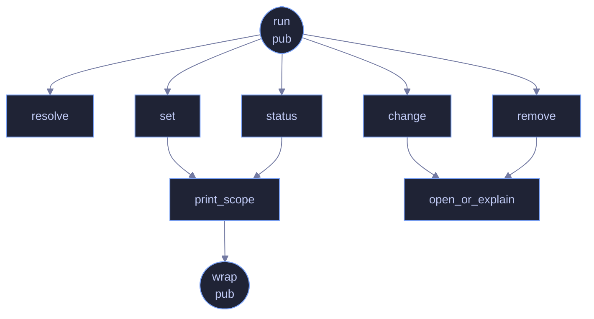

<!-- SPDX-License-Identifier: GPL-3.0-or-later -->
<!-- GENERATED by tools/docs/generate.py from the doc comments in the
     source. Do not edit this file: edit the `//!` and `///` comments in
     the .rs files and run the generator again. CI verifies it with
         python tools/docs/generate.py --check
-->

  

# `crates/veilvoice-cli/src/lock.rs`

[`veilvoice-cli`](../../../crates/veilvoice-cli/README.md) &middot; 239 lines &middot; [read the source](https://github.com/tilas01/veilvoice/blob/main/crates/veilvoice-cli/src/lock.rs)

## Contents

- [What calls what](#what-calls-what)
- [Items](#items)

`veilvoice lock` — manage the application lock from the command line.

The lock guards the desktop app: with one set, VeilVoice asks for a password
before it will show anything or start a live scramble. Managing it from here
exists because a headless machine still has a config directory, and because
anything the GUI can do to a file on disk should be inspectable without the
GUI.

Every path through this module prints `veilvoice_crypto::lock::SCOPE`, for
one reason: a lock the user believes is stronger than it is has made them
*less* safe, not more.

## What calls what

The functions this file defines, and the calls between them. Both
are read out of the source: an edge means the callee's name appears,
called, inside the caller's body. It is a syntactic reading, not a
type-resolved one, so a call made through a trait object or a macro
will not appear.

## Items

| Item | Line | Documentation |
|---|---:|---|
| `Action` pub enum | [21](https://github.com/tilas01/veilvoice/blob/main/crates/veilvoice-cli/src/lock.rs#L21) |  |
| `resolve` fn | [33](https://github.com/tilas01/veilvoice/blob/main/crates/veilvoice-cli/src/lock.rs#L33) | Resolve the lock file, preferring an explicit --path. |
| `print_scope` fn | [45](https://github.com/tilas01/veilvoice/blob/main/crates/veilvoice-cli/src/lock.rs#L45) | Print the honest scope note, wrapped for a terminal. |
| `wrap` pub fn | [54](https://github.com/tilas01/veilvoice/blob/main/crates/veilvoice-cli/src/lock.rs#L54) | Greedy word wrap. |
| `run` pub fn | [72](https://github.com/tilas01/veilvoice/blob/main/crates/veilvoice-cli/src/lock.rs#L72) |  |
| `status` fn | [85](https://github.com/tilas01/veilvoice/blob/main/crates/veilvoice-cli/src/lock.rs#L85) |  |
| `set` fn | [119](https://github.com/tilas01/veilvoice/blob/main/crates/veilvoice-cli/src/lock.rs#L119) |  |
| `change` fn | [162](https://github.com/tilas01/veilvoice/blob/main/crates/veilvoice-cli/src/lock.rs#L162) |  |
| `remove` fn | [174](https://github.com/tilas01/veilvoice/blob/main/crates/veilvoice-cli/src/lock.rs#L174) |  |
| `open_or_explain` fn | [185](https://github.com/tilas01/veilvoice/blob/main/crates/veilvoice-cli/src/lock.rs#L185) |  |

---

Generated from `crates/veilvoice-cli/src/lock.rs`. On the website: [`website/reference/veilvoice-cli/lock.html`](../../../website/reference/veilvoice-cli/lock.html).

Signing key fingerprint `8101FB3BB28D02FB239E0CDF9CC1C7E7A9B5833A`.
