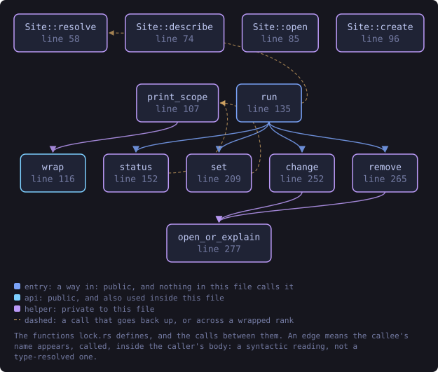
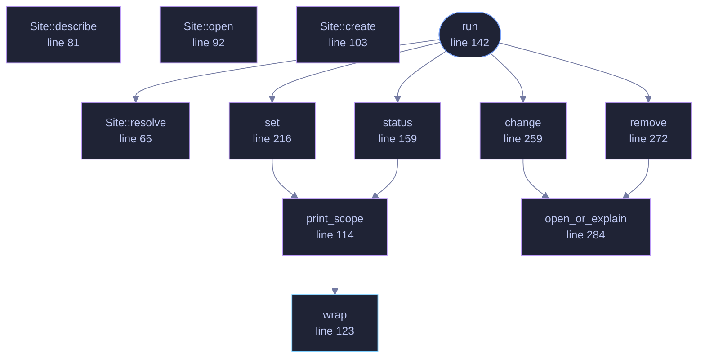

<!-- SPDX-License-Identifier: GPL-3.0-or-later -->
<!-- GENERATED by tools/docs/generate.py from the doc comments in the
     source. Do not edit this file: edit the `//!` and `///` comments in
     the .rs files and run the generator again. CI verifies it with
         python tools/docs/generate.py --check
-->

  

# `crates/veilvoice-cli/src/lock.rs`

[`veilvoice-cli`](../../../crates/veilvoice-cli/README.md) &middot; 354 lines &middot; [read the source](https://github.com/tilas01/veilvoice/blob/main/crates/veilvoice-cli/src/lock.rs)

## Contents

- [In plain words](#in-plain-words)
  - [What this file contains](#what-this-file-contains)
  - [What calls what](#what-calls-what)
  - [Items](#items)

`veilvoice lock` manages the application lock from the command line.

The lock guards the desktop app: with one set, VeilVoice asks for a password
before it will show anything or start a live scramble. Managing it from here
exists because a headless machine still has a config directory, and because
anything the GUI can do to a file on disk should be inspectable without the
GUI.

Every path through this module prints `veilvoice_crypto::lock::SCOPE`, for
one reason: a lock the user believes is stronger than it is has made them
*less* safe, not more.

# In plain words

Sets, changes and clears the passphrase that opens the desktop application,
from a terminal.

It is the same lock the window uses and the same file, so the two cannot get
out of step. What it is worth is printed with it: it stops somebody who picks
up your unlocked computer, and it does not stop somebody holding your disk.

## What this file contains

354 lines defining **12 functions** (2 public), **2 types** and **0 constants**. Everything below is read out of the source, so it cannot disagree with the code.

**The types it owns.**

- `enum Action` (line 37) -- What veilvoice lock can be asked to do.
- `enum Site` (line 57) -- Where the lock is kept for this invocation.

**What happens when it runs.** These are the ways in: public, and nothing else in this file calls them, so they are what an outside caller reaches first.

- `run` (line 142) -- Dispatch veilvoice lock to the subcommand that was asked for.
  - reaches: `change`, `remove`, `resolve`, `set`, `status`, `open_or_explain`, `print_scope`, `wrap`

## What calls what

The functions this file defines, and the calls between them. Both
are read out of the source: an edge means the callee's name appears,
called, inside the caller's body. It is a syntactic reading, not a
type-resolved one, so a call made through a trait object or a macro
will not appear.

_Colour key: **entry** -- a way in: public, and nothing in this file calls it; **api** -- public, and also used inside this file; **helper** -- private to this file._

  

The same graph as Mermaid source

## Items

| Item | Line | Documentation |
|---|---:|---|
| `Action` pub enum | [37](https://github.com/tilas01/veilvoice/blob/main/crates/veilvoice-cli/src/lock.rs#L37) | What veilvoice lock can be asked to do. |
| `Site` enum | [57](https://github.com/tilas01/veilvoice/blob/main/crates/veilvoice-cli/src/lock.rs#L57) | Where the lock is kept for this invocation. |
| `Site::resolve` fn | [65](https://github.com/tilas01/veilvoice/blob/main/crates/veilvoice-cli/src/lock.rs#L65) | Where the lock is kept: the path given on the command line, or the platform default. |
| `Site::describe` fn | [81](https://github.com/tilas01/veilvoice/blob/main/crates/veilvoice-cli/src/lock.rs#L81) | What to print as the location. |
| `Site::open` fn | [92](https://github.com/tilas01/veilvoice/blob/main/crates/veilvoice-cli/src/lock.rs#L92) | Open the lock, and say whether a missing copy had to be rebuilt. |
| `Site::create` fn | [103](https://github.com/tilas01/veilvoice/blob/main/crates/veilvoice-cli/src/lock.rs#L103) | Make a lock here for the first time, deriving the verifier from password. |
| `print_scope` fn | [114](https://github.com/tilas01/veilvoice/blob/main/crates/veilvoice-cli/src/lock.rs#L114) | Print the honest scope note, wrapped for a terminal. |
| `wrap` pub fn | [123](https://github.com/tilas01/veilvoice/blob/main/crates/veilvoice-cli/src/lock.rs#L123) | Greedy word wrap. |
| `run` pub fn | [142](https://github.com/tilas01/veilvoice/blob/main/crates/veilvoice-cli/src/lock.rs#L142) | Dispatch veilvoice lock to the subcommand that was asked for. |
| `status` fn | [159](https://github.com/tilas01/veilvoice/blob/main/crates/veilvoice-cli/src/lock.rs#L159) | veilvoice lock status: whether a lock is set, and where it lives. |
| `set` fn | [216](https://github.com/tilas01/veilvoice/blob/main/crates/veilvoice-cli/src/lock.rs#L216) | veilvoice lock set: make a lock, asking for the passphrase twice. |
| `change` fn | [259](https://github.com/tilas01/veilvoice/blob/main/crates/veilvoice-cli/src/lock.rs#L259) | veilvoice lock change: replace the passphrase, after proving the old one. |
| `remove` fn | [272](https://github.com/tilas01/veilvoice/blob/main/crates/veilvoice-cli/src/lock.rs#L272) | veilvoice lock remove: take the lock off, after proving the passphrase. |
| `open_or_explain` fn | [284](https://github.com/tilas01/veilvoice/blob/main/crates/veilvoice-cli/src/lock.rs#L284) | The lock store, or a message saying what to do rather than a bare error. |

---

Generated from `crates/veilvoice-cli/src/lock.rs`. On the website: [`website/reference/veilvoice-cli/lock.html`](../../../website/reference/veilvoice-cli/lock.html).

Signing key fingerprint `8101FB3BB28D02FB239E0CDF9CC1C7E7A9B5833A`.
