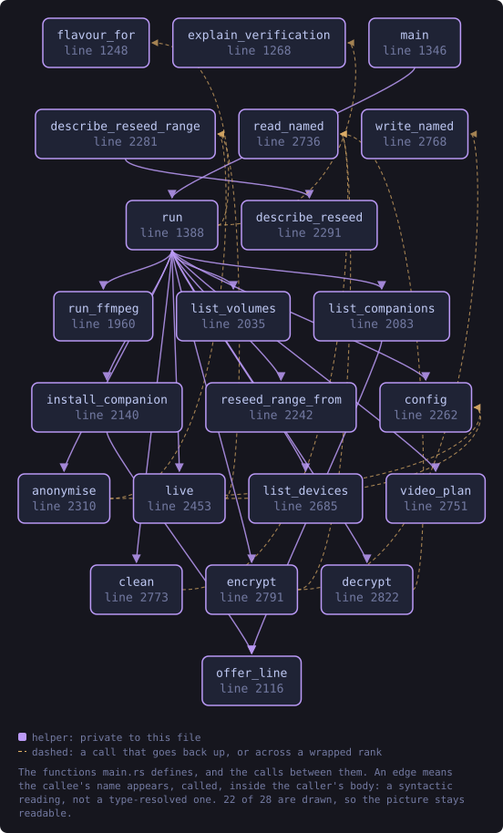

<!-- SPDX-License-Identifier: GPL-3.0-or-later -->
<!-- GENERATED by tools/docs/generate.py from the doc comments in the
     source. Do not edit this file: edit the `//!` and `///` comments in
     the .rs files and run the generator again. CI verifies it with
         python tools/docs/generate.py --check
-->

  

# `crates/veilvoice-cli/src/main.rs`

[`veilvoice-cli`](../../../crates/veilvoice-cli/README.md) &middot; 2554 lines &middot; [read the source](https://github.com/tilas01/veilvoice/blob/main/crates/veilvoice-cli/src/main.rs)

## Contents

- [What is here](#what-is-here)
- [Two behaviours that surprise people, on purpose](#two-behaviours-that-surprise-people-on-purpose)
- [Passphrase prompts cannot be piped](#passphrase-prompts-cannot-be-piped)
- [A clap ordering rule worth knowing](#a-clap-ordering-rule-worth-knowing)
- [In plain words](#in-plain-words)
  - [What this file contains](#what-this-file-contains)
  - [What calls what](#what-calls-what)
  - [Items](#items)

`veilvoice`, the command-line interface.

Everything VeilVoice does, available without a desktop: it runs over SSH, in
a container, and on machines that have no GUI toolkit at all. The same
engine backs both this and the graphical app.

# What is here

Twenty subcommands, and they divide into five groups:

* **Audio** -- `anonymise` a file, `live` scramble a microphone, list
`devices`, `conversation` for a recording with several people in it.
* **Privacy of the files themselves** -- `clean` metadata, `encrypt`,
`decrypt`, `keygen`, `shred`.
* **Watching the machine** -- `watch` the microphone and camera, `guard`
VeilVoice's own files against tampering, `sentry` for canaries and how
fast a folder is changing, `capture` for which screen recorders are
running.
* **The app lock** -- `lock set|status|change|remove`, and `policy` for
settings somebody has fixed so the interface cannot turn them off.
* **Getting it onto the machine** -- `install`, `uninstall`, `companions`,
and `gui` to open the desktop application.

That last group is a front end over `veilvoice_setup`, which the desktop
application's setup tab also calls. The careful part -- editing `PATH` --
has one implementation and one set of tests, rather than one per front
end.

# Two behaviours that surprise people, on purpose

**`anonymise` writes `<out>.veil`, not a bare WAV.** Recordings are
encrypted at rest by default. `--encrypt=false` opts out and requires
`--yes`, because an unsealed recording is the thing somebody later wishes
they had not produced. The wiki explains where the WAV went.

**The front-ends refuse rather than downgrade.** Asked to encrypt with
nothing to encrypt with, this exits with an error instead of writing plain
audio and mentioning it. Quiet degradation to a weaker posture is the defect
class this project has found in itself most often.

# Passphrase prompts cannot be piped

`rpassword` needs a real console; piping a passphrase in blocks on
`CONIN$` rather than reading it. That is a property of terminal input, not a
bug here, and it means anything that prompts cannot be smoke-tested from a
non-interactive shell. The layer *beneath* each prompt is therefore tested
instead -- see `crate::atrest` and `crate::lock`, where the logic lives
precisely so it can be reached without a terminal.

# A clap ordering rule worth knowing

An argument declared beside `#[command(subcommand)]` must precede the
subcommand on the command line unless it is marked `global = true`. So
`veilvoice lock --path X status` parses and `veilvoice lock status --path X`
does not, except that `--path` is now global specifically so both do.

# In plain words

This is VeilVoice without a window.

Everything the program does, typed instead of clicked: disguise a recording,
scramble a microphone while you talk, seal a file, strip a photograph's hidden
labels, handle a recording with several people in it.

It is the same code underneath, so it works the same way -- over a remote
connection, on a machine with no desktop, or from a script that runs it a
thousand times.

## What this file contains

2554 lines defining **23 functions** (0 public), **11 types** and **0 constants**. Everything below is read out of the source, so it cannot disagree with the code.

**The types it owns.**

- `struct Cli` (line 115)
- `enum Command` (line 121)
- `enum ConversationCommand` (line 578) -- What veilvoice conversation can do.
- `enum AppctlCommand` (line 714) -- What veilvoice capture can do.
- `enum InputCommand` (line 741)
- `enum CaptureCommand` (line 754)
- `enum PolicyCommand` (line 794) -- What veilvoice policy can do.
- `enum SentryCommand` (line 847) -- What veilvoice sentry can do.
- `enum CleanPolicy` (line 908)
- `struct Tuning` (line 1610) -- The engine settings a user can reach from the command line.
- `struct AtRest` (line 1682) -- What to do with the result once it exists.

## What calls what

The functions this file defines, and the calls between them. Both
are read out of the source: an edge means the callee's name appears,
called, inside the caller's body. It is a syntactic reading, not a
type-resolved one, so a call made through a trait object or a macro
will not appear.

_22 of 23 functions are drawn; the diagram is bounded at 22 so it
stays readable. The full list is in the table below._

_Colour key: **helper** -- private to this file._

  

The same graph as Mermaid source

```mermaid
%%{init: {"theme":"base","themeVariables":{"background":"#1a1b26","primaryColor":"#1f2335","primaryTextColor":"#c0caf5","primaryBorderColor":"#7aa2f7","secondaryColor":"#16161e","tertiaryColor":"#16161e","lineColor":"#737aa2","textColor":"#c0caf5","mainBkg":"#1f2335","nodeBorder":"#7aa2f7","clusterBkg":"#16161e","clusterBorder":"#2f3549","fontFamily":"ui-monospace, SFMono-Regular, Consolas, monospace","fontSize":"14px"}}}%%
flowchart TD
    n_main["main<br/>line 924"]
    n_run["run<br/>line 935"]
    n_run_ffmpeg["run_ffmpeg<br/>line 1367"]
    n_list_volumes["list_volumes<br/>line 1422"]
    n_list_companions["list_companions<br/>line 1470"]
    n_offer_line["offer_line<br/>line 1503"]
    n_install_companion["install_companion<br/>line 1527"]
    n_reseed_range_from["reseed_range_from<br/>line 1629"]
    n_config["config<br/>line 1644"]
    n_describe_reseed_range["describe_reseed_range<br/>line 1663"]
    n_describe_reseed["describe_reseed<br/>line 1673"]
    n_anonymise["anonymise<br/>line 1691"]
    n_live["live<br/>line 1830"]
    n_list_devices["list_devices<br/>line 2050"]
    n_clean["clean<br/>line 2082"]
    n_encrypt["encrypt<br/>line 2099"]
    n_decrypt["decrypt<br/>line 2128"]
    n_load_secret_key["load_secret_key<br/>line 2160"]
    n_keygen["keygen<br/>line 2168"]
    n_watch["watch<br/>line 2244"]
    n_shred["shred<br/>line 2334"]
    n_info["info<br/>line 2402"]
    n_anonymise --> n_config
    n_anonymise --> n_describe_reseed_range
    n_decrypt --> n_load_secret_key
    n_describe_reseed_range --> n_describe_reseed
    n_install_companion --> n_offer_line
    n_list_companions --> n_offer_line
    n_live --> n_config
    n_live --> n_describe_reseed_range
    n_main --> n_run
    n_run --> n_anonymise
    n_run --> n_clean
    n_run --> n_config
    n_run --> n_decrypt
    n_run --> n_encrypt
    n_run --> n_info
    n_run --> n_install_companion
    n_run --> n_keygen
    n_run --> n_list_companions
    n_run --> n_list_devices
    n_run --> n_list_volumes
    n_run --> n_live
    n_run --> n_reseed_range_from
    n_run --> n_run_ffmpeg
    n_run --> n_shred
    n_run --> n_watch
    click n_main href "https://github.com/tilas01/veilvoice/blob/main/crates/veilvoice-cli/src/main.rs#L924" "open the source"
    click n_run href "https://github.com/tilas01/veilvoice/blob/main/crates/veilvoice-cli/src/main.rs#L935" "open the source"
    click n_run_ffmpeg href "https://github.com/tilas01/veilvoice/blob/main/crates/veilvoice-cli/src/main.rs#L1367" "open the source"
    click n_list_volumes href "https://github.com/tilas01/veilvoice/blob/main/crates/veilvoice-cli/src/main.rs#L1422" "open the source"
    click n_list_companions href "https://github.com/tilas01/veilvoice/blob/main/crates/veilvoice-cli/src/main.rs#L1470" "open the source"
    click n_offer_line href "https://github.com/tilas01/veilvoice/blob/main/crates/veilvoice-cli/src/main.rs#L1503" "open the source"
    click n_install_companion href "https://github.com/tilas01/veilvoice/blob/main/crates/veilvoice-cli/src/main.rs#L1527" "open the source"
    click n_reseed_range_from href "https://github.com/tilas01/veilvoice/blob/main/crates/veilvoice-cli/src/main.rs#L1629" "open the source"
    click n_config href "https://github.com/tilas01/veilvoice/blob/main/crates/veilvoice-cli/src/main.rs#L1644" "open the source"
    click n_describe_reseed_range href "https://github.com/tilas01/veilvoice/blob/main/crates/veilvoice-cli/src/main.rs#L1663" "open the source"
    click n_describe_reseed href "https://github.com/tilas01/veilvoice/blob/main/crates/veilvoice-cli/src/main.rs#L1673" "open the source"
    click n_anonymise href "https://github.com/tilas01/veilvoice/blob/main/crates/veilvoice-cli/src/main.rs#L1691" "open the source"
    click n_live href "https://github.com/tilas01/veilvoice/blob/main/crates/veilvoice-cli/src/main.rs#L1830" "open the source"
    click n_list_devices href "https://github.com/tilas01/veilvoice/blob/main/crates/veilvoice-cli/src/main.rs#L2050" "open the source"
    click n_clean href "https://github.com/tilas01/veilvoice/blob/main/crates/veilvoice-cli/src/main.rs#L2082" "open the source"
    click n_encrypt href "https://github.com/tilas01/veilvoice/blob/main/crates/veilvoice-cli/src/main.rs#L2099" "open the source"
    click n_decrypt href "https://github.com/tilas01/veilvoice/blob/main/crates/veilvoice-cli/src/main.rs#L2128" "open the source"
    click n_load_secret_key href "https://github.com/tilas01/veilvoice/blob/main/crates/veilvoice-cli/src/main.rs#L2160" "open the source"
    click n_keygen href "https://github.com/tilas01/veilvoice/blob/main/crates/veilvoice-cli/src/main.rs#L2168" "open the source"
    click n_watch href "https://github.com/tilas01/veilvoice/blob/main/crates/veilvoice-cli/src/main.rs#L2244" "open the source"
    click n_shred href "https://github.com/tilas01/veilvoice/blob/main/crates/veilvoice-cli/src/main.rs#L2334" "open the source"
    click n_info href "https://github.com/tilas01/veilvoice/blob/main/crates/veilvoice-cli/src/main.rs#L2402" "open the source"
    classDef helper fill:#1f2335,stroke:#bb9af7,color:#c0caf5
    class n_main,n_run,n_run_ffmpeg,n_list_volumes,n_list_companions,n_offer_line,n_install_companion,n_reseed_range_from,n_config,n_describe_reseed_range,n_describe_reseed,n_anonymise,n_live,n_list_devices,n_clean,n_encrypt,n_decrypt,n_load_secret_key,n_keygen,n_watch,n_shred,n_info helper
```

## Items

| Item | Line | Documentation |
|---|---:|---|
| `Cli` struct | [115](https://github.com/tilas01/veilvoice/blob/main/crates/veilvoice-cli/src/main.rs#L115) |  |
| `Command` enum | [121](https://github.com/tilas01/veilvoice/blob/main/crates/veilvoice-cli/src/main.rs#L121) |  |
| `ConversationCommand` enum | [578](https://github.com/tilas01/veilvoice/blob/main/crates/veilvoice-cli/src/main.rs#L578) | What veilvoice conversation can do. |
| `AppctlCommand` enum | [714](https://github.com/tilas01/veilvoice/blob/main/crates/veilvoice-cli/src/main.rs#L714) | What veilvoice capture can do. |
| `InputCommand` enum | [741](https://github.com/tilas01/veilvoice/blob/main/crates/veilvoice-cli/src/main.rs#L741) |  |
| `CaptureCommand` enum | [754](https://github.com/tilas01/veilvoice/blob/main/crates/veilvoice-cli/src/main.rs#L754) |  |
| `PolicyCommand` enum | [794](https://github.com/tilas01/veilvoice/blob/main/crates/veilvoice-cli/src/main.rs#L794) | What veilvoice policy can do. |
| `SentryCommand` enum | [847](https://github.com/tilas01/veilvoice/blob/main/crates/veilvoice-cli/src/main.rs#L847) | What veilvoice sentry can do. |
| `CleanPolicy` enum | [908](https://github.com/tilas01/veilvoice/blob/main/crates/veilvoice-cli/src/main.rs#L908) |  |
| `Policy::from` fn | [916](https://github.com/tilas01/veilvoice/blob/main/crates/veilvoice-cli/src/main.rs#L916) |  |
| `main` fn | [924](https://github.com/tilas01/veilvoice/blob/main/crates/veilvoice-cli/src/main.rs#L924) |  |
| `run` fn | [935](https://github.com/tilas01/veilvoice/blob/main/crates/veilvoice-cli/src/main.rs#L935) |  |
| `run_ffmpeg` fn | [1367](https://github.com/tilas01/veilvoice/blob/main/crates/veilvoice-cli/src/main.rs#L1367) | Markers 87 and 88. |
| `list_volumes` fn | [1422](https://github.com/tilas01/veilvoice/blob/main/crates/veilvoice-cli/src/main.rs#L1422) | Report the encrypted volumes this machine is offering. |
| `list_companions` fn | [1470](https://github.com/tilas01/veilvoice/blob/main/crates/veilvoice-cli/src/main.rs#L1470) | Report every companion that means anything on this platform. |
| `offer_line` fn | [1503](https://github.com/tilas01/veilvoice/blob/main/crates/veilvoice-cli/src/main.rs#L1503) | One line describing what VeilVoice can do about a missing companion. |
| `install_companion` fn | [1527](https://github.com/tilas01/veilvoice/blob/main/crates/veilvoice-cli/src/main.rs#L1527) | Act on one named companion. |
| `Tuning` struct | [1610](https://github.com/tilas01/veilvoice/blob/main/crates/veilvoice-cli/src/main.rs#L1610) | The engine settings a user can reach from the command line. |
| `reseed_range_from` fn | [1629](https://github.com/tilas01/veilvoice/blob/main/crates/veilvoice-cli/src/main.rs#L1629) | Turn --reseed-range into a range, or into the reason it was not one. |
| `config` fn | [1644](https://github.com/tilas01/veilvoice/blob/main/crates/veilvoice-cli/src/main.rs#L1644) |  |
| `describe_reseed_range` fn | [1663](https://github.com/tilas01/veilvoice/blob/main/crates/veilvoice-cli/src/main.rs#L1663) | How a randomised roll range reads in the output. |
| `describe_reseed` fn | [1673](https://github.com/tilas01/veilvoice/blob/main/crates/veilvoice-cli/src/main.rs#L1673) | How the seed-rolling setting reads in the output. |
| `AtRest` struct | [1682](https://github.com/tilas01/veilvoice/blob/main/crates/veilvoice-cli/src/main.rs#L1682) | What to do with the result once it exists. |
| `anonymise` fn | [1691](https://github.com/tilas01/veilvoice/blob/main/crates/veilvoice-cli/src/main.rs#L1691) |  |
| `live` fn | [1830](https://github.com/tilas01/veilvoice/blob/main/crates/veilvoice-cli/src/main.rs#L1830) |  |
| `list_devices` fn | [2050](https://github.com/tilas01/veilvoice/blob/main/crates/veilvoice-cli/src/main.rs#L2050) |  |
| `clean` fn | [2082](https://github.com/tilas01/veilvoice/blob/main/crates/veilvoice-cli/src/main.rs#L2082) |  |
| `encrypt` fn | [2099](https://github.com/tilas01/veilvoice/blob/main/crates/veilvoice-cli/src/main.rs#L2099) |  |
| `decrypt` fn | [2128](https://github.com/tilas01/veilvoice/blob/main/crates/veilvoice-cli/src/main.rs#L2128) |  |
| `load_secret_key` fn | [2160](https://github.com/tilas01/veilvoice/blob/main/crates/veilvoice-cli/src/main.rs#L2160) | Load a private key file, which is itself a password-locked container. |
| `keygen` fn | [2168](https://github.com/tilas01/veilvoice/blob/main/crates/veilvoice-cli/src/main.rs#L2168) |  |
| `watch` fn | [2244](https://github.com/tilas01/veilvoice/blob/main/crates/veilvoice-cli/src/main.rs#L2244) | Report, and keep reporting, what is using the microphone and camera. |
| `shred` fn | [2334](https://github.com/tilas01/veilvoice/blob/main/crates/veilvoice-cli/src/main.rs#L2334) | Destroy a file's contents, then delete it. |
| `info` fn | [2402](https://github.com/tilas01/veilvoice/blob/main/crates/veilvoice-cli/src/main.rs#L2402) |  |

---

Generated from `crates/veilvoice-cli/src/main.rs`. On the website: [`website/reference/veilvoice-cli/main.html`](../../../website/reference/veilvoice-cli/main.html).

Signing key fingerprint `8101FB3BB28D02FB239E0CDF9CC1C7E7A9B5833A`.
