<!-- SPDX-License-Identifier: GPL-3.0-or-later -->
<!-- GENERATED by tools/docs/generate.py from the doc comments in the
     source. Do not edit this file: edit the `//!` and `///` comments in
     the .rs files and run the generator again. CI verifies it with
         python tools/docs/generate.py --check
-->

  

# `crates/veilvoice-cli/src/main.rs`

[`veilvoice-cli`](../../../crates/veilvoice-cli/README.md) &middot; 3553 lines &middot; [read the source](https://github.com/tilas01/veilvoice/blob/main/crates/veilvoice-cli/src/main.rs)

## Contents

- [What is here](#what-is-here)
- [Two behaviours that surprise people, on purpose](#two-behaviours-that-surprise-people-on-purpose)
- [Passphrase prompts cannot be piped](#passphrase-prompts-cannot-be-piped)
- [A clap ordering rule worth knowing](#a-clap-ordering-rule-worth-knowing)
- [In plain words](#in-plain-words)
  - [What this file contains](#what-this-file-contains)
  - [What calls what](#what-calls-what)
  - [Items](#items)

`veilvoice`, the command-line interface.

Everything VeilVoice does, available without a desktop: it runs over SSH, in
a container, and on machines that have no GUI toolkit at all. The same
engine backs both this and the graphical app.

# What is here

Twenty subcommands, and they divide into five groups:

* **Audio** -- `anonymise` a file, `live` scramble a microphone, list
`devices`, `conversation` for a recording with several people in it.
* **Privacy of the files themselves** -- `clean` metadata, `encrypt`,
`decrypt`, `keygen`, `shred`.
* **Watching the machine** -- `watch` the microphone and camera, `guard`
VeilVoice's own files against tampering, `sentry` for canaries and how
fast a folder is changing, `capture` for which screen recorders are
running.
* **The app lock** -- `lock set|status|change|remove`, and `policy` for
settings somebody has fixed so the interface cannot turn them off.
* **Getting it onto the machine** -- `install`, `uninstall`, `companions`,
and `gui` to open the desktop application.

That last group is a front end over `veilvoice_setup`, which the desktop
application's setup tab also calls. The careful part -- editing `PATH` --
has one implementation and one set of tests, rather than one per front
end.

# Two behaviours that surprise people, on purpose

**`anonymise` writes `<out>.veil`, not a bare WAV.** Recordings are
encrypted at rest by default. `--encrypt=false` opts out and requires
`--yes`, because an unsealed recording is the thing somebody later wishes
they had not produced. The wiki explains where the WAV went.

**The front-ends refuse rather than downgrade.** Asked to encrypt with
nothing to encrypt with, this exits with an error instead of writing plain
audio and mentioning it. Quiet degradation to a weaker posture is the defect
class this project has found in itself most often.

# Passphrase prompts cannot be piped

`rpassword` needs a real console; piping a passphrase in blocks on
`CONIN$` rather than reading it. That is a property of terminal input, not a
bug here, and it means anything that prompts cannot be smoke-tested from a
non-interactive shell. The layer *beneath* each prompt is therefore tested
instead -- see `crate::atrest` and `crate::lock`, where the logic lives
precisely so it can be reached without a terminal.

# A clap ordering rule worth knowing

An argument declared beside `#[command(subcommand)]` must precede the
subcommand on the command line unless it is marked `global = true`. So
`veilvoice lock --path X status` parses and `veilvoice lock status --path X`
does not, except that `--path` is now global specifically so both do.

# In plain words

This is VeilVoice without a window.

Everything the program does, typed instead of clicked: disguise a recording,
scramble a microphone while you talk, seal a file, strip a photograph's hidden
labels, handle a recording with several people in it.

It is the same code underneath, so it works the same way -- over a remote
connection, on a machine with no desktop, or from a script that runs it a
thousand times.

## What this file contains

3553 lines defining **29 functions** (0 public), **13 types** and **0 constants**. Everything below is read out of the source, so it cannot disagree with the code.

**The types it owns.**

- `struct Cli` (line 119)
- `enum Command` (line 125)
- `enum FixCommand` (line 754) -- The corrections veilvoice conversation fix can make.
- `enum ConversationCommand` (line 838)
- `enum AppctlCommand` (line 996) -- What veilvoice capture can do.
- `enum InputCommand` (line 1023)
- `enum CaptureCommand` (line 1036)
- `enum MandateCommand` (line 1076) -- What veilvoice mandate can do.
- `enum PolicyCommand` (line 1112) -- What veilvoice policy can do.
- `enum SentryCommand` (line 1165) -- What veilvoice sentry can do.
- `enum CleanPolicy` (line 1226)
- `struct Tuning` (line 2226) -- The engine settings a user can reach from the command line.
- `struct AtRest` (line 2303) -- What to do with the result once it exists.

## What calls what

The functions this file defines, and the calls between them. Both
are read out of the source: an edge means the callee's name appears,
called, inside the caller's body. It is a syntactic reading, not a
type-resolved one, so a call made through a trait object or a macro
will not appear.

_22 of 28 functions are drawn; the diagram is bounded at 22 so it
stays readable. The full list is in the table below._

_Colour key: **helper** -- private to this file._

  

The same graph as Mermaid source

```mermaid
%%{init: {"theme":"base","themeVariables":{"background":"#1a1b26","primaryColor":"#1f2335","primaryTextColor":"#c0caf5","primaryBorderColor":"#7aa2f7","secondaryColor":"#16161e","tertiaryColor":"#16161e","lineColor":"#737aa2","textColor":"#c0caf5","mainBkg":"#1f2335","nodeBorder":"#7aa2f7","clusterBkg":"#16161e","clusterBorder":"#2f3549","fontFamily":"ui-monospace, SFMono-Regular, Consolas, monospace","fontSize":"14px"}}}%%
flowchart TD
    n_flavour_for["flavour_for<br/>line 1248"]
    n_explain_verification["explain_verification<br/>line 1268"]
    n_main["main<br/>line 1346"]
    n_run["run<br/>line 1388"]
    n_run_ffmpeg["run_ffmpeg<br/>line 1963"]
    n_list_volumes["list_volumes<br/>line 2038"]
    n_list_companions["list_companions<br/>line 2086"]
    n_offer_line["offer_line<br/>line 2119"]
    n_install_companion["install_companion<br/>line 2143"]
    n_reseed_range_from["reseed_range_from<br/>line 2245"]
    n_config["config<br/>line 2265"]
    n_describe_reseed_range["describe_reseed_range<br/>line 2284"]
    n_describe_reseed["describe_reseed<br/>line 2294"]
    n_anonymise["anonymise<br/>line 2313"]
    n_live["live<br/>line 2456"]
    n_list_devices["list_devices<br/>line 2688"]
    n_read_named["read_named<br/>line 2739"]
    n_video_plan["video_plan<br/>line 2754"]
    n_write_named["write_named<br/>line 2771"]
    n_clean["clean<br/>line 2776"]
    n_encrypt["encrypt<br/>line 2794"]
    n_decrypt["decrypt<br/>line 2825"]
    n_anonymise --> n_config
    n_anonymise --> n_describe_reseed_range
    n_clean --> n_read_named
    n_decrypt --> n_read_named
    n_describe_reseed_range --> n_describe_reseed
    n_encrypt --> n_read_named
    n_encrypt --> n_write_named
    n_install_companion --> n_offer_line
    n_list_companions --> n_offer_line
    n_live --> n_config
    n_live --> n_describe_reseed_range
    n_main --> n_run
    n_run --> n_anonymise
    n_run --> n_clean
    n_run --> n_config
    n_run --> n_decrypt
    n_run --> n_encrypt
    n_run --> n_explain_verification
    n_run --> n_flavour_for
    n_run --> n_install_companion
    n_run --> n_list_companions
    n_run --> n_list_devices
    n_run --> n_list_volumes
    n_run --> n_live
    n_run --> n_reseed_range_from
    n_run --> n_run_ffmpeg
    n_run --> n_video_plan
    click n_flavour_for href "https://github.com/tilas01/veilvoice/blob/main/crates/veilvoice-cli/src/main.rs#L1248" "open the source"
    click n_explain_verification href "https://github.com/tilas01/veilvoice/blob/main/crates/veilvoice-cli/src/main.rs#L1268" "open the source"
    click n_main href "https://github.com/tilas01/veilvoice/blob/main/crates/veilvoice-cli/src/main.rs#L1346" "open the source"
    click n_run href "https://github.com/tilas01/veilvoice/blob/main/crates/veilvoice-cli/src/main.rs#L1388" "open the source"
    click n_run_ffmpeg href "https://github.com/tilas01/veilvoice/blob/main/crates/veilvoice-cli/src/main.rs#L1963" "open the source"
    click n_list_volumes href "https://github.com/tilas01/veilvoice/blob/main/crates/veilvoice-cli/src/main.rs#L2038" "open the source"
    click n_list_companions href "https://github.com/tilas01/veilvoice/blob/main/crates/veilvoice-cli/src/main.rs#L2086" "open the source"
    click n_offer_line href "https://github.com/tilas01/veilvoice/blob/main/crates/veilvoice-cli/src/main.rs#L2119" "open the source"
    click n_install_companion href "https://github.com/tilas01/veilvoice/blob/main/crates/veilvoice-cli/src/main.rs#L2143" "open the source"
    click n_reseed_range_from href "https://github.com/tilas01/veilvoice/blob/main/crates/veilvoice-cli/src/main.rs#L2245" "open the source"
    click n_config href "https://github.com/tilas01/veilvoice/blob/main/crates/veilvoice-cli/src/main.rs#L2265" "open the source"
    click n_describe_reseed_range href "https://github.com/tilas01/veilvoice/blob/main/crates/veilvoice-cli/src/main.rs#L2284" "open the source"
    click n_describe_reseed href "https://github.com/tilas01/veilvoice/blob/main/crates/veilvoice-cli/src/main.rs#L2294" "open the source"
    click n_anonymise href "https://github.com/tilas01/veilvoice/blob/main/crates/veilvoice-cli/src/main.rs#L2313" "open the source"
    click n_live href "https://github.com/tilas01/veilvoice/blob/main/crates/veilvoice-cli/src/main.rs#L2456" "open the source"
    click n_list_devices href "https://github.com/tilas01/veilvoice/blob/main/crates/veilvoice-cli/src/main.rs#L2688" "open the source"
    click n_read_named href "https://github.com/tilas01/veilvoice/blob/main/crates/veilvoice-cli/src/main.rs#L2739" "open the source"
    click n_video_plan href "https://github.com/tilas01/veilvoice/blob/main/crates/veilvoice-cli/src/main.rs#L2754" "open the source"
    click n_write_named href "https://github.com/tilas01/veilvoice/blob/main/crates/veilvoice-cli/src/main.rs#L2771" "open the source"
    click n_clean href "https://github.com/tilas01/veilvoice/blob/main/crates/veilvoice-cli/src/main.rs#L2776" "open the source"
    click n_encrypt href "https://github.com/tilas01/veilvoice/blob/main/crates/veilvoice-cli/src/main.rs#L2794" "open the source"
    click n_decrypt href "https://github.com/tilas01/veilvoice/blob/main/crates/veilvoice-cli/src/main.rs#L2825" "open the source"
    classDef helper fill:#1f2335,stroke:#bb9af7,color:#c0caf5
    class n_flavour_for,n_explain_verification,n_main,n_run,n_run_ffmpeg,n_list_volumes,n_list_companions,n_offer_line,n_install_companion,n_reseed_range_from,n_config,n_describe_reseed_range,n_describe_reseed,n_anonymise,n_live,n_list_devices,n_read_named,n_video_plan,n_write_named,n_clean,n_encrypt,n_decrypt helper
```

## Items

| Item | Line | Documentation |
|---|---:|---|
| `Cli` struct | [119](https://github.com/tilas01/veilvoice/blob/main/crates/veilvoice-cli/src/main.rs#L119) |  |
| `Command` enum | [125](https://github.com/tilas01/veilvoice/blob/main/crates/veilvoice-cli/src/main.rs#L125) |  |
| `conversation::Fix::from` fn | [735](https://github.com/tilas01/veilvoice/blob/main/crates/veilvoice-cli/src/main.rs#L735) |  |
| `FixCommand` enum | [754](https://github.com/tilas01/veilvoice/blob/main/crates/veilvoice-cli/src/main.rs#L754) | The corrections veilvoice conversation fix can make. |
| `ConversationCommand` enum | [838](https://github.com/tilas01/veilvoice/blob/main/crates/veilvoice-cli/src/main.rs#L838) |  |
| `AppctlCommand` enum | [996](https://github.com/tilas01/veilvoice/blob/main/crates/veilvoice-cli/src/main.rs#L996) | What veilvoice capture can do. |
| `InputCommand` enum | [1023](https://github.com/tilas01/veilvoice/blob/main/crates/veilvoice-cli/src/main.rs#L1023) |  |
| `CaptureCommand` enum | [1036](https://github.com/tilas01/veilvoice/blob/main/crates/veilvoice-cli/src/main.rs#L1036) |  |
| `MandateCommand` enum | [1076](https://github.com/tilas01/veilvoice/blob/main/crates/veilvoice-cli/src/main.rs#L1076) | What veilvoice mandate can do. |
| `PolicyCommand` enum | [1112](https://github.com/tilas01/veilvoice/blob/main/crates/veilvoice-cli/src/main.rs#L1112) | What veilvoice policy can do. |
| `SentryCommand` enum | [1165](https://github.com/tilas01/veilvoice/blob/main/crates/veilvoice-cli/src/main.rs#L1165) | What veilvoice sentry can do. |
| `CleanPolicy` enum | [1226](https://github.com/tilas01/veilvoice/blob/main/crates/veilvoice-cli/src/main.rs#L1226) |  |
| `Policy::from` fn | [1234](https://github.com/tilas01/veilvoice/blob/main/crates/veilvoice-cli/src/main.rs#L1234) |  |
| `flavour_for` fn | [1248](https://github.com/tilas01/veilvoice/blob/main/crates/veilvoice-cli/src/main.rs#L1248) | The verification script's spelling for a system, in one place. |
| `explain_verification` fn | [1268](https://github.com/tilas01/veilvoice/blob/main/crates/veilvoice-cli/src/main.rs#L1268) | What checking a release actually involves, and who does which part. |
| `main` fn | [1346](https://github.com/tilas01/veilvoice/blob/main/crates/veilvoice-cli/src/main.rs#L1346) | Parse the command line and turn a failure into an exit code and a message. |
| `run` fn | [1388](https://github.com/tilas01/veilvoice/blob/main/crates/veilvoice-cli/src/main.rs#L1388) | Carry out one subcommand. |
| `run_ffmpeg` fn | [1963](https://github.com/tilas01/veilvoice/blob/main/crates/veilvoice-cli/src/main.rs#L1963) | Roadmap items 87 and 88. |
| `list_volumes` fn | [2038](https://github.com/tilas01/veilvoice/blob/main/crates/veilvoice-cli/src/main.rs#L2038) | Report the encrypted volumes this machine is offering. |
| `list_companions` fn | [2086](https://github.com/tilas01/veilvoice/blob/main/crates/veilvoice-cli/src/main.rs#L2086) | Report every companion that means anything on this platform. |
| `offer_line` fn | [2119](https://github.com/tilas01/veilvoice/blob/main/crates/veilvoice-cli/src/main.rs#L2119) | One line describing what VeilVoice can do about a missing companion. |
| `install_companion` fn | [2143](https://github.com/tilas01/veilvoice/blob/main/crates/veilvoice-cli/src/main.rs#L2143) | Act on one named companion. |
| `Tuning` struct | [2226](https://github.com/tilas01/veilvoice/blob/main/crates/veilvoice-cli/src/main.rs#L2226) | The engine settings a user can reach from the command line. |
| `reseed_range_from` fn | [2245](https://github.com/tilas01/veilvoice/blob/main/crates/veilvoice-cli/src/main.rs#L2245) | Turn --reseed-range into a range, or into the reason it was not one. |
| `config` fn | [2265](https://github.com/tilas01/veilvoice/blob/main/crates/veilvoice-cli/src/main.rs#L2265) | The de-identification settings a Tuning describes, with every figure clamped. |
| `describe_reseed_range` fn | [2284](https://github.com/tilas01/veilvoice/blob/main/crates/veilvoice-cli/src/main.rs#L2284) | How a randomised roll range reads in the output. |
| `describe_reseed` fn | [2294](https://github.com/tilas01/veilvoice/blob/main/crates/veilvoice-cli/src/main.rs#L2294) | How the seed-rolling setting reads in the output. |
| `AtRest` struct | [2303](https://github.com/tilas01/veilvoice/blob/main/crates/veilvoice-cli/src/main.rs#L2303) | What to do with the result once it exists. |
| `anonymise` fn | [2313](https://github.com/tilas01/veilvoice/blob/main/crates/veilvoice-cli/src/main.rs#L2313) | veilvoice anonymise: veil a recording and write it somewhere else. |
| `live` fn | [2456](https://github.com/tilas01/veilvoice/blob/main/crates/veilvoice-cli/src/main.rs#L2456) | veilvoice live: veil the microphone as it is heard, with an optional preview. |
| `list_devices` fn | [2688](https://github.com/tilas01/veilvoice/blob/main/crates/veilvoice-cli/src/main.rs#L2688) | veilvoice devices: every input and output this machine reports. |
| `read_named` pub(crate) fn | [2739](https://github.com/tilas01/veilvoice/blob/main/crates/veilvoice-cli/src/main.rs#L2739) | Read a file, naming it if that fails. |
| `video_plan` pub(crate) fn | [2754](https://github.com/tilas01/veilvoice/blob/main/crates/veilvoice-cli/src/main.rs#L2754) | Read a --size and an --fps into a render plan, saying what was decided. |
| `write_named` pub(crate) fn | [2771](https://github.com/tilas01/veilvoice/blob/main/crates/veilvoice-cli/src/main.rs#L2771) | Write a file, naming it if that fails. |
| `clean` fn | [2776](https://github.com/tilas01/veilvoice/blob/main/crates/veilvoice-cli/src/main.rs#L2776) | veilvoice clean: strip the metadata a file carries, in place. |
| `encrypt` fn | [2794](https://github.com/tilas01/veilvoice/blob/main/crates/veilvoice-cli/src/main.rs#L2794) | veilvoice encrypt: seal a file, to a passphrase or to a public key. |
| `decrypt` fn | [2825](https://github.com/tilas01/veilvoice/blob/main/crates/veilvoice-cli/src/main.rs#L2825) | veilvoice decrypt: open a sealed file, given the passphrase or the secret key. |
| `load_secret_key` fn | [2857](https://github.com/tilas01/veilvoice/blob/main/crates/veilvoice-cli/src/main.rs#L2857) | Load a private key file, which is itself a password-locked container. |
| `keygen` fn | [2867](https://github.com/tilas01/veilvoice/blob/main/crates/veilvoice-cli/src/main.rs#L2867) | veilvoice keygen: write a new key pair, refusing to overwrite either file. |
| `watch` fn | [2943](https://github.com/tilas01/veilvoice/blob/main/crates/veilvoice-cli/src/main.rs#L2943) | Report, and keep reporting, what is using the microphone and camera. |
| `shred` fn | [3033](https://github.com/tilas01/veilvoice/blob/main/crates/veilvoice-cli/src/main.rs#L3033) | Destroy a file's contents, then delete it. |
| `info` fn | [3102](https://github.com/tilas01/veilvoice/blob/main/crates/veilvoice-cli/src/main.rs#L3102) | veilvoice info: the versions, and what this build was compiled to do. |

---

Generated from `crates/veilvoice-cli/src/main.rs`. On the website: [`website/reference/veilvoice-cli/main.html`](../../../website/reference/veilvoice-cli/main.html).

Signing key fingerprint `8101FB3BB28D02FB239E0CDF9CC1C7E7A9B5833A`.
