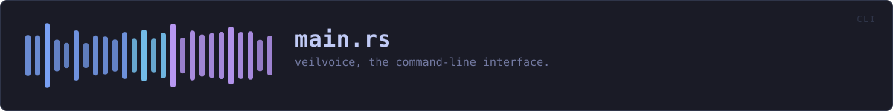
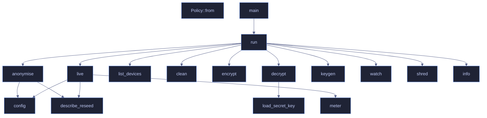

<!-- SPDX-License-Identifier: CC-BY-NC-SA-4.0 -->
<!-- GENERATED by tools/docs/generate.py from the doc comments in the
     source. Do not edit this file: edit the `//!` and `///` comments in
     the .rs files and run the generator again. CI verifies it with
         python tools/docs/generate.py --check
-->

  

# `crates/veilvoice-cli/src/main.rs`

[`veilvoice-cli`](../../../crates/veilvoice-cli/README.md) &middot; 1037 lines &middot; [read the source](https://github.com/tilas01/veilvoice/blob/main/crates/veilvoice-cli/src/main.rs)

## Contents

- [What calls what](#what-calls-what)
- [Items](#items)

`veilvoice` — the command-line interface.

Everything VeilVoice does, available without a desktop: it runs over SSH, in
a container, and on machines that have no GUI toolkit at all. The same
engine backs both this and the graphical app.

## What calls what

The functions this file defines, and the calls between them. Both
are read out of the source: an edge means the callee's name appears,
called, inside the caller's body. It is a syntactic reading, not a
type-resolved one, so a call made through a trait object or a macro
will not appear.

## Items

| Item | Line | Documentation |
|---|---:|---|
| `Cli` struct | [35](https://github.com/tilas01/veilvoice/blob/main/crates/veilvoice-cli/src/main.rs#L35) |  |
| `Command` enum | [41](https://github.com/tilas01/veilvoice/blob/main/crates/veilvoice-cli/src/main.rs#L41) |  |
| `CleanPolicy` enum | [179](https://github.com/tilas01/veilvoice/blob/main/crates/veilvoice-cli/src/main.rs#L179) |  |
| `Policy::from` fn | [187](https://github.com/tilas01/veilvoice/blob/main/crates/veilvoice-cli/src/main.rs#L187) |  |
| `main` fn | [195](https://github.com/tilas01/veilvoice/blob/main/crates/veilvoice-cli/src/main.rs#L195) |  |
| `run` fn | [206](https://github.com/tilas01/veilvoice/blob/main/crates/veilvoice-cli/src/main.rs#L206) |  |
| `Tuning` struct | [268](https://github.com/tilas01/veilvoice/blob/main/crates/veilvoice-cli/src/main.rs#L268) | The engine settings a user can reach from the command line. |
| `config` fn | [274](https://github.com/tilas01/veilvoice/blob/main/crates/veilvoice-cli/src/main.rs#L274) |  |
| `describe_reseed` fn | [287](https://github.com/tilas01/veilvoice/blob/main/crates/veilvoice-cli/src/main.rs#L287) | How the seed-rolling setting reads in the output. |
| `AtRest` struct | [296](https://github.com/tilas01/veilvoice/blob/main/crates/veilvoice-cli/src/main.rs#L296) | What to do with the result once it exists. |
| `anonymise` fn | [305](https://github.com/tilas01/veilvoice/blob/main/crates/veilvoice-cli/src/main.rs#L305) |  |
| `live` fn | [444](https://github.com/tilas01/veilvoice/blob/main/crates/veilvoice-cli/src/main.rs#L444) |  |
| `meter` fn | [530](https://github.com/tilas01/veilvoice/blob/main/crates/veilvoice-cli/src/main.rs#L530) | A small textual level meter. |
| `list_devices` fn | [545](https://github.com/tilas01/veilvoice/blob/main/crates/veilvoice-cli/src/main.rs#L545) |  |
| `clean` fn | [577](https://github.com/tilas01/veilvoice/blob/main/crates/veilvoice-cli/src/main.rs#L577) |  |
| `encrypt` fn | [594](https://github.com/tilas01/veilvoice/blob/main/crates/veilvoice-cli/src/main.rs#L594) |  |
| `decrypt` fn | [623](https://github.com/tilas01/veilvoice/blob/main/crates/veilvoice-cli/src/main.rs#L623) |  |
| `load_secret_key` fn | [655](https://github.com/tilas01/veilvoice/blob/main/crates/veilvoice-cli/src/main.rs#L655) | Load a private key file, which is itself a password-locked container. |
| `keygen` fn | [663](https://github.com/tilas01/veilvoice/blob/main/crates/veilvoice-cli/src/main.rs#L663) |  |
| `watch` fn | [739](https://github.com/tilas01/veilvoice/blob/main/crates/veilvoice-cli/src/main.rs#L739) | Report, and keep reporting, what is using the microphone and camera. |
| `shred` fn | [829](https://github.com/tilas01/veilvoice/blob/main/crates/veilvoice-cli/src/main.rs#L829) | Destroy a file's contents, then delete it. |
| `info` fn | [897](https://github.com/tilas01/veilvoice/blob/main/crates/veilvoice-cli/src/main.rs#L897) |  |

---

Generated from `crates/veilvoice-cli/src/main.rs`. On the website: [`website/reference/veilvoice-cli/main.html`](../../../website/reference/veilvoice-cli/main.html).

Signing key fingerprint `8101FB3BB28D02FB239E0CDF9CC1C7E7A9B5833A`.
