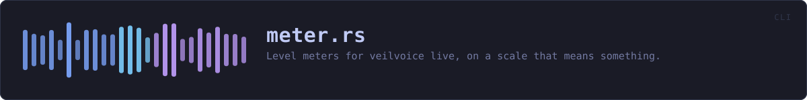
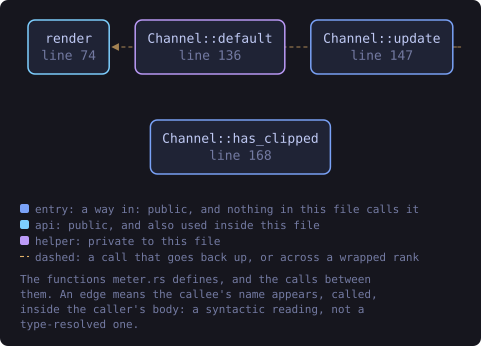
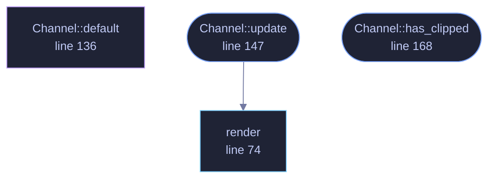

<!-- SPDX-License-Identifier: GPL-3.0-or-later -->
<!-- GENERATED by tools/docs/generate.py from the doc comments in the
     source. Do not edit this file: edit the `//!` and `///` comments in
     the .rs files and run the generator again. CI verifies it with
         python tools/docs/generate.py --check
-->

  

# `crates/veilvoice-cli/src/meter.rs`

[`veilvoice-cli`](../../../crates/veilvoice-cli/README.md) &middot; 259 lines &middot; [read the source](https://github.com/tilas01/veilvoice/blob/main/crates/veilvoice-cli/src/meter.rs)

## Contents

- [Why the old one was wrong](#why-the-old-one-was-wrong)
- [What it measures, and what it does not](#what-it-measures-and-what-it-does-not)
- [Peak hold](#peak-hold)
- [In plain words](#in-plain-words)
  - [What this file contains](#what-this-file-contains)
  - [What calls what](#what-calls-what)
  - [Items](#items)

Level meters for `veilvoice live`, on a scale that means something.

# Why the old one was wrong

The first meter was linear: a peak of 0.5 filled half the bar. That is
arithmetically fine and useless as a meter, because loudness is not linear.
Ordinary speech recorded at a sensible level peaks around **-12 dBFS**,
which is 0.25 linear — three of twelve blocks. Somebody speaking normally
saw a meter that looked like near-silence, and the only way to fill the bar
was to be clipping.

Every real meter is logarithmic for that reason, and this one is too:
-60 dBFS at the left, 0 dBFS at the right. Speech now sits in the middle of
the bar where a person can see it move.

# What it measures, and what it does not

**Sample peak, since the last read.** `veilvoice-audio` keeps the largest
absolute sample seen since the meter was last looked at and resets it on
read, so nothing between two reads is missed.

It is **not** a loudness meter. RMS, LUFS and everything else that
correlates with how loud a thing *sounds* need a window and a weighting
curve, and they answer a different question: this one is for "am I being
recorded, and am I clipping", which is a peak question.

It also cannot see an **inter-sample peak** — a waveform that passes above
full scale between two samples and clips in a converter or an encoder
without any single sample exceeding 1.0. Catching those needs oversampling.
The meter says `CLIP` when a sample actually reaches full scale, and says
nothing about the ones it cannot see, which is the honest half of a true
peak meter rather than a claim to be one.

# Peak hold

A bar that only shows the current moment cannot show a transient: the loud
syllable is gone before a human eye finishes moving. The highest level of
the last `HOLD` is kept and drawn as a single marker, and it decays rather
than sticking, so the bar stays honest about what is happening *now* while
still showing what just happened.

# In plain words

Draws the input and output level meters during a live session.

The bar and the decibel number beside it are worked out from the same piece of
arithmetic the window uses, so the two halves of VeilVoice cannot disagree
about the same reading. They did once, and a meter you have caught contradicting
itself is a meter you stop believing.

## What this file contains

259 lines defining **4 functions** (3 public), **1 type** and **2 constants**. Everything below is read out of the source, so it cannot disagree with the code.

**The types it owns.**

- `struct Channel` (line 129) -- One channel's meter, keeping the peak between reads.

**What happens when it runs.** These are the ways in: public, and nothing else in this file calls them, so they are what an outside caller reaches first.

- `Channel::update` (line 147) -- Take a new reading and give back the meter to print.
  - reaches: `render`
- `Channel::has_clipped` (line 168) -- Whether this channel has clipped at any point in the session.

## What calls what

The functions this file defines, and the calls between them. Both
are read out of the source: an edge means the callee's name appears,
called, inside the caller's body. It is a syntactic reading, not a
type-resolved one, so a call made through a trait object or a macro
will not appear.

_Colour key: **entry** -- a way in: public, and nothing in this file calls it; **api** -- public, and also used inside this file; **helper** -- private to this file._

  

The same graph as Mermaid source

## Items

| Item | Line | Documentation |
|---|---:|---|
| `HOLD` pub const | [62](https://github.com/tilas01/veilvoice/blob/main/crates/veilvoice-cli/src/meter.rs#L62) | How long a peak marker is held before it falls back. |
| `EIGHTHS` const | [69](https://github.com/tilas01/veilvoice/blob/main/crates/veilvoice-cli/src/meter.rs#L69) | The eighth-block characters, so a bar of n characters has 8n steps. |
| `render` pub fn | [74](https://github.com/tilas01/veilvoice/blob/main/crates/veilvoice-cli/src/meter.rs#L74) | One meter: the bar, the peak marker, and the number. |
| `Channel` pub struct | [129](https://github.com/tilas01/veilvoice/blob/main/crates/veilvoice-cli/src/meter.rs#L129) | One channel's meter, keeping the peak between reads. |
| `Channel::default` fn | [136](https://github.com/tilas01/veilvoice/blob/main/crates/veilvoice-cli/src/meter.rs#L136) |  |
| `Channel::update` pub fn | [147](https://github.com/tilas01/veilvoice/blob/main/crates/veilvoice-cli/src/meter.rs#L147) | Take a new reading and give back the meter to print. |
| `Channel::has_clipped` pub fn | [168](https://github.com/tilas01/veilvoice/blob/main/crates/veilvoice-cli/src/meter.rs#L168) | Whether this channel has clipped at any point in the session. |

---

Generated from `crates/veilvoice-cli/src/meter.rs`. On the website: [`website/reference/veilvoice-cli/meter.html`](../../../website/reference/veilvoice-cli/meter.html).

Signing key fingerprint `8101FB3BB28D02FB239E0CDF9CC1C7E7A9B5833A`.
