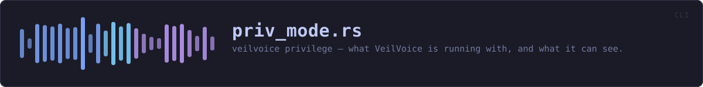
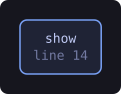

<!-- SPDX-License-Identifier: GPL-3.0-or-later -->
<!-- GENERATED by tools/docs/generate.py from the doc comments in the
     source. Do not edit this file: edit the `//!` and `///` comments in
     the .rs files and run the generator again. CI verifies it with
         python tools/docs/generate.py --check
-->

  

# `crates/veilvoice-cli/src/priv_mode.rs`

[`veilvoice-cli`](../../../crates/veilvoice-cli/README.md) &middot; 46 lines &middot; [read the source](https://github.com/tilas01/veilvoice/blob/main/crates/veilvoice-cli/src/priv_mode.rs)

## Contents

- [In plain words](#in-plain-words)
  - [What this file contains](#what-this-file-contains)
  - [What calls what](#what-calls-what)
  - [Items](#items)

`veilvoice privilege` shows what VeilVoice runs with, and what it can see.

# In plain words

Most of VeilVoice needs no special permissions. The parts that watch your
machine see more when it is run as an administrator, and this says which of
those you are getting. It will not raise its own privileges for you, and it
prints the command and you decide.

## What this file contains

46 lines defining **1 function** (1 public), **0 types** and **0 constants**. Everything below is read out of the source, so it cannot disagree with the code.

**What happens when it runs.** These are the ways in: public, and nothing else in this file calls them, so they are what an outside caller reaches first.

- `show` (line 14) -- Report the privilege level and what it means.

## What calls what

The functions this file defines, and the calls between them. Both
are read out of the source: an edge means the callee's name appears,
called, inside the caller's body. It is a syntactic reading, not a
type-resolved one, so a call made through a trait object or a macro
will not appear.

_Colour key: **entry** -- a way in: public, and nothing in this file calls it._

  

The same graph as Mermaid source

```mermaid
%%{init: {"theme":"base","themeVariables":{"background":"#1a1b26","primaryColor":"#1f2335","primaryTextColor":"#c0caf5","primaryBorderColor":"#7aa2f7","secondaryColor":"#16161e","tertiaryColor":"#16161e","lineColor":"#737aa2","textColor":"#c0caf5","mainBkg":"#1f2335","nodeBorder":"#7aa2f7","clusterBkg":"#16161e","clusterBorder":"#2f3549","fontFamily":"ui-monospace, SFMono-Regular, Consolas, monospace","fontSize":"14px"}}}%%
flowchart TD
    n_show(["show<br/>line 14"])
    click n_show href "https://github.com/tilas01/veilvoice/blob/main/crates/veilvoice-cli/src/priv_mode.rs#L14" "open the source"
    classDef entry fill:#1f2335,stroke:#7aa2f7,color:#c0caf5
    class n_show entry
```

## Items

| Item | Line | Documentation |
|---|---:|---|
| `show` pub fn | [14](https://github.com/tilas01/veilvoice/blob/main/crates/veilvoice-cli/src/priv_mode.rs#L14) | Report the privilege level and what it means. |

---

Generated from `crates/veilvoice-cli/src/priv_mode.rs`. On the website: [`website/reference/veilvoice-cli/priv_mode.html`](../../../website/reference/veilvoice-cli/priv_mode.html).

Signing key fingerprint `8101FB3BB28D02FB239E0CDF9CC1C7E7A9B5833A`.
