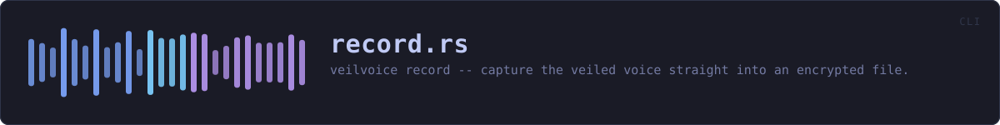
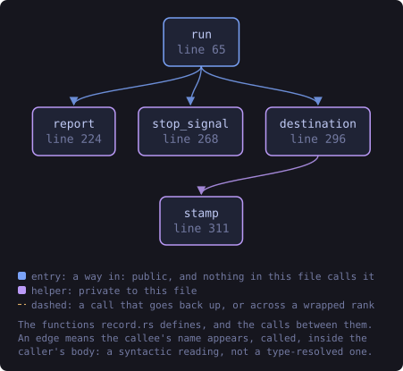
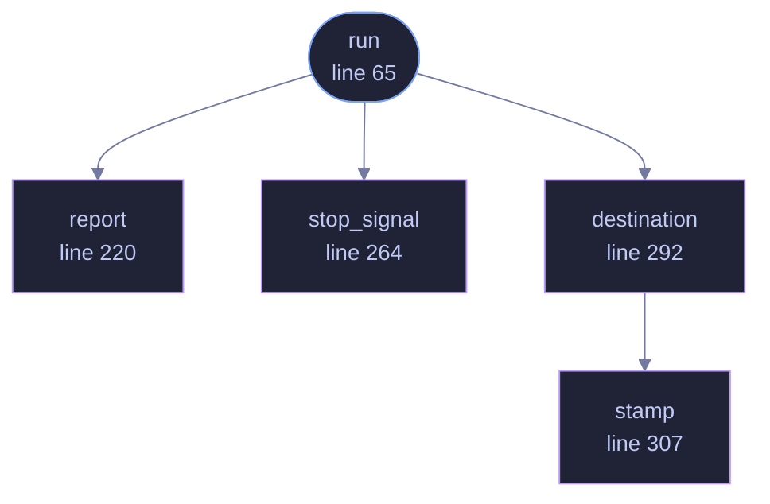

<!-- SPDX-License-Identifier: GPL-3.0-or-later -->
<!-- GENERATED by tools/docs/generate.py from the doc comments in the
     source. Do not edit this file: edit the `//!` and `///` comments in
     the .rs files and run the generator again. CI verifies it with
         python tools/docs/generate.py --check
-->

  

# `crates/veilvoice-cli/src/record.rs`

[`veilvoice-cli`](../../../crates/veilvoice-cli/README.md) &middot; 360 lines &middot; [read the source](https://github.com/tilas01/veilvoice/blob/main/crates/veilvoice-cli/src/record.rs)

## Contents

- [What this is, next to the commands beside it](#what-this-is-next-to-the-commands-beside-it)
- [Never a plaintext file, not even briefly](#never-a-plaintext-file-not-even-briefly)
- [Why it stops on a keypress rather than on Ctrl-C](#why-it-stops-on-a-keypress-rather-than-on-ctrl-c)
- [In plain words](#in-plain-words)
  - [What this file contains](#what-this-file-contains)
  - [What calls what](#what-calls-what)
  - [Items](#items)

`veilvoice record` -- capture the veiled voice straight into an encrypted
file.

# What this is, next to the commands beside it

`veilvoice live` veils the voice and sends it to a device, keeping nothing.
`veilvoice anonymise` veils a recording somebody already made, which means
the original exists, in the clear, on their disk, and stays there unless
they remember to shred it.

This is the third case and the one that leaves the least behind: the
microphone goes in, the veiled voice comes out, and the only file that ever
exists is the encrypted one.

# Never a plaintext file, not even briefly

The recording is accumulated in a [`Tape`](veilvoice_crypto::Tape), encoded
into a [`Secret`](veilvoice_crypto::Secret), and sealed from there. At no
point is there a WAV on disk to be deleted afterwards, because a plaintext
file that is written and deleted is exactly what
`veilvoice_crypto::shred` explains cannot be reliably taken back on flash
storage. Writing one and encrypting it afterwards would leave the original
recoverable and the file merely tidy.

# Why it stops on a keypress rather than on Ctrl-C

Ctrl-C ends the process, and a recording that ends by killing the process
is a recording that is never sealed and never written. Catching the signal
instead would mean a signal-handling dependency for one command, and this
project argues at length against dependencies nobody has read.

So it stops on Enter, or after `--seconds`. Both are ordinary control flow,
reach the sealing step, and need nothing new in the dependency tree. Ctrl-C
still works and still abandons the recording, which is the correct thing for
it to do: it is how somebody says "stop, and keep nothing".

# In plain words

Records you with your voice already disguised, and saves it encrypted.

There is never an unencrypted copy of the recording anywhere, not even for a
moment, so there is nothing to delete afterwards and nothing to recover from
the disk.

## What this file contains

360 lines defining **5 functions** (1 public), **1 type** and **0 constants**. Everything below is read out of the source, so it cannot disagree with the code.

**The types it owns.**

- `struct Sealing` (line 54) -- How the recording is to be protected once it is made.

**What happens when it runs.** These are the ways in: public, and nothing else in this file calls them, so they are what an outside caller reaches first.

- `run` (line 65) -- Run a recording session and seal what it captured.
  - reaches: `destination`, `report`, `stop_signal`, `stamp`

## What calls what

The functions this file defines, and the calls between them. Both
are read out of the source: an edge means the callee's name appears,
called, inside the caller's body. It is a syntactic reading, not a
type-resolved one, so a call made through a trait object or a macro
will not appear.

_Colour key: **entry** -- a way in: public, and nothing in this file calls it; **helper** -- private to this file._

  

The same graph as Mermaid source

## Items

| Item | Line | Documentation |
|---|---:|---|
| `Sealing` pub struct | [54](https://github.com/tilas01/veilvoice/blob/main/crates/veilvoice-cli/src/record.rs#L54) | How the recording is to be protected once it is made. |
| `run` pub fn | [65](https://github.com/tilas01/veilvoice/blob/main/crates/veilvoice-cli/src/record.rs#L65) | Run a recording session and seal what it captured. |
| `report` fn | [220](https://github.com/tilas01/veilvoice/blob/main/crates/veilvoice-cli/src/record.rs#L220) | What was captured, and what was actually obtained for it. |
| `stop_signal` fn | [264](https://github.com/tilas01/veilvoice/blob/main/crates/veilvoice-cli/src/record.rs#L264) | A flag that becomes true when the recording should stop. |
| `destination` fn | [292](https://github.com/tilas01/veilvoice/blob/main/crates/veilvoice-cli/src/record.rs#L292) | Where the recording goes, defaulting to a timestamped name here. |
| `stamp` fn | [307](https://github.com/tilas01/veilvoice/blob/main/crates/veilvoice-cli/src/record.rs#L307) | YYYYMMDD-HHMMSS in UTC, for a filename. |

---

Generated from `crates/veilvoice-cli/src/record.rs`. On the website: [`website/reference/veilvoice-cli/record.html`](../../../website/reference/veilvoice-cli/record.html).

Signing key fingerprint `8101FB3BB28D02FB239E0CDF9CC1C7E7A9B5833A`.
